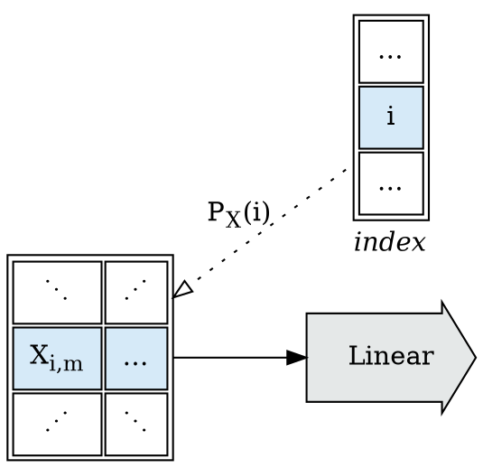
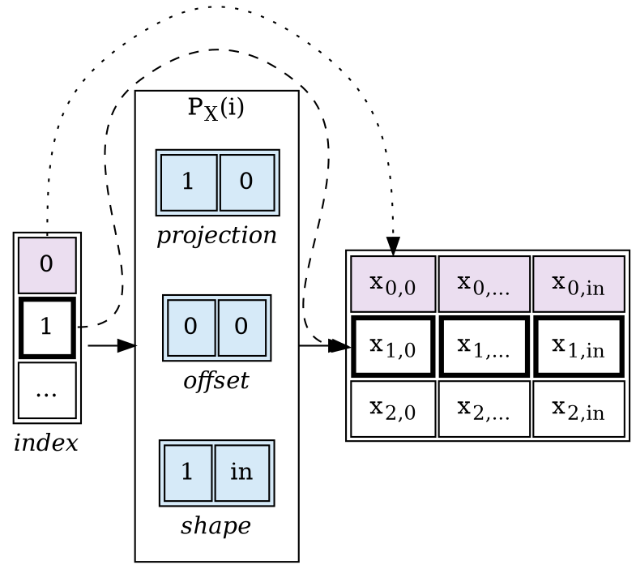
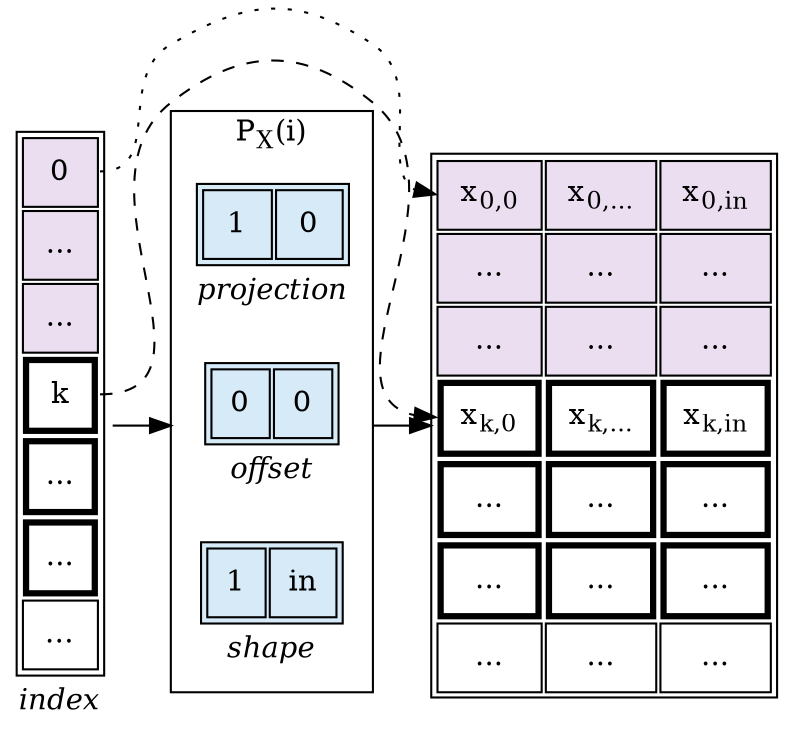

# Abstract

This document represents my living attempt to describe work I'm doing in the research
of the design and implementation of shardable tensor expression languages. It's going
to take time to fill all the way in, and this is my roll-up single entry point document.

## References

This is an active field of research for me; I believe that index projection functions are a viable solution to this,
and I've done a fair amount of background work on large transform environments.

* [Tapestry Tensor Expressions](https://github.com/crutcher/tapestry)
    - my current toy environment.
* [3Scan Crystal Pipeline](https://docs.google.com/presentation/d/1KGlawW9iZnI7xN-X-Q5y4h8aBqgu6bh4pA_0Siq321E/edit?usp=sharing)
    - a slideshow of previous work we did on large-scale tensor expression environments.
* [MLIR Polyhedral Types](https://mlir.llvm.org/docs/Dialects/Affine/)
    - the current LLVM work on polyhedral types for MLIR.

# The Distributed Tensor Expression Problem

The distributed tensor expression "problem":
* Given a tensor expression ( $Y = f(A, B); Z = g(X, Y)$ ), where the tensors may be
  arbitrarily large, how do we efficiently schedule the expression over large numbers of GPUs?

Much of the existing work in this space has focused upon scaling programs written
in existing tensor expression languages (`pytorch`, `tensorflow`, `numpy`);
most of which were modeled upon the stats language `R`; and none of which were built
to permit the ready calculation of operation sharding, or graph optimization.

It's understandable why the focus has been on extending the semantics and scalability
of the languages that so much of the existing AI application stacks have been written in;
incremental improvements have direct impact on the ability to train and deploy existing
applications.

However, quite a few pieces of the current system pose problems for these *smart* compilers:
* the existing APIs have many entry points;
* the entry points don't all follow consistent semantics;
* the apis were not written to enforce a stable co-variance between parameters and results;
* the tensor APIs are data/shape polymorphic;
* and python itself is obnoxious to trace symbolically


If, as an exercise, we drop any notion of compatibility with existing `numpy`-derived
apis; I'm interested in the question of how far we can get?

## Expanding a Toy Example

The process of designing new evaluation environments is the process of searching over spaces
of functor embeddings to attempt to fit the formal semantics we desire to the operational
requirements we'd like to satisfy in evaluation.

Consider a tensor expression in a toy language, call it $Expr$:

```
X, W, b, Z: Tensor
Z = Linear(X, W, b)
Y = ReLU(Z)
```
At this point there are no formal semantics for $Expr$; we're searching design space
for formal semantics such that:
1. Common operations in AI can be represented in the semantics;
2. $Expr$ can be sharded to a distributed GPU fabric using existing optimization theory.

If we were attempting to shard `python+numpy`, or `python+pytorch`, or any number of other
existing problem spaces, we'd be forced to find an embedding which permitted hosting
the entire semantic surface of those environments.

But since we've decided to drop that requirement, we can *break* the semantics; since $Expr$
is only a sketch towards a language, we can explore restrictions to $Expr$ which simplify
embedding.

Consider one functional dependency interpretation of our toy example:


Taking motivation from the toy example; we'd like to be able to shard the $Linear$ node.
The operation is intended as a stand-in for the fully-connected linear layer operation from
neural networks:

$$
Linear(X, W, b) := X \cdot W^T + b
$$

By examining the implementation of $Linear$, and assuming that $X$ has shape $[batch, in]$ ,
we can show that the operation can be cleanly sharded along any batch dimensions of the input $X$:

$$\begin{eqnarray\*}
\begin{split}
Z &= Linear(X, W, b) \\\\
Y &= ReLU(Z)
\end{split}
\quad &\leftrightarrow& \quad
\begin{split}
Z &= \left( \begin{split}
Linear(X[..k , ...], W, b) \\\\
Linear(X[k.. , ...], W, b)
\end{split} \right) \\\\
Y &= ReLU(Z)
\end{split} \\\\ \\\\
&\leftrightarrow& \quad
\begin{split}
X_1 &= X[.. k, ...] \\\\
X_2 &= X[k .., ...] \\\\
Z_1 &= Linear(X_1, W, b) \\\\
Z_2 &= Linear(X_2, W, b) \\\\
Z &= \left( \begin{split} Z_1 \\\\ Z_2 \end{split} \right) \\\\
Y &= ReLU(Z)
\end{split} \\\\ \\\\
\end{eqnarray\*}$$


By exploiting our knowledge of the implementation of $ReLU$:

$$
ReLU(Z) := Z \circ [Z > 0]
$$

We know that we can also re-write $ReLU$ expressions upon the batch dimensions:

$$\begin{eqnarray\*}
\begin{split}
X_1 &= X[.. k, ...] \\\\
X_2 &= X[k .., ...] \\\\
Z_1 &= Linear(X_1, W, b) \\\\
Z_2 &= Linear(X_2, W, b) \\\\
Z &= \left( \begin{split} Z_1 \\\\ Z_2 \end{split} \right) \\\\
Y &= ReLU(Z)
\end{split}
\quad &\leftrightarrow& \quad
\begin{split}
X_1 &= X[.. k, ...] \\\\
X_2 &= X[k .., ...] \\\\
Z_1 &= Linear(X_1, W, b) \\\\
Z_2 &= Linear(X_2, W, b) \\\\
Y &= \left( \begin{split}
ReLU(Z_1) \\\\
ReLU(Z_2)
\end{split} \right)
\end{split} \\\\ \\\\
&\leftrightarrow& \quad
\begin{split}
X_1 &= X[.. k, ...] \\\\
X_2 &= X[k .., ...] \\\\
Z_1 &= Linear(X_1, W, b) \\\\
Z_2 &= Linear(X_2, W, b) \\\\
Y_1 &= ReLU(Z_1) \\\\
Y_2 &= ReLU(Z_2) \\\\
Y &= \left( \begin{split} Y_1 \\\\ Y_2 \end{split} \right) \\\\
\end{split}
\end{eqnarray\*}$$


And finally, seeing $Z_1$ and $Z_2$ do not escape, we can fuse $Linear$ and $ReLU$
into the combined $Linear \Rightarrow ReLU$ operation, and collapse the shards:

$$\begin{eqnarray\*}
\begin{split}
X_1 &= X[.. k, ...] \\\\
X_2 &= X[k .., ...] \\\\
Z_1 &= Linear(X_1, W, b) \\\\
Z_2 &= Linear(X_2, W, b) \\\\
Y_1 &= ReLU(Z_1) \\\\
Y_2 &= ReLU(Z_2) \\\\
Y &= \left( \begin{split}
Y_1 \\\\
Y_2
\end{split} \right)
\end{split}
\quad &\leftrightarrow& \quad
\begin{split}
X_1 &= X[.. k, ...] \\\\
X_2 &= X[k .., ...] \\\\
Y_1 &= ReLU(Linear(X_1, W, B)) \\\\
Y_2 &= ReLU(Linear(X_2, W, B)) \\\\
Y &= \left( \begin{split}
Y_1 \\\\
Y_2
\end{split} \right)
\end{split} \\\\
&\leftrightarrow& \quad
\begin{split}
X_1 &= X[.. k, ...] \\\\
X_2 &= X[k .., ...] \\\\
Y_1 &= (Linear \Rightarrow ReLU)(X_1, W, b) \\\\
Y_2 &= (Linear \Rightarrow ReLU)(X_2, W, b) \\\\
Y &= \left( \begin{split}
Y_1 \\\\
Y_2
\end{split} \right)
\end{split} \\\\ \\\\
\end{eqnarray\*}$$


These series of transformations are possible because we know (or assume) details about
the structural co-variance of the inputs and outputs to the operations $Linear$ and $ReLU$.

# Restricting to Shardable Operators

We cannot assume that any arbitrary operation from a collection of named tensors (the parameters)
to a collection of named tensors (the results) will have cleanly explicable structural co-variance
(the relationship between the data in the input cells and the data in the output cells);
but we can observe that the tractability and explicability of the structural co-variance of operators
bears directly upon our ability to design mechanical sharding and graph-rewrite algorithms over
expression graphs.

* If we take as a design requirement the ability to make intelligent sharding choices about operators,
  and to be able to chain the results of those choices through subsequent layers of the graph, then we
  can reframe the semantics problem of our toy language as searching for a family of operators with
  this property.

For any given $Operator$, we need additional information:
* Given the shapes of the parameters, what are the expected shapes of the results?
* Given the shapes of the parameters, what independent shards are possible which can be
  fused back into the same results?
* How do the shards share resources (which sharding choices are more or less expensive)?

But we also need to ensure that connective expression language between operators has the same properties.

This is an active field of research for me; I believe that index projection functions are a viable solution to this,
and I've done a fair amount of background work on large transform environments.

* [Tapestry Tensor Expressions](https://github.com/crutcher/tapestry)
    - my current toy environment.
* [3Scan Crystal Pipeline](https://docs.google.com/presentation/d/1KGlawW9iZnI7xN-X-Q5y4h8aBqgu6bh4pA_0Siq321E/edit?usp=sharing)
    - a slideshow of previous work we did on large-scale tensor expression environments.
* [MLIR Polyhedral Types](https://mlir.llvm.org/docs/Dialects/Affine/)
    - the current LLVM work on polyhedral types for MLIR.


Suppose we've got a toy tensor expression language $Expr$:
```
X, W, b, Z: Tensor
Z = Linear(X, W, b)
Y = ReLU(Z)
```

And we're interested in mechanical sharding optimizations of the resultant expression graph:


Let $Operator$ be a block-operation, taking *tensor*-valued inputs, and producing *tensor*-valued outputs.

As discussed in the previous post, we're attempting to find a family of $Operators$ such that,
for any given $Operator$, we'll have additional information:
* Given the shapes of the parameters, what are the expected shapes of the results?
* Given the shapes of the parameters, what independent shards are possible which can be
  fused back into the same results?
* How do the shards share resources (which sharding choices are more or less expensive)?


Consider the abstract one-$Operator$ flow graph:


We're interested in families of $Operator$ such that we can shard operations mechanically, and
re-assemble the results mechanically, and produce the same value as though the operation had been done in one pass.


# Operator Index Counting

Crucially, the goal is to be able to shard:
* *With* a strong ability to predict execution costs before evaluation; and
* *Without* examining anything about the implementation of $Operator$.

This can be reframed as a counting problem:
* Can we enumerate all simple sub-problems of a given call to $Operator$?

To make this concrete, let's reconsider $Linear$ from above. If we add an $index$ space
to count all sub-problems of $Linear$:
* What is the shape of $index$?
    * How many dimensions does $index$ have?
    * What are their sizes?
* What relationship does the shape of $index$ have to the inputs ($X$, $W$, $b$) and outputs ($Y$)?
* What *portions* of the inputs and outputs are associated with each point in $index$?


Given a block $Operation$, and knowledge about the structural co-variance of its inputs
and outputs, we seek an index space, and a collection of projection functions $P_T(i)$
for each input or output $tensor$, such that we can mechanically enumerate sub-problems
and re-assemble the results.

It is important to state that the top-down approach (starting with an $Operator$, find sharding)
is a potentially intractable problem; while the bottom-up approach (starting with sharding, define
$Operator$s) is solvable by construction (but limited to findable constructions):
* Top-Down: Given this $Operator$, can I find projection functions $P_T(i)$?
* Bottom-Up: Given a menagerie of known projection functions $P_T(i)$,
  what $Operators$ can I construct?

# Affine Projection Functions

One design approach for solving the $P_T(i)$ projection design problem is the use of
coordinate space (integer, $\mathbb{Z}$) affine transforms (linear projections) from the index space
to the tensor spaces.

Affine projection functions are an approach I explored in depth working at 3Scan,
and an approach that's also been incorporated into the [MLIR](https://mlir.llvm.org/)
project's [Polyhedral Types](https://mlir.llvm.org/docs/Dialects/Affine/).

What components make up an affine projection function?:
* an affine expression mapping points in $index$ space to starts in the coordinate space of input/output tensors;
* a fixed $shape$ defining the shape of region selected relative to the mapped point.

The simplest representation of this is a simple affine transform + a shape:

$$
P_T(i) := ZRange(start: A_T i + B_T, shape: S_T)
$$

Are affine expressions the *right* or *best* solution to te design of projection functions?
We don't know; affine expressions can only be compared to other proposals, not
all possible families of functions; there may be better ideas yet to be surfaced.
We do know that affine expressions make some common patterns easy to express
*and* to compute the shards of; and make some performance critical patterns
*tractable* to express and compute the shards of.

Affine projection function have an important non-obvious property; it is generally
tractable to arrange them such that *coherent* range blocks in the *index* space
map to *coherent* space blocks in the input or output tensors. This property falls
out of the fact that affine projection functions have constant marginal delta strides
(the incremental change resulting from changing an input by one step is constant).
Coherent input/output blocks dramatically simplify processing expectations,
particularly in the face of shared input (as with convolution operations).

As with many matrix transform operations, the basic definitions are simple;
but some of the implications can be complex to unpack. We'll explore a few here.

### Linear Strides Over a Batch Dimension

Consider $Linear$'s $X$ input tensor; let's assume a 2D shape $[batch, in]$.




We'd like to be able to describe a $P_X(i)$ affine projection such that we can describe
the following shards:


A very simple linear projection is sufficient to describe the mapping from a point in index space
to a batch row of the input $X$.



We also cleanly get the property that coherent ranges in the index space
correspond to coherent tensor ranges in the mappend coordinate space:



# Next

I'll continue developing this theme in future posts. More can be read in the tapestry work:
* [tapestry: Exploring Tensor Block Sharding Feasibility](https://github.com/crutcher/tapestry/blob/main/BlockSharding.md)
* [tapestry: Index Projection Functions](https://github.com/crutcher/tapestry/blob/main/IndexProjectionDesign.md)
