<p style="text-align: center;">Author: Crutcher Dunnavant &lt;crutcher@gmail.com&gt;</p>


## A Note For Reviewers

| TODO                                                                                                  |
|-------------------------------------------------------------------------------------------------------|
| Rewrite all graphs to flow from definitions to dependencies                                           |
| Unify language of value-producing operators: block expression, value expression, block operator, etc. |

This is an in-progress draft, to define the background material and theory for an
optimizing tensor expression compilation and evaluation toolchain;
As such, it's incomplete; and will grow as I expand and firm up the representation
of the ideas.

What's the TL;DR?

* Small, easy to write programs which use 100s of GPUs to solve large problems efficiently.

This is the most expensive problem in computer science that I know of; we can conservatively
estimate
that 1/2 to 3/4 of current big-compute and AI costs are simply wasted by the inefficiencies of
the pragmatics of the current approaches.

This is a large project, it's far too big to write in one go and have the results be readable; and
your efforts to review and provide feedback are extremely welcome.

I'm looking for help making this material accessible to the widest possible audience. I'm
particularly
interested in feedback on:

* Sections which need to be expanded or added;
* Terminology used without sufficient introduction;
* Graphs or Charts which are confusing, or need additional discussion or callouts;
* And any awkward or confusing wording.

I am of the professional opinion that this project requires no *new* computer science;
just the careful and methodical application of pieces from a number of sub-fields.
I believe that challenges the industry has faced iterating on this problem are pragmatic
issues in the evolution of the software stacks, and not fundamentally misunderstood
problems.

Say at one end of the system, we want to do A; and A (math) can be done in terms of B;
B can be done in terms of C; and C can be done in terms of D (distributed systems scheduling).
It's not that we don't know how to do A, B, C, and D; or that no one has done
A and B, B and C, or C and D together; it's that most systems that have
incrementally implemented A, then added B, then added C, then added D have
then encountered constraints on A and D, which derive from each other, that
were not visible from A or D alone; and by the time these large systems were
in place, the issues were too expensive to fix. If we start off knowing we want the full stack, and
defer building
something "useful and quick" until the math is fully resolved, we can avoid that design problem.

Alternatively, if you want to help *write* some of this, or help with implementation; again, I'd be
ecstatic.

Thank you for efforts to make this more readable - Crutcher

### Draft Stages

*Tapestry* will be built out in the following stages of work, which correspond to a series
of technical embeddings going deeper into the stack, and will remain as rewrite layers.

When this stack is *semantically* complete, even in a preview form; we can begin to
preview applications written in the block operation graph language.

From this stage onward, development will bifurcate:

* Applications and extensions written *above* the block operation language; and
* Optimization research and operational implementation work done *below* the block operation
  language.

The goal is:

> Provide an existence proof that a provably shardable formal language is possible
> (we can prove that it *can* be made fast); then make it easy to program for to
> get more help; then make it fast.

## Table of Contents

<!-- toc -->

## Introduction

This whitepaper describes "Tapestry", a concrete theory and system for implementing "distributed
tensor expression
evaluators". In this context, "distributed" means targeting resources and execution on multiple
computers
simultaneously. A "tensor" is a multidimensional array, consisting of a single number, `2`, an array
of numbers,
`[3.5, 2.5]`, a matrix, `[[2, 3], [4, 5]]`, or a larger multidimensional array. "Expressions" are
operations
on one or more tensors, which produce new tensors. Evaluators are systems for running expressions
and generating
values.

For example, the following expressions produce the corresponding results:

| Expression      | Result |
|-----------------|--------|
| 1 + 2           | 3      |
| [3, 4] + [1, 1] | [4, 5] |
| 2 * [1, 0]      | [2, 0] |
| abs([3, -4])    | [3, 4] |

An example of a higher dimensional tensor can be found in a batch of images. Suppose we have
a tensor `X`, containing 10 million RGB images, each 256 x 256 pixels, each pixel containing
3 values (the red, green, and blue values of RGB). It would be natural to represent
this batch as a tensor, though we might choose to do so in different ways:

* `[10_000_000, 256, 256, 3]` - as batch, height, width, and color channel.
* `[10_000_000, 3, 256, 256]` - as batch, color channel, height, and width.

Assuming a byte-valued tensor with values ranging from 0 to 255; this tensor would be 32 TB of data.
Suppose we wished to convert the byte valued 0 - 255 `X` to a float16 (2 bytes) valued 0 - 1.0 `Y`
tensor;
Abstractly, this is as simple to describe as `Y := float(X) / 255.0`; but `Y` is 62 TB of data.
Where do we put the input data? Where does the output data go? How do we manage the conversions?
And how do we get there from `Y := float(X) / 255.0`?

Tapestry allows us to describe mathematical operations that are relatively simple to author, but may
describe very large
amounts of data and operations. However, implementing these operations requires orchestrating many
data transfers and
batched operations, which can be difficult and inefficient.

The cost of implementing large distributed mathematics dominates the costs of modern AI and
computational modeling. This
is true for applications such as fluid flow or weather simulation and protein modeling. Both the
development costs of
the programs and the resource costs of computers running inefficient implementations of large math
evaluators contribute
to this problem.

By contrast, `SQL` expression evaluators allow the manipulation and querying of vast amounts of
information distributed
over databases that span hundreds of machines. `SQL` achieves this by establishing a strong formal
declarative abstract
language, where users can describe the operations they wish to perform in a language that hides the
pragmatics, but does
so in such a way that the `SQL` evaluation environments can effectively transform, optimize, and
shard those
descriptions into efficient underlying pragmatic schedules and execution plans.

Tapestry is a proposal for such a formal declarative abstract language, covering expressions
consuming and producing
tensor values. The programming surface, the abstract formal language, which users would read, write,
and interact with,
is a relatively small surface, similar to `SQL`. However, the definitions of the semantics of the
operators have been
chosen to enable aggressive and *correct* (value preserving) optimization of these expressions into
efficient
distributed pragmatics.

This whitepaper covers the abstract tapestry expression language, the derivation of the formal
semantics of that
language, and the concrete pragmatics of implementing an evaluator for that language.

## Background and Related Work

This document describes my ongoing research on the design and implementation of shardable tensor
expression languages.
It serves as a single entry point for the project, which will take some time to fully develop.

This work is related to existing tensor environments and compilers, including JAX, MLIR, and PyTorch
Tau. It also builds
upon ideas from other domains, such as data pipeline languages like Apache Spark and Google
Dataflow, graph-rewriting
functional languages like Haskell and OCaml, and SQL.

Existing work in this field has mainly focused on improving the distribution and performance of
existing languages and
environments. However, that work is constrained by the semantics of those environments and backends.
Distributed work
needs to retain the look and feel of existing data science languages, while local kernel work
focuses heavily on
exploiting specific GPU/TPU hardware.

In contrast, this work takes a bottom-up, shardable-by-construction approach to the distributed
tensor expression
problem. Each core operation is designed to be shardable, as is each operation composition and each
graph rewrite. The
goal is to derive a semantic core with the fewest possible prior operators and constraints, enabling
the use of
aggressive stochastic graph rewrite optimizers.

This is work in the same space as existing tensor environments and compilers:

* [jax pjit](https://jax.readthedocs.io/en/latest/jax-101/08-pjit.html)
* [MLIR](https://mlir.llvm.org/)
* [pytorch tau](https://github.com/pytorch/tau)
* [Apache TVM](https://tvm.apache.org/docs/index.html)

Of these, [Apache TVM](https://tvm.apache.org/docs/index.html) bears the closest resemblance
of the design ideas here. TVM appears to be focused on being an effective compiler backend
for single-machine programs which originate in python `numpy` semantics; it bears watching closer,
but it appears to be a top-down approach to building a smarter compiler targeting various single
machine hardware backends; rather than focusing on a bottom up theory of distributed evaluation
and optimization. TVM may be a good backend target for local operation lowering.

Tapestry also extends many ideas from existing environments:

* Data Pipeline Languages
    * [Apache Spark](https://spark.apache.org/)
    * [Google Dataflow](https://cloud.google.com/dataflow)
* Graph-rewriting Functional Languages:
    * [Haskell](https://www.haskell.org/)
    * [OCaml](https://ocaml.org/)
* And of course, [SQL](https://en.wikipedia.org/wiki/SQL)

### The Vision

To explain the larger vision of Tapestry, we need to explore the uses cases
of a large system which does not yet exist, which we'll also call Tapestry.

> 📝 Note: The motivation for the synecdoche here is taken from SQL, where SQL is both
> the language and the environment, as their semantics are formal and shared.

Grid-scale datacenters filled with GPU nodes are becoming commonplace;
datacenters with 1000s of server-grade GPUs, commonly hosted on densely networked
machines with 2-8 GPUs per machine. These machines have tremendous theoretical
compute throughput, but existing programming environments for them require
multiple layers of systems engineers and operations engineers to successfully
exploit the theoretical potential.

Common use involves compiling specialized application images for a given task
to be run on these systems, allocating some subset of the available machines
as machines for that task, pushing machine images to each machine allocated
for that subset, and running a controller and worker instances built
from the compiled application image. The entire workflow is inefficient
and fragile, and encourages sizing datacenter usage to the max storage
or compute needs that a task will need for its entire lifecycle.

Suppose we instead had a uniform collection of interconnected nodes with unified management,
holding both storage and compute resources. Interconnected service grids
where point-to-point communication is abstracted into semantic routing
are frequently called "meshes" and "fabrics"; to be specific here
we'll call this:

* a tensor fabric, or
* a tapestry environment


The individual nodes in this environment would be largely opaque to us; we
would not send data or jobs to them individually, or push virtual machine images to them;
they act in concert as a unified environment, and we work with them
in terms of the total environment.

One way of thinking of this is as a *very* large `numpy` or `torch` environment.

Suppose we can perform a few operations in this environment:

* Allocate and manage named tensors in the environment.
* Copy portions of tensors into other tensors.
* Load and export external data into and from named tensors in the environment;
  for example from and to databases and network file sources.


This is a very basic environment; and for now, we've omitted a number of details.

* How is the data split between nodes?
* How is node recovery managed (do we have duplicate copies of the data)?

Given only the ability to create storage, move data around, and move data
into and out of the tapestry; we've defined an environment with scratch-space semantics.
We could find a use for this environment; run data jobs which unpack their data
and construct large tensor objects, followed by data jobs which re-pack that
data differently.

Now, suppose in addition to injecting data into our environment, we'd like to
be able to inject functions which manipulate the data. The environment
has many compute nodes, but they're distributed; it stores a lot of data,
but not in places or shards we know about.

To be able to inject functions, we desire a way to describe semantic actions
we wish to take on the data ("apply this function to that tensor, yielding a new tensor"):

* without specifying the details of the layout or scheduling,
* while getting close to theoretically resource optimal results.

A high-level desired workflow would permit us to:

1. Load tensor data into tapestry: 
2. Inject and apply an operation, transforming existing tensors into new tensors:
   
3. Export the result tensor data: 

The details of the operation injection step are the crucial issue here;
finding a family of operations which can be injected into such an environment
and yield optimal resource (time and space) efficient results with minimal external
knowledge about the tapestry layout.

Many environments exist for flat-mapped collections, for data that is structured
in lists, arrays, or key/value mapped dictionaries:

* [Apache Spark](https://spark.apache.org/)
* [Google Dataflow](https://cloud.google.com/dataflow)

These environments do not model tensor-indexed values, or have effective
mechanisms for distributing dataflow and functional dependencies across
polyhedrally typed operations (operations typed in terms of the shape
coupled ranging of their inputs and outputs); a new formalism is needed to effectively
describe operator injection into distributed tensor environments.

<!-- TODO: image / explanation for polyhedrally typed functions -->

Tapestry is an effort to describe such a formalism, focusing on shardable by construction
operation graph semantics.

### Applications

A brief review of some applications of a tapestry environment.

#### Artificial Intelligence and Machine Learning

Deep learning AI/ML applications describe models as stacks of tensor-valued weights,
connected by a computation graph describing how tensor-valued data injected into
the model evolves through a series of compute steps to produce the predictions
of the model, or to compute changes to the models weights for learning.

Existing systems are built on stacks of `numpy`-inspired APIs, with minimal
optimization passes; an API which was not designed to restrict itself to shardable
operations. As a result, existing systems struggle with operational engineering
to achieve effective distribution and sharding, and leave a great deal of
theoretical throughput unexploited.

An optimizing tapestry environment could greatly speed AI/ML research, by removing
the requirements for much of the task-specific operational scaling engineering;
while simultaneously reducing the research costs, by optimizing the resulting
operations graphs to more effectively utilize available resources.

#### Finite Element Simulations

Finite element simulations decompose a problem (weather, heat flow, stress) onto
tensors describing a space to be simulated, valued in terms of the material
properties at each point in the space (density, energy, pressure, material, heat, etc).

Finite element simulations evolve by describing a kernel transition function,
which predicts the next time value for a given point in space by applying a
kernel transition function which examines only the tensor values of the
local neighborhood of that point at the previous time value.

This is equivalent to iteratively applying a kernel convolution to
produce successive time step world tensors.

An effective tapestry environment sufficient to host finite element simulations
would permit accelerated research into anything built upon finite element simulations;
which includes a great deal of modern engineering and physical sciences applications.

## TEG: Tapestry Expression Graph

This section defines the formal semantics of the "Tapestry Expression Graph", or "TEG".

*TEG* graphs are acyclic directed graphs, defining the values of chained tensor expressions; they 
are made up of a selection of node types:
* [Tensor Nodes](#Tensor-Nodes) - which define logical tensors.
* [Selector Nodes](#Selector-Nodes) - which produce logical tensors by selecting values from
   other logical tensors.
* [Block Operator Nodes](#Block-Operator-Nodes) - which define parallel block operations;
  computationally producing new logical tensors from input tensor values.
  * [Source Nodes](#Source-Nodes) - which define data-import operators.
  * [Sink Nodes](#Sink-Nodes) - which define data-export operators.
* [Signature Nodes](#Signature-Nodes) - which define the sharding semantics for block operators.
* [Sequence Point Nodes](#Sequence-Point-Nodes) - which define ordering constraints for block
  operators.

Consider the following example graph:


In this example we see:
 * *Source Nodes* generating tensors *A1*, *A2*, and *B* from local memory (on different
   shard hosts);
 * A *concat* *Selector Node* fusing *A1* and *A2* to produce *A*;
 * An *Add* *Block Operation* consuming *A* and *B* to produce *C*;
 * A *Sink* operation writing *C* to a database;
 * *Signature Nodes* annotating *Add* and *Sink: C* with sharding information,
   should we choose to shard them;
 * And a *Signature Point* marking *Sink: C* as an observed value to be computed.
 
Under appropriate *Signature* constraints, we may be able to rewrite
the above expression into this one; processing the data in parallel
without ever fusing it:


### No Serialization Standard

*At this point*, "TEG" describes graphs, and not a language; there is no standard
serialization for TEG graphs.

Implementing serialization formats is complex, as we want to model errors for
mal-formed graphs which speed development; and as a result the languages are slow
to modify.

Everything in a TEG graph *should* remain serializable, for the development
of standard tooling; but at this point this is an explicit non-goal, to
permit rapid iteration on the graph semantics and implementation.

### Fixed Graphs

*TEG* graphs are non-dynamic, and do not model control flow.

All values are considered to be idempotent; a given block operator should, given
the same input, produce the same output every time it is executed; this is an important
property for shard recovery.

As the graph is value-oriented and acyclic, all values are single-static assignment;
*TEG* graphs do not model mutation.

Fixed expression languages without mutation or control flow can be included as the
"basic block" machinery of larger languages which do model mutation and control
flow.

### Tensor Nodes


A *Tensor Node* represents the shape, datatype, and data of a logical tensor.

A *Tensor Node* has exactly one dependency, which may be either:
 * a *Source Node*,
 * a *Selector Node*,
 * a *Block Operator Node*.

Each tensor node:
* has its origin at 0;
* has a shape;
* has a single data type;
* is dense and contiguous.

### Selector Nodes


A *Selector Node* represents a view transform / data selection over input tensors.

A *Selector Node* has:
* 0 or more *named* *Tensor Node* dependencies;
* Exactly one *named* *Tensor Node* output;
* some number of node parameters.

> 📝 Note:
> The primary difference between *Selector Nodes* and *Block Operator Nodes* is
> the analytic transparency of the operation; every cell in the output node is
> a function of a known mapping over the input nodes.

### Block Operator Nodes


A *Block Operator Node* represents a parallel block computation over input tensors.

A *Block Operator Node* has:
* a *Block Index*, which is a dense ZSpace range;
* 0 or more *named* *Tensor Node* dependencies;
* At most one *Signature* dependency;
* 0 or more *named* *Tensor Node* outputs;
* some number of node parameters;
* 0 or more *Sequence Point* dependencies;
* 0 or more *Sequence Point* consumers;
* an optional multi-type *Costs* dictionary.

*Sequence Point* nodes consume and produce no data, but constitute a strict
*happens before* mechanic and are the root nodes for visibility and pruning
analysis.

#### Source and Sink Nodes


*Source* and *Sink Nodes* are *Block Operation Nodes* which bridge data into or out of
an expression.

##### Source Nodes

A *Source Node* represents a process which generates a *Tensor Node*.
A *Source Node* may represent real work (load the tensor from a database);
or may exist to constrain optimization solutions (this tensor is in memory
on this given machine).

A *Source Node* has no dependencies; and produces a single *Tensor Node*.

##### Sink Nodes

A *Sink Node* represents a process which stores or makes the contents
of a *Tensor Node* accessible outside the expression environment after
evaluation is complete. It may also represent real work (store this tensor
to a file system or database); or it may represent a constraint that
the tensor is in the cache on a given target machine.

A *Sink Node* has exactly one *Tensor Node* dependency; and can only
be the dependency of a *Sequence Point*.


### Signature Nodes


A *Signature Node* represents the block sharding and cost map signature of *Block Operator Nodes*.

A *Block Operator Node* without a signature cannot be re-sharded; and costs cannot be
updated on new shards; stripping the associated *Signature Node* fixes a *Block Operation*.

A *Signature Node* has:
* no dependencies; 
* a map from *named* inputs to *Index Projections* for those inputs;
* a map from *named* outputs to *Index Projections* for those inputs;
* a *Marginal Cost Map*.

### Sequence Point Nodes


*Sequence Point Nodes* consume and produce no data, but constitute a strict
*happens before* mechanic and are the root nodes for visibility and pruning
analysis.

A *Sequence Point Node* has:
* 0 or more *Block Operator Node* dependencies;
* 0 or more *Block Operator Node* consumers.


## Evaluation Theory Derivation

The goal of this section is to incrementally refine informal operational semantics
over tensor expressions towards formal semantics. We're motivated by math we'd like to
be able to express simply, and have "The Right Thing" happen.

We focus on defining things in terms of "expressions", rather than "processes";
as processes describe what to do, while expressions define values. All expression
definitions can be rewritten mechanically as process definitions, but the reverse
is not true (and the proof of that is an important result in computer science
known as the "halting problem").

The watchword of this derivation will be "Value Equivalence":

* Two expression graphs are equivalent if all observed values of the graphs are the same.

Rigorously defining value equivalence permits us to define legal, value preserving rewrites
which can be applied during cost optimization (which is covered in a different section);
the focus of this section will be on defining that equivalence.

For instance, consider an expression describing the addition of two large tensors `A` and `B`:

```
C = A + B
```

If `A` and `B` are both multi-petabyte objects, how can we describe the operational semantics
of computing and storing `C`?

* `A` and `B` are distributed sharded objects (stored on multiple machines);
* the component addition operations need to happen on some collection of machines;
* `C` will need to be reified as a distributed sharded object.

While our motivation lies primarily in computing data, in the `+` portion of the above
semantics, we'll begin with an exploration of what it means to select, copy, and move data;
as this lays an important foundation for describing the sharding of computational expressions.

Much of the existing work in this space has focused upon scaling programs written
in existing tensor expression languages (`pytorch`, `tensorflow`, `numpy`);
most of which were modeled upon the stats language `R`; and none of which were built
to permit the ready calculation of operation sharding, or graph optimization.

It's understandable why the focus has been on extending the semantics and scalability
of the languages that so much of the existing AI application stacks have been written in;
incremental improvements have direct impact on the ability to train and deploy existing
applications.

However, quite a few pieces of the current system pose problems for these *smart* compilers:

* the existing APIs have many entry points;
* the entry points don't all follow consistent semantics;
* the apis were not written to enforce a stable coupled ranging between parameters and results;
* the tensor APIs are data/shape polymorphic;
* and python itself is obnoxious to trace symbolically

If, as an exercise, we drop any notion of compatibility with existing `numpy`-derived
apis; I'm interested in the question of how far we can get?

When designing new evaluation languages, it is important to start with informal semantics that
clearly and simply
express the concepts we want to convey. We should also consider operational requirements, such as
desired resource
usage (CPU, memory, networks, etc.). From there, we can look for systems of formal semantics that
use established
building blocks in math and computer science. This approach helps us achieve our design goals as
closely as possible.

A functor embedding provides a formal way to describe how one evaluation system can be embedded in
another in a
transparent and correct way. This technique is commonly used to ensure that a program designed for
one system can be
used on another without issues. It is important to note that this process requires a deep
understanding of both systems
to ensure embedding is done correctly. A functor embedding can be a useful tool for developers,
allowing them to reuse
code and avoid rewriting entire programs from scratch. It can also help simplify the development
process by reducing the
time and effort required to create new programs. Overall, a functor embedding is a powerful
technique for streamlining
development and ensuring programs are efficient and effective.

We can think of this process as searching for functor embeddings that have certain properties. When
we find a functor
embedding that aligns with an abstract execution environment while having semantics similar to the
machine environments
we want to target, translating from the functor embedding to the actual machines is often easy.

While searching for good embeddings, we may come across a system of formal semantics that is
somewhat close to our
original informal semantics. We can either force alignment or adjust our goals and take advantage of
the formal semantic
system that we’ve found. Personally, I prefer the latter approach.

This design approach is particularly useful when creating new programming languages or evaluating
the performance of
existing ones. By starting with an understanding of informal semantics and operational requirements,
we can ensure that
our formal semantics are well-suited to the task at hand.

It is important to keep in mind the target machines for our evaluation languages as we search for
functor embeddings.
Finding an embedding that aligns well with an abstract execution environment similar to our target
machines can greatly
simplify the translation process.

In cases where the formal semantics we discover are not a perfect match for our original informal
semantics, we have two
options: we can either force alignment or adjust our goals. In my experience, adjusting our goals to
take advantage of
the formal semantic system we've found is often the most efficient approach.

### Piecewise Tensors

Informally, we know that our abstract distributed tensors must be made of parts, and the location
of those parts in an execution graph affect the operational costs of manipulation.

A piece of a tensor which is local to a GPU or host can be viewed and transformed on that
machine without incurring network transit costs or delays; while a piece of a tensor which
must be moved between GPUs or hosts to reach its target consumer incurs different, higher
costs in time and resource contention.

And *some* parts of a tensor may be local to a target consumer, while others are not;
so we know our formal semantics must expose and model the piecewise construction of abstract
tensors from sharded components located on a resource locality graph.

To begin to make this concrete, suppose we have some logical tensor view `X` of
shape `[1000, 10, 10]`,
composed piecewise from tensors `X.1` and `X.2` each of shape `[500, 10, 10]`:


We need operators to describe this composition; as there are many potential ways
such a composition may work.

Let's introduce a "Selector Expression", in this case, `concat` on `dim=0`, to firm this up:


> 📝 Note: `concat` is an operation which concatenates existing tensors into a new, larger
> tensor along the given dimension. There are shape and correctness restrictions
> (the other dimensions must be the same shape, the datatype must match) which
> are important to `concat`, but not important to the current discussion.

A "Selector Expression" doesn't change data, it provides a recipe for defining
views of subsets of data which have already been defined under a new geometric view.
We'll call the result of a *Selector Expression* a *Tensor View*, as it is a view of
existing data, seen through a selection lens.

Returning to the example, and considering a large logical tensor `X`, we could define
it by selecting many shards (`X1`, ..., `X1000`), and collecting them under a single view.


As the resultant view of `X` is defined in terms of views on its parts; no entity `X` needs
to ever *exist* anywhere, provided we will only be consuming pieces of it; we can take the
ranges of `X` we wish an operation to act upon, map those ranges through the Selector Expression
`concat`, and determine which ranges of the component source tensors to select the data from
when needed.

### Tensor Layout Pragmatics

In order to discus tensor views, a small detour into tensor implementation pragmatics
is necessary. Physical tensors, tensors actually stored on some machine as opposed
to logical or computed or composite views of tensors; will be stored in one or more
linear ranges of memory or disk storage; as both memory and disk systems
are indexed linearly.

All of the machinery concerning how these tensors are indexed, and thus how transformed
views of those indexes can be constructed, are captured in the "striding" schemes
attached to these tensors.

Consider a simple array tensor `T` with linear storage:

```
T := [8, 9, 10, 11]
```

This tensor has 1-dimension, a *shape* (`[4]`), and a *size* (`4`) defined as the product
of the shape. To find the value of the `T[2]` element, we'd start from the beginning of
the data, and take 2 steps, arriving at `10`. In this situation, the tensor also has another field
*strides* (`[1]`) which defines how large a step to take in a given dimension.

Our simple 1-dimensional array `T` might therefore be:

| Field   | Value          |
|---------|----------------|
| data    | [8, 9, 10, 11] |
| offset  | 0              |
| shape   | [4]            |
| strides | [1]            |

As this tensor is a simple linear array, *strides* here is `[1]`, indicating that the size
of one step in the 0-dimension is `1`.

To lookup `T[2]`, we would compute:

```
T[2] = data[offset + 2*strides[0]]
T[2] = data[0 + 2*1]
T[2] = data[2]
T[2] = 10
```

But what if we wanted a view-only reversal of this tensor? In this example, the data buffer
is small, but it could be gigabytes; we'd like a mechanism to manipulate how we see the layout
of the data, without copying the data.

We can manipulate the `offset` and `strides` to achieve this. First, we need to make the stride
for the 0-dimension `-1`, as each step we take should now move us backwards in the array;
second, we need to adjust the offset so that `R[0]` points to the end of the previous array;
in this situation:

```
R.offset = T.offset + (T.shape[0] - 1) * T.strides[0]
R.offset = 0 + 3 * 1 = 3
```

Which would give us the following definition of `R`:

| Field   | Value          |
|---------|----------------|
| data    | [8, 9, 10, 11] |
| offset  | 3              |
| shape   | [4]            |
| strides | [-1]           |

To lookup `R[2]`, we would compute:

```
R[2] = data[offset + 2*strides[0]]
R[2] = data[3 - 2]
R[2] = data[1]
R[2] = 9
```

We can extend our tensor into additional dimensions; consider a `[2, 3]` tensor `A`
with the following data:

|           | A[0, :] | A[1, :] | A[2, :] |
|-----------|---------|---------|---------|
| *A[:, 0]* | 10      | 20      | 30      |
| *A[:, 1]* | 40      | 50      | 60      | 

A common way to layout this tensor would be to pack the "least significant",
or last dimension most densely, and to step out from there in strides;
so the contents of each row are arranged contiguously, and each column
takes a stride step the size of a full row:

| Field   | Value                    |
|---------|--------------------------|
| data    | [10, 20, 30, 40, 50, 60] |
| offset  | 0                        |
| shape   | [2, 3]                   |
| strides | [3, 1]                   |

We can generalize the above offset calculation into arbitrary dimensions:

```
A[coords] = data[offset + sum([coords[i] * strides[i] for i in range(c.length)])]
```

So, looking up `A[1, 2]`, which we expect to be `60`, we see:

```
A[1, 2] = data[offset + coords[0] * strides[0] + coords[1] * strides[1]]
A[1, 2] = data[0 + 1 * 3 + 2 * 1]
A[1, 2] = data[5] = 60
```

If we wanted to take the transposition of this tensor, and swap the dimensions,
we could do so *without* moving the data, by simply swapping the shape
and strides. Call it `B`:

| Field   | Value                    |
|---------|--------------------------|
| data    | [10, 20, 30, 40, 50, 60] |
| offset  | 0                        |
| shape   | [3, 2]                   |
| strides | [1, 3]                   |

```
B[2, 1] = data[offset + coords[0] * strides[0] + coords[1] * strides[1]]
B[2, 1] = data[0 + 2 * 1 + 1 * 3]
B[2, 1] = data[5] = 60
```

|           | B[0, :] | B[1, :] |
|-----------|---------|---------|
| *B[:, 0]* | 10      | 40      |
| *B[:, 1]* | 20      | 50      |  
| *B[:, 1]* | 30      | 60      |  

This offset location projection follows the general form a discrete affine projection,
$Ax + b$ (or $strides \cdot coords + offset$), where we're mapping from some number of dimensions
in the input coordinate space to a flat location in some buffer space.
As such, there are many mechanical transformations which can be applied to this offset
mapping to produce different effects without changing or copying the underlying buffer, for example:

* arbitrarily reordering dimensions
* reversing a dimension
* selecting a subset tensor which holds one dimension fixed
* selecting a subset tensor which takes regular strides along a dimension
* etc.

These are the view pragmatics underlying tensor representations; provided that access
to the tensor is random (we can access it in any order) and *O(1)* (the access cost
of looking at any one piece of data is constant), arbitrary combinations of index
view transformations have no underlying costs.

> 📝 Note: In practice, at the level of internal machine memory access cache lines and
> direct memory access block reads, contiguous accesses are faster, and algorithms
> can be improved by careful layout planning. This is commonly done by dedicated
> vector compilers for a particular machine target.
>
> It is possible to mark the physical layout an operation will produce
> on output; and the preferred physical layout an operation desires
> on input, and to trace these through a solution graph to achieve
> better performance, but this is deep work in cost pragmatics
> which we'll ignore while developing the remaining theory.
> It can be mechanically added to a graph solver at a later point
> as a layout pragma; and it does have impact on cost models.
>
> At the planning level under consideration, distributed operations
> moving data *between* machines, the impact of non-contiguous layouts
> is negligible compared to most cross-machine transfer operations;
> until a system is directly using RDMA (remote data memory access)
> transfers, at which point the engineering resources necessary to
> model the preferred layout in the solvers should track with system
> benefits.
>
> When we care about the speed impact, we'll be able to afford solving
> it without a total rewrite.

#### Squeeze, Unsqueeze, and Broadcast

There is a non-obvious trick we can perform with the above indexing scheme,
which derives from the fact that dimensions of size 1 have no impact on the
calculated offset of a tensor. It doesn't matter what value that dimension
has for its stride, as the coordinate for that dimension is always 0.

Consider the above tensor `T` again:

| Field   | Value          |
|---------|----------------|
| data    | [8, 9, 10, 11] |
| offset  | 0              |
| shape   | [4]            |
| strides | [1]            |

We could add as many size-1 dimensions as we wished, by adding to the shape,
and setting their resultant stride to 0.
Consider shape `[1, 1, 4, 1]`, and let's call this `V`:

| Field   | Value          |
|---------|----------------|
| data    | [8, 9, 10, 11] |
| offset  | 0              |
| shape   | [1, 1, 4, 1]   |
| strides | [0, 0, 1, 0]   |

Calculating the offset of `V[0, 0, 2, 0]`:

```
V[0, 0, 2, 0] = data[offset + c[0]*strides[0] + c[1]*strides[1] + c[2]*strides[2] + c[3]*strides[3]]
V[0, 0, 2, 0] = data[0 + 0*0 + 0*0 + 2*1 + 0*0]
V[0, 0, 2, 0] = data[2]
V[0, 0, 2, 0] = 10
```

We can also safely remove an dimension of size 1, no matter its stride, by deleting both entries.

Size 1 dimensions do not affect the data offset; and the view operations of removing and adding
these dimensions are called `squeeze` and `unsqueeze`.

But there's another trick, once we focus on a dimension with stride of 0; we can set the shape
to any value, and we'll see a computed view which mirrors the data along that dimension.
This is called a *broadcast* dimension, it's a synthetic view; and its frequently used to perform
tensor operations on tensors of different sizes.

Consider this tensor, called `M`, where we've added a broadcast dimension:

| Field   | Value          |
|---------|----------------|
| data    | [8, 9, 10, 11] |
| offset  | 0              |
| shape   | [ 4, 2]        |
| strides | [ 1, 0]        |

To a viewer, this tensor would appear to have the data:

|           | M[0, :] | M[1, :] | M[2, :] | M[3, :] |
|-----------|---------|---------|---------|---------|
| *M[:, 0]* | 8       | 9       | 10      | 11      |
| *M[:, 1]* | 8       | 9       | 10      | 11      |

Though in the underlying buffer, there would be only one copy.

It is valuable for us to know that a tensor view we wish to copy is a broadcast view,
as properly modeling this can dramatically reduce the total data to transfer.

### Selector Expressions and Tensor Views

As we've informally seen the need for composite view operations, and explored some tensor
indexing view pragmatics, we can make a case that we'd like *Selector Expressions* which
either:

* Define a *Tensor View* as an index transformation of an existing *Tensor View*; or
* Define a *Tensor View* as some composition of one or more existing *Tensor Views*

A rough list of index transformations we've previously discussed would include:

* `permute/transpose` - reordering the dimension indexes of a tensor is free.
* `reverse/flip` - flipping a tensor dimension is free.
* `select` - selecting a subset of a tensor is free.
* `stride` - skipping every `k` items along a dimension is free.
* `squeeze/unsqueeze` - adding/removing a size-1 dimension is free.
* `broadcast` - treat a size 1 dimension as though it were size `n`, without copying data.

We already know we'll need `concat`, but there are a few other common composition selectors
worth mentioning at this point:

* `concat` - assemble a tensor view by concatenating multiple tensors along a dimension.
* `interleave` - assemble a tensor view by interleaving multiple tensors along a dimension.
* `repeat`<sup>\*</sup> - assemble a tensor view by repeating a tensor along a dimension.
* `pad`<sup>\*</sup> - supply data outside the selection region with a default value, or a
  reflection.
* `where`, `max`, `min` - conditionally construct a view by switching on the data from multiple
  views.

> 📝 Note: <sup>\*</sup>`pad` and `repeat` are *Selection*s we'd also prefer to implement on the
> local consumer;
> as the data is either a default value, or a reflection or duplication of data we already have;
> and these are also good targets for Selection optimization and re-write.

> 📝 Note: `broadcast` and `repeat` are similar, but not the same. A combination of `unsqueeze`
> and `broadcast` permits us to construct a new dimension, and then duplicate data along
> that dimension; but does not permit us to repeat the data in a dimension.
>
> It is possible to model an operation like `repeat` by adding modulo arithmetic to
> the view indexing operations; or to model it as an application to `concat`.
>
> There are other view transformations which would benefit from the addition of modulo
> arithmetic to view transformations, at the cost of increasing the complexity of
> all operations which manipulate and rewrite transformations; so for now, we'll
> model `repeat` as a shorthand for `concat`.

#### Atomic Selections

While these transformations are composable, and thus we could define complex single-step
transformations; this significantly reduces readability, and increases the complexity of
graph modeling code.

For this reason, we'll work for now in terms of atomic selection expressions, expressions which
do one well-describable thing at a time. Multi-stage operations can always be fused later,
but the reverse process can produce strange transformations which don't line up with
original code and can be a barrier to understanding.

#### Generators

An additional potentially useful category of *Selector Expressions* are generators; consider:

* `zeros`, `ones`, `full` - generate a view full of a given value.
* `rand` - generate "random" data.

Generators can be used to create an entire Tensor View on the local machine;
as the data is a deterministic function, there's no data to transmit.

##### Random Generators

It is important to note that `rand` is an entire sub-category of problems:

* We require an idempotent, and thus deterministic random field;
  in a given evaluation, we must be able to rebuild the *same* random
  values every time a tensor view is accessed; so `rand` needs a seed
  and to compute data as some function of the coordinate space.
* There are many random number generation distributions to select from,
  before we consider that properties (such as $\sigma$) may be functions
  of the input coordinates.

It may prove simpler in practice to model random generators as block expressions
than as *Selector* generators.

### Block Operator Expressions

> TODO:
> This section develops too quickly. Develop a (+) example first.

Having addressed the semantics involved in viewing and moving data,
we can now focus on computing products of operators on data.

Consider a tensor expression in a toy language, call it $Expr$; this particular expression
is motivated by a fully connected neural network layer, but it could be anything:

```
X, W, b, Z: Tensor
Z = Linear(X, W, b)
Y = ReLU(Z)
```

At this point there are no formal semantics for $Expr$; we're searching design space
for formal semantics such that:

1. Common operations in AI can be represented in the semantics;
2. $Expr$ can be sharded to a distributed GPU fabric using existing optimization theory.

If we were attempting to shard `python+numpy`, or `python+pytorch`, or any number of other
existing problem spaces, we'd be forced to find an embedding which permitted hosting
the entire semantic surface of those environments. But since we've decided to drop that requirement,
we can *break* the semantics; since $Expr$ is only a sketch towards a language, we can explore
restrictions to $Expr$ which simplify
embedding.

Consider one functional dependency interpretation of our toy example:


Taking motivation from the toy example; we'd like to be able to shard the $Linear$ node.
The operation is intended as a stand-in for the fully-connected linear layer operation from
neural networks:

$$\begin{eqnarray\*}
Linear(X_{[batch,in]}, W_{[in,out]}, b_{[out]}) := X \times W + b
\end{eqnarray\*}$$

By examining the implementation of $Linear$, and assuming that $X$ has shape $[batch, in]$ ,
we can show that the operation can be cleanly sharded along any batch dimensions of the input $X$:

$$\begin{eqnarray\*}
\left\\{ \begin{split}
Z &= Linear(X, W, b) \\\\
Y &= ReLU(Z)
\end{split} \right\\}
%
& \rightarrow_{shard(X)} &
%
\left\\{ \begin{split}
Z &= \left( \begin{split}
Linear_1(X[..k , ...], W, b) \\\\
Linear_2(X[k.. , ...], W, b)
\end{split} \right) \\\\
Y &= ReLU(Z)
\end{split} \right\\} \\\\ \\\\
%
&\rightarrow_{shard(Z)}& \quad
%
\left\\{ \begin{split}
X_1 &= X[.. k, ...] \\\\
X_2 &= X[k .., ...] \\\\
Z_1 &= Linear_1(X_1, W, b) \\\\
Z_2 &= Linear_2(X_2, W, b) \\\\
Z &= \left( \begin{split}
Z_1 \\\\
Z_2
\end{split} \right) \\\\
Y &= ReLU(Z)
\end{split} \right\\} \\\\ \\\\
\end{eqnarray\*}$$


By exploiting our knowledge of the implementation of $ReLU$:

$$\begin{eqnarray\*}
ReLU(Z) := Z \circ [Z > 0]
\end{eqnarray\*}$$

> 📝 Note: While many activation functions are more complex, ReLU specifically
> can be rewritten, by the above definition, as a `where(T, T, zeros_like(T))` selection expression.
>
> This is distracting from the current derivation, but in practice
> could provide significant speedups; depending upon implementation and fusion pragmatics.

We know that we can also re-write $ReLU$ expressions upon the batch dimensions:

$$\begin{eqnarray\*}
\left\\{ \begin{split}
X_1 &= X[.. k, ...] \\\\
X_2 &= X[k .., ...] \\\\
Z_1 &= Linear_1(X_1, W, b) \\\\
Z_2 &= Linear_2(X_2, W, b) \\\\
Z &= \left( \begin{split} Z_1 \\\\ Z_2 \end{split} \right) \\\\
Y &= ReLU(Z)
\end{split} \right\\}
%
& \rightarrow_{forward(Z)} &
%
\left\\{ \begin{split}
X_1 &= X[.. k, ...] \\\\
X_2 &= X[k .., ...] \\\\
Z_1 &= Linear_1(X_1, W, b) \\\\
Z_2 &= Linear_2(X_2, W, b) \\\\
Y &= \left( \begin{split}
ReLU_1(Z_1) \\\\
ReLU_2(Z_2)
\end{split} \right)
\end{split} \right\\} \\\\ \\\\
%
& \rightarrow_{shard(Y)} &
%
\left\\{ \begin{split}
X_1 &= X[.. k, ...] \\\\
X_2 &= X[k .., ...] \\\\
Z_1 &= Linear_1(X_1, W, b) \\\\
Z_2 &= Linear_2(X_2, W, b) \\\\
Y_1 &= ReLU_1(Z_1) \\\\
Y_2 &= ReLU_2(Z_2) \\\\
Y &= \left( \begin{split}
Y_1 \\\\
Y_2
\end{split} \right) \\\\
\end{split} \right\\}
\end{eqnarray\*}$$


And finally, seeing $Z_1$ and $Z_2$ do not escape, we can fuse $Linear$ and $ReLU$
into the combined $Linear \Rightarrow ReLU$ operation, and collapse the shards:

$$\begin{eqnarray\*}
\left\\{ \begin{split}
X_1 &= X[.. k, ...] \\\\
X_2 &= X[k .., ...] \\\\
Z_1 &= Linear_1(X_1, W, b) \\\\
Z_2 &= Linear_2(X_2, W, b) \\\\
Y_1 &= ReLU_1(Z_1) \\\\
Y_2 &= ReLU_2(Z_2) \\\\
Y &= \left( \begin{split}
Y_1 \\\\
Y_2
\end{split} \right)
\end{split} \right\\}
%
& \rightarrow_{compose(Linear, ReLU)} &
%
\left\\{ \begin{split}
X_1 &= X[.. k, ...] \\\\
X_2 &= X[k .., ...] \\\\
Y_1 &= ReLU_1(Linear_1(X_1, W, B)) \\\\
Y_2 &= ReLU_2(Linear_2(X_2, W, B)) \\\\
Y &= \left( \begin{split}
Y_1 \\\\
Y_2
\end{split} \right)
\end{split} \right\\} \\\\ \\\\
%
& \rightarrow_{fuse(Linear, ReLU)} &
%
\left\\{ \begin{split}
X_1 &= X[.. k, ...] \\\\
X_2 &= X[k .., ...] \\\\
Y_1 &= (Linear \Rightarrow ReLU)_1(X_1, W, b) \\\\
Y_2 &= (Linear \Rightarrow ReLU)_2(X_2, W, b) \\\\
Y &= \left( \begin{split}
Y_1 \\\\
Y_2
\end{split} \right)
\end{split} \right\\} \\\\ \\\\
\end{eqnarray\*}$$


These series of transformations are possible because we know (or assume) details about
the structural coupled ranging of the inputs and outputs to the operations $Linear$ and $ReLU$.

### Restricting to Shardable Operators

We cannot assume that any arbitrary operation from a collection of named tensors (the parameters)
to a collection of named tensors (the results) will have cleanly explicable structural coupled
ranging
(the relationship between the data in the input cells and the data in the output cells);
but we can observe that the tractability and explicability of the structural coupled ranging of
operators
bears directly upon our ability to design mechanical sharding and graph-rewrite algorithms over
expression graphs.

* If we take as a design requirement the ability to make intelligent sharding choices about
  operators,
  and to be able to chain the results of those choices through subsequent layers of the graph, then
  we
  can reframe the semantics problem of our toy language as searching for a family of operators with
  this property.

For any given $Operator$, we need additional information:

* Given the shapes of the parameters, what are the expected shapes of the results?
* Given the shapes of the parameters, what independent shards are possible which can be
  fused back into the same results?
* How do the shards share resources (which sharding choices are more or less expensive)?

Recall the toy tensor expression in $Expr$:

```
X, W, b, Z: Tensor
Z = Linear(X, W, b)
Y = ReLU(Z)
```


Let $Operator$ be a block-operation, taking *tensor*-valued inputs, and producing *tensor*-valued
outputs.

As discussed previously, we're attempting to find a family of $Operators$ such that,
for any given $Operator$, we'll have additional information:

* Given the shapes of the parameters, what are the expected shapes of the results?
* Given the shapes of the parameters, what independent shards are possible which can be
  fused back into the same results?
* How do the shards share resources (which sharding choices are more or less expensive)?



```graphviz
digraph G {
    rankdir=RL;

    x [
        shape="plain",
        label=<
        <table cellpadding="8">
            <tr>
                <td>⋱</td>
                <td>⋰</td>
                </tr>
            <tr>
                <td bgcolor="#D6EAF8">X<sub>i,m</sub></td>
                <td bgcolor="#D6EAF8">…</td>
                </tr>
            <tr>
                <td>⋰</td>
                <td>⋱</td>
                </tr>
            </table>
        >,
    ];

    w [
        shape="plain",
        label=<
        <table cellpadding="8">
            <tr>
                <td>⋱</td>
                <td bgcolor="#D6EAF8">…</td>
                <td>⋰</td>
                </tr>
            <tr>
                <td>…</td>
                <td bgcolor="#D6EAF8">W<sub>m,n</sub></td>
                <td>…</td>
                </tr>
            <tr>
                <td>⋰</td>
                <td bgcolor="#D6EAF8">…</td>
                <td>⋱</td>
                </tr>
            </table>
        >,
    ];

    op [
        label=Linear,
        shape=rarrow,
        style=filled,
        fillcolor="#E5E8E8",
        margin=0.25
    ];

    b [
        shape="plain",
        label=<
        <table cellpadding="8">
            <tr>
                <td>…</td>
                <td bgcolor="#D6EAF8">b<sub>n</sub></td>
                <td>…</td>
                </tr>
            </table>
        >,
    ];

    y [
        shape="plain",
        label=<
        <table cellpadding="8">
            <tr>
                <td>⋱</td>
                <td>…</td>
                <td>⋰</td>
                </tr>
            <tr>
                <td>…</td>
                <td bgcolor="#D6EAF8">y<sub>i,n</sub></td>
                <td>…</td>
                </tr>
            <tr>
                <td>⋰</td>
                <td>…</td>
                <td>⋱</td>
                </tr>
            </table>
        >,
    ];
    
    op -> x;
    y -> op;
    
    op -> w;
    op -> b;
}
```

Consider the abstract one-$Operator$ expression graph:

```graphviz
digraph G {
    rankdir=RL;

    A [
        shape="plain",
        label=<
        <table cellpadding="8">
            <tr>
                <td>⋱</td>
                <td>⋰</td>
                </tr>
            <tr>
                <td bgcolor="#D6EAF8">A<sub>i,m</sub></td>
                <td bgcolor="#D6EAF8">…</td>
                </tr>
            <tr>
                <td>⋰</td>
                <td>⋱</td>
                </tr>
            </table>
        >,
    ];

    B [
        shape="plain",
        label=<
        <table cellpadding="8">
            <tr>
                <td>⋱</td>
                <td bgcolor="#D6EAF8">…</td>
                <td>⋰</td>
                </tr>
            <tr>
                <td>…</td>
                <td bgcolor="#D6EAF8">B<sub>m,n</sub></td>
                <td>…</td>
                </tr>
            <tr>
                <td>⋰</td>
                <td bgcolor="#D6EAF8">…</td>
                <td>⋱</td>
                </tr>
            </table>
        >,
    ];

    op [
        label=Operator,
        shape=rarrow,
        style=filled,
        fillcolor="#E5E8E8",
        margin=0.25
    ];
    
    X [
        shape="plain",
        label=<
        <table cellpadding="8">
            <tr>
                <td>⋱</td>
                <td>…</td>
                <td>⋰</td>
                </tr>
            <tr>
                <td>…</td>
                <td bgcolor="#D6EAF8">X<sub>i,n</sub></td>
                <td>…</td>
                </tr>
            <tr>
                <td>⋰</td>
                <td>…</td>
                <td>⋱</td>
                </tr>
            </table>
        >,
    ];

    Y [
        shape="plain",
        label=<
        <table cellpadding="8">
            <tr>
                <td>⋱</td>
                <td>…</td>
                <td>⋰</td>
                </tr>
            <tr>
                <td>…</td>
                <td bgcolor="#D6EAF8">Y<sub>i,n</sub></td>
                <td>…</td>
                </tr>
            <tr>
                <td>⋰</td>
                <td>…</td>
                <td>⋱</td>
                </tr>
            </table>
        >,
    ];
    
    op -> A;
    op -> B;
    X -> op;
    Y -> op;
}
```



We're interested in families of $Operator$ such that we can shard operations mechanically, and
re-assemble the results mechanically, and produce the same value as though the operation had been
done in one pass.

```graphviz
digraph G {
    rankdir=RL;
    A1, A2, B1, B2, X1, X2, Y1, Y2 [shape=box3d, fillcolor="#d0d0ff", style=filled];

    A [
        shape="plain",
        label=<
        <table cellpadding="8">
            <tr>
                <td>⋱</td>
                <td>⋰</td>
                </tr>
            <tr>
                <td bgcolor="#D6EAF8">A<sub>i,m</sub></td>
                <td bgcolor="#D6EAF8">…</td>
                </tr>
            <tr>
                <td>⋰</td>
                <td>⋱</td>
                </tr>
            </table>
        >,
    ];

    B [
        shape="plain",
        label=<
        <table cellpadding="8">
            <tr>
                <td>⋱</td>
                <td bgcolor="#D6EAF8">…</td>
                <td>⋰</td>
                </tr>
            <tr>
                <td>…</td>
                <td bgcolor="#D6EAF8">B<sub>m,n</sub></td>
                <td>…</td>
                </tr>
            <tr>
                <td>⋰</td>
                <td bgcolor="#D6EAF8">…</td>
                <td>⋱</td>
                </tr>
            </table>
        >,
    ];

    op1 [
        label=<Operator<sub>1</sub>>,
        shape=rarrow,
        style=filled,
        fillcolor="#E5E8E8",
        margin=0.25
    ];
    op2 [
        label=<Operator<sub>2</sub>>,
        shape=rarrow,
        style=filled,
        fillcolor="#E5E8E8",
        margin=0.25
    ];
    
    X [
        shape="plain",
        label=<
        <table cellpadding="8">
            <tr>
                <td>⋱</td>
                <td>…</td>
                <td>⋰</td>
                </tr>
            <tr>
                <td>…</td>
                <td bgcolor="#D6EAF8">X<sub>i,n</sub></td>
                <td>…</td>
                </tr>
            <tr>
                <td>⋰</td>
                <td>…</td>
                <td>⋱</td>
                </tr>
            </table>
        >,
    ];

    Y [
        shape="plain",
        label=<
        <table cellpadding="8">
            <tr>
                <td>⋱</td>
                <td>…</td>
                <td>⋰</td>
                </tr>
            <tr>
                <td>…</td>
                <td bgcolor="#D6EAF8">Y<sub>i,n</sub></td>
                <td>…</td>
                </tr>
            <tr>
                <td>⋰</td>
                <td>…</td>
                <td>⋱</td>
                </tr>
            </table>
        >,
    ];
    
    SA1 [
      label=<slice>,
      margin=0,
      shape=parallelogram,
      style=filled,
      fillcolor="#a0d0d0",
      color=black,
    ];
    SA2 [
      label=<slice>,
      margin=0,
      shape=parallelogram,
      style=filled,
      fillcolor="#a0d0d0",
      color=black,
    ];
    SB1 [
      label=<slice>,
      margin=0,
      shape=parallelogram,
      style=filled,
      fillcolor="#a0d0d0",
      color=black,
    ];
    SB2 [
      label=<slice>,
      margin=0,
      shape=parallelogram,
      style=filled,
      fillcolor="#a0d0d0",
      color=black,
    ];
    
    SX [
      label=<concat>,
      margin=0,
      shape=parallelogram,
      style=filled,
      fillcolor="#a0d0d0",
      color=black,
    ];
    SY [
      label=<concat>,
      margin=0,
      shape=parallelogram,
      style=filled,
      fillcolor="#a0d0d0",
      color=black,
    ];
    
    SA1 -> A;
    SA2 -> A;
    A1 -> SA1;
    A2 -> SA2;
    
    SB1 -> B;
    SB2 -> B;
    B1 -> SB1;
    B2 -> SB2;
    
    op1 -> A1;
    op1 -> B1;
    X1 -> op1;
    Y1 -> op1;
    
    op2 -> A2;
    op2 -> B2;
    X2 -> op2;
    Y2 -> op2;
    
    SX -> X1;
    SX -> X2;
    
    SY -> Y1;
    SY -> Y2;
    
    X -> SX;
    Y -> SY;
}
```



### Operator Index Counting

Crucially, the goal is to be able to shard:

* *With* a strong ability to predict execution costs before evaluation; and
* *Without* examining anything about the implementation of $Operator$.

This can be reframed as a counting problem:

* Can we enumerate all simple sub-problems of a given call to $Operator$?

To make this concrete, let's reconsider $Linear$ from above. If we add an $index$ space
to count all sub-problems of $Linear$:

* What is the shape of $index$?
    * How many dimensions does $index$ have?
    * What are their sizes?
* What relationship does the shape of $index$ have to the inputs ($X$, $W$, $b$) and outputs ($Y$)?
* What *portions* of the inputs and outputs are associated with each point in $index$?

```graphviz
digraph G {
    rankdir=RL;

    idx [
        shape="plain",
        label=<
	<table border="0">
        <tr><td>
          <table cellpadding="8">
              <tr>
                  <td>⋱</td>
                  <td>…</td>
                  <td>⋰</td>
                  </tr>
              <tr>
                  <td>…</td>
                  <td bgcolor="#D6EAF8">i,n</td>
                  <td>…</td>
                  </tr>
              <tr>
                  <td>⋰</td>
                  <td>…</td>
                  <td>⋱</td>
                  </tr>
              </table>
	  </td></tr>
        <tr><td><i>index</i></td></tr>
	  </table>
        >,
    ];

    x [
        shape="plain",
        label=<
        <table cellpadding="8">
            <tr>
                <td>⋱</td>
                <td>⋰</td>
                </tr>
            <tr>
                <td bgcolor="#D6EAF8">X<sub>i,m</sub></td>
                <td bgcolor="#D6EAF8">…</td>
                </tr>
            <tr>
                <td>⋰</td>
                <td>⋱</td>
                </tr>
            </table>
        >,
    ];

    w [
        shape="plain",
        label=<
        <table cellpadding="8">
            <tr>
                <td>⋱</td>
                <td bgcolor="#D6EAF8">…</td>
                <td>⋰</td>
                </tr>
            <tr>
                <td>…</td>
                <td bgcolor="#D6EAF8">W<sub>m,n</sub></td>
                <td>…</td>
                </tr>
            <tr>
                <td>⋰</td>
                <td bgcolor="#D6EAF8">…</td>
                <td>⋱</td>
                </tr>
            </table>
        >,
    ];

    op [
        label=Linear,
        shape=rarrow,
        style=filled,
        fillcolor="#E5E8E8",
        margin=0.25
    ];

    b [
        shape="plain",
        label=<
        <table cellpadding="8">
            <tr>
                <td>…</td>
                <td bgcolor="#D6EAF8">b<sub>n</sub></td>
                <td>…</td>
                </tr>
            </table>
        >,
    ];

    y [
        shape="plain",
        label=<
        <table cellpadding="8">
            <tr>
                <td>⋱</td>
                <td>…</td>
                <td>⋰</td>
                </tr>
            <tr>
                <td>…</td>
                <td bgcolor="#D6EAF8">y<sub>i,n</sub></td>
                <td>…</td>
                </tr>
            <tr>
                <td>⋰</td>
                <td>…</td>
                <td>⋱</td>
                </tr>
            </table>
        >,
    ];

    op -> x;
    y -> op;
    op -> w;
    op -> b;

    idx -> x [label=<P<sub>X</sub>(i)>, constraint=false, style=dotted, arrowhead=empty];
    idx -> w [label=<P<sub>W</sub>(i)>, constraint=false, style=dotted, arrowhead=empty];
    idx -> b [label=<P<sub>b</sub>(i)>, constraint=false, style=dotted, arrowhead=empty];
    idx -> y [label=<P<sub>Y</sub>(i)>, constraint=false, style=dotted, arrowhead=empty];

    { rank=same; op; idx; }
}
```



Given a block $Operation$, and knowledge about the structural coupled ranging of its inputs
and outputs, we seek an index space, and a collection of projection functions $P_T(i)$
for each input or output $tensor$, such that we can mechanically enumerate sub-problems
and re-assemble the results.

It is important to state that the top-down approach (starting with an $Operator$, find sharding)
is a potentially intractable problem; while the bottom-up approach (starting with sharding, define
$Operator$s) is solvable by construction (but limited to findable constructions):

* Top-Down: Given this $Operator$, can I find projection functions $P_T(i)$?
* Bottom-Up: Given a menagerie of known projection functions $P_T(i)$,
  what $Operators$ can I construct?

### Index Projection Functions

One design approach for solving the $P_T(i)$ projection design problem is the use of
discrete coordinate space (integer, $\mathbb{Z}$) affine transforms (linear projections) from the
index space
to the tensor spaces.

Discrete affine projection functions are a common approach that's also been incorporated into
the [MLIR](https://mlir.llvm.org/)
project's [Polyhedral Types](https://mlir.llvm.org/docs/Dialects/Affine/).

What components make up an affine index projection function?:

* The projections are Z-Space / integer valued;
* an affine expression mapping points in $index$ space to starts in the coordinate space of
  input/output tensors;
* a fixed $shape$ defining the shape of region selected relative to the mapped point.

The simplest representation of this is a simple affine transform + a shape:

$$\begin{eqnarray\*}
P_T(i) := ZRange(start: A_T i + B_T, shape: S_T)
\end{eqnarray\*}$$

Are affine expressions the *right* or *best* solution to te design of projection functions?
We don't know; affine expressions can only be compared to other proposals, not
all possible families of functions; there may be better ideas yet to be surfaced.
We do know that affine expressions make some common patterns easy to express
*and* to compute the shards of; and make some performance critical patterns
*tractable* to express and compute the shards of.

Affine projection function have an important non-obvious property; it is generally
tractable to arrange them such that *coherent* range blocks in the *index* space
map to *coherent* space blocks in the input or output tensors. This property falls
out of the fact that affine projection functions have constant marginal delta strides
(the incremental change resulting from changing an input by one step is constant).
Coherent input/output blocks dramatically simplify processing expectations,
particularly in the face of shared input (as with convolution operations).

As with many matrix transform operations, the basic definitions are simple;
but some of the implications can be complex to unpack. We'll explore a few here.

#### Linear Strides Over a Batch Dimension

Consider $Linear$ again:

$$\begin{eqnarray\*}
Linear(X_{[batch,in]}, W_{[in,out]}, b_{[out]}) := X \times W + b
\end{eqnarray\*}$$

In order to discuss projection functions, we need to extract the dimensions
of the tensors under discussion; let's assume
$X: [batch, in]$, $W: [in, out]$, $b: [out]$, $Y: [batch, out]$:

> 📝 Note: Careful readers may note that while $W$ and $b$ are frequently tied to a model
(and thus have a fixed size); $batch$ could be a stand-in not only for an
> arbitrarily sized input $X$ (and thus an arbitrarily sized output $Y$);
> but that we could model it as having an arbitrary number of dimensions; the
> math of which are simple extensions.

```graphviz
digraph G {
    rankdir=RL;

    idx [
        shape="plain",
        label=<
	<table border="0">
        <tr><td>
          <table cellpadding="8">
              <tr>
                  <td>⋱</td>
                  <td>…</td>
                  <td>⋰</td>
                  </tr>
              <tr>
                  <td>…</td>
                  <td bgcolor="#D6EAF8" align="center">batch,in,out</td>
                  <td>…</td>
                  </tr>
              <tr>
                  <td>⋰</td>
                  <td>…</td>
                  <td>⋱</td>
                  </tr>
              </table>
	  </td></tr>
        <tr><td><i>index</i></td></tr>
	  </table>
        >,
    ];

    x [
        shape="plain",
        label=<
        <table cellpadding="8">
            <tr>
                <td>⋱</td>
                <td>⋰</td>
                </tr>
            <tr>
                <td bgcolor="#D6EAF8">X<sub>batch,in</sub></td>
                <td bgcolor="#D6EAF8">…</td>
                </tr>
            <tr>
                <td>⋰</td>
                <td>⋱</td>
                </tr>
            </table>
        >,
    ];

    w [
        shape="plain",
        label=<
        <table cellpadding="8">
            <tr>
                <td>⋱</td>
                <td bgcolor="#D6EAF8">…</td>
                <td>⋰</td>
                </tr>
            <tr>
                <td>…</td>
                <td bgcolor="#D6EAF8">W<sub>in,out</sub></td>
                <td>…</td>
                </tr>
            <tr>
                <td>⋰</td>
                <td bgcolor="#D6EAF8">…</td>
                <td>⋱</td>
                </tr>
            </table>
        >,
    ];

    op [
        label=Linear,
        shape=rarrow,
        style=filled,
        fillcolor="#E5E8E8",
        margin=0.25
    ];

    b [
        shape="plain",
        label=<
        <table cellpadding="8">
            <tr>
                <td>…</td>
                <td bgcolor="#D6EAF8">b<sub>out</sub></td>
                <td>…</td>
                </tr>
            </table>
        >,
    ];

    y [
        shape="plain",
        label=<
        <table cellpadding="8">
            <tr>
                <td>⋱</td>
                <td>…</td>
                <td>⋰</td>
                </tr>
            <tr>
                <td>…</td>
                <td bgcolor="#D6EAF8">y<sub>batch,out</sub></td>
                <td>…</td>
                </tr>
            <tr>
                <td>⋰</td>
                <td>…</td>
                <td>⋱</td>
                </tr>
            </table>
        >,
    ];

    op -> x;
    y -> op;
    op -> w;
    op -> b;

    idx -> x [label=<P<sub>X</sub>(i)>, constraint=false, style=dotted, arrowhead=empty];
    idx -> w [label=<P<sub>W</sub>(i)>, constraint=false, style=dotted, arrowhead=empty];
    idx -> b [label=<P<sub>b</sub>(i)>, constraint=false, style=dotted, arrowhead=empty];
    idx -> y [label=<P<sub>Y</sub>(i)>, constraint=false, style=dotted, arrowhead=empty];

    { rank=same; op; idx; }
}
```

We'd like to be able to describe a $P_X(i)$ affine projection such that we can describe
the following shards:

```graphviz
digraph G {
    rankdir=RL;

    x [
        shape="plain",
        label=<
        <table cellpadding="8">
            <tr>
                <td bgcolor="#D6EAF8">x<sub>i,m</sub></td>
                <td bgcolor="#D6EAF8">…</td>
                </tr>
            <tr>
                <td bgcolor="#EBDEF0">…</td>
                <td bgcolor="#EBDEF0">⋱</td>
                </tr>
            </table>
        >,
    ];

    y [
        shape="plain",
        label=<
        <table cellpadding="8">
            <tr>
                <td bgcolor="#D6EAF8">y<sub>i,n</sub></td>
                <td bgcolor="#D6EAF8">…</td>
                </tr>
            <tr>
                <td bgcolor="#EBDEF0">…</td>
                <td bgcolor="#EBDEF0">⋱</td>
                </tr>
            </table>
        >,
    ];

    w [
        shape="plain",
        label=<
        <table bgcolor="#D5F5E3" cellpadding="8">
            <tr>
                <td>w<sub>m,n</sub></td>
                <td>…</td>
                </tr>
            <tr>
                <td>…</td>
                <td>⋱</td>
                </tr>
            </table>
        >,
    ];

    b [
        shape="plain",
        label=<
        <table bgcolor="#D5F5E3" cellpadding="8">
            <tr>
                <td>b<sub>n</sub></td>
                <td>…</td>
                </tr>
            </table>
        >,
    ];


    subgraph cluster_0 {

    x0 [
        shape="plain",
        label=<
        <table bgcolor="#D6EAF8" cellpadding="8">
            <tr>
                <td>x<sub>0,m</sub></td>
                <td>…</td>
                </tr>
            <tr>
                <td>…</td>
                <td>…</td>
                </tr>
            <tr>
                <td>x<sub>k,m</sub></td>
                <td>…</td>
                </tr>
            </table>
        >,
    ];

    op0 [
        label=<Linear<sub>0</sub>>,
        shape=rarrow,
        style=filled,
        fillcolor="#E5E8E8",
        margin=0.25
    ];

    y0 [
        shape="plain",
        label=<
        <table bgcolor="#D6EAF8" cellpadding="8">
            <tr>
                <td>y<sub>0,n</sub></td>
                <td>…</td>
                </tr>
            <tr>
                <td>…</td>
                <td>…</td>
                </tr>
            <tr>
                <td>y<sub>k,n</sub></td>
                <td>…</td>
                </tr>
            </table>
        >,
    ];
    
    op0 -> x0;
    y0 -> op0;
    }

    subgraph cluster_1 {

    xk [
        shape="plain",
        label=<
        <table bgcolor="#EBDEF0" cellpadding="8">
            <tr>
                <td>x<sub>k+1,m</sub></td>
                <td>…</td>
                </tr>
            <tr>
                <td>…</td>
                <td>…</td>
                </tr>
            <tr>
                <td>x<sub>i,m</sub></td>
                <td>…</td>
                </tr>
            </table>
        >,
    ];

    yk [
        shape="plain",
        label=<
        <table bgcolor="#EBDEF0" cellpadding="8">
            <tr>
                <td>y<sub>k+1,m</sub></td>
                <td>…</td>
                </tr>
            <tr>
                <td>…</td>
                <td>…</td>
                </tr>
            <tr>
                <td>y<sub>i,m</sub></td>
                <td>…</td>
                </tr>
            </table>
        >,
    ];

    opk [
        label=<Linear<sub>1</sub>>,
        shape=rarrow,
        style=filled,
        fillcolor="#E5E8E8",
        margin=0.25
    ];
    
    opk -> xk;
    yk -> opk;

    }
    
    op0 -> w [weight=0];
    opk -> w [weight=0];

    op0 -> b [weight=0];
    opk -> b [weight=0];
    
    x0 -> x;
    xk -> x;
    y -> y0;
    y -> yk;
}
```

It's clear that $P_W(i)$ and $P_b(i)$ can ignore $batch$ dimensional sharding; and it seems
simple linear projections are sufficient to describe the $start$ points of $P_X(i)$ and $P_Y(i)$
in terms of the indexed $batch$ dimension, and the shapes in terms of the total $in$ and $out$
shapes.

$$\begin{eqnarray\*}
P_X(i) &=& ZRange \left\\{ \begin{split} start&:& [i_{batch}, 0], \\\\ shape &:& [1, X_{in}]
\end{split} \right\\} \\\\
\\\\
P_Y(i) &=& ZRange \left\\{ \begin{split} start&:& [i_{batch}, 0], \\\\ shape &:& [1, Y_{out}]
\end{split} \right\\}
\end{eqnarray\*}$$

```graphviz
digraph G {
    rankdir=RL;

    idx [
        shape="plain",
        label=<
	<table border="0">
        <tr><td>
          <table cellpadding="8">
              <tr>
                  <td>⋱</td>
                  <td>…</td>
                  <td>⋰</td>
                  </tr>
              <tr>
                  <td>…</td>
                  <td bgcolor="#D6EAF8" align="center">batch,in,out</td>
                  <td>…</td>
                  </tr>
              <tr>
                  <td>⋰</td>
                  <td>…</td>
                  <td>⋱</td>
                  </tr>
              </table>
	  </td></tr>
        <tr><td><i>index</i></td></tr>
	  </table>
        >,
    ];

    x [
        shape="plain",
        label=<
        <table cellpadding="8">
            <tr>
                <td port="a" bgcolor="#D6EAF8" border="3">P<sub>X</sub>(i)</td>
                <td bgcolor="#D6EAF8" border="3">...</td>
                <td bgcolor="#D6EAF8" border="3">...</td>
                </tr>
            <tr>
                <td>…</td>
                <td>…</td>
                <td>…</td>
                </tr>
            <tr>
                <td>⋰</td>
                <td>…</td>
                <td>⋱</td>
                </tr>
            </table>
        >,
    ];
    
    y [
        shape="plain",
        label=<
        <table cellpadding="8">
            <tr>
                <td port="a" bgcolor="#D6EAF8" border="3">P<sub>Y</sub>(i)</td>
                <td bgcolor="#D6EAF8" border="3">...</td>
                <td bgcolor="#D6EAF8" border="3">...</td>
                </tr>
            <tr>
                <td>…</td>
                <td>…</td>
                <td>…</td>
                </tr>
            <tr>
                <td>⋰</td>
                <td>…</td>
                <td>⋱</td>
                </tr>
            </table>
        >,
    ];
    
    op [
        label=Linear,
        shape=rarrow,
        style=filled,
        fillcolor="#E5E8E8",
        margin=0.25
    ];
    
    op -> x;
    y -> op;

    idx -> x:a [
        label=<P<sub>W</sub>(i)>,
        constraint=false,
        style=dotted,
        arrowhead=empty
    ];
    
    idx -> y:a [
        label=<P<sub>Y</sub>(i)>,
        constraint=false,
        style=dotted,
        arrowhead=empty
    ];

    { rank=same; op; idx; }
}
```

We also cleanly get the property that coherent ranges in the index space
correspond to coherent tensor ranges in the mapped coordinate space:

```graphviz
digraph G {
    rankdir=RL;

    idx [
        shape="plain",
        label=<
	<table border="0">
       <tr><td>
          <table cellpadding="8">
              <tr>
                  <td>⋱</td>
                  <td>…</td>
                  <td>⋰</td>
                  </tr>
              <tr>
                  <td>…</td>
                  <td bgcolor="#D6EAF8" align="center">batch,in,out</td>
                  <td>…</td>
                  </tr>
              <tr>
                  <td>⋰</td>
                  <td>…</td>
                  <td>⋱</td>
                  </tr>
              </table>
	  </td></tr>
        <tr><td><i>index</i></td></tr>
	  </table>
        >,
    ];
    
    x [
        shape="plain",
        label=<
        <table cellpadding="8">
            <tr>
                <td port="a" bgcolor="#D6EAF8">P<sub>X</sub>({batch:0})</td>
                <td bgcolor="#D6EAF8">...</td>
                <td bgcolor="#D6EAF8">...</td>
                </tr>
            <tr>
                <td bgcolor="#D6EAF8">...</td>
                <td bgcolor="#D6EAF8">...</td>
                <td bgcolor="#D6EAF8">...</td>
                </tr>
            <tr>
                <td port="b" border="3">P<sub>X</sub>({batch:k})</td>
                <td border="3">...</td>
                <td border="3">...</td>
                </tr>
            <tr>
                <td border="3">...</td>
                <td border="3">...</td>
                <td border="3">...</td>
                </tr>
            <tr>
                <td>⋰</td>
                <td>…</td>
                <td>⋱</td>
                </tr>
            </table>
        >,
    ];
    
    y [
        shape="plain",
        label=<
        <table cellpadding="8">
            <tr>
                <td port="a" bgcolor="#D6EAF8">P<sub>Y</sub>({batch:0})</td>
                <td bgcolor="#D6EAF8">...</td>
                <td bgcolor="#D6EAF8">...</td>
                </tr>
            <tr>
                <td bgcolor="#D6EAF8">...</td>
                <td bgcolor="#D6EAF8">...</td>
                <td bgcolor="#D6EAF8">...</td>
                </tr>
            <tr>
                <td port="b" border="3">P<sub>Y</sub>({batch:k})</td>
                <td border="3">...</td>
                <td border="3">...</td>
                </tr>
            <tr>
                <td border="3">...</td>
                <td border="3">...</td>
                <td border="3">...</td>
                </tr>
            <tr>
                <td>⋰</td>
                <td>…</td>
                <td>⋱</td>
                </tr>
            </table>
        >,
    ];

    op [
        label=Linear,
        shape=rarrow,
        style=filled,
        fillcolor="#E5E8E8",
        margin=0.25
    ];
    
    op -> x;
    y -> op;

    idx -> x:a [
        label=<P<sub>X</sub>({batch:0})>,
        constraint=false,
        style=dotted,
        arrowhead=empty
    ];
    
    idx -> x:b [
        label=<P<sub>X</sub>({batch:k})>,
        constraint=false,
        style=dotted,
        arrowhead=empty
    ];
    
    idx -> y:a [
        label=<P<sub>Y</sub>({batch:0})>,
        constraint=false,
        style=dotted,
        arrowhead=empty
    ];
    
    idx -> y:b [
        label=<P<sub>Y</sub>({batch:k})>,
        constraint=false,
        style=dotted,
        arrowhead=empty
    ];

    { rank=same; op; idx; }
}
```

#### Sharding Linear over the out dimension

$$\begin{eqnarray\*}
Linear(X, W, b) := X \times W + b
\end{eqnarray\*}$$

We'll now consider the projection functions $P_W(i)$, $P_b(i)$, and $P_Y(i)$;
and how we'll handle batching over `out` dimensions:

```graphviz
digraph G {
    rankdir=RL;

    idx [
        shape="plain",
        label=<
	<table border="0">
        <tr><td>
          <table cellpadding="8">
              <tr>
                  <td>⋱</td>
                  <td>…</td>
                  <td>⋰</td>
                  </tr>
              <tr>
                  <td>…</td>
                  <td bgcolor="#D6EAF8" align="center">batch,in,out</td>
                  <td>…</td>
                  </tr>
              <tr>
                  <td>⋰</td>
                  <td>…</td>
                  <td>⋱</td>
                  </tr>
              </table>
	  </td></tr>
        <tr><td><i>index</i></td></tr>
	  </table>
        >,
    ];

    x [
        shape="plain",
        label=<
        <table cellpadding="8">
            <tr>
                <td>⋱</td>
                <td>⋰</td>
                </tr>
            <tr>
                <td bgcolor="#D6EAF8">X<sub>batch,in</sub></td>
                <td bgcolor="#D6EAF8">…</td>
                </tr>
            <tr>
                <td>⋰</td>
                <td>⋱</td>
                </tr>
            </table>
        >,
    ];

    w [
        shape="plain",
        label=<
        <table cellpadding="8">
            <tr>
                <td>⋱</td>
                <td bgcolor="#D6EAF8">…</td>
                <td>⋰</td>
                </tr>
            <tr>
                <td>…</td>
                <td bgcolor="#D6EAF8">W<sub>in,out</sub></td>
                <td>…</td>
                </tr>
            <tr>
                <td>⋰</td>
                <td bgcolor="#D6EAF8">…</td>
                <td>⋱</td>
                </tr>
            </table>
        >,
    ];

    op [
        label=Linear,
        shape=rarrow,
        style=filled,
        fillcolor="#E5E8E8",
        margin=0.25
    ];

    b [
        shape="plain",
        label=<
        <table cellpadding="8">
            <tr>
                <td>…</td>
                <td bgcolor="#D6EAF8">b<sub>out</sub></td>
                <td>…</td>
                </tr>
            </table>
        >,
    ];

    y [
        shape="plain",
        label=<
        <table cellpadding="8">
            <tr>
                <td>⋱</td>
                <td>…</td>
                <td>⋰</td>
                </tr>
            <tr>
                <td>…</td>
                <td bgcolor="#D6EAF8">y<sub>batch,out</sub></td>
                <td>…</td>
                </tr>
            <tr>
                <td>⋰</td>
                <td>…</td>
                <td>⋱</td>
                </tr>
            </table>
        >,
    ];

    op -> x;
    y -> op;
    op -> w;
    op -> b;

    idx -> x [label=<P<sub>X</sub>(i)>, constraint=false, style=dotted, arrowhead=empty];
    idx -> w [label=<P<sub>W</sub>(i)>, constraint=false, style=dotted, arrowhead=empty];
    idx -> b [label=<P<sub>b</sub>(i)>, constraint=false, style=dotted, arrowhead=empty];
    idx -> y [label=<P<sub>Y</sub>(i)>, constraint=false, style=dotted, arrowhead=empty];

    { rank=same; op; idx; }
}
```

The values of $Linear$ in the `out` dimension are independent of each other;
each `out` value is computed using one column of $W$ and one value in $b$;
and as a result the op can be cleanly and trivially sharded by chunking $W$ and $b$,
and reconstituting the result via selection expressions:

```graphviz
digraph G {
    rankdir=RL;

    x [
        shape="plain",
        label=<
        <table bgcolor="#D5F5E3" cellpadding="8">
            <tr>
                <td>x<sub>batch,in</sub></td>
                <td>…</td>
                </tr>
            <tr>
                <td>…</td>
                <td>⋱</td>
                </tr>
            </table>
        >,
    ];

    w [
        shape="plain",
        label=<
        <table bgcolor="#D5F5E3" cellpadding="8">
            <tr>
                <td bgcolor="#D6EAF8">w<sub>in,out</sub></td>
                <td bgcolor="#EBDEF0">…</td>
                </tr>
            <tr>
                <td bgcolor="#D6EAF8">…</td>
                <td bgcolor="#EBDEF0">⋱</td>
                </tr>
            </table>
        >,
    ];

    b [
        shape="plain",
        label=<
        <table bgcolor="#D5F5E3" cellpadding="8">
            <tr>
                <td bgcolor="#D6EAF8">b<sub>out</sub></td>
                <td bgcolor="#EBDEF0">…</td>
                </tr>
            </table>
        >,
    ];


    subgraph cluster_0 {

    w0 [
        shape="plain",
        label=<
        <table bgcolor="#D6EAF8" cellpadding="8">
            <tr>
                <td>w<sub>0,0</sub></td>
                <td>…</td>
                <td>w<sub>0,k</sub></td>
                </tr>
            <tr>
                <td>…</td>
                <td>…</td>
                <td>…</td>
                </tr>
            <tr>
                <td>w<sub>in,0</sub></td>
                <td>…</td>
                <td>w<sub>in,k</sub></td>
                </tr>
            </table>
        >,
    ];
    
    SW0 [
      label=<slice[:, 0:k]>,
      margin=0,
      shape=parallelogram,
      style=filled,
      fillcolor="#a0d0d0",
      color=black,
    ];

    b0 [
        shape="plain",
        label=<
        <table bgcolor="#D6EAF8" cellpadding="8">
            <tr>
                <td>b<sub>0</sub></td>
                <td>…</td>
                <td>b<sub>k</sub></td>
                </tr>
            </table>
        >,
    ];
    
    Sb0 [
      label=<slice[:, 0:k]>,
      margin=0,
      shape=parallelogram,
      style=filled,
      fillcolor="#a0d0d0",
      color=black,
    ];

    op0 [
        label=<Linear<sub>0</sub>>,
        shape=rarrow,
        style=filled,
        fillcolor="#E5E8E8",
        margin=0.25
    ];

    y0 [
        shape="plain",
        label=<
        <table bgcolor="#D6EAF8" cellpadding="8">
            <tr>
                <td>y<sub>0,0</sub></td>
                <td>…</td>
                <td>y<sub>0,k</sub></td>
                </tr>
            <tr>
                <td>…</td>
                <td>…</td>
                <td>…</td>
                </tr>
            <tr>
                <td>y<sub>batch,0</sub></td>
                <td>…</td>
                <td>y<sub>batch,k</sub></td>
                </tr>
            </table>
        >,
    ];
    
    op0 -> b0;
    y0 -> op0;

    }

    subgraph cluster_1 {

    wk [
        shape="plain",
        label=<
        <table bgcolor="#EBDEF0" cellpadding="8">
            <tr>
                <td>w<sub>0,k+1</sub></td>
                <td>…</td>
                <td>w<sub>0,out</sub></td>
                </tr>
            <tr>
                <td>…</td>
                <td>…</td>
                <td>…</td>
                </tr>
            <tr>
                <td>w<sub>in,k+1</sub></td>
                <td>…</td>
                <td>w<sub>in,out</sub></td>
                </tr>
            </table>
        >,
    ];
    
    SWk [
      label=<slice[:, k:]>,
      margin=0,
      shape=parallelogram,
      style=filled,
      fillcolor="#a0d0d0",
      color=black,
    ];

    bk [
        shape="plain",
        label=<
        <table bgcolor="#EBDEF0" cellpadding="8">
            <tr>
                <td>b<sub>k+1</sub></td>
                <td>…</td>
                <td>b<sub>out</sub></td>
                </tr>
            </table>
        >,
    ];
    
    Sbk [
      label=<slice[:, k:]>,
      margin=0,
      shape=parallelogram,
      style=filled,
      fillcolor="#a0d0d0",
      color=black,
    ];

    yk [
        shape="plain",
        label=<
        <table bgcolor="#EBDEF0" cellpadding="8">
            <tr>
                <td>y<sub>0,k+1</sub></td>
                <td>…</td>
                <td>y<sub>0,out</sub></td>
                </tr>
            <tr>
                <td>…</td>
                <td>…</td>
                <td>…</td>
                </tr>
            <tr>
                <td>y<sub>batch,k+1</sub></td>
                <td>…</td>
                <td>y<sub>batch,out</sub></td>
                </tr>
            </table>
        >,
    ];

    opk [
        label=<Linear<sub>1</sub>>,
        shape=rarrow,
        style=filled,
        fillcolor="#E5E8E8",
        margin=0.25
    ];
    
    opk -> bk;
    yk -> opk;

    }

    y [
        shape="plain",
        label=<
        <table cellpadding="8">
            <tr>
                <td bgcolor="#D6EAF8">y<sub>batch,out</sub></td>
                <td bgcolor="#EBDEF0">…</td>
                </tr>
            <tr>
                <td bgcolor="#D6EAF8">…</td>
                <td bgcolor="#EBDEF0">⋱</td>
                </tr>
            </table>
        >,
    ];

    op0 -> x [weight=0];
    opk -> x [weight=0];
    
    w0 -> SW0 -> w;
    wk -> SWk -> w;

    b0 -> Sb0 -> b;
    bk -> Sbk -> b;

    op0 -> w0;
    opk -> wk;
    
    SC [
      label=<
         <table border="0" cellspacing="0" cellpadding="0">
           <tr><td>concat</td></tr>
           <tr><td>dim=1</td></tr>
           </table>
      >,
      margin=0,
      shape=parallelogram,
      style=filled,
      fillcolor="#a0d0d0",
      color=black,
    ];
    
    SC -> y0;
    SC -> yk;
    y -> SC;
}
```

By extending the $index$ space to index the $out$ dimension, we can express the index functions
$P_W(i)$, $P_b(i)$,
and $P_Y(i)$ $start$ coordinates in terms of the indexed $out$ coordinate, and the shapes in
terms of the $W_{out}$ out dimension size.

$$\begin{eqnarray\*}
P_W(i) &=& ZRange \left\\{ \begin{split} start&:& [0, i_{out}], \\\\ shape &:& [W_{out}, 1]
\end{split} \right\\} \\\\
\\\\
P_b(i) &=& ZRange \left\\{ \begin{split} start&:& [i_{out}], \\\\ shape &:& [1] \end{split}
\right\\} \\\\
\\\\
P_Y(i) &=& ZRange \left\\{ \begin{split} start&:& [0, i_{out}], \\\\ shape &:& [W_{out}, 1]
\end{split} \right\\}
\end{eqnarray\*}$$

```graphviz
digraph G {
    rankdir=RL;

    idx [
        shape="plain",
        label=<
	<table border="0">
        <tr><td>
          <table cellpadding="8">
              <tr>
                  <td>⋱</td>
                  <td>…</td>
                  <td>⋰</td>
                  </tr>
              <tr>
                  <td>…</td>
                  <td bgcolor="#D6EAF8" align="center">batch,in,out</td>
                  <td>…</td>
                  </tr>
              <tr>
                  <td>⋰</td>
                  <td>…</td>
                  <td>⋱</td>
                  </tr>
              </table>
	  </td></tr>
        <tr><td><i>index</i></td></tr>
	  </table>
        >,
    ];

    w [
        shape="plain",
        label=<
        <table cellpadding="8">
            <tr>
                <td>⋱</td>
                <td port="a" bgcolor="#D6EAF8" border="3">P<sub>W</sub>(i)</td>
                <td>⋰</td>
                </tr>
            <tr>
                <td>…</td>
                <td bgcolor="#D6EAF8" border="3">…</td>
                <td>…</td>
                </tr>
            <tr>
                <td>⋰</td>
                <td bgcolor="#D6EAF8" border="3">…</td>
                <td>⋱</td>
                </tr>
            </table>
        >,
    ];
    
    b [
        shape="plain",
        label=<
        <table cellpadding="8">
            <tr>
                <td>…</td>
                <td port="a" bgcolor="#D6EAF8" border="3">P<sub>b</sub>(i)</td>
                <td>…</td>
                </tr>
            </table>
        >,
    ];

    op [
        label=Linear,
        shape=rarrow,
        style=filled,
        fillcolor="#E5E8E8",
        margin=0.25
    ];

    y [
        shape="plain",
        label=<
        <table cellpadding="8">
            <tr>
                <td>⋱</td>
                <td port="a" bgcolor="#D6EAF8" border="3">P<sub>Y</sub>(i)</td>
                <td>⋰</td>
                </tr>
            <tr>
                <td>…</td>
                <td bgcolor="#D6EAF8" border="3">…</td>
                <td>…</td>
                </tr>
            <tr>
                <td>⋰</td>
                <td bgcolor="#D6EAF8" border="3">…</td>
                <td>⋱</td>
                </tr>
            </table>
        >,
    ];
    
    op -> w;
    op -> b;
    y -> op;

    idx -> w:a [
        label=<P<sub>W</sub>(i)>,
        constraint=false,
        style=dotted,
        arrowhead=empty
    ];
    
    idx -> b:a [
        label=<P<sub>b</sub>(i)>,
        constraint=false,
        style=dotted,
        arrowhead=empty
    ];
    
    idx -> y:a [
        label=<P<sub>Y</sub>(i)>,
        constraint=false,
        style=dotted,
        arrowhead=empty
    ];

    { rank=same; op; idx; }
}
```

We also cleanly get the property that coherent ranges in the index space
correspond to coherent tensor ranges in the mapped coordinate space:

```graphviz
digraph G {
    rankdir=RL;

    idx [
        shape="plain",
        label=<
	<table border="0">
        <tr><td>
          <table cellpadding="8">
              <tr>
                  <td>⋱</td>
                  <td>…</td>
                  <td>⋰</td>
                  </tr>
              <tr>
                  <td>…</td>
                  <td bgcolor="#D6EAF8" align="center">batch,in,out</td>
                  <td>…</td>
                  </tr>
              <tr>
                  <td>⋰</td>
                  <td>…</td>
                  <td>⋱</td>
                  </tr>
              </table>
	  </td></tr>
        <tr><td><i>index</i></td></tr>
	  </table>
        >,
    ];

    w [
        shape="plain",
        label=<
        <table cellpadding="8">
            <tr>
                <td port="a" bgcolor="#D6EAF8">P<sub>W</sub>({out: 0})</td>
                <td bgcolor="#D6EAF8">…</td>
                <td port="b" border="3">P<sub>W</sub>({out: k})</td>
                <td border="3">…</td>
                <td>…</td>
                </tr>
            <tr>
                <td bgcolor="#D6EAF8">…</td>
                <td bgcolor="#D6EAF8">…</td>
                <td border="3">…</td>
                <td border="3">…</td>
                <td>…</td>
                </tr>
            <tr>
                <td bgcolor="#D6EAF8">…</td>
                <td bgcolor="#D6EAF8">…</td>
                <td border="3">…</td>
                <td border="3">…</td>
                <td>…</td>
                </tr>
            </table>
        >,
    ];
    
    y [
        shape="plain",
        label=<
        <table cellpadding="8">
            <tr>
                <td port="a" bgcolor="#D6EAF8">P<sub>Y</sub>({out: 0})</td>
                <td bgcolor="#D6EAF8">…</td>
                <td port="b" border="3">P<sub>Y</sub>({out: k})</td>
                <td border="3">…</td>
                <td>…</td>
                </tr>
            <tr>
                <td bgcolor="#D6EAF8">…</td>
                <td bgcolor="#D6EAF8">…</td>
                <td border="3">…</td>
                <td border="3">…</td>
                <td>…</td>
                </tr>
            <tr>
                <td bgcolor="#D6EAF8">…</td>
                <td bgcolor="#D6EAF8">…</td>
                <td border="3">…</td>
                <td border="3">…</td>
                <td>…</td>
                </tr>
            </table>
        >,
    ];
    
    b [
        shape="plain",
        label=<
        <table cellpadding="8">
            <tr>
                <td port="a" bgcolor="#D6EAF8">P<sub>b</sub>({out: 0})</td>
                <td bgcolor="#D6EAF8">…</td>
                <td port="b" border="3">P<sub>b</sub>({out: k})</td>
                <td border="3">...</td>
                <td>…</td>
                </tr>
            </table>
        >,
    ];

    op [
        label=Linear,
        shape=rarrow,
        style=filled,
        fillcolor="#E5E8E8",
        margin=0.25
    ];
    
    op -> w;
    op -> b;
    y -> op;

    idx -> w:a [
        label=<P<sub>W</sub>({out: 0})>,
        constraint=false,
        style=dotted,
        arrowhead=empty
    ];
    
    idx -> w:b [
        label=<P<sub>W</sub>({out: k})>,
        constraint=false,
        style=dotted,
        arrowhead=empty
    ];
    
    idx -> b:a [
        label=<P<sub>b</sub>({out: 0})>,
        constraint=false,
        style=dotted,
        arrowhead=empty
    ];
    
    idx -> b:b [
        label=<P<sub>b</sub>({out: k})>,
        constraint=false,
        style=dotted,
        arrowhead=empty
    ];
    
    idx -> y:a [
        label=<P<sub>Y</sub>({out: 0})>,
        constraint=false,
        style=dotted,
        arrowhead=empty
    ];
    
    idx -> y:b [
        label=<P<sub>Y</sub>({out: b})>,
        constraint=false,
        style=dotted,
        arrowhead=empty
    ];

    { rank=same; op; idx; }
}
```

### Sharding Linear, and Matmul, over the in dimension

Previously we developed affine projection sharding over the $batch$ and $out$ dimensions of a
tensor-valued $Linear$
operation, assuming dimensions: $X: [batch, in]$, $W: [in, out]$, $b: [out]$, $Y: [batch, out]$:

$$\begin{eqnarray\*}
Linear(X_{[batch,in]}, W_{[in,out]}, b_{[out]})_{[batch,out]} := X \times W + b
\end{eqnarray\*}$$

To examine sharding over the $in$ dimension, we'll need to focus on the nature of the matrix
multiplication
operation, and discuss $Matmul$ and $Sum$ operations.

$$\begin{eqnarray\*}
Matmul(X_{[batch,in]}, W_{[in,out]})_{[batch,out]} &:=& X \times W \\\\
Sum(A\_{[...]}, B\_{[...]})\_{[...]} &:=& A + B
\end{eqnarray\*}$$

What's important here is that, while $Matmul$ is linearly shardable in its $batch$ and $out$
dimensions,
it contains an implicit reduce sum reduction operation in its $input$ dimension.

$$\begin{eqnarray\*}
Matmul(X_{[batch,in]}, W_{[in,out]}) := \left(
\begin{split}
\left\\{\sum_{in=1}^n x_{batch,in}w_{in,out}\right\\}_{batch,out} &\qquad& ... \\\\
... &\qquad& ...
\end{split} \right)
\end{eqnarray\*}$$

> 📝 Note: careful readers may note that there exists a large body of work dedicated to the question
> of
> how to implement $Matmul$ more efficiently. The point of this exercise is to use $Linear$ and
> $Matmul$
> as a lens to examine data coupled ranging in sharding block operations; and a naive treatment of
> $Matmul$
> is useful to these needs.
> \
> In a fully developed tensor expression sharding environment, it could be useful to hoist some
> operations, such as $Matmul$ to the level that the compiler were directly aware of them;
> and could more aggressively use the existing research in those spaces; but it is not
> necessary to develop the foundations of such an environment.

Returning to $Linear$, we can rewrite $Linear$ as a composition of $Matmul$ and $Sum$:

$$\begin{eqnarray\*}
Linear(X_{[batch,in]}, W_{[in,out]}, b_{[out]})_{[batch,out]} := Sum(Matuml(X, W), b)
\end{eqnarray\*}$$

Applying this re-write would restructure our expression graph from this:

```graphviz
digraph D {
    rankdir=RL;
    X, W, b, Z [shape=box3d, fillcolor="#d0d0ff", style=filled];
    
    Linear [
        shape=rarrow,
        margin=0.25,
        style=filled,
        fillcolor="#E5E8E8",
    ];
    
    Linear -> X;
    Linear -> W;
    Linear -> b;
    Z -> Linear;
}
```

To this:

```graphviz
digraph D {
    rankdir=RL;
    X, W, b, Z [shape=box3d, fillcolor="#d0d0ff", style=filled];
    
    Matmul -> X;
    Matmul -> W;
    
    Matmul, Sum [
        shape=rarrow,
        margin=0.25,
        style=filled,
        fillcolor="#E5E8E8",
    ];
    
    Sum -> Matmul;
    Sum -> b;
    Z -> Sum;
}
```

A block operation sharding solution for $Matmul$ on $in$ should translate to a solution
for $Linear$ on $in$.

We can decompose $Matmul$ by distinguishing between the matrix multiplication operator ($\times$)
and the cell-wise product operation ($\cdot$); and generate an intermediate product with
shape $[batch,in,out]$.

To do this, we need to extend and broadcast $X$ and $W$ to the combined shape $[batch,in,out]$,
to produce an intermediate result $V$:

$$\begin{eqnarray\*}
V := (X\_{[batch,in,1]} \cdot W\_{[1,in,out]})\_{[batch,in,out]}
\end{eqnarray\*}$$

And we need to introduce a new operator $SumDim(T, dim)$ which sums along and removes one dim of
$T$.

We can now define $Matmul$ in terms of this intermediate result, and $SumDim$

$$\begin{eqnarray\*}
Matmul(X_{[batch,in]}, W_{[in,out]})_{[batch,out]} &:=& X\_{[batch,in]} \times W\_{[in,out]\} \\\\
&=& SumDim \left( \begin{split}
(X\_{[batch,in,1]} \times W\_{[1,in,out]})\_{[batch,in,out]}, \\\\
dim = \langle in \rangle
\end{split} \right)
\end{eqnarray\*}$$

This decomposition yields the following expression graph:

```graphviz
digraph D {
    rankdir=RL;
    X, W, V, Z [shape=box3d, fillcolor="#d0d0ff", style=filled];
    
    Prod -> X;
    Prod -> W;
    
    Prod [
        shape=rarrow,
        margin=0.25,
        style=filled,
        fillcolor="#E5E8E8",
    ];
    
    V -> Prod;
    SumDim -> V;
    
    SumDim [
      shape=rpromoter,
      margin=0.25,
      style=filled,
      fillcolor="#E5E8E8",
    ];
    
    Z -> SumDim;
}
```

In this decomposition, $Prod$ is a well-behaved block operation; but
$SumDim$ is represented differently, it is not a block operation as we've represented them
before, but a *reduction operation*.

#### Sharding Prod

Consider $Prod$; a simple cell-wise multiplication. We expect the output
to have the same shape and dimensions as the input:

$$\begin{eqnarray\*}
Prod(A\_{[...]\}, B\_{[...]})\_{[...]} &:=& A \cdot B \\\\
Prod(A\_{[m,n,o]}, B\_{[m,n,o]})\_{[m,n,o]} &:=& \left( \begin{split}
(a\_{m,n,o} \cdot b\_{m,n,o}) &\qquad& ... \\\\
... &\qquad& ...
\end{split} \right)
\end{eqnarray\*}$$

To achieve this in tensor operations over inputs where the shapes are not initially the
same, but can be manipulated to be the same; it's common to use *broadcasting*; to
treat any dimension which is $1$ for one input, but non $1$ for another input
as though it were broadcast or spread to cover the size of the other:

$$\begin{eqnarray\*}
Prod(A\_{[1,n,o]}, B\_{[m,1,o]})\_{[m,n,o]} := \left( \begin{split}
(a\_{1,n,o} \cdot b\_{m,1,o}) &\qquad& ... \\\\
... &\qquad& ...
\end{split} \right)
\end{eqnarray\*}$$

It is also common in tensor operations to perform various permutations,
transpositions, and reversals to achieve appropriate alignment for
broadcasting operations; all tensor libraries have a host of features,
some more convenient than others.

```python
>>> import torch
>>> batch = 10
>>> input = 2
>>> output = 3

>>> x = torch.rand((batch, input)
>>> x.shape
torch.Size([10, 2]))

>>> x.unsqueeze(-1).shape
torch.Size([10, 2, 1])

>>> w = torch.rand((input, output))
>>> w.shape
torch.Size([2, 3]))

>>> w.unsqueeze(0).shape
torch.Size([1, 2, 3])

>>> (x.unsqueeze(-1) * w.unsqueeze(0)).shape
torch.Size([10, 2, 3])
```

Index projection functions permit working directly in the dimensions
of the input and output tensors; provided there is enough space in
the dimensionality of the index space to count all points in the block;
so we can directly describe the above $Prod$ operation used by the $Matmul$
with a simple index space that covers the full shape of the output.

```graphviz
digraph G {
    rankdir=RL;

    idx [
        shape="plain",
        label=<
	<table border="0">
        <tr><td>
          <table><tr><td>
            <table cellpadding="8">
                <tr>
                    <td>…</td>
                    <td>…</td>
                    </tr>
                <tr>
                    <td bgcolor="#D6EAF8" align="center">batch,in,out</td>
                    <td>…</td>
                    </tr>
                <tr>
                    <td>…</td>
                    <td>…</td>
                    </tr>
                </table>
              </td></tr></table>
	  </td></tr>
        <tr><td><i>index</i></td></tr>
	  </table>
        >,
    ];

    x [
        shape="plain",
        label=<
        <table cellpadding="8">
            <tr>
                <td>⋱</td>
                <td>⋰</td>
                </tr>
            <tr>
                <td bgcolor="#D6EAF8">x<sub>batch,in</sub></td>
                <td>…</td>
                </tr>
            <tr>
                <td>⋰</td>
                <td>⋱</td>
                </tr>
            </table>
        >,
    ];
    
    w [
        shape="plain",
        label=<
        <table cellpadding="8">
            <tr>
                <td>⋱</td>
                <td>⋰</td>
                </tr>
            <tr>
                <td bgcolor="#D6EAF8">w<sub>in,out</sub></td>
                <td>…</td>
                </tr>
            <tr>
                <td>⋰</td>
                <td>⋱</td>
                </tr>
            </table>
        >,
    ];

    op [
        label=Prod,
        shape=rarrow,
        style=filled,
        fillcolor="#E5E8E8",
        margin=0.25
    ];

    z [
        shape="plain",
        label=<
        <table><tr><td>
        <table cellpadding="8">
            <tr>
                <td>…</td>
                </tr>
            <tr>
                <td bgcolor="#D6EAF8">Z<sub>batch,in,out</sub></td>
                </tr>
            <tr>
                <td>…</td>
                </tr>
            </table>
            </td></tr></table>
        >,
    ];
    
    op -> x;
    op -> w;
    z -> op;

    idx -> x [label=<P<sub>X</sub>(i)>, constraint=false, style=dotted, arrowhead=empty];
    idx -> w [label=<P<sub>W</sub>(i)>, constraint=false, style=dotted, arrowhead=empty];
    idx -> z [label=<P<sub>Z</sub>(i)>, constraint=false, style=dotted, arrowhead=empty];

    { rank=same; op; idx; }
}
```

> 📝 Note: careful readers may note that this involves the same input
> data being read by multiple output cells.

#### Reduction Operations

Reduction operations require information *between* cells, on the face they
don't appear shardable. Consider the index projections for a
$SumDim(X\_{[batch,reduce]}, dim=\langle reduce \rangle)$ operation
over two dimensions:

```graphviz
digraph G {
    rankdir=RL;

    idx [
        shape="plain",
        label=<
	<table border="0">
        <tr><td>
          <table cellpadding="8">
              <tr>
                  <td>…</td>
                  </tr>
              <tr>
                  <td bgcolor="#D6EAF8" align="center">batch</td>
                  </tr>
              <tr>
                  <td>…</td>
                  </tr>
              </table>
	  </td></tr>
        <tr><td><i>index</i></td></tr>
	  </table>
        >,
    ];

    x [
        shape="plain",
        label=<
        <table cellpadding="8">
            <tr>
                <td>⋱</td>
                <td>⋰</td>
                </tr>
            <tr>
                <td bgcolor="#D6EAF8">X<sub>batch,reduce</sub></td>
                <td bgcolor="#D6EAF8">…</td>
                </tr>
            <tr>
                <td>⋰</td>
                <td>⋱</td>
                </tr>
            </table>
        >,
    ];

    op [
        label=SumDim,
        shape=rarrow,
        style=filled,
        fillcolor="#E5E8E8",
        margin=0.25
    ];

    y [
        shape="plain",
        label=<
        <table cellpadding="8">
            <tr>
                <td>…</td>
                </tr>
            <tr>
                <td bgcolor="#D6EAF8">y<sub>batch</sub></td>
                </tr>
            <tr>
                <td>…</td>
                </tr>
            </table>
        >,
    ];
    
    op -> x;
    y -> op;

    idx -> x [label=<P<sub>X</sub>(i)>, constraint=false, style=dotted, arrowhead=empty];
    idx -> y [label=<P<sub>Y</sub>(i)>, constraint=false, style=dotted, arrowhead=empty];

    { rank=same; op; idx; }
}
```

$SumDim$, as a block operation, cannot be sharded along the $reduce$ dimension.

Additional information about $SumDim$, and about rewrites to $SumDim$
which are semantics-preserving; beyond what can be expressed about *Block Operations*,
would permit us to break it apart.

In modeling tensor expression graphs, we're interested in recurrent *classes* of operations;
a solution specific to $SumDim$ might be useful, but a larger class of answers
would hold more value.

Suppose we notice that the summation reduction follows the monadic laws (it is associative
and commutative); such that we can re-order and regroup it as we see fit:

$$\begin{eqnarray\*}
a \oplus b \oplus c \oplus d &=& (a \oplus b) \oplus (c \oplus d) \\\\
&=& (c \oplus d) \oplus (a \oplus b)
\end{eqnarray\*} $$

Any operation with this property, no matter what the implementation is doing,
permits us to mechanically rewrite evaluation order.

If we can attest that $SumDim$ is a reduction operation along the reduction dimension;
then we know we can split the operation into intermediate results.

Suppose we introduced a $block$ index dimension, to model partial reductions
over blocks of the reduction dimension, producing an intermediate result
with an additional $block$ dimension; and then applied a second $SumDim$
stage to complete the reduction:

```graphviz
digraph G {
    rankdir=RL;

    idx [
        shape="plain",
        label=<
	<table border="0">
        <tr><td>
          <table cellpadding="8">
              <tr>
                  <td>…</td>
                  </tr>
              <tr>
                  <td bgcolor="#D6EAF8" align="center">batch,block</td>
                  </tr>
              <tr>
                  <td>…</td>
                  </tr>
              </table>
	  </td></tr>
        <tr><td><i>index</i></td></tr>
	  </table>
        >,
    ];

    x [
        shape="plain",
        label=<
        <table cellpadding="8">
            <tr>
                <td>…</td>
                <td>…</td>
                <td>…</td>
                <td>…</td>
                </tr>
            <tr>
                <td bgcolor="#D6EAF8">X<sub>batch,reduce</sub></td>
                <td bgcolor="#D6EAF8">…</td>
                <td>…</td>
                <td>…</td>
                </tr>
            <tr>
                <td>…</td>
                <td>…</td>
                <td>…</td>
                <td>…</td>
                </tr>
            </table>
        >,
    ];

    op [
        label=SumDim,
        shape=rarrow,
        style=filled,
        fillcolor="#E5E8E8",
        margin=0.25
    ];
    
    v [
        shape="plain",
        label=<
        <table cellpadding="8">
            <tr>
                <td>…</td>
                <td>…</td>
                </tr>
            <tr>
                <td bgcolor="#D6EAF8" border="3">v<sub>batch,block</sub></td>
                <td border="3">…</td>
                </tr>
            <tr>
                <td>…</td>
                <td>…</td>
                </tr>
            </table>
        >,
    ];
    
    op -> x;
    v -> op;

    idx -> x [label=<P<sub>X</sub>(i)>, constraint=false, style=dotted, arrowhead=empty];
    idx -> v [label=<P<sub>V</sub>(i)>, constraint=false, style=dotted, arrowhead=empty];

    { rank=same; op; idx; }
    
    idx2 [
        shape="plain",
        label=<
	<table border="0">
        <tr><td>
          <table cellpadding="8">
              <tr>
                  <td>…</td>
                  </tr>
              <tr>
                  <td bgcolor="#D6EAF8" border="3">batch</td>
                  </tr>
              <tr>
                  <td>…</td>
                  </tr>
              </table>
	  </td></tr>
        <tr><td><i>index</i></td></tr>
	  </table>
        >,
    ];
    
    op2 [
        label=SumDim,
        shape=rarrow,
        style=filled,
        fillcolor="#E5E8E8",
        margin=0.25
    ];
    
    y [
        shape="plain",
        label=<
        <table cellpadding="8">
            <tr>
                <td>…</td>
                </tr>
            <tr>
                <td bgcolor="#D6EAF8" border="3">y<sub>batch</sub></td>
                </tr>
            <tr>
                <td>…</td>
                </tr>
            </table>
        >,
    ];
    
    op2 -> v;
    y -> op2;
    
    idx2 -> v [label=<P<sub>V</sub>(i)>, constraint=false, style=dotted, arrowhead=empty];
    idx2 -> y [label=<P<sub>Y</sub>(i)>, constraint=false, style=dotted, arrowhead=empty];
    
    { rank=same; op2; idx2; }
}
```

When an operation is known to be a monoidal reduction along a given dimension of the
input, a broad family of equivalent rewrite schedules become possible; but it complicates
representation of the index space, as $⟪reduce⟫$ is no longer a simple countable dimension.

```graphviz
digraph G {
    rankdir=RL;

    idx [
        shape="plain",
        label=<
	<table border="0">
        <tr><td align="center">
	      <table border="0">
            <tr><td align="center">
              <table cellpadding="8">
                  <tr>
                      <td>…</td>
                      </tr>
                  <tr>
                      <td bgcolor="#D6EAF8" align="center">batch</td>
                      </tr>
                  <tr>
                      <td>…</td>
                      </tr>
                  </table>
              </td></tr>
              <tr><td align="center">⟪reduce⟫</td></tr>
              </table>
	  </td></tr>
        <tr><td><i>index</i></td></tr>
	  </table>
        >,
    ];

    x [
        shape="plain",
        label=<
        <table cellpadding="8">
            <tr>
                <td>⋱</td>
                <td>⋰</td>
                </tr>
            <tr>
                <td bgcolor="#D6EAF8">X<sub>batch,reduce</sub></td>
                <td bgcolor="#D6EAF8">…</td>
                </tr>
            <tr>
                <td>⋰</td>
                <td>⋱</td>
                </tr>
            </table>
        >,
    ];

    op [
        label=SumDim,
        shape=rpromoter,
        style=filled,
        fillcolor="#E5E8E8",
        margin=0.25
    ];

    y [
        shape="plain",
        label=<
        <table cellpadding="8">
            <tr>
                <td>…</td>
                </tr>
            <tr>
                <td bgcolor="#D6EAF8">y<sub>batch</sub></td>
                </tr>
            <tr>
                <td>…</td>
                </tr>
            </table>
        >,
    ];

    op -> x;
    y -> op;

    idx -> x [label=<P<sub>X</sub>(i)>, constraint=false, style=dotted, arrowhead=empty];
    idx -> y [label=<P<sub>Y</sub>(i)>, constraint=false, style=dotted, arrowhead=empty];

    { rank=same; op; idx; }
}
```

#### Rewriting Matmul

Returning to the definition of $Matmul$,

$$\begin{eqnarray\*}
Matmul(X_{[batch,in]}, W_{[in,out]}) &:=& \left(
\begin{split}
\left\\{\sum_{in=1}^n x_{batch,in}w_{in,out}\right\\}_{batch,out} &\qquad& ... \\\\
... &\qquad& ...
\end{split} \right) \\\\
&=& SumDim \left( \begin{split}
(X\_{[batch,in,1]} \cdot W\_{[1,in,out]})\_{[batch,in,out]}, \\\\
dim = \langle in \rangle
\end{split} \right)
\end{eqnarray\*}$$

We can now construct $Matmul$ from the combination of a block operation and a reduce operation:

```graphviz
digraph G {
    rankdir=RL;

    idx [
        shape="plain",
        label=<
	<table border="0">
        <tr><td>
          <table><tr><td>
            <table cellpadding="8">
                <tr>
                    <td>…</td>
                    <td>…</td>
                    </tr>
                <tr>
                    <td bgcolor="#D6EAF8" align="center">batch,in,out</td>
                    <td>…</td>
                    </tr>
                <tr>
                    <td>…</td>
                    <td>…</td>
                    </tr>
                </table>
              </td></tr></table>
	  </td></tr>
        <tr><td><i>index</i></td></tr>
	  </table>
        >,
    ];

    x [
        shape="plain",
        label=<
        <table cellpadding="8">
            <tr>
                <td>⋱</td>
                <td>⋰</td>
                </tr>
            <tr>
                <td bgcolor="#D6EAF8">x<sub>batch,in</sub></td>
                <td>…</td>
                </tr>
            <tr>
                <td>⋰</td>
                <td>⋱</td>
                </tr>
            </table>
        >,
    ];
    
    w [
        shape="plain",
        label=<
        <table cellpadding="8">
            <tr>
                <td>⋱</td>
                <td>⋰</td>
                </tr>
            <tr>
                <td bgcolor="#D6EAF8">w<sub>in,out</sub></td>
                <td>…</td>
                </tr>
            <tr>
                <td>⋰</td>
                <td>⋱</td>
                </tr>
            </table>
        >,
    ];

    Prod [
        label=Prod,
        shape=rarrow,
        style=filled,
        fillcolor="#E5E8E8",
        margin=0.25
    ];

    z [
        shape="plain",
        label=<
        <table><tr><td>
        <table cellpadding="8">
            <tr>
                <td>…</td>
                </tr>
            <tr>
                <td bgcolor="#D6EAF8">Z<sub>batch,in,out</sub></td>
                </tr>
            <tr>
                <td>…</td>
                </tr>
            </table>
            </td></tr></table>
        >,
    ];
    
    Prod -> x;
    Prod -> w;
    z -> Prod;

    idx -> x [label=<P<sub>X</sub>(i)>, constraint=false, style=dotted, arrowhead=empty];
    idx -> w [label=<P<sub>W</sub>(i)>, constraint=false, style=dotted, arrowhead=empty];
    idx -> z [label=<P<sub>Z</sub>(i)>, constraint=false, style=dotted, arrowhead=empty];

    { rank=same; Prod; idx; }
    
    idx2 [
        shape="plain",
        label=<
	<table border="0">
        <tr><td align="center">
	      <table border="0">
            <tr><td align="center">
              <table cellpadding="8">
                  <tr>
                      <td>…</td>
                      <td>…</td>
                      </tr>
                  <tr>
                      <td bgcolor="#D6EAF8" align="center">batch,out</td>
                      <td>…</td>
                      </tr>
                  <tr>
                      <td>…</td>
                      <td>…</td>
                      </tr>
                  </table>
              </td></tr>
              <tr><td align="center">⟪in⟫</td></tr>
              </table>
	  </td></tr>
        <tr><td><i>index</i></td></tr>
	  </table>
        >,
    ];
    
    SumDim [
        label=SumDim,
        shape=rpromoter,
        style=filled,
        fillcolor="#E5E8E8",
        margin=0.25
    ];

    y [
        shape="plain",
        label=<
        <table cellpadding="8">
            <tr>
                <td>…</td>
                <td>…</td>
                </tr>
            <tr>
                <td bgcolor="#D6EAF8">y<sub>batch,out</sub></td>
                <td>…</td>
                </tr>
            <tr>
                <td>…</td>
                <td>…</td>
                </tr>
            </table>
        >,
    ];
    
    SumDim -> z;
    y -> SumDim;

    idx2 -> z [label=<P<sub>X</sub>(i)>, constraint=false, style=dotted, arrowhead=empty];
    idx2 -> y [label=<P<sub>Y</sub>(i)>, constraint=false, style=dotted, arrowhead=empty];

    { rank=same; SumDim; idx2; }
}
```

#### Sharding Linear over in

Putting this together with the definition of $Linear$,

$$ \begin{eqnarray\*}
Linear(X_{[batch,in]}, W_{[in,out]}, b_{[out]})_{[batch,out]} := X \times W + b
\end{eqnarray\*} $$

We can now express $Linear$ as a form of high-level reduction operation,
over the $batch$, $in$, and $out$ dimensions:

```graphviz
digraph G {
    rankdir=RL;

    idx [
        shape="plain",
        label=<
	<table border="0">
        <tr><td>
            <table border="0">
            <tr><td>
              <table cellpadding="8">
                  <tr>
                      <td>…</td>
                      <td>…</td>
                      </tr>
                  <tr>
                      <td bgcolor="#D6EAF8" align="center">batch,out</td>
                      <td>…</td>
                      </tr>
                  <tr>
                      <td>…</td>
                      <td>…</td>
                      </tr>
                  </table>
              </td></tr>
              <tr><td align="center">⟪in⟫</td></tr>
              </table>
	  </td></tr>
        <tr><td><i>index</i></td></tr>
	  </table>
        >,
    ];

    x [
        shape="plain",
        label=<
        <table cellpadding="8">
            <tr>
                <td>⋱</td>
                <td>⋰</td>
                </tr>
            <tr>
                <td bgcolor="#D6EAF8">x<sub>batch,in</sub></td>
                <td>…</td>
                </tr>
            <tr>
                <td>⋰</td>
                <td>⋱</td>
                </tr>
            </table>
        >,
    ];
    
    w [
        shape="plain",
        label=<
        <table cellpadding="8">
            <tr>
                <td bgcolor="#D6EAF8">w<sub>in,out</sub></td>
                <td>⋰</td>
                </tr>
            <tr>
                <td>…</td>
                <td>…</td>
                </tr>
            <tr>
                <td>⋰</td>
                <td>⋱</td>
                </tr>
            </table>
        >,
    ];
    
    b [
        shape="plain",
        label=<
        <table cellpadding="8">
            <tr>
                <td bgcolor="#D6EAF8">b<sub>out</sub></td>
                </tr>
            <tr>
                <td>…</td>
                </tr>
            <tr>
                <td>…</td>
                </tr>
            </table>
        >,
    ];

    Linear [
        label=Linear,
        shape=Msquare,
        style=filled,
        fillcolor="#E5E8E8",
        margin=0.25
    ];

    y [
        shape="plain",
        label=<
        <table cellpadding="8">
            <tr>
                <td>…</td>
                <td>…</td>
                </tr>
            <tr>
                <td bgcolor="#D6EAF8">y<sub>batch,out</sub></td>
                <td>…</td>
                </tr>
            <tr>
                <td>…</td>
                <td>…</td>
                </tr>
            </table>
        >,
    ];
    
    Linear -> x;
    Linear -> w;
    Linear -> b;
    y -> Linear;

    idx -> x [label=<P<sub>X</sub>(i)>, constraint=false, style=dotted, arrowhead=empty];
    idx -> b [label=<P<sub>B</sub>(i)>, constraint=false, style=dotted, arrowhead=empty];
    idx -> w [label=<P<sub>W</sub>(i)>, constraint=false, style=dotted, arrowhead=empty];
    idx -> y [label=<P<sub>Y</sub>(i)>, constraint=false, style=dotted, arrowhead=empty];

    { rank=same; Linear; idx; }
}
```

When sharding is desired over the $in$ dimension, $Linear$ expands to the following
sub-graph of $Prod$, $SumDim$, and $Sum$ operations:

```graphviz
digraph G {
    rankdir=RL;

    idx [
        shape="plain",
        label=<
	<table border="0">
        <tr><td>
          <table><tr><td>
            <table cellpadding="8">
                <tr>
                    <td>…</td>
                    <td>…</td>
                    </tr>
                <tr>
                    <td bgcolor="#D6EAF8" align="center">batch,in,out</td>
                    <td>…</td>
                    </tr>
                <tr>
                    <td>…</td>
                    <td>…</td>
                    </tr>
                </table>
              </td></tr></table>
	  </td></tr>
        <tr><td><i>index</i></td></tr>
	  </table>
        >,
    ];

    x [
        shape="plain",
        label=<
        <table cellpadding="8">
            <tr>
                <td>⋱</td>
                <td>⋰</td>
                </tr>
            <tr>
                <td bgcolor="#D6EAF8">x<sub>batch,in</sub></td>
                <td>…</td>
                </tr>
            <tr>
                <td>⋰</td>
                <td>⋱</td>
                </tr>
            </table>
        >,
    ];
    
    w [
        shape="plain",
        label=<
        <table cellpadding="8">
            <tr>
                <td>⋱</td>
                <td>⋰</td>
                </tr>
            <tr>
                <td bgcolor="#D6EAF8">w<sub>in,out</sub></td>
                <td>…</td>
                </tr>
            <tr>
                <td>⋰</td>
                <td>⋱</td>
                </tr>
            </table>
        >,
    ];

    Prod [
        label=Prod,
        shape=rarrow,
        style=filled,
        fillcolor="#E5E8E8",
        margin=0.25
    ];

    z [
        shape="plain",
        label=<
        <table><tr><td>
        <table cellpadding="8">
            <tr>
                <td>…</td>
                </tr>
            <tr>
                <td bgcolor="#D6EAF8">Z<sub>batch,in,out</sub></td>
                </tr>
            <tr>
                <td>…</td>
                </tr>
            </table>
            </td></tr></table>
        >,
    ];
    
    Prod -> x;
    Prod -> w;
    z -> Prod;

    idx -> x [label=<P<sub>X</sub>(i)>, constraint=false, style=dotted, arrowhead=empty];
    idx -> w [label=<P<sub>W</sub>(i)>, constraint=false, style=dotted, arrowhead=empty];
    idx -> z [label=<P<sub>Z</sub>(i)>, constraint=false, style=dotted, arrowhead=empty];

    { rank=same; Prod; idx; }
    
    idx2 [
        shape="plain",
        label=<
	<table border="0">
        <tr><td align="center">
	      <table border="0">
            <tr><td align="center">
              <table cellpadding="8">
                  <tr>
                      <td>…</td>
                      <td>…</td>
                      </tr>
                  <tr>
                      <td bgcolor="#D6EAF8" align="center">batch,out</td>
                      <td>…</td>
                      </tr>
                  <tr>
                      <td>…</td>
                      <td>…</td>
                      </tr>
                  </table>
              </td></tr>
              <tr><td align="center">⟪in⟫</td></tr>
              </table>
	  </td></tr>
        <tr><td><i>index</i></td></tr>
	  </table>
        >,
    ];
    
    SumDim [
        label=SumDim,
        shape=rpromoter,
        style=filled,
        fillcolor="#E5E8E8",
        margin=0.25
    ];

    v [
        shape="plain",
        label=<
        <table cellpadding="8">
            <tr>
                <td>…</td>
                <td>…</td>
                </tr>
            <tr>
                <td bgcolor="#D6EAF8">y<sub>batch,out</sub></td>
                <td>…</td>
                </tr>
            <tr>
                <td>…</td>
                <td>…</td>
                </tr>
            </table>
        >,
    ];
    
    SumDim -> z;
    v -> SumDim;

    idx2 -> z [label=<P<sub>X</sub>(i)>, constraint=false, style=dotted, arrowhead=empty];
    idx2 -> v [label=<P<sub>V</sub>(i)>, constraint=false, style=dotted, arrowhead=empty];

    { rank=same; SumDim; idx2; }

    idx3 [
        shape="plain",
        label=<
	<table border="0">
        <tr><td>
            <table cellpadding="8">
                <tr>
                    <td>…</td>
                    <td>…</td>
                    </tr>
                <tr>
                    <td bgcolor="#D6EAF8" align="center">batch,out</td>
                    <td>…</td>
                    </tr>
                <tr>
                    <td>…</td>
                    <td>…</td>
                    </tr>
                </table>
	  </td></tr>
        <tr><td><i>index</i></td></tr>
	  </table>
        >,
    ];
    
    b [
        shape="plain",
        label=<
        <table cellpadding="8">
            <tr>
                <td bgcolor="#D6EAF8">b<sub>out</sub></td>
                </tr>
            <tr>
                <td>…</td>
                </tr>
            <tr>
                <td>…</td>
                </tr>
            </table>
        >,
    ];

    Sum [
        label=Sum,
        shape=rarrow,
        style=filled,
        fillcolor="#E5E8E8",
        margin=0.25
    ];
    
    y [
        shape="plain",
        label=<
        <table cellpadding="8">
            <tr>
                <td>…</td>
                <td>…</td>
                </tr>
            <tr>
                <td bgcolor="#D6EAF8">y<sub>batch,out</sub></td>
                <td>…</td>
                </tr>
            <tr>
                <td>…</td>
                <td>…</td>
                </tr>
            </table>
        >,
    ];
    
    Sum -> v;
    Sum -> b;
    y -> Sum;
    
    idx3 -> v [label=<P<sub>V</sub>(i)>, constraint=false, style=dotted, arrowhead=empty];
    idx3 -> b [label=<P<sub>B</sub>(i)>, constraint=false, style=dotted, arrowhead=empty];
    idx3 -> y [label=<P<sub>Y</sub>(i)>, constraint=false, style=dotted, arrowhead=empty];
    
    { rank=same; Sum; idx3; }
}
```

And when sharding is $not$ desired over the $in$ dimension; $Linear$
expands to a graph over the one-step $LinearBlock$ operation, which
behaves the way our previous description of $Linear$ behaved:

```graphviz
digraph G {
    rankdir=RL;

    idx [
        shape="plain",
        label=<
	<table border="0">
        <tr><td>
            <table cellpadding="8">
                <tr>
                    <td>…</td>
                    <td>…</td>
                    </tr>
                <tr>
                    <td bgcolor="#D6EAF8" align="center">batch,out</td>
                    <td>…</td>
                    </tr>
                <tr>
                    <td>…</td>
                    <td>…</td>
                    </tr>
                </table>
	  </td></tr>
        <tr><td><i>index</i></td></tr>
	  </table>
        >,
    ];

    x [
        shape="plain",
        label=<
        <table cellpadding="8">
            <tr>
                <td>⋱</td>
                <td>⋰</td>
                </tr>
            <tr>
                <td bgcolor="#D6EAF8">x<sub>batch,in</sub></td>
                <td bgcolor="#D6EAF8">…</td>
                </tr>
            <tr>
                <td>⋰</td>
                <td>⋱</td>
                </tr>
            </table>
        >,
    ];
    
    w [
        shape="plain",
        label=<
        <table cellpadding="8">
            <tr>
                <td bgcolor="#D6EAF8">w<sub>in,out</sub></td>
                <td>⋰</td>
                </tr>
            <tr>
                <td bgcolor="#D6EAF8">…</td>
                <td>…</td>
                </tr>
            <tr>
                <td bgcolor="#D6EAF8">⋰</td>
                <td>⋱</td>
                </tr>
            </table>
        >,
    ];
    
    b [
        shape="plain",
        label=<
        <table cellpadding="8">
            <tr>
                <td bgcolor="#D6EAF8">b<sub>out</sub></td>
                </tr>
            <tr>
                <td>…</td>
                </tr>
            <tr>
                <td>…</td>
                </tr>
            </table>
        >,
    ];

    Linear [
        label=LinearBlock,
        shape=rarrow,
        style=filled,
        fillcolor="#E5E8E8",
        margin=0.25
    ];

    y [
        shape="plain",
        label=<
        <table cellpadding="8">
            <tr>
                <td>…</td>
                <td>…</td>
                </tr>
            <tr>
                <td bgcolor="#D6EAF8">y<sub>batch,out</sub></td>
                <td>…</td>
                </tr>
            <tr>
                <td>…</td>
                <td>…</td>
                </tr>
            </table>
        >,
    ];
    
    Linear -> x;
    Linear -> w;
    Linear -> b;
    y -> Linear;

    idx -> x [label=<P<sub>X</sub>(i)>, constraint=false, style=dotted, arrowhead=empty];
    idx -> b [label=<P<sub>B</sub>(i)>, constraint=false, style=dotted, arrowhead=empty];
    idx -> w [label=<P<sub>W</sub>(i)>, constraint=false, style=dotted, arrowhead=empty];
    idx -> y [label=<P<sub>Y</sub>(i)>, constraint=false, style=dotted, arrowhead=empty];

    { rank=same; Linear; idx; }
}
```

Being able to express this re-write option, when the $in$ dimension is not sharded,
will require us to develop high-order meta-operator representation above the index
projection function formalism.

### Sharding Convolution Operators

Let's now consider a new operation, the application of
[Convolution Kernels](https://en.wikipedia.org/wiki/Kernel_(image_processing)).

```python
Y = Conv2D(X, K)
```

Kernel convolution operations tile (or tessellate) a moving input window over the entire space
of an input tensor. Convolution operations (frequently, see sparse convolutions below) share input
data with neighbors;
and effective modeling of their shard characteristics can dramatically reduce data flow
in large computations, by sharding data neighborhoods to maximize local data sharing.

Expanding the sharding theory of convolution operations will require us to:

* define tensor stride view operations, to model sparse convolutions;
* develop stacked affine projections, to work in derived view environments;
* define tensor fusion operations, to reassemble sparse shards.

Consider the following case of a $[3, 3]$ kernel. We wish to generate output cells
by applying an operation on this kernel to window selections on the input of the same
size.

If we apply no padding, and shift each neighbor by 1 step:

* $Y[0,0] = sum(X[0:3, 0:3] * F)$ ;
* $Y[1,0] = sum(X[1:4, 0:3] * F)$ ;
* $Y[0,1] = sum(X[0:3, 1:4] * F)$ ;
* etc ...

```graphviz
digraph G {
  rankdir=RL;

  idx [
    shape="plain",
    label=<
    <table border="0">
    <tr><td><table cellpadding="8">
          <tr>
              <td>⋱</td>
              <td>…</td>
              <td>…</td>
              <td>⋰</td>
              </tr>
          <tr>
              <td>…</td>
              <td bgcolor="#D6EAF8">i,j</td>
              <td border="3">i,j+1</td>
              <td>…</td>
              </tr>
          <tr>
              <td>⋰</td>
              <td>…</td>
              <td>…</td>
              <td>⋱</td>
              </tr>
          </table></td></tr>
    <tr><td><i>index</i></td></tr>
        </table>
    >,
  ];

  X [
      shape="plain",
      label=<
      <table cellpadding="8">
          <tr>
              <td bgcolor="#D6EAF8">⋱</td>
              <td border="3" bgcolor="#D6EAF8">…</td>
              <td border="3" bgcolor="#D6EAF8">…</td>
              <td border="3">…</td>
              <td>⋰</td>
              </tr>
          <tr>
              <td bgcolor="#D6EAF8">…</td>
              <td border="3" bgcolor="#D6EAF8">x<sub>i,j</sub></td>
              <td border="3" bgcolor="#D6EAF8">x<sub>i,j+1</sub></td>
              <td border="3">…</td>
              <td>…</td>
              </tr>
          <tr>
              <td bgcolor="#D6EAF8">…</td>
              <td border="3" bgcolor="#D6EAF8">…</td>
              <td border="3" bgcolor="#D6EAF8">…</td>
              <td border="3">…</td>
              <td>…</td>
              </tr>
          <tr>
              <td>⋰</td>
              <td>…</td>
              <td>…</td>
              <td>…</td>
              <td>⋱</td>
              </tr>
          </table>
      >,
  ];

  F [
      shape="plain",
      label=<
      <table bgcolor="#D5F5E3" cellpadding="8">
          <tr>
              <td >f<sub>a,b</sub></td>
              <td >…</td>
              <td>⋰</td>
              </tr>
          <tr>
              <td>…</td>
              <td>…</td>
              <td>…</td>
              </tr>
          <tr>
              <td>⋰</td>
              <td>…</td>
              <td>⋱</td>
              </tr>
          </table>
      >,
  ];

  Conv [
      shape=rarrow,
      style=filled,
      fillcolor="#E5E8E8",
      margin=0.25
  ];

  Y [
      shape="plain",
      label=<
      <table cellpadding="8">
          <tr>
              <td>⋱</td>
              <td>…</td>
              <td>…</td>
              <td>…</td>
              <td>⋰</td>
              </tr>
          <tr>
              <td>…</td>
              <td bgcolor="#D6EAF8">y<sub>i,j,k</sub></td>
              <td border="3">y<sub>i,j+1,k</sub></td>
              <td>…</td>
              <td>…</td>
              </tr>
          <tr>
              <td>…</td>
              <td>…</td>
              <td>…</td>
              <td>…</td>
              <td>…</td>
              </tr>
          <tr>
              <td>⋰</td>
              <td>…</td>
              <td>…</td>
              <td>…</td>
              <td>⋱</td>
              </tr>
          </table>
      >,
  ];
  
  Conv -> X;
  Conv -> F;
  Y -> Conv;
  
  idx -> X [label=<P<sub>X</sub>(i)>, constraint=false, style=dotted, arrowhead=empty];
  idx -> F [label=<P<sub>F</sub>(i)>, constraint=false, style=dotted, arrowhead=empty];
  idx -> Y [label=<P<sub>Y</sub>(i)>, constraint=false, style=dotted, arrowhead=empty];

  { rank=same; idx; Conv; }
}
```

The projection function $P_X(i)$ for the no-padding, simple stride, dense case is
very simple to describe:

* the origin value should point to the first cell used by the output origin;
* the marginal stride matches the output stride;
* the projection shape size matches the window size.

In this situation:

* $P_X(i).projection$ is $Identity$,
* $P_X(i).shape$ is $[3, 3]$

Convolution operations are frequently applied to not one convolution kernel,
but to a stack of them. It's common for a $Conv2D$ call to have a kernel (or filter)
with a 2D $[3,3]$ or $[5,5]$ shape, but with $64$, $128$ stacked filters;
so we may see $F_{[128,3,3]}$, and to produce a layer of $Y$ for each
input filter layer.

Additionally, in cases where no padding is used, the output must lose size relative
to the input; the first and last values along each dimension are shifted in to permit
the full selection of the convolution filters. Padding will be discussed later,
which brings with it many questions of how that padding should be generated.

Consider:

* a 100 batch, $[10,10]$ shape, 1-channel input $X$;
* a 128 layer, $[3,3]$ shape, 1-channel input convolution filter $F$;
* yielding a 100 batch, $[8,8]$ shape, 128-channel output $Y$.

$$\begin{eqnarray\*}
Y_{[100,128,8,8]} = Conv2D(X_{[100,1,10,10]}, F_{[128,1,3,3]})
\end{eqnarray\*}$$

#### Sparse Strided Convolution Operators

Consider an operation which is common in convolution, but which our current index
projection description has no mechanism for describing: *striding*

In this example, we wish to apply the $[3,3]$ kernel filters to $[3,3]$ tiles
of the input; but we wish to do that sparsely along one of the dimensions;
skipping over 1 value in our selection.

This is a common mechanism to add non-local information to a kernel without inflating
the size (and complexity) of the kernel filter itself; a good model of it is necessary.

```graphviz
digraph G {
rankdir=RL;

idx [
shape="plain",
label=<
<table border="0">
<tr><td>

      <table cellpadding="8">
          <tr>
              <td>⋱</td>
              <td>…</td>
              <td>…</td>
              <td>…</td>
              <td>⋰</td>
              </tr>
          <tr>
              <td>…</td>
              <td bgcolor="#D6EAF8">i,j</td>
              <td border="3">i,j+1</td>
              <td>…</td>
              <td>…</td>
              </tr>
          <tr>
              <td>…</td>
              <td>…</td>
              <td>…</td>
              <td>…</td>
              <td>…</td>
              </tr>
          <tr>
              <td>⋰</td>
              <td>…</td>
              <td>…</td>
              <td>…</td>
              <td>⋱</td>
              </tr>
          </table>
	</td></tr>

    <tr><td><i>index</i></td></tr>
          </table>
    >,
];

X [
shape="plain",
label=<
<table cellpadding="8">
<tr>
<td bgcolor="#D6EAF8">⋱</td>
<td border="3">…</td>
<td bgcolor="#D6EAF8">…</td>
<td border="3">…</td>
<td bgcolor="#D6EAF8">…</td>
<td border="3">…</td>
<td>…</td>
<td>⋰</td>
</tr>
<tr>
<td bgcolor="#D6EAF8">…</td>
<td border="3">…</td>
<td bgcolor="#D6EAF8">x<sub>i,j</sub></td>
<td border="3">x<sub>i,j+1</sub></td>
<td bgcolor="#D6EAF8">…</td>
<td border="3">…</td>
<td>…</td>
<td>…</td>
</tr>
<tr>
<td bgcolor="#D6EAF8">…</td>
<td border="3">…</td>
<td bgcolor="#D6EAF8">…</td>
<td border="3">…</td>
<td bgcolor="#D6EAF8">…</td>
<td border="3">…</td>
<td>…</td>
<td>…</td>
</tr>
<tr>
<td>⋰</td>
<td>…</td>
<td>…</td>
<td>…</td>
<td>…</td>
<td>…</td>
<td>…</td>
<td>⋱</td>
</tr>
</table>
>,
];

F [
shape="plain",
label=<
<table cellpadding="8">
<tr><td>
<table bgcolor="#D5F5E3" cellpadding="8">
<tr>
<td >f<sub>a,b,k</sub></td>
<td >…</td>
<td>⋰</td>
</tr>
<tr>
<td>…</td>
<td>…</td>
<td>…</td>
</tr>
<tr>
<td>⋰</td>
<td>…</td>
<td>⋱</td>
</tr>
</table>
</td></tr>
</table>
>,
];

Conv [
shape=rarrow,
style=filled,
fillcolor="#E5E8E8",
margin=0.25
];

strides [
label=<strides: [1,<b>2</b>,…]>,
shape=rectangle,
];

strides -> Conv;

Y [
shape="plain",
label=<
<table cellpadding="8">
<tr><td>

      <table cellpadding="8">
          <tr>
              <td>⋱</td>
              <td>…</td>
              <td>…</td>
              <td>…</td>
              <td>⋰</td>
              </tr>
          <tr>
              <td>…</td>
              <td bgcolor="#D6EAF8">y<sub>i,j</sub></td>
              <td border="3">y<sub>i,j+1</sub></td>
              <td>…</td>
              <td>…</td>
              </tr>
          <tr>
              <td>…</td>
              <td>…</td>
              <td>…</td>
              <td>…</td>
              <td>…</td>
              </tr>
          <tr>
              <td>⋰</td>
              <td>…</td>
              <td>…</td>
              <td>…</td>
              <td>⋱</td>
              </tr>
          </table>

	  </td></tr>
        </table>
      >,
];

Conv -> X;
Conv -> F;
Y -> Conv;

{ rank=same; idx; Conv; strides; }
}
```

The outcome we'd like to achieve in this situation is that we're able to rewrite
this operation into dense variants; doing so permits local neighborhood data reuse.

Consider the following rewrite, into strided sliced views of $X$; and fusing
$Y$ from strided sliced result shards:

```graphviz
digraph G {
  rankdir=RL;

  subgraph cluster_0 {
  idx0 [
    shape="plain",
    label=<
        <table border="0">
    <tr><td>

      <table cellpadding="8">
          <tr>
              <td>⋱</td>
              <td>…</td>
              <td>⋰</td>
              </tr>
          <tr>
              <td>…</td>
              <td bgcolor="#D6EAF8">i,m</td>
              <td>…</td>
              </tr>
          <tr>
              <td>⋰</td>
              <td>…</td>
              <td>⋱</td>
              </tr>
          </table>
	</td></tr>

    <tr><td><i>index</i></td></tr>
          </table>
    >,
  ];

  X0 [
      shape="plain",
      label=<
      <table cellpadding="8">
          <tr>
              <td bgcolor="#D6EAF8">⋱</td>
              <td bgcolor="#D6EAF8">…</td>
              <td bgcolor="#D6EAF8">…</td>
              <td>⋰</td>
              </tr>
          <tr>
              <td bgcolor="#D6EAF8">…</td>
              <td bgcolor="#D6EAF8">x<sub>i,m</sub></td>
              <td bgcolor="#D6EAF8">…</td>
              <td>…</td>
              </tr>
          <tr>
              <td bgcolor="#D6EAF8">…</td>
              <td bgcolor="#D6EAF8">…</td>
              <td bgcolor="#D6EAF8">…</td>
              <td>…</td>
              </tr>
          <tr>
              <td>⋰</td>
              <td>…</td>
              <td>…</td>
              <td>⋱</td>
              </tr>
          </table>
      >,
  ];


  Conv0 [
      label=<Conv<sub>m</sub>>,
      shape=rarrow,
      style=filled,
      fillcolor="#E5E8E8",
      margin=0.25
  ];

  strides0 [
      label=<strides: [1,<b>1</b>,…]>,
      shape=rectangle,
  ];
  
  Conv0 -> strides0;

  { rank=same; idx0; Conv0; strides0; }
  }

  subgraph cluster_1 {
  X1 [
      shape="plain",
      label=<
      <table cellpadding="8">
          <tr>
              <td border="3">⋱</td>
              <td border="3">…</td>
              <td border="3">…</td>
              <td>⋰</td>
              </tr>
          <tr>
              <td border="3">…</td>
              <td border="3">x<sub>i,n</sub></td>
              <td border="3">…</td>
              <td>…</td>
              </tr>
          <tr>
              <td border="3">…</td>
              <td border="3">…</td>
              <td border="3">…</td>
              <td>…</td>
              </tr>
          <tr>
              <td>⋰</td>
              <td>…</td>
              <td>…</td>
              <td>⋱</td>
              </tr>
          </table>
      >,
  ];

  idx1 [
    shape="plain",
    label=<
        <table border="0">
    <tr><td>

      <table cellpadding="8">
          <tr>
              <td>⋱</td>
              <td>…</td>
              <td>⋰</td>
              </tr>
          <tr>
              <td>…</td>
              <td border="3">i,n</td>
              <td>…</td>
              </tr>
          <tr>
              <td>⋰</td>
              <td>…</td>
              <td>⋱</td>
              </tr>
          </table>
	</td></tr>

    <tr><td><i>index</i></td></tr>
          </table>
    >,
  ];
  Conv1 [
      label=<Conv<sub>n</sub>>,
      shape=rarrow,
      style=filled,
      fillcolor="#E5E8E8",
      margin=0.25
  ];

  strides1 [
      label=<strides: [1,<b>1</b>,…]>,
      shape=rectangle,
  ];
  
  Conv1 -> strides1;

  { rank=same; idx1; Conv1; strides1; }
  }


  X [
      shape="plain",
      label=<
      <table cellpadding="8">
          <tr>
              <td bgcolor="#D6EAF8">⋱</td>
              <td border="3">…</td>
              <td bgcolor="#D6EAF8">…</td>
              <td border="3">…</td>
              <td bgcolor="#D6EAF8">…</td>
              <td border="3">…</td>
              <td>…</td>
              <td>⋰</td>
              </tr>
          <tr>
              <td bgcolor="#D6EAF8">…</td>
              <td border="3">…</td>
              <td bgcolor="#D6EAF8">x<sub>i,j</sub></td>
              <td border="3">x<sub>i,j+1</sub></td>
              <td bgcolor="#D6EAF8">…</td>
              <td border="3">…</td>
              <td>…</td>
              <td>…</td>
              </tr>
          <tr>
              <td bgcolor="#D6EAF8">…</td>
              <td border="3">…</td>
              <td bgcolor="#D6EAF8">…</td>
              <td border="3">…</td>
              <td bgcolor="#D6EAF8">…</td>
              <td border="3">…</td>
              <td>…</td>
              <td>…</td>
              </tr>
          <tr>
              <td>⋰</td>
              <td>…</td>
              <td>…</td>
              <td>…</td>
              <td>…</td>
              <td>…</td>
              <td>…</td>
              <td>⋱</td>
              </tr>
          </table>
      >,
  ];
  
  S0 [
    label=<stride[:, 0:2]>,
    margin=0,
    shape=parallelogram,
    style=filled,
    fillcolor="#a0d0d0",
    color=black,
  ];
  S1 [
    label=<stride[:, 1:2]>,
    margin=0,
    shape=parallelogram,
    style=filled,
    fillcolor="#a0d0d0",
    color=black,
  ];
  
  X0 -> S0 -> X;
  X0 -> S1 -> X;

  F [
      shape="plain",
      label=<
      <table cellpadding="8">
        <tr><td>
      <table bgcolor="#D5F5E3" cellpadding="8">
          <tr>
              <td >f<sub>a,b,k</sub></td>
              <td >…</td>
              <td>⋰</td>
              </tr>
          <tr>
              <td>…</td>
              <td>…</td>
              <td>…</td>
              </tr>
          <tr>
          	<td>⋰</td>
              <td>…</td>
          	<td>⋱</td>
              </tr>
          </table>
	  </td></tr>
        </table>
      >,
  ];

  Y [
      shape="plain",
      label=<
      <table cellpadding="8">
        <tr><td>

      <table cellpadding="8">
          <tr>
              <td>⋱</td>
              <td>…</td>
              <td>…</td>
              <td>…</td>
              <td>⋰</td>
              </tr>
          <tr>
              <td>…</td>
              <td bgcolor="#D6EAF8">y<sub>i,j,k</sub></td>
              <td border="3">y<sub>i,j+1,k</sub></td>
              <td>…</td>
              <td>…</td>
              </tr>
          <tr>
              <td>…</td>
              <td>…</td>
              <td>…</td>
              <td>…</td>
              <td>…</td>
              </tr>
          <tr>
              <td>⋰</td>
              <td>…</td>
              <td>…</td>
              <td>…</td>
              <td>⋱</td>
              </tr>
          </table>

	  </td></tr>
        </table>
      >,
  ];
  
  Conv0 -> X0;
  Conv0 -> F;
  SI -> Conv0;
  
  Conv1 -> X1;
  Conv1 -> F;
  SI -> Conv1;

  SI [
    label=<
       <table border="0" cellspacing="0" cellpadding="0">
         <tr><td>interleave</td></tr>
         <tr><td>dim=1</td></tr>
         </table>
    >,
    margin=0,
    shape=parallelogram,
    style=filled,
    fillcolor="#a0d0d0",
    color=black,
  ];
  
  Y -> SI;
}
```

There are two broad approaches to realize this goal, which will be explored in later sections:

* extending the projection function language with the concept of striding;
* developing strided tensor slice and fusion operations.

In practice, these two approaches are isomorphic to each other; though in some situations
some problems are easier to express in one or the other approach. We'll develop both.

### Source and Sink Operators

> TODO: flesh out.

* Where do tensors come from, at the beginning of an expression?
* How do we constrain result tensors to be stored in particular locations?

These pragmatics can be modeled by the introduction of *Source* and *Sink* operator
expressions.

A *Source* operator has a trivial one-element index space, and produces the tensor
shard it is defined for as its only output. Under scheduling optimization,
that operation can be constrained to be scheduled local to the compute resource
where the input data is provided. *Source* operators are well-behaved in the value
semantics, if nothing looks at their data, they can be safely pruned.

A *Sink* operator is the reverse; it also has a trivial one-element index space,
consumes the tensor shard it is responsible for storing, and is constrained
to be scheduled only on the target output node that is the target destination
for that resource. *Sink* operators are assumed to be observed, they are
the final value consumers in the value semantics, and cannot be pruned from
the graph.

These operators could perform any arbitrary IO, reading and writing to and from
existing memory resources, local or remote disks, databases, or even data transform
operations.

There are reasons to define abstract large index *Source* and *Sink*
operators, as some execution environments may not have predefined data layout,
or the operators may exist to describe gateway processes which need to be
scheduled to read or write data from or to another service; in these
situations the scheduling constraint on the operators ("must be on this machine")
would be relaxed.

### Graph Rewrite Rules

[Graph rewriting](https://en.wikipedia.org/wiki/Graph_rewriting) is a common implementation feature
of graph evaluation languages; "graph rewrite rules" are rules to describe legal rewrites on a
graph,
and the field constitutes a large field of study on its own.

As an example, suppose we have a graph containing the following subgraph:

```graphviz
digraph G {
  rankdir=RL;
  W, X, Y [shape=box3d, fillcolor="#d0d0ff", style=filled];
  A [
      shape=rarrow,
      margin=0.25,
      style=filled,
      fillcolor="#E5E8E8",
  ];
  
  G1, G2, G3 [label="...", shape=plain];
  
  W -> G1;
  X -> G2;
  G3 -> Y;
  
  A -> W;
  A -> X;
  Y -> A;
}
```

And we have a rule saying something like:

* "Under certain conditions, `A` can be rewritten in terms of `J` and `K`";
  with appropriate patterns and machinery to check those conditions, and perform the rewrite
  mechanically.

We could imagine determining that the rewrite applied in this situation, and then applying it
yielding
the following graph, where `A` has been replaced with `J` and `K`, and an intermediate value `V` has
been introduced:

```graphviz
digraph G {
  rankdir=RL;
  W, X, Y [shape=box3d, fillcolor="#d0d0ff", style=filled];
  
  subgraph cluster_0 {
    label="A => J, K";
    V [shape=box3d, fillcolor="#d0d0ff", style=filled];
    J, K [
      shape=rarrow,
      margin=0.25,
      style=filled,
      fillcolor="#E5E8E8",
    ];
    V -> J;
    K -> V;
  }
  
  G1, G2, G3 [label="...", shape=plain];
  W -> G1;
  X -> G2;
  G3 -> Y;
  
  J -> W;
  J -> X;
  Y -> K;
}
```

It can be valuable to distinguish between semantic and optimization rewrites:

* **semantic rewrites** are rewrites required by the language; frequently when some high level
  feature
  is implemented in terms of lower level features, and *must* be replaced for evaluation.
* **optimization rewrites** are rewrites which aim to reduce the execution cost;
  they are optional, but desired.

Much of the work on block sharding thus far has been implicitly modeling families of rewrite
rules around sharding block operations; on rewriting block operation graphs, such as this one:

```graphviz
digraph G {
  rankdir=RL;
  W, X, Y [shape=box3d, fillcolor="#d0d0ff", style=filled];
  A [
    shape=rarrow,
    margin=0.25,
    style=filled,
    fillcolor="#E5E8E8",
  ];
  
  G1, G2, G3 [label="...", shape=plain];
  W -> G1;
  X -> G2;
  G3 -> Y;
  
  A -> W;
  A -> X;
  Y -> A;
}
```

Into graphs where the block operations have been sharded in some way, such as this one:

```graphviz
digraph G {
  rankdir=RL;
  W, X, Y [shape=box3d, fillcolor="#d0d0ff", style=filled];
  
  subgraph cluster_0 {
    label="shard A";
    A1, A2 [
      shape=rarrow,
      margin=0.25,
      style=filled,
      fillcolor="#E5E8E8",
    ];
    A1 [label=<A<sub>1</sub>>];
    A2 [label=<A<sub>2</sub>>];
  }
  
  G1, G2, G3 [label="...", shape=plain];
  W -> G1;
  X -> G2;
  G3 -> Y;
  
  A1 -> W;
  A1 -> X;
  Y -> A1;
  
  A2 -> W;
  A2 -> X;
  Y -> A2;
}
```

Previous work in sharding $Linear$ and $Matmul$ blocks has shown that there are other rewrites
that are valuable to us, starting from a high-level $Linear$ block:

```graphviz
digraph G {
    rankdir=RL;
    X, W, b, Y [shape=box3d, fillcolor="#d0d0ff", style=filled];

    Linear [
        label=Linear,
        shape=Msquare,
        style=filled,
        fillcolor="#E5E8E8",
        margin=0.25
    ];
    
    Linear -> X;
    Linear -> W;
    Linear -> b;
    Y -> Linear;
    
    G1, G2 [label="...", shape=plain];
    X -> G1;
    G2 -> Y;
}
```

We semantically rewrite to either a $LinearBlock$ if we choose not to shard on the $in$ dimension
of $Linear$:

```graphviz
digraph G {
    rankdir=RL;
    X, W, b, Y [shape=box3d, fillcolor="#d0d0ff", style=filled];
    
    subgraph cluster_0 {
      label="Linear => LinearBlock";
      LinearBlock [
          label=LinearBlock,
          shape=rarrow,
          style=filled,
          fillcolor="#E5E8E8",
          margin=0.25
      ];
    }
    
    LinearBlock -> X;
    LinearBlock -> W;
    LinearBlock -> b;
    Y -> LinearBlock;
    
    G1, G2 [label="...", shape=plain];
    X -> G1;
    G2 -> Y;
}
```

Or we semantically rewrite to a $Prod$, $SumDim$, $Sum$ subgraph if we choose to shard on the $in$
dimension
of $Linear$:

```graphviz
digraph G {
    rankdir=RL;
    X, W, b, Y [shape=box3d, fillcolor="#d0d0ff", style=filled];
    {rank=same; X; b; }
    
    subgraph cluster_0 {
      label="Linear => Prod, SumDim, Sum";
      Z, V [shape=box3d, fillcolor="#d0d0ff", style=filled];

      Prod [
          label=Prod,
          shape=rarrow,
          style=filled,
          fillcolor="#E5E8E8",
          margin=0.25
      ];
      
      Z -> Prod;

      SumDim [
          label=SumDim,
          shape=rpromoter,
          style=filled,
          fillcolor="#E5E8E8",
          margin=0.25
      ];
      
      SumDim -> Z;
      V -> SumDim;

      Sum [
          label=Sum,
          shape=rarrow,
          style=filled,
          fillcolor="#E5E8E8",
          margin=0.25
      ];
      
      Sum -> V;
    }
    
    Prod -> X;
    Prod -> W;
    Sum -> b;
    Y -> Sum;
    
    G1, G2 [label="...", shape=plain];
    X -> G1;
    G2 -> Y;
}
```

Fully expanding an optimizing tensor evaluation environment requires some facility
for graph rewriting; though only **semantic rewrites** are required.

**Optimization rewrites** are frequently treated as a nice-to-have; something
added to evaluation systems once they've reached maturity, and added piecemeal,
where they can be inserted without disrupting the semantics of existing programs.

The resource impact, in performance and memory, of optimization rewrites can
be extremely large; large enough that an argument can be made that the core
structure of a system should be engineered from the beginning to enable them;
and that is the approach that we're taking with Tapestry.

Graph rewrite rules, both semantic and optimization, require a mechanism of
application. There are two broad categories of graph rewrite application
methodologies:

* **Local Expansion** - locally expanding a node with the subgraph which "defines" it.
* **Global Search** - searching for subgraph patterns in the full graph
  which match a given rule, and rewriting the matching subgraph.

#### Local Node Expansion Rewrite

Local node expansion is the simplest form of graph rewrite to implement.

Local node expansion rules are best thought of as
[production rules](https://en.wikipedia.org/wiki/Production_(computer_science)):

* they mave have a single expansion,
* they may have multiple ambiguous expansions,
* they may have conditional expansions which can only be used in certain situations;
* and they may be recursively defined with other production rules.

Given a high level node, such as this example $Op$, local rewrite provides
one or more expansions for the definition of that node. We need only find that
node in the tree, and replace it with one of it's "definitions".

For example, consider this subgraph featuring $Op$:

```graphviz
digraph G {
    rankdir=RL;
    A, B, C [shape=box3d, fillcolor="#d0d0ff", style=filled];

    Op [
        label=Op,
        shape=Msquare,
        style=filled,
        fillcolor="#E5E8E8",
        margin=0.25
    ];
    
    Op -> A;
    Op -> B;
    C -> Op;
    
    G1, G2, G3 [label="...", shape=plain];
    A -> G1;
    B -> G2;
    G3 -> C;
}
```

A high level node with a single expansion is essentially a simple
function or macro. In this case it's easy and common to think of the
expansion as the "definition" or "internals" of the $Op$.

Suppose we had one expansion defined for $Op$; such that the following rewrite
could be applied:

```graphviz
digraph G {
    rankdir=RL;
    A, B, C [shape=box3d, fillcolor="#d0d0ff", style=filled];
    
    subgraph cluster_0 {
      V [shape=box3d, fillcolor="#d0d0ff", style=filled];
      
      J [
          label=J,
          shape=rarrow,
          style=filled,
          fillcolor="#E5E8E8",
          margin=0.25
      ];
      
      K [
          label=K,
          shape=rarrow,
          style=filled,
          fillcolor="#E5E8E8",
          margin=0.25
      ];
      
      V -> J;
      K -> V;
    }
    
    J -> A;
    J -> B;
    C -> K;
    
    G1, G2, G3 [label="...", shape=plain];
    A -> G1;
    B -> G2;
    G3 -> C;
}
```

A given high-level node may have multiple expansions; which is equivalent to plural
[production rules](https://en.wikipedia.org/wiki/Production_(computer_science));
for example this entirely different rewrite of $Op$.

```graphviz
digraph G {
    rankdir=RL;
    A, B, C [shape=box3d, fillcolor="#d0d0ff", style=filled];
    
    subgraph cluster_0 {
      V [shape=box3d, fillcolor="#d0d0ff", style=filled];
      
      M [
          label=M,
          shape=rarrow,
          style=filled,
          fillcolor="#E5E8E8",
          margin=0.25
      ];
      
      V -> M;
      
      N [
          label=N,
          shape=rarrow,
          style=filled,
          fillcolor="#E5E8E8",
          margin=0.25
      ];
      
      N -> V;
    }
    
    M -> A;
    N -> B;
    C -> N;
    
    G1, G2, G3 [label="...", shape=plain];
    A -> G1;
    B -> G2;
    G3 -> C;
}
```

##### Conditional Rewrites

In the situation where there are multiple expansions of a given node,
it is common to set some conditional gates upon those expansions;
to establish a guarantee that a given node will be expanded unambiguously
in exactly one way in a given situation; frequently with fall-through
precedence ordering, and a final default case, to handle resolution
when multiple tests match:

* If condition $T_0$ is true, expand $Op$ to $J, K$;
* If condition $T_1$ is true, expand $Op$ to $M, N$;
* otherwise, expand $Op$ to $P$.

This is helpful with single descent local rewrite implementations;
but it is limiting for global optimization.

##### Ambiguous Rewrites

If we permit multiple expansions of a node to simultaneously match,
either by having no conditions on expansion, or by permitting more
than one condition to match at the same time, we may have ambiguous
expansion.

A simple fall-back implementation to handle ambiguous expansion
is to apply some heuristic to select the winning expansion;
but the real power in ambiguous expansions lies in global optimization.

It is frequently the case that there isn't sufficient local information
to determine which expansion is best; and we can only determine the best
choice by examining the relative cost models of both expansions
in a global context.

Implementing parallel global tree optimization search is significantly
more complex and expensive at compile time; but also permits much
more aggressive optimizations; particularly when paired with global
pattern search rewrites, as discussed below.

#### Global Pattern Search Rewrite

Global pattern search rewrites are not limited to defining local
expansions of high-level abstract nodes.

Global pattern search rewrites define subgraph patterns that they can
be applied to (potentially gated by conditional tests); and upon application
they can rewrite the tree at that location.

Consider the subgraph below:

```graphviz
digraph G {
    rankdir=RL;
    A, B, C, D [shape=box3d, fillcolor="#d0d0ff", style=filled];
    
    M [
        shape=rarrow,
        style=filled,
        fillcolor="#E5E8E8",
        margin=0.25
    ];
    
    N [
        shape=rarrow,
        style=filled,
        fillcolor="#E5E8E8",
        margin=0.25
    ];
    
    M -> A;
    M -> B;
    C -> M;
    N -> C;
    D -> N;
    
    G1, G2, G3 [label="...", shape=plain];
    A -> G1;
    B -> G2;
    G3 -> D;
}
```

Suppose we had a rule which could match the $M \rightarrow \\$V \rightarrow N$ pattern,
and rewrite it to a new condensed operator, $J$:

```graphviz
digraph G {
    rankdir=RL;
    A, B, D [shape=box3d, fillcolor="#d0d0ff", style=filled];
    
    subgraph cluster_0 {
      label="(M -> $V -> N) => J"
      J [
          shape=rarrow,
          style=filled,
          fillcolor="#E5E8E8",
          margin=0.25
      ];
    }
    
    J -> A;
    J -> B;
    D -> J;
    
    G1, G2, G3 [label="...", shape=plain];
    A -> G1;
    B -> G2;
    G3 -> D;
}
```

This rule is not a node expansion; and to apply a rule like this, we'd need to search
the entire graph for matching patterns.

Suites of global graph rewrite rules can enable deep incremental rewrites, particularly
when their rewrites are permitted to be mutually recursive (produce rewrites which
will in turn be rewritten).

Implementations of the application of global rewrite rules can be grouped into two
broad categories:

* deterministic/fixed-pass count implementations - these scan for patterns a fixed
  number of times, performing expansions and rewrites in a predetermined order.
* non-deterministic implementations - these scan for matching patterns until
  a fixed-point is reached; a point at which no further rewrites can be found.

It is common to stack rewrite passes into larger rewrite meta sequences; deterministic
passes to expand certain high level primitives; a few non-deterministic passes to
search for optimizations; and a few final deterministic passes to perform fusions.

As discussed later in the sections on parallel stochastic search; we can see that
each re-write step will produce an instance with a different estimated cost according
to our cost models, and we can merge rewrites with stochastic optimization to allow
us to use the ambiguity of optional rewrites to permit aggressive exploration of the optimization
space.

#### Returning to Linear

Returning to the implementation of $Linear$ expansion; we could implement $Linear$
using either local expansion, or global rewrite search.

```graphviz
digraph G {
    rankdir=RL;
    X, W, b, Y [shape=box3d, fillcolor="#d0d0ff", style=filled];

    Linear [
        label=Linear,
        shape=Msquare,
        style=filled,
        fillcolor="#E5E8E8",
        margin=0.25
    ];
    
    Linear -> X;
    Linear -> W;
    Linear -> b;
    Y -> Linear;
    
    G1, G2 [label="...", shape=plain];
    X -> G1;
    G2 -> Y;
}
```

##### Linear under Local Expansion

Under local expansion, we'd implement $Linear$ with expansion rules
on the operator, expanding to either a $LinearBlock$ if we choose not to shard on the $in$ dimension
of $Linear$:

```graphviz
digraph G {
    rankdir=RL;
    X, W, b, Y [shape=box3d, fillcolor="#d0d0ff", style=filled];
    
    subgraph cluster_0 {
      label="Linear => LinearBlock";
      LinearBlock [
          label=LinearBlock,
          shape=rarrow,
          style=filled,
          fillcolor="#E5E8E8",
          margin=0.25
      ];
    }

    LinearBlock -> X;
    LinearBlock -> W;
    LinearBlock -> b;
    Y -> LinearBlock;
    
    G1, G2 [label="...", shape=plain];
    X -> G1;
    G2 -> Y;
}
```

Or expanding to a $Prod$, $SumDim$, $Sum$ subgraph if we choose to shard on the $in$ dimension
of $Linear$:

```graphviz
digraph G {
    rankdir=RL;
    X, W, b, Y [shape=box3d, fillcolor="#d0d0ff", style=filled];
    {rank=same; X; b; }
    
    subgraph cluster_0 {
      label="Linear => Prod, SumDim, Sum";
      Z, V [shape=box3d, fillcolor="#d0d0ff", style=filled];

      Prod [
          label=Prod,
          shape=rarrow,
          style=filled,
          fillcolor="#E5E8E8",
          margin=0.25
      ];

      Z -> Prod;

      SumDim [
          label=SumDim,
          shape=rpromoter,
          style=filled,
          fillcolor="#E5E8E8",
          margin=0.25
      ];

      SumDim -> Z;
      V -> SumDim;

      Sum [
          label=Sum,
          shape=rarrow,
          style=filled,
          fillcolor="#E5E8E8",
          margin=0.25
      ];
      
      Sum -> V;
    }
    
    Prod -> X;
    Prod -> W;
    Sum -> b;
    Y -> Sum;
    
    G1, G2 [label="...", shape=plain];
    X -> G1;
    G2 -> Y;
}
```

##### Linear under Global Rewrite

Under global rewrite rules, we'd **always** expand $Linear$ to the $Prod$, $SumDim$, $Sum$
representation:

```graphviz
digraph G {
    rankdir=RL;
    X, W, b, Y, Z, V [shape=box3d, fillcolor="#d0d0ff", style=filled];
    {rank=same; X; b; }

      Prod [
          label=Prod,
          shape=rarrow,
          style=filled,
          fillcolor="#E5E8E8",
          margin=0.25
      ];

      Z -> Prod;

      SumDim [
          label=SumDim,
          shape=rpromoter,
          style=filled,
          fillcolor="#E5E8E8",
          margin=0.25
      ];

      SumDim -> Z;
      V -> SumDim;

      Sum [
          label=Sum,
          shape=rarrow,
          style=filled,
          fillcolor="#E5E8E8",
          margin=0.25
      ];
      
      Sum -> V;
    
    Prod -> X;
    Prod -> W;
    Sum -> b;
    Y -> Sum;
    
    G1, G2 [label="...", shape=plain];
    X -> G1;
    G2 -> Y;
}
```

But we'd also add a global rule that said that the pattern could be conditionally
rewritten to $LinearBlock$ when the $in$ dimension wasn't being sharded upon:

```graphviz
digraph G {
    rankdir=RL;
    X, W, b, Y [shape=box3d, fillcolor="#d0d0ff", style=filled];
    
    subgraph cluster_0 {
      label="(Prod -> SumDim -> Sum) => LinearBlock";
      LinearBlock [
          label=LinearBlock,
          shape=rarrow,
          style=filled,
          fillcolor="#E5E8E8",
          margin=0.25
      ];
    }

    LinearBlock -> X;
    LinearBlock -> W;
    LinearBlock -> b;
    Y -> LinearBlock;
    
    G1, G2 [label="...", shape=plain];
    X -> G1;
    G2 -> Y;
}
```

One of the benefits of this approach is that **any** matching subgraph
with these operators could be fused anywhere in the graph, even if
they'd never originally been part of a $Linear$ block.

#### Graph Fusion Operators

Global rewrite operations become significantly more powerful when paired
with fusion operators designed for them.

We can examine common operators, and develop a repertoire of utility operators,
sometimes with interfaces which may seem less natural for programmers to use
directly, which significantly improve fusion products.

This is a common approach in functional language compilers, such as Haskell.

This approach can be made more powerful when high-level operators are designed by
api designers in terms of the known family of fusion operators and rewrite
operations; leading to potentially large wins in fusion optimization search
results.

## Cost Optimization

The tapestry work thus far has focused on establishing rewrite rules
to find equivalent evaluation graphs to an initial high-level abstract program.
Given an initial graph $G$ in a system of formal semantics, we have established
rules which permit us to mechanically derive a large family of alternative
graphs ($G_1$, $G_2$, $G_3$, ...) which evaluate to the same results
under that system of formal semantics.

Tapestry is designed to be amenable to parallel stochastic multi-objective
optimization; the choices made thus far have focused on enabling effective
use of parallel optimizer search.

An optimizer can be described, at a very high level, as a process to take
an initial graph $G$, a cost model $C: G \rightarrow cost$, and a family of rewrite rules
$\\{ R_i: G \rightarrow G' \\}$, and select the lowest-cost $G'$ graph it can find.

In some optimization problems, the cost model returns not a single value,
but a collection of values we might be simultaneously interested in improving. For example:

* the total memory usage
* the total compute usage
* the expected wall-clock time
* the peak node memory usage
* the peak node compute usage
* the node memory utilization waste
* the node compute utilization waste

### Stochastic Pareto Frontier Optimization

Enter the field
of [multi-objective optimization](https://en.wikipedia.org/wiki/Multi-objective_optimization);
which is the research field into optimization when we have multiple dimensions to care about.
This section is a brief overview of multi-objective optimization, as it applies to tapestry
plans.

Given an existing population of instance trials $\\{ G_i \\}$, we can run our cost
model on each trial $C_i = C(G_i)$, and produce a multi-dimensional cost value.
Placing those costs in space, we can establish a surface known as the "Pareto frontier",
made up of all instances which are better than any other instance on at least one dimension:


The **Pareto frontier** represents the instances (found so far) making the best trade-offs
between resources we care about from our cost model.

When searching for improvements, we can select one (or more, in the case of graph or genetic
cross-over)
instance(s) of the instances $G_i$ from the **pareto frontier** (or, in the case of some models,
sampled proportionally relative to their distance from the frontier); apply one or more
of the mutation rules, producing a new instance $G'$, and run the cost model to establish
the new cost $C': C(G')$, placing the new instance somewhere in the optimization space:


With the addition of a new cost-annotated instance, we recompute the **pareto frontier**;
if the new instance represents an improvement, we move the frontier:


There are many ways to improve this. It's common to sample parent instances from points *near*
the frontier, even if they no longer lie upon it; and the generalization of that is to say that
there's distribution of parent selection probability which is willing to sample any instance
within some distance of the frontier with some probability relative to that distance.


A large motivation for the sampling approach is that many mutations may not produce better
children, but might enable further mutations which do, and we don't want to close ourselves
to exploring those options.

Further, it may be the case that there are regions of the optimization space which constitute
external constraints; but we'd still like to include instances outside that region to permit
appropriate
exploration.

For example, our initial graph $G$ likely has peak node memory and compute utilization greater
than any of our existing compute resources; we can't schedule it at all, but it's the basis
for our initial optimization search.


### Graph Mutator Selection Optimization

There's also a host of research about how to balance selecting which mutation rules
from our collection of mutation rules $\\{ R_i: G \rightarrow G' \\}$ to apply.

In practice, not every mutator rule can apply to every graph; so we can extend our description
of mutations to include applicability rules $\\{ A_i: G \rightarrow bool \\}$; such that
for a given instance, we only consider rules $\\{ R_i | A_i(G) \\}$ where the
applicability test for the rule says it applies.

We could select from these rules uniformly, or hand-code their firing probabilities.
In practice, it is common to tune the triggering rate for optimization rules against
metrics collected over a series of benchmarks.

As long as *every* rule has a chance to apply, and *every* instance has a chance to be
selected, then the entire space of legal graphs constructed by some series of mutations
is reachable; though it may be intractable to fully search, so we'd like to bias
our exploration to things likely to yield improvements.

One approach is to track the mutation histories of each instance (the series of mutation
rules which lead to each instance), and compute the rates at which each mutation rule
contributed to improvements in the pareto frontier.

This can be done offline, by running benchmarks and hard-coding the resulting values;
or it can be done dynamically while running a given optimization.

In practice, a combination approach is powerful: offline benchmarking to establish a prior
distribution,
combined with dynamic statistics based in the observed optimization histories
attached to a given problem.

One additional value of dynamic mutator rule balancing is that it eases use of
third-party and application-specific mutations rules.

### Parallel Optimization

Given that our instances are very small relative to the data they operate on
(they describe execution graphs), and our cost models are relatively abstract
(they compute expected compute and memory and timing costs for a given graph);
we expect that examining any given instance will be very fast and small, compared
to actually running the described execution.

If optimization evaluation is sufficiently fast and small, and if mutators
have a high enough chance of producing improvements, a local optimization
loop running on one machine, in one thread, has a good chance of producing
a good execution graph for our needs.

But if the graph is complicated, or the rules do not immediately produce
improvements, or if the graph optimization surface has lots of local minima;
we may need to examine parallel optimization.

Parallel optimization is running trials in multiple threads, or even potentially
on multiple machines, in parallel. Stochastic pareto front optimization is
well suited for parallel optimization; at the limit, machines only need
to communicate when they've found improvements to the pareto frontier.
Optimizing this form of search is a large field of research.

One interesting approach to take is to run the search as long as continuing
to do so is expected to reduce the total value of some function of the
cost model.

Say, we're currently seeing a 5% improvement every 1000 trials of the optimization
search? When should we stop looking for a better answer? An optimal choice
depends on:

* how expensive are the optimization trials?
* how valuable is that 5% reduction in the optimized graph schedule?

When targeting jobs meant to run for weeks to months on 1000s of GPUs;
we may reasonably aim to run the optimizer on 100 machines for a few hours,
if doing so reliably reduces the long term utilization.

However, when targeting jobs which should take 5 machines 20 minutes;
the target optimization time should probably be a great deal shorter.

## Implementation Mechanics

This section is devoted to working out the datatypes and algorithms to actually
implement the math described in the evaluation theory. The sections are seperated
because they're both complex, and have a lot of practical considerations particular
to their portion of the problem; by factoring the derivations into separate tracks,
I hope to make both more tractable to follow, critique, and extend.

### Working in ZSpace

$$\begin{eqnarray\*}
ZSpace := \\{ \mathbb{Z}^n | n \in \mathbb{Z}^+ \\}
\end{eqnarray\*}$$

"ZSpace" is a common shorthand, typographically simple name for the infinite
family of $n$-dimensional discrete Euclidean spaces.

The $n$-dimensional coordinates of discrete-celled tensors (the kind of tensors we work with on
computers)
are *ZSpace* objects, as are bounding regions selecting those coordinates, and morphisms or maps
from one region to
another.

Though we could, in principle, simply call a coordinate an array of integers;
performing any non-trivial index math on discrete location $n$-dimensional tensors requires
libraries for representing and manipulating these tensors.

As I've been working on pieces of Tapestry;
most of the work has be focused on libraries for manipulating objects in ZSpace without spending
all of my time debugging math errors.

Most tensor libraries I've been able to examine, for Python, C++, Java, and Rust, focus primarily on
abstracting
the details of using hardware accelerated vectorized floating point operations. They carry big
dependency costs,
and have lots of runtime call patterns, driven by this.

So I've been building my own ZSpace libs, which cannot represent anything other than integer values;
because my focus isn't on the performance of the calculations of the data in the values; but on
correctly manipulating
(with type checking and runtime assertions) index regions describing shards of expressions.

This is, for instance, the ZTensor and tests:

* [ZTensor.java](https://github.com/crutcher/loom/blob/main/java/src/main/java/loom/zspace/ZTensor.java)
* [ZTensorTest.java](https://github.com/crutcher/loom/blob/main/java/src/test/java/loom/zspace/ZTensorTest.java)

This is a situation where the existing libraries were just not built for manipulating polyhedral
types and ranges
in ZSpace; where we frequently wish to perform transforms which result in coordinates.

There's a tremendous amount of clever little tricks wrapped up in how tensor libs get built; and how
things like `transpopse`, `permute`, `reverse`, `select`, `squeeze`, `unsqueeze`, and `broadcastTo`
can be implemented with zero-copy views which read or write back to their parent; and I may do a
series on "How to write
a Tensor";
but for now a fair number of those tricks are wrapped up in that code.

#### Side Note: Size, Z^0, and Scalars

The size of a contiguous slice of ZSpace (the number of elements contained in it), and thus of a
contiguous slice of a
tensor; is the product of the size of
the inclusive bounds of that slice; aka, the *shape* of the tensor.

* In $\mathbb{Z}^1$, simple arrays, the size is trivially the length of the array;
* In $\mathbb{Z}^2$, simple matrices, the size is $rows * cols$, the product of the dimensions;
* and so on for $n >= 1$

However, consider the $0$-dimensional space $\mathbb{Z}^0$. The product of an empty collection is
defined as $1$;
as this is the most consistent answer for a "zero" for multiplication; so we have this argument for
the existence of $0$-dimensional tensors which still have one element in them; purely from
the math of the product of shapes.

And it turns out, that's how all tensor libraries model scalar values; as $0$-dimensional tensors.

### Representing Graphs

Expression languages differ from process languages in that define values in terms of
transformations on previous values. The simplest outcome of this is that it's quite
easy to use a given value more than once; but by adding an observer, we can define
directly which values are ever observed by the outside world.

Values which are never observed are free to be inlined (when they contribute to other
values which transitively are observed), or even eliminated entirely (when they don't
contribute to any observed values).

#### Simple Expressions

```graphviz
digraph G {
  rankdir=RL;
  
  A [label="Tensor: A", shape=box3d, fillcolor="#d0d0ff", style=filled];
  
  obs [shape=doublecircle];
  obs -> A [arrowhead=dot];
}
```

What does it mean for us to be able to observe a tensor value?

* After the expression is evaluated, we can read the value of the tensor.

#### Chained Expressions

We're generally interested in more complex expressions, where transformations are applied to
tensor values, and then to the results of those transformations, and so on.

```graphviz
digraph G {
  rankdir=RL;
  
  A [label="Tensor: A", shape=box3d, fillcolor="#d0d0ff", style=filled];
  B [label="Tensor: B", shape=box3d, fillcolor="#d0d0ff", style=filled];
  C [label="Tensor: C", shape=box3d, fillcolor="#d0d0ff", style=filled];
  D [label="Tensor: D", shape=box3d, fillcolor="#d0d0ff", style=filled];
  E [label="Tensor: E", shape=box3d, fillcolor="#d0d0ff", style=filled];
  
  X -> A;
  X -> B;
  X [label="BlockExpr: X", shape=Msquare, fillcolor="#d0ffd0", style=filled];
  C -> X;
  D -> X;
  
  Y -> D;
  Y [label="BlockExpr: Y", shape=Msquare, fillcolor="#d0ffd0", style=filled];
  
  E -> Y;

  obs [shape=doublecircle];
  obs -> E [arrowhead=dot];
}
```

In this example, the *Tensor: C* value is never observed, and so it can dropped entirely
from our schedule, or generated and *written* to a null-store by the block expr.

We are operating with a contract that if we provide the data in `A` and `B` to `X`;
that it will correctly produce `C` and `D` for us; and that this operation is idempotent.

Additionally, at this level it's quite possible that the tensors are abstractions
which could not fit on a single machine.

#### Sharded Expressions

We are interested in the ability to:

* shard these operations and values;
* execute a given sharded schedule;
* to compare the costs (in time and space) of different sharding choices;
* and prune expression trees which are not transitivity observed.

```graphviz
digraph G {
  compound=true;
  rankdir=RL;
  
  subgraph cluster_aeg {
    label="Abstract Expression Graph";
    style=dotted;
  
    B [label="Tensor: B", shape=box3d, fillcolor="#d0d0ff", style=filled];
    A [label="Tensor: A", shape=box3d, fillcolor="#d0d0ff", style=filled];
    D [label="Tensor: D", shape=box3d, fillcolor="#d0d0ff", style=filled];
  
    subgraph cluster_C {
      label="Pruned";
      style=filled;
      color=lightgray;
  
      C [label="Tensor: C", shape=box3d, fillcolor="#d0d0ff", style=filled];
    }
  
    E [label="Tensor: E", shape=box3d, fillcolor="#d0d0ff", style=filled];
  
    X -> B;
    X -> A;
    X [label="BlockExpr: X", shape=Msquare, fillcolor="#d0ffd0", style=filled];
    C -> X;
    D -> X;
  
    Y -> D;
    Y [label="BlockExpr: Y", shape=Msquare, fillcolor="#d0ffd0", style=filled];
  
    E -> Y;
  }
  
  subgraph cluster_seg {
    label="Sharded Expression Graph";
    style=dotted;
  
    subgraph cluster_B {
      label="Tensor: B";
      style=solid;
      B1 [label="Tensor: B.1", shape=box3d, fillcolor="#d0d0ff", style=filled];
    }
    subgraph cluster_A {
      label="Tensor: A";
      style=solid;
      A1 [label="Tensor: A.1", shape=box3d, fillcolor="#d0d0ff", style=filled];
      A2 [label="Tensor: A.2", shape=box3d, fillcolor="#d0d0ff", style=filled];
    }
  
    subgraph cluster_X {
      label="BlockExpr: X";
      style=solid;
      X1 [label="Shard: X.1", shape=Msquare, fillcolor="#d0ffd0", style=filled];
      X2 [label="Shard: X.2", shape=Msquare, fillcolor="#d0ffd0", style=filled];
    }
  
    X1 -> A1;
    X1 -> B1;
    D1 -> X1;
  
    X2 -> A2;
    X2 -> B1;
    D2 -> X2;
  
    subgraph cluster_D {
      label="Tensor: D";
      style=solid;
      D1 [label="Tensor: D.1", shape=box3d, fillcolor="#d0d0ff", style=filled];
      D2 [label="Tensor: D.2", shape=box3d, fillcolor="#d0d0ff", style=filled];
    }
  
    Y1 -> D1;
    E1 -> Y1;
  
    Y2 -> D2;
    E2 -> Y2;
  
    subgraph cluster_Y {
      label="BlockExpr: Y";
      style=solid;
      Y1 [label="Shard: Y.1", shape=Msquare, fillcolor="#d0ffd0", style=filled];
      Y2 [label="Shard: Y.2", shape=Msquare, fillcolor="#d0ffd0", style=filled];
    }
  
    subgraph cluster_E {
      label="Tensor: E";
      style=solid;
      E1 [label="Tensor: E.1", shape=box3d, fillcolor="#d0d0ff", style=filled];
      E2 [label="Tensor: E.2", shape=box3d, fillcolor="#d0d0ff", style=filled];
    }
  }
  
  outputorder="edgesfirst";
  
  X1 -> X [constraint=false, style=dashed, ltail=cluster_X];
  Y1 -> Y [constraint=false, style=dashed, ltail=cluster_Y];

  obs [shape=doublecircle];
  obs -> E2 [arrowhead=dot, lhead=cluster_E];
  obs -> E [arrowhead=dot];
}
```

This continues the assertion that this is an equivalent and correct sharding;
that each of the operations, if performed in dependency order, will produce the same
result as the original expression.

#### Polyhedral Type Information

Being able to say:

* Expression `X'` is a sharded version of expression `X`

Is independent of our ability to:

* Verify that `X'` is a sharded version of `X`; or
* Given `X`, generate shareded versions `X'` and `X''`

If we have an execution environment for `X'`; having the sharded version is sufficient
for execution.

* Being able to describe the relative components in a tractable manner is the main project.

The additional information, needed to verify and generate sharded versions, is
the polyhedral type signature information attached to the expressions.

Finding a concrete representation to describe the relationships between the
abstract expression graphs, the polyhedral type information, and the sharded
expression graphs is the next major block on this project,
in a way which enables us to:

* Verify that the sharded graphs are correct;
* Generate sharded graphs from the abstract graphs;
* Generate abstract graphs from the sharded graphs;
* Apply a cost model to the sharded graphs;
* Write a stochastic optimizer to find good sharding choices.

#### The Cost Information

As a consequence of the choice of index spaces and index projection functions for the
*Tapestry* expression representations; we can show that the marginal data sharing
costs for input and output have constant marginal costs along each dimension of
the index space; e.g. the marginal cost change of including one additional step along a
batch dimension is constant, though different, than taking one additional step along
a channel dimension.

As the block compute model assumes shardable blocks which are location agnostic in
slice space; *Assuming* that the marginal compute/memory costs of blocks is linearly
related to their inputs along the above dimensions; we can take as an abstrac cost model the
notion of marginal resource cost per step along each dimension of the index space.

Additionally, at this layer we don't know what to *do* with those costs, that is a function
of the cost model / scheduling simulator (how are parallel costs managed? are transmission/bandwidth
costs elided when a tensor is being moved to the same machine it's already on; etc.);
so we can model costs as fixed marginal costs per step along each dimension of the index space;
for each of an arbitrary number of inputs.

Given an index space `I` with dimensions `batch, x, y, k`;

|       | gpu | ram |
|-------|-----|-----|
| batch | 1   | 1   |
| x     | 4   | 8   |
| y     | 4   | 8   |
| k     | 128 | 64  |

We also assume that the transmission of tensors is well modeled,
and that the marginal costs associated with the tensors is borne
entirely by the marginal data overlap and the transmissions costs.

Additionally, multiple sharded expressions can share the same shape
and cost information (as well as information about the operation being modeled).

In this diagram, we've added the marginal costs, the index projection functions
(<code>P<sub>a</sub>(idx)</code>), the abstract and concrete index, and tensor
selection slices to the information present in the block expression:

```graphviz
digraph G {
  compound=true;
  rankdir=RL;
  
  B [label="Tensor: B", shape=box3d, fillcolor="#d0d0ff", style=filled];
  A [label="Tensor: A", shape=box3d, fillcolor="#d0d0ff", style=filled];
  C [label="Tensor: C", shape=box3d, fillcolor="#d0d0ff", style=filled];
  
  
  subgraph cluster_expr {
    label="BlockExpr";
    style=filled;
    shape=Msquare;
    fillcolor="#d0ffd0";
  
    Index [shape=box3d, fillcolor="#d0d0ff", style=filled];
    Costs [shape=box3d, fillcolor="#d0d0dd", style=filled];
  
    ASel [label="Slice: A", shape=box3d, fillcolor="#d0d0dd", style=filled];
    BSel [label="Slice: B", shape=box3d, fillcolor="#d0d0dd", style=filled];
    CSel [label="Slice: C", shape=box3d, fillcolor="#d0d0dd", style=filled];
    
    subgraph cluster_signature {
      label="Signature";
      fillcolor="#ffffd0";
    
      AbstractIndex [shape=box3d];
    
      Pa [label=<P<sub>a</sub>(idx)>, shape=parallelogram];
      Pb [label=<P<sub>b</sub>(idx)>, shape=parallelogram];
      Pc [label=<P<sub>c</sub>(idx)>, shape=parallelogram];
    
      AbstractIndex -> Pa;
      AbstractIndex -> Pb;
      Pc -> AbstractIndex [dir=back];
    
      MarginalCosts [shape=box3d];
    
      {rank=same; MarginalCosts; AbstractIndex}
    }
  
    MarginalCosts -> Costs [constraint=false];
    AbstractIndex -> MarginalCosts;
  
    Pa -> MarginalCosts [constraint=false];
    Pb -> MarginalCosts [constraint=false];
    MarginalCosts -> Pc [dir=back, constraint=false];
  
    Index -> AbstractIndex [constraint=false];
  }
  
  Pa -> ASel;
  ASel -> A;
  
  Pb -> BSel;
  BSel -> B;
  
  CSel -> Pc [dir=back];
  C -> CSel [dir=back];
}
```

This information is necessary to make any changes to the sharding of the expressions; though it
is not necessary to schedule or execute a correct sharding as-is.

Additionally, there's annotation information we could include or derive, such as:

* the expected size of the input / output tensors
    * when married with a concrete execution schedule, this permits transmission bandwith/delay
      modeling.
* the expected compute costs of the block
    * CPU/GPU delay
    * Block memory usage

This information about blocks, describing the cost models, is needed in most places where the
polyhedral type information is needed.

#### Encapsulation

When picking graph ownership mechanics, we're selecting between different encapsulation
options to represent the relationship between abstract and sharded expression graphs,
and the signatures which describe legal sharding and marginal costs.

Choosing a concrete representation of the above relationships determines the traversal API for
the compiler's cost models, mutation proposers, and debuggers. This in turn affects the
development and communication costs of the entire effort.

I speculate that many of the previous efforts in this space have struggled under the requirement
that they start with a concrete expression sharding, and work backwards attempting to
derive an abstract graph and operator signatures for the associated expressions,
and then to produce transformations which maintain the semantics of the original
expressions.

And this has been difficult, because many of the languages in question lack
particularly strong shape signature information; most of the development
effort seems to get soaked up in this code analysis phase.
