<p style="text-align: center;">Author: Crutcher Dunnavant &lt;crutcher@gmail.com&gt;</p>


## Progress

> Note: Document Completion Progress ~= 5%

This is an in-progress work, to define the background material and theory for an
optimizing tensor expression compilation and evaluation toolchain;
As such, it's incomplete; and will grow as I expand and firm up the representation
of the ideas. This section exists as a rough guide to the active work edges
in the document as it stands.

Major next-steps in the work exist along these axes:

* Sharding Theory - sections deriving sharding theory from principles.
  * Describe the theory for sharding $Conv$ / convolution operators.
  * Describe tensor view / slice / fusion structure operators.
* Rewrite Theory - sections deriving rewrite pattern theory from principles.
  * Describe theory for graph rewrite matching.
* Mechanics - sections describing implementation choices.
  * Formal Operator Semantics - describing a formal representation
    consistent with the derived theory.
  * Formal Rewrite Semantics - describing a formal representation
    consistent with the derived theory.


## Abstract

This document represents my living attempt to describe work I'm doing in research
on the design and implementation of shardable tensor expression languages. It's going
to take time to fill all the way in, and this is my roll-up single entry point document.

This is work in the same space as existing tensor environments and compilers:

* [jax pjit](https://jax.readthedocs.io/en/latest/jax-101/08-pjit.html)
* [MLIR](https://mlir.llvm.org/)
* [pytorch tau](https://github.com/pytorch/tau)

It also extends many ideas from existing environments:

* Data Pipeline Languages
    * [Apache Spark](https://spark.apache.org/)
    * [Google Dataflow](https://cloud.google.com/dataflow)
* Graph-rewriting Functional Languages:
    * [Haskell](https://www.haskell.org/)
    * [OCaml](https://ocaml.org/)
* And of course, [SQL](https://en.wikipedia.org/wiki/SQL)

Existing work in the space has focused on making existing languages distribute well,
or on getting the best performance out of tensor backends. The work has been constrained
by the semantics of the existing environments and backends; the distributed work has
been heavily constrained by the needs to retain environments that look similar to
existing datascience languages, and the local kernel work has focused heavily on
maximally exploiting the specific GPU/TPU hardware target languages.

This work focuses on a bottom-up, shardable-by-construction approach
to the distributed tensor expression problem
(each core operations can be proven to be shardable, each operation
composition can be proven to be shardable, and each graph-rewrite can
be proven to be equivalent)
; deriving and explaining
a semantic core with the fewest prior operators and constraints, designed
to enable aggressive stochastic graph rewrite optimizers.

## The Tapestry Vision

To explain the larger vision of Tapestry, we need to explore the uses cases
of a large system which does not yet exist, which we'll also call Tapestry.

> Note: The motivation for the synecdoche here is taken from SQL, where SQL is both
> the language and the environment, as their semantics are formal and shared.

Grid-scale datacenters filled with GPU nodes are becoming commonplace;
datacenters with 1000s of server-grade GPUs, commonly hosted on densely networked
machines with 2-8 GPUs per machine. These machines have tremendous theoretical
compute throughput, but existing programming environments for them require
multiple layers of systems engineers and operations engineers to successfully
exploit the theoretical potential.

Common use involves compiling specialized application images for a given task
to be run on these systems, allocating some subset of the available machines
as machines for that task, pushing machine images to each machine allocated
for that subset, and running a controller and worker instances built
from the compiled application image. The entire workflow is inefficient
and fragile, and encourages sizing datacenter usage to the max storage
or compute needs that a task will need for its entire lifecycle.

Suppose we instead had a uniform collection of interconnected nodes with unified management,
holding both storage and compute resources. Interconnected service grids
where point-to-point communication is abstracted into semantic routing
are frequently called "meshes" and "fabrics"; to be specific here
we'll call this:

* a tensor fabric, or
* a tapestry environment


The individual nodes in this environment would be largely opaque to us; we
would not send data or jobs to them individually, or push virtual machine images to them;
they act in concert as a unified environment, and we work with them
in terms of the total environment.

One way of thinking of this is as a *very* large `numpy` or `torch` environment.

Suppose we can perform a few operations in this environment:

* Allocate and manage named tensors in the environment.
* Copy portions of tensors into other tensors.
* Load and export external data into and from named tensors in the environment;
  for example from and to databases and network file sources.


This is a very basic environment; and for now, we've omitted a number of details.

* How is the data split between nodes?
* How is node recovery managed (do we have duplicate copies of the data)?

Given only the ability to create storage, move data around, and move data
into and out of the tapestry; we've defined an environment with scratch-space semantics.
We could find a use for this environment; run data jobs which unpack their data
and construct large tensor objects, followed by data jobs which re-pack that
data differently.

Now, suppose in addition to injecting data into our environment, we'd like to
be able to inject functions which manipulate the data. The environment
has many compute nodes, but they're distributed; it stores a lot of data,
but not in places or shards we know about.

To be able to inject functions, we desire a way to describe semantic actions
we wish to take on the data ("apply this function to that tensor, yielding a new tensor"):

* without specifying the details of the layout or scheduling,
* while getting close to theoretically resource optimal results.

A high-level desired workflow would permit us to:

1. Load tensor data into tapestry: 
2. Inject and apply an operation, transforming existing tensors into new tensors:
   
3. Export the result tensor data: 

The details of the operation injection step are the crucial issue here;
finding a family of operations which can be injected into such an environment
and yield optimal resource (time and space) efficient results with minimal external
knowledge about the tapestry layout.

Many environments exist for flat-mapped collections, for data that is structured
in lists, arrays, or key/value mapped dictionaries:

* [Apache Spark](https://spark.apache.org/)
* [Google Dataflow](https://cloud.google.com/dataflow)

These environments do not model tensor-indexed values, or have effective
mechanisms for distributing dataflow and functional dependencies across
polyhedrally typed operations (operations typed in terms of the shape
co-variance of their inputs and outputs); a new formalism is needed to effectively
describe operator injection into distributed tensor environments.

<!-- TODO: image / explanation for polyhedrally typed functions -->

Tapestry is an effort to describe such a formalism, focusing on shardable by construction
operation graph semantics.

### Applications

A brief review of some applications of a tapestry environment.

#### Artificial Intelligence and Machine Learning

Deep learning AI/ML applications describe models as stacks of tensor-valued weights,
connected by a computation graph describing how tensor-valued data injected into
the model evolves through a series of compute steps to produce the predictions
of the model, or to compute changes to the models weights for learning.

Existing systems are built on stacks of `numpy`-inspired APIs, with minimal
optimization passes; an API which was not designed to restrict itself to shardable
operations. As a result, existing systems struggle with operational engineering
to achieve effective distribution and sharding, and leave a great deal of
theoretical throughput unexploited.

An optimizing tapestry environment could greatly speed AI/ML research, by removing
the requirements for much of the task-specific operational scaling engineering;
while simultaneously reducing the research costs, by optimizing the resulting
operations graphs to more effectively utilize available resources.

#### Finite Element Simulations

Finite element simulations decompose a problem (weather, heat flow, stress) onto
tensors describing a space to be simulated, valued in terms of the material
properties at each point in the space (density, energy, pressure, material, heat, etc).

Finite element simulations evolve by describing a kernel transition function,
which predicts the next time value for a given point in space by applying a
kernel transition function which examines only the tensor values of the
local neighborhood of that point at the previous time value.

This is equivalent to iteratively applying a kernel convolution to
produce successive time step world tensors.

An effective tapestry environment sufficient to host finite element simulations
would permit accelerated research into anything built upon finite element simulations;
which includes a great deal of modern engineering and physical sciences applications.

## The Tapestry Plan

### Overview

I'm developing out a project in defining the bottom-up sharding and scheduling of grid-scale
tensor expression languages; its name is "Tapestry", for the way expression
value flow graphs weave between execution contexts.

I am of the opinion that this is a project which requires no *new* computer science;
just the careful and methodical application of pieces from a number of sub-fields.

As there are many projects exploring how to take existing evaluation environments
and back-fit sharding machinery too them, and as those projects are continuing to
make reasonable progress, I feel that there's no short-term urgency to solve this;
so I'm taking a first-principles formal language design route.

* We don't have users, and won't have them till the whole stack works. We won't have
  to worry about maintaining semantics or operational decisions when problems are
  encountered with them.

* We will have some trouble acquiring people to help; everything is going to
  appear *very* abstract until the functional machinery is in-place.

### Stages

*Tapestry* will be built out in the following stages of work, which correspond to a series
of technical embeddings going deeper into the stack, and will remain as rewrite layers.

* Tensor Valued Block Operation Graph Language
* Block Operation Index Projection Sharding Graph Language
* Block Operation Substitution Rewrite Graph Language
* Block Operation Fusion Rewrite Graph Language
* Block Operation Rewrite Sharding Optimizer
    * Configurable Execution Cost Model
    * Pareto-Front Stochastic Search Optimizer
* Block Shard Operational Embedding
* Block Shard Grid Host
    * Shard Scheduling
    * Shard Metric Instrumentation

When this stack is *semantically* complete, even in a preview form; we can begin to
preview applications written in the block operation graph language.

From this stage onward, development will bifurcate:

* Applications and extensions written *above* the block operation language; and
* Optimization research and operational implementation work done *below* the block operation language.

The goal is:

> Provide an existence proof that a provably shardable formal language is possible
> (we can prove that it *can* be made fast); then make it easy to program for to
> get more help; then make it fast.

### References

This is an active field of research for me; I believe that index projection functions are a viable solution to this,
and I've done a fair amount of background work on large transform environments.

* [Tapestry Tensor Expressions](https://github.com/crutcher/tapestry)
    - my current toy environment.
* [3Scan Crystal Pipeline](https://docs.google.com/presentation/d/1KGlawW9iZnI7xN-X-Q5y4h8aBqgu6bh4pA_0Siq321E/edit?usp=sharing)
    - a slideshow of previous work we did on large-scale tensor expression environments.
* [MLIR Polyhedral Types](https://mlir.llvm.org/docs/Dialects/Affine/)
    - the current LLVM work on polyhedral types for MLIR.

## Evaluation Theory Derivation

The Evaluation Theory Derivation section will focus on incrementally unfolding and deriving a bottom-up theory
of operator evaluation and sharding from first principles.

An as-yet-unwritten section on Formal Semantics will present the same material as a completed
top-down design; followed on a Mechanics section on implementing the Formal Semantics.

### The Distributed Tensor Expression Problem

The tensor evaluation language problem:

```
A, B, X, Y: Tensor
Y = f(A, B)
Z = g(X, Y)
```

* Given an arbitrarily large tensor-valued operator expression;
  how do we efficiently schedule the expression over large numbers of GPUs?

Much of the existing work in this space has focused upon scaling programs written
in existing tensor expression languages (`pytorch`, `tensorflow`, `numpy`);
most of which were modeled upon the stats language `R`; and none of which were built
to permit the ready calculation of operation sharding, or graph optimization.

It's understandable why the focus has been on extending the semantics and scalability
of the languages that so much of the existing AI application stacks have been written in;
incremental improvements have direct impact on the ability to train and deploy existing
applications.

However, quite a few pieces of the current system pose problems for these *smart* compilers:

* the existing APIs have many entry points;
* the entry points don't all follow consistent semantics;
* the apis were not written to enforce a stable co-variance between parameters and results;
* the tensor APIs are data/shape polymorphic;
* and python itself is obnoxious to trace symbolically

If, as an exercise, we drop any notion of compatibility with existing `numpy`-derived
apis; I'm interested in the question of how far we can get?

#### Expanding a Toy Example

Designing new evaluation languages requires that we work backwards from informal semantics
(things *similar* to things we want to be able to say) and operational requirements
(things we want to be true of resource usage: cpu, memory, networks, etc); and search
for systems of formal semantics constructed from building blocks already known to math
and computer science, which come closest to satisfying the design goals.

I like to cast much of this as searching for functor embeddings with a given set of
properties, because if we can find a functor embedding into an abstract execution
environment with semantics similar to the machine environments we wish to target;
translation from the functor embedding to the actual machines tends to be straightforward.

It is frequently the case that, in searching for good embeddings, we'll find a system
of formal semantics which is *close* to the informal semantics we started out with as a
goal. We could force alignment, or we could adjust our goals; and exploit the machinery
provided by the formal semantic system we've found. I tend to prefer the later approach.

Consider a tensor expression in a toy language, call it $Expr$; this particular expression
is motivated by a fully connected neural network layer, but it could be anything:

```
X, W, b, Z: Tensor
Z = Linear(X, W, b)
Y = ReLU(Z)
```

At this point there are no formal semantics for $Expr$; we're searching design space
for formal semantics such that:

1. Common operations in AI can be represented in the semantics;
2. $Expr$ can be sharded to a distributed GPU fabric using existing optimization theory.

If we were attempting to shard `python+numpy`, or `python+pytorch`, or any number of other
existing problem spaces, we'd be forced to find an embedding which permitted hosting
the entire semantic surface of those environments. But since we've decided to drop that requirement,
we can *break* the semantics; since $Expr$
is only a sketch towards a language, we can explore restrictions to $Expr$ which simplify
embedding.

Consider one functional dependency interpretation of our toy example:


Taking motivation from the toy example; we'd like to be able to shard the $Linear$ node.
The operation is intended as a stand-in for the fully-connected linear layer operation from
neural networks:

$$\begin{eqnarray\*}
Linear(X_{[batch,in]}, W_{[in,out]}, b_{[out]}) := X \times W + b
\end{eqnarray\*}$$

By examining the implementation of $Linear$, and assuming that $X$ has shape $[batch, in]$ ,
we can show that the operation can be cleanly sharded along any batch dimensions of the input $X$:

$$\begin{eqnarray\*}
\left\\{ \begin{split}
Z &= Linear(X, W, b) \\\\
Y &= ReLU(Z)
\end{split} \right\\}
%
& \rightarrow_{shard(X)} &
%
\left\\{ \begin{split}
Z &= \left( \begin{split}
Linear(X[..k , ...], W, b) \\\\
Linear(X[k.. , ...], W, b)
\end{split} \right) \\\\
Y &= ReLU(Z)
\end{split} \right\\} \\\\ \\\\
%
&\rightarrow_{shard(Z)}& \quad
%
\left\\{ \begin{split}
X_1 &= X[.. k, ...] \\\\
X_2 &= X[k .., ...] \\\\
Z_1 &= Linear(X_1, W, b) \\\\
Z_2 &= Linear(X_2, W, b) \\\\
Z &= \left( \begin{split}
Z_1 \\\\
Z_2
\end{split} \right) \\\\
Y &= ReLU(Z)
\end{split} \right\\} \\\\ \\\\
\end{eqnarray\*}$$


By exploiting our knowledge of the implementation of $ReLU$:

$$\begin{eqnarray\*}
ReLU(Z) := Z \circ [Z > 0]
\end{eqnarray\*}$$

We know that we can also re-write $ReLU$ expressions upon the batch dimensions:

$$\begin{eqnarray\*}
\left\\{ \begin{split}
X_1 &= X[.. k, ...] \\\\
X_2 &= X[k .., ...] \\\\
Z_1 &= Linear(X_1, W, b) \\\\
Z_2 &= Linear(X_2, W, b) \\\\
Z &= \left( \begin{split} Z_1 \\\\ Z_2 \end{split} \right) \\\\
Y &= ReLU(Z)
\end{split} \right\\}
%
& \rightarrow_{forward(Z)} &
%
\left\\{ \begin{split}
X_1 &= X[.. k, ...] \\\\
X_2 &= X[k .., ...] \\\\
Z_1 &= Linear(X_1, W, b) \\\\
Z_2 &= Linear(X_2, W, b) \\\\
Y &= \left( \begin{split}
ReLU(Z_1) \\\\
ReLU(Z_2)
\end{split} \right)
\end{split} \right\\} \\\\ \\\\
%
& \rightarrow_{shard(Y)} &
%
\left\\{ \begin{split}
X_1 &= X[.. k, ...] \\\\
X_2 &= X[k .., ...] \\\\
Z_1 &= Linear(X_1, W, b) \\\\
Z_2 &= Linear(X_2, W, b) \\\\
Y_1 &= ReLU(Z_1) \\\\
Y_2 &= ReLU(Z_2) \\\\
Y &= \left( \begin{split}
Y_1 \\\\
Y_2
\end{split} \right) \\\\
\end{split} \right\\}
\end{eqnarray\*}$$


And finally, seeing $Z_1$ and $Z_2$ do not escape, we can fuse $Linear$ and $ReLU$
into the combined $Linear \Rightarrow ReLU$ operation, and collapse the shards:

$$\begin{eqnarray\*}
\left\\{ \begin{split}
X_1 &= X[.. k, ...] \\\\
X_2 &= X[k .., ...] \\\\
Z_1 &= Linear(X_1, W, b) \\\\
Z_2 &= Linear(X_2, W, b) \\\\
Y_1 &= ReLU(Z_1) \\\\
Y_2 &= ReLU(Z_2) \\\\
Y &= \left( \begin{split}
Y_1 \\\\
Y_2
\end{split} \right)
\end{split} \right\\}
%
& \rightarrow_{compose(Linear, ReLU)} &
%
\left\\{ \begin{split}
X_1 &= X[.. k, ...] \\\\
X_2 &= X[k .., ...] \\\\
Y_1 &= ReLU(Linear(X_1, W, B)) \\\\
Y_2 &= ReLU(Linear(X_2, W, B)) \\\\
Y &= \left( \begin{split}
Y_1 \\\\
Y_2
\end{split} \right)
\end{split} \right\\} \\\\ \\\\
%
& \rightarrow_{fuse(Linear, ReLU)} &
%
\left\\{ \begin{split}
X_1 &= X[.. k, ...] \\\\
X_2 &= X[k .., ...] \\\\
Y_1 &= (Linear \Rightarrow ReLU)(X_1, W, b) \\\\
Y_2 &= (Linear \Rightarrow ReLU)(X_2, W, b) \\\\
Y &= \left( \begin{split}
Y_1 \\\\
Y_2
\end{split} \right)
\end{split} \right\\} \\\\ \\\\
\end{eqnarray\*}$$


These series of transformations are possible because we know (or assume) details about
the structural co-variance of the inputs and outputs to the operations $Linear$ and $ReLU$.

### Restricting to Shardable Operators

We cannot assume that any arbitrary operation from a collection of named tensors (the parameters)
to a collection of named tensors (the results) will have cleanly explicable structural co-variance
(the relationship between the data in the input cells and the data in the output cells);
but we can observe that the tractability and explicability of the structural co-variance of operators
bears directly upon our ability to design mechanical sharding and graph-rewrite algorithms over
expression graphs.

* If we take as a design requirement the ability to make intelligent sharding choices about operators,
  and to be able to chain the results of those choices through subsequent layers of the graph, then we
  can reframe the semantics problem of our toy language as searching for a family of operators with
  this property.

For any given $Operator$, we need additional information:

* Given the shapes of the parameters, what are the expected shapes of the results?
* Given the shapes of the parameters, what independent shards are possible which can be
  fused back into the same results?
* How do the shards share resources (which sharding choices are more or less expensive)?

But we also need to ensure that connective expression language between operators has the same properties.

Recall the toy tensor expression in $Expr$:

```
X, W, b, Z: Tensor
Z = Linear(X, W, b)
Y = ReLU(Z)
```


Let $Operator$ be a block-operation, taking *tensor*-valued inputs, and producing *tensor*-valued outputs.

As discussed previously, we're attempting to find a family of $Operators$ such that,
for any given $Operator$, we'll have additional information:

* Given the shapes of the parameters, what are the expected shapes of the results?
* Given the shapes of the parameters, what independent shards are possible which can be
  fused back into the same results?
* How do the shards share resources (which sharding choices are more or less expensive)?

```graphviz
digraph G {
    rankdir=LR;

    x [
        shape="plain",
        label=<
        <table cellpadding="8">
            <tr>
                <td>⋱</td>
                <td>⋰</td>
                </tr>
            <tr>
                <td bgcolor="#D6EAF8">X<sub>i,m</sub></td>
                <td bgcolor="#D6EAF8">…</td>
                </tr>
            <tr>
                <td>⋰</td>
                <td>⋱</td>
                </tr>
            </table>
        >,
    ];

    w [
        shape="plain",
        label=<
        <table cellpadding="8">
            <tr>
                <td>⋱</td>
                <td bgcolor="#D6EAF8">…</td>
                <td>⋰</td>
                </tr>
            <tr>
                <td>…</td>
                <td bgcolor="#D6EAF8">W<sub>m,n</sub></td>
                <td>…</td>
                </tr>
            <tr>
                <td>⋰</td>
                <td bgcolor="#D6EAF8">…</td>
                <td>⋱</td>
                </tr>
            </table>
        >,
    ];

    op [
        label=Linear,
        shape=rarrow,
        style=filled,
        fillcolor="#E5E8E8",
        margin=0.3
    ];

    b [
        shape="plain",
        label=<
        <table cellpadding="8">
            <tr>
                <td>…</td>
                <td bgcolor="#D6EAF8">b<sub>n</sub></td>
                <td>…</td>
                </tr>
            </table>
        >,
    ];

    y [
        shape="plain",
        label=<
        <table cellpadding="8">
            <tr>
                <td>⋱</td>
                <td>…</td>
                <td>⋰</td>
                </tr>
            <tr>
                <td>…</td>
                <td bgcolor="#D6EAF8">y<sub>i,n</sub></td>
                <td>…</td>
                </tr>
            <tr>
                <td>⋰</td>
                <td>…</td>
                <td>⋱</td>
                </tr>
            </table>
        >,
    ];


    x -> op;
    op -> y;

    w -> op;
    b -> op;
}
```

Consider the abstract one-$Operator$ flow graph:

```graphviz
digraph G {
    rankdir=LR;

    A [
        shape="plain",
        label=<
        <table cellpadding="8">
            <tr>
                <td>⋱</td>
                <td>⋰</td>
                </tr>
            <tr>
                <td bgcolor="#D6EAF8">A<sub>i,m</sub></td>
                <td bgcolor="#D6EAF8">…</td>
                </tr>
            <tr>
                <td>⋰</td>
                <td>⋱</td>
                </tr>
            </table>
        >,
    ];

    B [
        shape="plain",
        label=<
        <table cellpadding="8">
            <tr>
                <td>⋱</td>
                <td bgcolor="#D6EAF8">…</td>
                <td>⋰</td>
                </tr>
            <tr>
                <td>…</td>
                <td bgcolor="#D6EAF8">B<sub>m,n</sub></td>
                <td>…</td>
                </tr>
            <tr>
                <td>⋰</td>
                <td bgcolor="#D6EAF8">…</td>
                <td>⋱</td>
                </tr>
            </table>
        >,
    ];

    op [
        label=Operator,
        shape=rarrow,
        style=filled,
        fillcolor="#E5E8E8",
        margin=0.3
    ];
    
    X [
        shape="plain",
        label=<
        <table cellpadding="8">
            <tr>
                <td>⋱</td>
                <td>…</td>
                <td>⋰</td>
                </tr>
            <tr>
                <td>…</td>
                <td bgcolor="#D6EAF8">X<sub>i,n</sub></td>
                <td>…</td>
                </tr>
            <tr>
                <td>⋰</td>
                <td>…</td>
                <td>⋱</td>
                </tr>
            </table>
        >,
    ];

    Y [
        shape="plain",
        label=<
        <table cellpadding="8">
            <tr>
                <td>⋱</td>
                <td>…</td>
                <td>⋰</td>
                </tr>
            <tr>
                <td>…</td>
                <td bgcolor="#D6EAF8">Y<sub>i,n</sub></td>
                <td>…</td>
                </tr>
            <tr>
                <td>⋰</td>
                <td>…</td>
                <td>⋱</td>
                </tr>
            </table>
        >,
    ];
    
    A -> op;
    B -> op;
    op -> X;
    op -> Y;
}
```

We're interested in families of $Operator$ such that we can shard operations mechanically, and
re-assemble the results mechanically, and produce the same value as though the operation had been done in one pass.

```graphviz
digraph G {
    rankdir=LR;

    A [
        shape="plain",
        label=<
        <table cellpadding="8">
            <tr>
                <td>⋱</td>
                <td>⋰</td>
                </tr>
            <tr>
                <td bgcolor="#D6EAF8">A<sub>i,m</sub></td>
                <td bgcolor="#D6EAF8">…</td>
                </tr>
            <tr>
                <td>⋰</td>
                <td>⋱</td>
                </tr>
            </table>
        >,
    ];

    B [
        shape="plain",
        label=<
        <table cellpadding="8">
            <tr>
                <td>⋱</td>
                <td bgcolor="#D6EAF8">…</td>
                <td>⋰</td>
                </tr>
            <tr>
                <td>…</td>
                <td bgcolor="#D6EAF8">B<sub>m,n</sub></td>
                <td>…</td>
                </tr>
            <tr>
                <td>⋰</td>
                <td bgcolor="#D6EAF8">…</td>
                <td>⋱</td>
                </tr>
            </table>
        >,
    ];

    op1 [
        label=<Operator<sub>1</sub>>,
        shape=rarrow,
        style=filled,
        fillcolor="#E5E8E8",
        margin=0.3
    ];
    op2 [
        label=<Operator<sub>2</sub>>,
        shape=rarrow,
        style=filled,
        fillcolor="#E5E8E8",
        margin=0.3
    ];
    
    X [
        shape="plain",
        label=<
        <table cellpadding="8">
            <tr>
                <td>⋱</td>
                <td>…</td>
                <td>⋰</td>
                </tr>
            <tr>
                <td>…</td>
                <td bgcolor="#D6EAF8">X<sub>i,n</sub></td>
                <td>…</td>
                </tr>
            <tr>
                <td>⋰</td>
                <td>…</td>
                <td>⋱</td>
                </tr>
            </table>
        >,
    ];

    Y [
        shape="plain",
        label=<
        <table cellpadding="8">
            <tr>
                <td>⋱</td>
                <td>…</td>
                <td>⋰</td>
                </tr>
            <tr>
                <td>…</td>
                <td bgcolor="#D6EAF8">Y<sub>i,n</sub></td>
                <td>…</td>
                </tr>
            <tr>
                <td>⋰</td>
                <td>…</td>
                <td>⋱</td>
                </tr>
            </table>
        >,
    ];
    
    A -> op1;
    B -> op1;
    op1 -> X;
    op1 -> Y;
    
    A -> op2;
    B -> op2;
    op2 -> X;
    op2 -> Y;
}
```

### Operator Index Counting

Crucially, the goal is to be able to shard:

* *With* a strong ability to predict execution costs before evaluation; and
* *Without* examining anything about the implementation of $Operator$.

This can be reframed as a counting problem:

* Can we enumerate all simple sub-problems of a given call to $Operator$?

To make this concrete, let's reconsider $Linear$ from above. If we add an $index$ space
to count all sub-problems of $Linear$:

* What is the shape of $index$?
    * How many dimensions does $index$ have?
    * What are their sizes?
* What relationship does the shape of $index$ have to the inputs ($X$, $W$, $b$) and outputs ($Y$)?
* What *portions* of the inputs and outputs are associated with each point in $index$?

```graphviz
digraph G {
    rankdir=LR;

    idx [
        shape="plain",
        label=<
	<table border="0">
        <tr><td>
          <table cellpadding="8">
              <tr>
                  <td>⋱</td>
                  <td>…</td>
                  <td>⋰</td>
                  </tr>
              <tr>
                  <td>…</td>
                  <td bgcolor="#D6EAF8">i,n</td>
                  <td>…</td>
                  </tr>
              <tr>
                  <td>⋰</td>
                  <td>…</td>
                  <td>⋱</td>
                  </tr>
              </table>
	  </td></tr>
        <tr><td><i>index</i></td></tr>
	  </table>
        >,
    ];

    x [
        shape="plain",
        label=<
        <table cellpadding="8">
            <tr>
                <td>⋱</td>
                <td>⋰</td>
                </tr>
            <tr>
                <td bgcolor="#D6EAF8">X<sub>i,m</sub></td>
                <td bgcolor="#D6EAF8">…</td>
                </tr>
            <tr>
                <td>⋰</td>
                <td>⋱</td>
                </tr>
            </table>
        >,
    ];

    w [
        shape="plain",
        label=<
        <table cellpadding="8">
            <tr>
                <td>⋱</td>
                <td bgcolor="#D6EAF8">…</td>
                <td>⋰</td>
                </tr>
            <tr>
                <td>…</td>
                <td bgcolor="#D6EAF8">W<sub>m,n</sub></td>
                <td>…</td>
                </tr>
            <tr>
                <td>⋰</td>
                <td bgcolor="#D6EAF8">…</td>
                <td>⋱</td>
                </tr>
            </table>
        >,
    ];

    op [
        label=Linear,
        shape=rarrow,
        style=filled,
        fillcolor="#E5E8E8",
        margin=0.3
    ];

    b [
        shape="plain",
        label=<
        <table cellpadding="8">
            <tr>
                <td>…</td>
                <td bgcolor="#D6EAF8">b<sub>n</sub></td>
                <td>…</td>
                </tr>
            </table>
        >,
    ];

    y [
        shape="plain",
        label=<
        <table cellpadding="8">
            <tr>
                <td>⋱</td>
                <td>…</td>
                <td>⋰</td>
                </tr>
            <tr>
                <td>…</td>
                <td bgcolor="#D6EAF8">y<sub>i,n</sub></td>
                <td>…</td>
                </tr>
            <tr>
                <td>⋰</td>
                <td>…</td>
                <td>⋱</td>
                </tr>
            </table>
        >,
    ];


    x -> op;
    op -> y;

    w -> op;
    b -> op;

    idx -> x [label=<P<sub>X</sub>(i)>, constraint=false, style=dotted, arrowhead=empty];
    idx -> w [label=<P<sub>W</sub>(i)>, constraint=false, style=dotted, arrowhead=empty];
    idx -> b [label=<P<sub>b</sub>(i)>, constraint=false, style=dotted, arrowhead=empty];
    idx -> y [label=<P<sub>Y</sub>(i)>, constraint=false, style=dotted, arrowhead=empty];

    { rank=same; op; idx; }
}
```

Given a block $Operation$, and knowledge about the structural co-variance of its inputs
and outputs, we seek an index space, and a collection of projection functions $P_T(i)$
for each input or output $tensor$, such that we can mechanically enumerate sub-problems
and re-assemble the results.

It is important to state that the top-down approach (starting with an $Operator$, find sharding)
is a potentially intractable problem; while the bottom-up approach (starting with sharding, define
$Operator$s) is solvable by construction (but limited to findable constructions):

* Top-Down: Given this $Operator$, can I find projection functions $P_T(i)$?
* Bottom-Up: Given a menagerie of known projection functions $P_T(i)$,
  what $Operators$ can I construct?

### Affine Projection Functions

One design approach for solving the $P_T(i)$ projection design problem is the use of
coordinate space (integer, $\mathbb{Z}$) affine transforms (linear projections) from the index space
to the tensor spaces.

Affine projection functions are an approach I explored in depth working at 3Scan,
and an approach that's also been incorporated into the [MLIR](https://mlir.llvm.org/)
project's [Polyhedral Types](https://mlir.llvm.org/docs/Dialects/Affine/).

What components make up an affine projection function?:

* an affine expression mapping points in $index$ space to starts in the coordinate space of input/output tensors;
* a fixed $shape$ defining the shape of region selected relative to the mapped point.

The simplest representation of this is a simple affine transform + a shape:

$$\begin{eqnarray\*}
P_T(i) := ZRange(start: A_T i + B_T, shape: S_T)
\end{eqnarray\*}$$

Are affine expressions the *right* or *best* solution to te design of projection functions?
We don't know; affine expressions can only be compared to other proposals, not
all possible families of functions; there may be better ideas yet to be surfaced.
We do know that affine expressions make some common patterns easy to express
*and* to compute the shards of; and make some performance critical patterns
*tractable* to express and compute the shards of.

Affine projection function have an important non-obvious property; it is generally
tractable to arrange them such that *coherent* range blocks in the *index* space
map to *coherent* space blocks in the input or output tensors. This property falls
out of the fact that affine projection functions have constant marginal delta strides
(the incremental change resulting from changing an input by one step is constant).
Coherent input/output blocks dramatically simplify processing expectations,
particularly in the face of shared input (as with convolution operations).

As with many matrix transform operations, the basic definitions are simple;
but some of the implications can be complex to unpack. We'll explore a few here.

#### Linear Strides Over a Batch Dimension

Consider $Linear$ again:

$$\begin{eqnarray\*}
Linear(X_{[batch,in]}, W_{[in,out]}, b_{[out]}) := X \times W + b
\end{eqnarray\*}$$

In order to discuss projection functions, we need to extract the dimensions
of the tensors under discussion; let's assume
$X: [batch, in]$, $W: [in, out]$, $b: [out]$, $Y: [batch, out]$:

> 📝 Note: Careful readers may note that while $W$ and $b$ are frequently tied to a model
(and thus have a fixed size); $batch$ could be a stand-in not only for an
> arbitrarily sized input $X$ (and thus an arbitrarily sized output $Y$);
> but that we could model it as having an arbitrary number of dimensions; the
> math of which are simple extensions.

```graphviz
digraph G {
    rankdir=LR;

    idx [
        shape="plain",
        label=<
	<table border="0">
        <tr><td>
          <table cellpadding="8">
              <tr>
                  <td>⋱</td>
                  <td>…</td>
                  <td>⋰</td>
                  </tr>
              <tr>
                  <td>…</td>
                  <td bgcolor="#D6EAF8" align="center">batch,in,out</td>
                  <td>…</td>
                  </tr>
              <tr>
                  <td>⋰</td>
                  <td>…</td>
                  <td>⋱</td>
                  </tr>
              </table>
	  </td></tr>
        <tr><td><i>index</i></td></tr>
	  </table>
        >,
    ];

    x [
        shape="plain",
        label=<
        <table cellpadding="8">
            <tr>
                <td>⋱</td>
                <td>⋰</td>
                </tr>
            <tr>
                <td bgcolor="#D6EAF8">X<sub>batch,in</sub></td>
                <td bgcolor="#D6EAF8">…</td>
                </tr>
            <tr>
                <td>⋰</td>
                <td>⋱</td>
                </tr>
            </table>
        >,
    ];

    w [
        shape="plain",
        label=<
        <table cellpadding="8">
            <tr>
                <td>⋱</td>
                <td bgcolor="#D6EAF8">…</td>
                <td>⋰</td>
                </tr>
            <tr>
                <td>…</td>
                <td bgcolor="#D6EAF8">W<sub>in,out</sub></td>
                <td>…</td>
                </tr>
            <tr>
                <td>⋰</td>
                <td bgcolor="#D6EAF8">…</td>
                <td>⋱</td>
                </tr>
            </table>
        >,
    ];

    op [
        label=Linear,
        shape=rarrow,
        style=filled,
        fillcolor="#E5E8E8",
        margin=0.3
    ];

    b [
        shape="plain",
        label=<
        <table cellpadding="8">
            <tr>
                <td>…</td>
                <td bgcolor="#D6EAF8">b<sub>out</sub></td>
                <td>…</td>
                </tr>
            </table>
        >,
    ];

    y [
        shape="plain",
        label=<
        <table cellpadding="8">
            <tr>
                <td>⋱</td>
                <td>…</td>
                <td>⋰</td>
                </tr>
            <tr>
                <td>…</td>
                <td bgcolor="#D6EAF8">y<sub>batch,out</sub></td>
                <td>…</td>
                </tr>
            <tr>
                <td>⋰</td>
                <td>…</td>
                <td>⋱</td>
                </tr>
            </table>
        >,
    ];


    x -> op;
    op -> y;

    w -> op;
    b -> op;

    idx -> x [label=<P<sub>X</sub>(i)>, constraint=false, style=dotted, arrowhead=empty];
    idx -> w [label=<P<sub>W</sub>(i)>, constraint=false, style=dotted, arrowhead=empty];
    idx -> b [label=<P<sub>b</sub>(i)>, constraint=false, style=dotted, arrowhead=empty];
    idx -> y [label=<P<sub>Y</sub>(i)>, constraint=false, style=dotted, arrowhead=empty];

    { rank=same; op; idx; }
}
```

We'd like to be able to describe a $P_X(i)$ affine projection such that we can describe
the following shards:

```graphviz
digraph G {
    rankdir=LR;

    x [
        shape="plain",
        label=<
        <table cellpadding="8">
            <tr>
                <td bgcolor="#D6EAF8">x<sub>i,m</sub></td>
                <td bgcolor="#D6EAF8">…</td>
                </tr>
            <tr>
                <td bgcolor="#EBDEF0">…</td>
                <td bgcolor="#EBDEF0">⋱</td>
                </tr>
            </table>
        >,
    ];

    y [
        shape="plain",
        label=<
        <table cellpadding="8">
            <tr>
                <td bgcolor="#D6EAF8">y<sub>i,n</sub></td>
                <td bgcolor="#D6EAF8">…</td>
                </tr>
            <tr>
                <td bgcolor="#EBDEF0">…</td>
                <td bgcolor="#EBDEF0">⋱</td>
                </tr>
            </table>
        >,
    ];

    w [
        shape="plain",
        label=<
        <table bgcolor="#D5F5E3" cellpadding="8">
            <tr>
                <td>w<sub>m,n</sub></td>
                <td>…</td>
                </tr>
            <tr>
                <td>…</td>
                <td>⋱</td>
                </tr>
            </table>
        >,
    ];

    b [
        shape="plain",
        label=<
        <table bgcolor="#D5F5E3" cellpadding="8">
            <tr>
                <td>b<sub>n</sub></td>
                <td>…</td>
                </tr>
            </table>
        >,
    ];


    subgraph cluster_0 {

    x0 [
        shape="plain",
        label=<
        <table bgcolor="#D6EAF8" cellpadding="8">
            <tr>
                <td>x<sub>0,m</sub></td>
                <td>…</td>
                </tr>
            <tr>
                <td>…</td>
                <td>…</td>
                </tr>
            <tr>
                <td>x<sub>k,m</sub></td>
                <td>…</td>
                </tr>
            </table>
        >,
    ];

    op0 [
        label=<Linear<sub>0</sub>>,
        shape=rarrow,
        style=filled,
        fillcolor="#E5E8E8",
        margin=0.3
    ];

    y0 [
        shape="plain",
        label=<
        <table bgcolor="#D6EAF8" cellpadding="8">
            <tr>
                <td>y<sub>0,n</sub></td>
                <td>…</td>
                </tr>
            <tr>
                <td>…</td>
                <td>…</td>
                </tr>
            <tr>
                <td>y<sub>k,n</sub></td>
                <td>…</td>
                </tr>
            </table>
        >,
    ];

    x0 -> op0;
    op0 -> y0;

    }

    subgraph cluster_1 {

    xk [
        shape="plain",
        label=<
        <table bgcolor="#EBDEF0" cellpadding="8">
            <tr>
                <td>x<sub>k+1,m</sub></td>
                <td>…</td>
                </tr>
            <tr>
                <td>…</td>
                <td>…</td>
                </tr>
            <tr>
                <td>x<sub>i,m</sub></td>
                <td>…</td>
                </tr>
            </table>
        >,
    ];

    yk [
        shape="plain",
        label=<
        <table bgcolor="#EBDEF0" cellpadding="8">
            <tr>
                <td>y<sub>k+1,m</sub></td>
                <td>…</td>
                </tr>
            <tr>
                <td>…</td>
                <td>…</td>
                </tr>
            <tr>
                <td>y<sub>i,m</sub></td>
                <td>…</td>
                </tr>
            </table>
        >,
    ];

    opk [
        label=<Linear<sub>1</sub>>,
        shape=rarrow,
        style=filled,
        fillcolor="#E5E8E8",
        margin=0.3
    ];

    xk -> opk;
    opk -> yk;

    }


    w -> op0 [weight=0];
    w -> opk [weight=0];

    b -> op0 [weight=0];
    b -> opk [weight=0];

    x -> x0;
    x -> xk;
    y0 -> y;
    yk -> y;
}
```

It's clear that $P_W(i)$ and $P_b(i)$ can ignore $batch$ dimensional sharding; and it seems
simple linear projections are sufficient to describe the $start$ points of $P_X(i)$ and $P_Y(i)$
in terms of the indexed $batch$ dimension, and the shapes in terms of the total $in$ and $out$ shapes.

$$\begin{eqnarray\*}
P_X(i) &=& ZRange \left\\{ \begin{split} start&:& [i_{batch}, 0], \\\\ shape &:& [1, X_{in}] \end{split} \right\\} \\\\
\\\\
P_Y(i) &=& ZRange \left\\{ \begin{split} start&:& [i_{batch}, 0], \\\\ shape &:& [1, Y_{out}] \end{split} \right\\}
\end{eqnarray\*}$$

```graphviz
digraph G {
    rankdir=LR;

    idx [
        shape="plain",
        label=<
	<table border="0">
        <tr><td>
          <table cellpadding="8">
              <tr>
                  <td>⋱</td>
                  <td>…</td>
                  <td>⋰</td>
                  </tr>
              <tr>
                  <td>…</td>
                  <td bgcolor="#D6EAF8" align="center">batch,in,out</td>
                  <td>…</td>
                  </tr>
              <tr>
                  <td>⋰</td>
                  <td>…</td>
                  <td>⋱</td>
                  </tr>
              </table>
	  </td></tr>
        <tr><td><i>index</i></td></tr>
	  </table>
        >,
    ];

    x [
        shape="plain",
        label=<
        <table cellpadding="8">
            <tr>
                <td port="a" bgcolor="#D6EAF8" border="3">P<sub>X</sub>(i)</td>
                <td bgcolor="#D6EAF8" border="3">...</td>
                <td bgcolor="#D6EAF8" border="3">...</td>
                </tr>
            <tr>
                <td>…</td>
                <td>…</td>
                <td>…</td>
                </tr>
            <tr>
                <td>⋰</td>
                <td>…</td>
                <td>⋱</td>
                </tr>
            </table>
        >,
    ];
    
    y [
        shape="plain",
        label=<
        <table cellpadding="8">
            <tr>
                <td port="a" bgcolor="#D6EAF8" border="3">P<sub>Y</sub>(i)</td>
                <td bgcolor="#D6EAF8" border="3">...</td>
                <td bgcolor="#D6EAF8" border="3">...</td>
                </tr>
            <tr>
                <td>…</td>
                <td>…</td>
                <td>…</td>
                </tr>
            <tr>
                <td>⋰</td>
                <td>…</td>
                <td>⋱</td>
                </tr>
            </table>
        >,
    ];
    
    op [
        label=Linear,
        shape=rarrow,
        style=filled,
        fillcolor="#E5E8E8",
        margin=0.3
    ];

    x -> op;
    op -> y;

    idx -> x:a [
        label=<P<sub>W</sub>(i)>,
        constraint=false,
        style=dotted,
        arrowhead=empty
    ];
    
    idx -> y:a [
        label=<P<sub>Y</sub>(i)>,
        constraint=false,
        style=dotted,
        arrowhead=empty
    ];

    { rank=same; op; idx; }
}
```

We also cleanly get the property that coherent ranges in the index space
correspond to coherent tensor ranges in the mapped coordinate space:

```graphviz
digraph G {
    rankdir=LR;

    idx [
        shape="plain",
        label=<
	<table border="0">
       <tr><td>
          <table cellpadding="8">
              <tr>
                  <td>⋱</td>
                  <td>…</td>
                  <td>⋰</td>
                  </tr>
              <tr>
                  <td>…</td>
                  <td bgcolor="#D6EAF8" align="center">batch,in,out</td>
                  <td>…</td>
                  </tr>
              <tr>
                  <td>⋰</td>
                  <td>…</td>
                  <td>⋱</td>
                  </tr>
              </table>
	  </td></tr>
        <tr><td><i>index</i></td></tr>
	  </table>
        >,
    ];
    
    x [
        shape="plain",
        label=<
        <table cellpadding="8">
            <tr>
                <td port="a" bgcolor="#D6EAF8">P<sub>X</sub>({batch:0})</td>
                <td bgcolor="#D6EAF8">...</td>
                <td bgcolor="#D6EAF8">...</td>
                </tr>
            <tr>
                <td bgcolor="#D6EAF8">...</td>
                <td bgcolor="#D6EAF8">...</td>
                <td bgcolor="#D6EAF8">...</td>
                </tr>
            <tr>
                <td port="b" border="3">P<sub>X</sub>({batch:k})</td>
                <td border="3">...</td>
                <td border="3">...</td>
                </tr>
            <tr>
                <td border="3">...</td>
                <td border="3">...</td>
                <td border="3">...</td>
                </tr>
            <tr>
                <td>⋰</td>
                <td>…</td>
                <td>⋱</td>
                </tr>
            </table>
        >,
    ];
    
    y [
        shape="plain",
        label=<
        <table cellpadding="8">
            <tr>
                <td port="a" bgcolor="#D6EAF8">P<sub>Y</sub>({batch:0})</td>
                <td bgcolor="#D6EAF8">...</td>
                <td bgcolor="#D6EAF8">...</td>
                </tr>
            <tr>
                <td bgcolor="#D6EAF8">...</td>
                <td bgcolor="#D6EAF8">...</td>
                <td bgcolor="#D6EAF8">...</td>
                </tr>
            <tr>
                <td port="b" border="3">P<sub>Y</sub>({batch:k})</td>
                <td border="3">...</td>
                <td border="3">...</td>
                </tr>
            <tr>
                <td border="3">...</td>
                <td border="3">...</td>
                <td border="3">...</td>
                </tr>
            <tr>
                <td>⋰</td>
                <td>…</td>
                <td>⋱</td>
                </tr>
            </table>
        >,
    ];

    op [
        label=Linear,
        shape=rarrow,
        style=filled,
        fillcolor="#E5E8E8",
        margin=0.3
    ];

    x -> op;
    op -> y;

    idx -> x:a [
        label=<P<sub>X</sub>({batch:0})>,
        constraint=false,
        style=dotted,
        arrowhead=empty
    ];
    
    idx -> x:b [
        label=<P<sub>X</sub>({batch:k})>,
        constraint=false,
        style=dotted,
        arrowhead=empty
    ];
    
    idx -> y:a [
        label=<P<sub>Y</sub>({batch:0})>,
        constraint=false,
        style=dotted,
        arrowhead=empty
    ];
    
    idx -> y:b [
        label=<P<sub>Y</sub>({batch:k})>,
        constraint=false,
        style=dotted,
        arrowhead=empty
    ];

    { rank=same; op; idx; }
}
```

#### Sharding Linear over the out dimension

$$\begin{eqnarray\*}
Linear(X, W, b) := X \times W + b
\end{eqnarray\*}$$

We'll now consider the projection functions $P_W(i)$, $P_b(i)$, and $P_Y(i)$;
and how we'll handle batching over `out` dimensions:


The values of $Linear$ in the `out` dimension are independent of each other;
each `out` value is computed using one column of $W$ and one value in $b$;
and as a result the op can be cleanly and trivially sharded by chunking $W$ and $b$:

```graphviz
digraph G {
    rankdir=LR;

    x [
        shape="plain",
        label=<
        <table bgcolor="#D5F5E3" cellpadding="8">
            <tr>
                <td>x<sub>batch,in</sub></td>
                <td>…</td>
                </tr>
            <tr>
                <td>…</td>
                <td>⋱</td>
                </tr>
            </table>
        >,
    ];

    w [
        shape="plain",
        label=<
        <table bgcolor="#D5F5E3" cellpadding="8">
            <tr>
                <td bgcolor="#D6EAF8">w<sub>in,out</sub></td>
                <td bgcolor="#EBDEF0">…</td>
                </tr>
            <tr>
                <td bgcolor="#D6EAF8">…</td>
                <td bgcolor="#EBDEF0">⋱</td>
                </tr>
            </table>
        >,
    ];

    b [
        shape="plain",
        label=<
        <table bgcolor="#D5F5E3" cellpadding="8">
            <tr>
                <td bgcolor="#D6EAF8">b<sub>out</sub></td>
                <td bgcolor="#EBDEF0">…</td>
                </tr>
            </table>
        >,
    ];


    subgraph cluster_0 {

    w0 [
        shape="plain",
        label=<
        <table bgcolor="#D6EAF8" cellpadding="8">
            <tr>
                <td>w<sub>0,0</sub></td>
                <td>…</td>
                <td>w<sub>0,k</sub></td>
                </tr>
            <tr>
                <td>…</td>
                <td>…</td>
                <td>…</td>
                </tr>
            <tr>
                <td>w<sub>in,0</sub></td>
                <td>…</td>
                <td>w<sub>in,k</sub></td>
                </tr>
            </table>
        >,
    ];

    b0 [
        shape="plain",
        label=<
        <table bgcolor="#D6EAF8" cellpadding="8">
            <tr>
                <td>b<sub>0</sub></td>
                <td>…</td>
                <td>b<sub>k</sub></td>
                </tr>
            </table>
        >,
    ];

    op0 [
        label=<Linear<sub>0</sub>>,
        shape=rarrow,
        style=filled,
        fillcolor="#E5E8E8",
        margin=0.3
    ];

    y0 [
        shape="plain",
        label=<
        <table bgcolor="#D6EAF8" cellpadding="8">
            <tr>
                <td>y<sub>0,0</sub></td>
                <td>…</td>
                <td>y<sub>0,k</sub></td>
                </tr>
            <tr>
                <td>…</td>
                <td>…</td>
                <td>…</td>
                </tr>
            <tr>
                <td>y<sub>batch,0</sub></td>
                <td>…</td>
                <td>y<sub>batch,k</sub></td>
                </tr>
            </table>
        >,
    ];

    b0 -> op0;
    op0 -> y0;

    }

    subgraph cluster_1 {

    wk [
        shape="plain",
        label=<
        <table bgcolor="#EBDEF0" cellpadding="8">
            <tr>
                <td>w<sub>0,k+1</sub></td>
                <td>…</td>
                <td>w<sub>0,out</sub></td>
                </tr>
            <tr>
                <td>…</td>
                <td>…</td>
                <td>…</td>
                </tr>
            <tr>
                <td>w<sub>in,k+1</sub></td>
                <td>…</td>
                <td>w<sub>in,out</sub></td>
                </tr>
            </table>
        >,
    ];

    bk [
        shape="plain",
        label=<
        <table bgcolor="#EBDEF0" cellpadding="8">
            <tr>
                <td>b<sub>k+1</sub></td>
                <td>…</td>
                <td>b<sub>out</sub></td>
                </tr>
            </table>
        >,
    ];

    yk [
        shape="plain",
        label=<
        <table bgcolor="#EBDEF0" cellpadding="8">
            <tr>
                <td>y<sub>0,k+1</sub></td>
                <td>…</td>
                <td>y<sub>0,out</sub></td>
                </tr>
            <tr>
                <td>…</td>
                <td>…</td>
                <td>…</td>
                </tr>
            <tr>
                <td>y<sub>batch,k+1</sub></td>
                <td>…</td>
                <td>y<sub>batch,out</sub></td>
                </tr>
            </table>
        >,
    ];

    opk [
        label=<Linear<sub>1</sub>>,
        shape=rarrow,
        style=filled,
        fillcolor="#E5E8E8",
        margin=0.3
    ];

    bk -> opk;
    opk -> yk;

    }

    y [
        shape="plain",
        label=<
        <table cellpadding="8">
            <tr>
                <td bgcolor="#D6EAF8">y<sub>batch,out</sub></td>
                <td bgcolor="#EBDEF0">…</td>
                </tr>
            <tr>
                <td bgcolor="#D6EAF8">…</td>
                <td bgcolor="#EBDEF0">⋱</td>
                </tr>
            </table>
        >,
    ];


    x -> op0 [weight=0];
    x -> opk [weight=0];

    w -> w0;
    w -> wk;

    b -> b0;
    b -> bk;

    w0 -> op0;
    wk -> opk;

    y0 -> y;
    yk -> y;
}
```

By extending the $index$ space to index the $out$ dimension, we can express the index functions $P_W(i)$, $P_b(i)$,
and $P_Y(i)$ $start$ coordinates in terms of the indexed $out$ coordinate, and the shapes in
terms of the $W_{out}$ out dimension size.

$$\begin{eqnarray\*}
P_W(i) &=& ZRange \left\\{ \begin{split} start&:& [0, i_{out}], \\\\ shape &:& [W_{out}, 1] \end{split} \right\\} \\\\
\\\\
P_b(i) &=& ZRange \left\\{ \begin{split} start&:& [i_{out}], \\\\ shape &:& [1] \end{split} \right\\} \\\\
\\\\
P_Y(i) &=& ZRange \left\\{ \begin{split} start&:& [0, i_{out}], \\\\ shape &:& [W_{out}, 1] \end{split} \right\\}
\end{eqnarray\*}$$

```graphviz
digraph G {
    rankdir=LR;

    idx [
        shape="plain",
        label=<
	<table border="0">
        <tr><td>
          <table cellpadding="8">
              <tr>
                  <td>⋱</td>
                  <td>…</td>
                  <td>⋰</td>
                  </tr>
              <tr>
                  <td>…</td>
                  <td bgcolor="#D6EAF8" align="center">batch,in,out</td>
                  <td>…</td>
                  </tr>
              <tr>
                  <td>⋰</td>
                  <td>…</td>
                  <td>⋱</td>
                  </tr>
              </table>
	  </td></tr>
        <tr><td><i>index</i></td></tr>
	  </table>
        >,
    ];

    w [
        shape="plain",
        label=<
        <table cellpadding="8">
            <tr>
                <td>⋱</td>
                <td port="a" bgcolor="#D6EAF8" border="3">P<sub>W</sub>(i)</td>
                <td>⋰</td>
                </tr>
            <tr>
                <td>…</td>
                <td bgcolor="#D6EAF8" border="3">…</td>
                <td>…</td>
                </tr>
            <tr>
                <td>⋰</td>
                <td bgcolor="#D6EAF8" border="3">…</td>
                <td>⋱</td>
                </tr>
            </table>
        >,
    ];
    
    b [
        shape="plain",
        label=<
        <table cellpadding="8">
            <tr>
                <td>…</td>
                <td port="a" bgcolor="#D6EAF8" border="3">P<sub>b</sub>(i)</td>
                <td>…</td>
                </tr>
            </table>
        >,
    ];

    op [
        label=Linear,
        shape=rarrow,
        style=filled,
        fillcolor="#E5E8E8",
        margin=0.3
    ];

    y [
        shape="plain",
        label=<
        <table cellpadding="8">
            <tr>
                <td>⋱</td>
                <td port="a" bgcolor="#D6EAF8" border="3">P<sub>Y</sub>(i)</td>
                <td>⋰</td>
                </tr>
            <tr>
                <td>…</td>
                <td bgcolor="#D6EAF8" border="3">…</td>
                <td>…</td>
                </tr>
            <tr>
                <td>⋰</td>
                <td bgcolor="#D6EAF8" border="3">…</td>
                <td>⋱</td>
                </tr>
            </table>
        >,
    ];
    
    w -> op;
    b -> op;
    op -> y;

    idx -> w:a [
        label=<P<sub>W</sub>(i)>,
        constraint=false,
        style=dotted,
        arrowhead=empty
    ];
    
    idx -> b:a [
        label=<P<sub>b</sub>(i)>,
        constraint=false,
        style=dotted,
        arrowhead=empty
    ];
    
    idx -> y:a [
        label=<P<sub>Y</sub>(i)>,
        constraint=false,
        style=dotted,
        arrowhead=empty
    ];

    { rank=same; op; idx; }
}
```

We also cleanly get the property that coherent ranges in the index space
correspond to coherent tensor ranges in the mapped coordinate space:

```graphviz
digraph G {
    rankdir=LR;

    idx [
        shape="plain",
        label=<
	<table border="0">
        <tr><td>
          <table cellpadding="8">
              <tr>
                  <td>⋱</td>
                  <td>…</td>
                  <td>⋰</td>
                  </tr>
              <tr>
                  <td>…</td>
                  <td bgcolor="#D6EAF8" align="center">batch,in,out</td>
                  <td>…</td>
                  </tr>
              <tr>
                  <td>⋰</td>
                  <td>…</td>
                  <td>⋱</td>
                  </tr>
              </table>
	  </td></tr>
        <tr><td><i>index</i></td></tr>
	  </table>
        >,
    ];

    w [
        shape="plain",
        label=<
        <table cellpadding="8">
            <tr>
                <td port="a" bgcolor="#D6EAF8">P<sub>W</sub>({out: 0})</td>
                <td bgcolor="#D6EAF8">…</td>
                <td port="b" border="3">P<sub>W</sub>({out: k})</td>
                <td border="3">…</td>
                <td>…</td>
                </tr>
            <tr>
                <td bgcolor="#D6EAF8">…</td>
                <td bgcolor="#D6EAF8">…</td>
                <td border="3">…</td>
                <td border="3">…</td>
                <td>…</td>
                </tr>
            <tr>
                <td bgcolor="#D6EAF8">…</td>
                <td bgcolor="#D6EAF8">…</td>
                <td border="3">…</td>
                <td border="3">…</td>
                <td>…</td>
                </tr>
            </table>
        >,
    ];
    
    y [
        shape="plain",
        label=<
        <table cellpadding="8">
            <tr>
                <td port="a" bgcolor="#D6EAF8">P<sub>Y</sub>({out: 0})</td>
                <td bgcolor="#D6EAF8">…</td>
                <td port="b" border="3">P<sub>Y</sub>({out: k})</td>
                <td border="3">…</td>
                <td>…</td>
                </tr>
            <tr>
                <td bgcolor="#D6EAF8">…</td>
                <td bgcolor="#D6EAF8">…</td>
                <td border="3">…</td>
                <td border="3">…</td>
                <td>…</td>
                </tr>
            <tr>
                <td bgcolor="#D6EAF8">…</td>
                <td bgcolor="#D6EAF8">…</td>
                <td border="3">…</td>
                <td border="3">…</td>
                <td>…</td>
                </tr>
            </table>
        >,
    ];
    
    b [
        shape="plain",
        label=<
        <table cellpadding="8">
            <tr>
                <td port="a" bgcolor="#D6EAF8">P<sub>b</sub>({out: 0})</td>
                <td bgcolor="#D6EAF8">…</td>
                <td port="b" border="3">P<sub>b</sub>({out: k})</td>
                <td border="3">...</td>
                <td>…</td>
                </tr>
            </table>
        >,
    ];

    op [
        label=Linear,
        shape=rarrow,
        style=filled,
        fillcolor="#E5E8E8",
        margin=0.3
    ];

    w -> op;
    b -> op;
    op -> y;

    idx -> w:a [
        label=<P<sub>W</sub>({out: 0})>,
        constraint=false,
        style=dotted,
        arrowhead=empty
    ];
    
    idx -> w:b [
        label=<P<sub>W</sub>({out: k})>,
        constraint=false,
        style=dotted,
        arrowhead=empty
    ];
    
    idx -> b:a [
        label=<P<sub>b</sub>({out: 0})>,
        constraint=false,
        style=dotted,
        arrowhead=empty
    ];
    
    idx -> b:b [
        label=<P<sub>b</sub>({out: k})>,
        constraint=false,
        style=dotted,
        arrowhead=empty
    ];
    
    idx -> y:a [
        label=<P<sub>Y</sub>({out: 0})>,
        constraint=false,
        style=dotted,
        arrowhead=empty
    ];
    
    idx -> y:b [
        label=<P<sub>Y</sub>({out: b})>,
        constraint=false,
        style=dotted,
        arrowhead=empty
    ];

    { rank=same; op; idx; }
}
```

### Sharding Linear, and Matmul, over the in dimension

Previously we developed affine projection sharding over the $batch$ and $out$ dimensions of a tensor-valued $Linear$
operation, assuming dimensions: $X: [batch, in]$, $W: [in, out]$, $b: [out]$, $Y: [batch, out]$:

$$\begin{eqnarray\*}
Linear(X_{[batch,in]}, W_{[in,out]}, b_{[out]})_{[batch,out]} := X \times W + b
\end{eqnarray\*}$$

To examine sharding over the $in$ dimension, we'll need to focus on the nature of the matrix multiplication
operation, and discuss $Matmul$ and $Sum$ operations.

$$\begin{eqnarray\*}
Matmul(X_{[batch,in]}, W_{[in,out]})_{[batch,out]} &:=& X \times W \\\\
Sum(A\_{[...]}, B\_{[...]})\_{[...]} &:=& A + B
\end{eqnarray\*}$$

What's important here is that, while $Matmul$ is linearly shardable in its $batch$ and $out$ dimensions,
it contains an implicit reduce sum reduction operation in its $input$ dimension.

$$\begin{eqnarray\*}
Matmul(X_{[batch,in]}, W_{[in,out]}) := \left(
\begin{split}
\left\\{\sum_{in=1}^n x_{batch,in}w_{in,out}\right\\}_{batch,out} &\qquad& ... \\\\
... &\qquad& ...
\end{split} \right)
\end{eqnarray\*}$$

> 📝 Note: careful readers may note that there exists a large body of work dedicated to the question of
> how to implement $Matmul$ more efficiently. The point of this exercise is to use $Linear$ and $Matmul$
> as a lens to examine data covariance in sharding block operations; and a naive treatment of $Matmul$
> is useful to these needs.
> \
> In a fully developed tensor expression sharding environment, it could be useful to hoist some
> operations, such as $Matmul$ to the level that the compiler were directly aware of them;
> and could more aggressively use the existing research in those spaces; but it is not
> necessary to develop the foundations of such an environment.

Returning to $Linear$, we can rewrite $Linear$ as a composition of $Matmul$ and $Sum$:

$$\begin{eqnarray\*}
Linear(X_{[batch,in]}, W_{[in,out]}, b_{[out]})_{[batch,out]} := Sum(Matuml(X, W), b)
\end{eqnarray\*}$$

Applying this re-write would restructure our expression graph from this:


To this:


A block operation sharding solution for $Matmul$ on $in$ should translate to a solution
for $Linear$ on $in$.

We can decompose $Matmul$ by distinguishing between the matrix multiplication operator ($\times$)
and the cell-wise product operation ($\cdot$); and generate an intermediate product with shape $[batch,in,out]$.

To do this, we need to extend and broadcast $X$ and $W$ to the combined shape $[batch,in,out]$,
to produce an intermediate result $V$:

$$\begin{eqnarray\*}
V := (X\_{[batch,in,1]} \cdot W\_{[1,in,out]})\_{[batch,in,out]}
\end{eqnarray\*}$$

And we need to introduce a new operator $SumDim(T, dim)$ which sums along and removes one dim of $T$.

We can now define $Matmul$ in terms of this intermediate result, and $SumDim$

$$\begin{eqnarray\*}
Matmul(X_{[batch,in]}, W_{[in,out]})_{[batch,out]} &:=& X\_{[batch,in]} \times W\_{[in,out]\} \\\\
&=& SumDim \left( \begin{split}
(X\_{[batch,in,1]} \times W\_{[1,in,out]})\_{[batch,in,out]}, \\\\
dim = \langle in \rangle
\end{split} \right)
\end{eqnarray\*}$$

This decomposition yields the following expression graph:


In this decomposition, $Prod$ is a well-behaved block operation; but
$SumDim$ is represented differently, it is not a block operation as we've represented them
before, but a *reduction operation*.

#### Sharding Prod

Consider $Prod$; a simple cell-wise multiplication. We expect the output
to have the same shape and dimensions as the input:

$$\begin{eqnarray\*}
Prod(A\_{[...]\}, B\_{[...]})\_{[...]} &:=& A \cdot B \\\\
Prod(A\_{[m,n,o]}, B\_{[m,n,o]})\_{[m,n,o]} &:=& \left( \begin{split}
(a\_{m,n,o} \cdot b\_{m,n,o}) &\qquad& ... \\\\
... &\qquad& ...
\end{split} \right)
\end{eqnarray\*}$$

To achieve this in tensor operations over inputs where the shapes are not initially the
same, but can be manipulated to be the same; it's common to use *broadcasting*; to
treat any dimension which is $1$ for one input, but non $1$ for another input
as though it were broadcast or spread to cover the size of the other:

$$\begin{eqnarray\*}
Prod(A\_{[1,n,o]}, B\_{[m,1,o]})\_{[m,n,o]} := \left( \begin{split}
(a\_{1,n,o} \cdot b\_{m,1,o}) &\qquad& ... \\\\
... &\qquad& ...
\end{split} \right)
\end{eqnarray\*}$$

It is also common in tensor operations to perform various permutations,
transpositions, and reversals to achieve appropriate alignment for
broadcasting operations; all tensor libraries have a host of features,
some more convenient than others.

```python
>> > import torch
>> > batch = 10
>> > input = 2
>> > output = 3

>> > x = torch.rand((batch, input)
                    >> > x.shape
torch.Size([10, 2]))
>> > x.unsqueeze(-1).shape
torch.Size([10, 2, 1])

>> > w = torch.rand((input, output))
>> > w.shape
torch.Size([2, 3]))
>> > w.unsqueeze(0).shape
torch.Size([1, 2, 3])

>> > (x.unsqueeze(-1) * w.unsqueeze(0)).shape
torch.Size([10, 2, 3])
```

Index projection functions permit working directly in the dimensions
of the input and output tensors; provided there is enough space in
the dimensionality of the index space to count all points in the block;
so we can directly describe the above $Prod$ operation used by the $Matmul$
with a simple index space that covers the full shape of the output.

```graphviz
digraph G {
    rankdir=LR;

    idx [
        shape="plain",
        label=<
	<table border="0">
        <tr><td>
          <table><tr><td>
            <table cellpadding="8">
                <tr>
                    <td>…</td>
                    <td>…</td>
                    </tr>
                <tr>
                    <td bgcolor="#D6EAF8" align="center">batch,in,out</td>
                    <td>…</td>
                    </tr>
                <tr>
                    <td>…</td>
                    <td>…</td>
                    </tr>
                </table>
              </td></tr></table>
	  </td></tr>
        <tr><td><i>index</i></td></tr>
	  </table>
        >,
    ];

    x [
        shape="plain",
        label=<
        <table cellpadding="8">
            <tr>
                <td>⋱</td>
                <td>⋰</td>
                </tr>
            <tr>
                <td bgcolor="#D6EAF8">x<sub>batch,in</sub></td>
                <td>…</td>
                </tr>
            <tr>
                <td>⋰</td>
                <td>⋱</td>
                </tr>
            </table>
        >,
    ];
    
    w [
        shape="plain",
        label=<
        <table cellpadding="8">
            <tr>
                <td>⋱</td>
                <td>⋰</td>
                </tr>
            <tr>
                <td bgcolor="#D6EAF8">w<sub>in,out</sub></td>
                <td>…</td>
                </tr>
            <tr>
                <td>⋰</td>
                <td>⋱</td>
                </tr>
            </table>
        >,
    ];

    op [
        label=Prod,
        shape=rarrow,
        style=filled,
        fillcolor="#E5E8E8",
        margin=0.3
    ];

    z [
        shape="plain",
        label=<
        <table><tr><td>
        <table cellpadding="8">
            <tr>
                <td>…</td>
                </tr>
            <tr>
                <td bgcolor="#D6EAF8">Z<sub>batch,in,out</sub></td>
                </tr>
            <tr>
                <td>…</td>
                </tr>
            </table>
            </td></tr></table>
        >,
    ];

    x -> op;
    w -> op;
    op -> z;

    idx -> x [label=<P<sub>X</sub>(i)>, constraint=false, style=dotted, arrowhead=empty];
    idx -> w [label=<P<sub>W</sub>(i)>, constraint=false, style=dotted, arrowhead=empty];
    idx -> z [label=<P<sub>Z</sub>(i)>, constraint=false, style=dotted, arrowhead=empty];

    { rank=same; op; idx; }
}
```

> 📝 Note: careful readers may note that this involves the same input
> data being read by multiple output cells.

#### Reduction Operations

Reduction operations require information *between* cells, on the face they
don't appear shardable. Consider the index projections for a
$SumDim(X\_{[batch,reduce]}, dim=\langle reduce \rangle)$ operation
over two dimensions:

```graphviz
digraph G {
    rankdir=LR;

    idx [
        shape="plain",
        label=<
	<table border="0">
        <tr><td>
          <table cellpadding="8">
              <tr>
                  <td>…</td>
                  </tr>
              <tr>
                  <td bgcolor="#D6EAF8" align="center">batch</td>
                  </tr>
              <tr>
                  <td>…</td>
                  </tr>
              </table>
	  </td></tr>
        <tr><td><i>index</i></td></tr>
	  </table>
        >,
    ];

    x [
        shape="plain",
        label=<
        <table cellpadding="8">
            <tr>
                <td>⋱</td>
                <td>⋰</td>
                </tr>
            <tr>
                <td bgcolor="#D6EAF8">X<sub>batch,reduce</sub></td>
                <td bgcolor="#D6EAF8">…</td>
                </tr>
            <tr>
                <td>⋰</td>
                <td>⋱</td>
                </tr>
            </table>
        >,
    ];

    op [
        label=SumDim,
        shape=rarrow,
        style=filled,
        fillcolor="#E5E8E8",
        margin=0.3
    ];

    y [
        shape="plain",
        label=<
        <table cellpadding="8">
            <tr>
                <td>…</td>
                </tr>
            <tr>
                <td bgcolor="#D6EAF8">y<sub>batch</sub></td>
                </tr>
            <tr>
                <td>…</td>
                </tr>
            </table>
        >,
    ];

    x -> op;
    op -> y;

    idx -> x [label=<P<sub>X</sub>(i)>, constraint=false, style=dotted, arrowhead=empty];
    idx -> y [label=<P<sub>Y</sub>(i)>, constraint=false, style=dotted, arrowhead=empty];

    { rank=same; op; idx; }
}
```

$SumDim$, as a block operation, cannot be sharded along the $reduce$ dimension.

Additional information about $SumDim$, and about rewrites to $SumDim$
which are semantics-preserving; beyond what can be expressed about *Block Operations*,
would permit us to break it apart.

In modeling tensor expression graphs, we're interested in recurrent *classes* of operations;
a solution specific to $SumDim$ might be useful, but a larger class of answers
would hold more value.

Suppose we notice that the summation reduction follows the monadic laws (it is associative
and commutative); such that we can re-order and regroup it as we see fit:

$$\begin{eqnarray\*}
a \oplus b \oplus c \oplus d &=& (a \oplus b) \oplus (c \oplus d) \\\\
&=& (c \oplus d) \oplus (a \oplus b)
\end{eqnarray\*} $$

Any operation with this property, no matter what the implementation is doing,
permits us to mechanically rewrite evaluation order.

If we can attest that $SumDim$ is a reduction operation along the reduction dimension;
then we know we can split the operation into intermediate results.

Suppose we introduced a $block$ index dimension, to model partial reductions
over blocks of the reduction dimension, producing an intermediate result
with an additional $block$ dimension; and then and then applied a second $SumDim$
stage to complete the reduction:

```graphviz
digraph G {
    rankdir=LR;

    idx [
        shape="plain",
        label=<
	<table border="0">
        <tr><td>
          <table cellpadding="8">
              <tr>
                  <td>…</td>
                  </tr>
              <tr>
                  <td bgcolor="#D6EAF8" align="center">batch,block</td>
                  </tr>
              <tr>
                  <td>…</td>
                  </tr>
              </table>
	  </td></tr>
        <tr><td><i>index</i></td></tr>
	  </table>
        >,
    ];

    x [
        shape="plain",
        label=<
        <table cellpadding="8">
            <tr>
                <td>…</td>
                <td>…</td>
                <td>…</td>
                <td>…</td>
                </tr>
            <tr>
                <td bgcolor="#D6EAF8">X<sub>batch,reduce</sub></td>
                <td bgcolor="#D6EAF8">…</td>
                <td>…</td>
                <td>…</td>
                </tr>
            <tr>
                <td>…</td>
                <td>…</td>
                <td>…</td>
                <td>…</td>
                </tr>
            </table>
        >,
    ];

    op [
        label=SumDim,
        shape=rarrow,
        style=filled,
        fillcolor="#E5E8E8",
        margin=0.3
    ];
    
    v [
        shape="plain",
        label=<
        <table cellpadding="8">
            <tr>
                <td>…</td>
                <td>…</td>
                </tr>
            <tr>
                <td bgcolor="#D6EAF8" border="3">v<sub>batch,block</sub></td>
                <td border="3">…</td>
                </tr>
            <tr>
                <td>…</td>
                <td>…</td>
                </tr>
            </table>
        >,
    ];

    x -> op;
    op -> v;

    idx -> x [label=<P<sub>X</sub>(i)>, constraint=false, style=dotted, arrowhead=empty];
    idx -> v [label=<P<sub>V</sub>(i)>, constraint=false, style=dotted, arrowhead=empty];

    { rank=same; op; idx; }
    
    idx2 [
        shape="plain",
        label=<
	<table border="0">
        <tr><td>
          <table cellpadding="8">
              <tr>
                  <td>…</td>
                  </tr>
              <tr>
                  <td bgcolor="#D6EAF8" border="3">batch</td>
                  </tr>
              <tr>
                  <td>…</td>
                  </tr>
              </table>
	  </td></tr>
        <tr><td><i>index</i></td></tr>
	  </table>
        >,
    ];
    
    op2 [
        label=SumDim,
        shape=rarrow,
        style=filled,
        fillcolor="#E5E8E8",
        margin=0.3
    ];
    
    y [
        shape="plain",
        label=<
        <table cellpadding="8">
            <tr>
                <td>…</td>
                </tr>
            <tr>
                <td bgcolor="#D6EAF8" border="3">y<sub>batch</sub></td>
                </tr>
            <tr>
                <td>…</td>
                </tr>
            </table>
        >,
    ];
    
    v -> op2;
    op2 -> y;
    
    idx2 -> v [label=<P<sub>V</sub>(i)>, constraint=false, style=dotted, arrowhead=empty];
    idx2 -> y [label=<P<sub>Y</sub>(i)>, constraint=false, style=dotted, arrowhead=empty];
    
    { rank=same; op2; idx2; }
}
```

When an operation is known to be a monoidal reduction along a given dimension of the
input, a broad family of equivalent rewrite schedules become possible; but it complicates
representation of the index space, as $⟪reduce⟫$ is no longer a simple countable dimension.

```graphviz
digraph G {
    rankdir=LR;

    idx [
        shape="plain",
        label=<
	<table border="0">
        <tr><td align="center">
	      <table border="0">
            <tr><td align="center">
              <table cellpadding="8">
                  <tr>
                      <td>…</td>
                      </tr>
                  <tr>
                      <td bgcolor="#D6EAF8" align="center">batch</td>
                      </tr>
                  <tr>
                      <td>…</td>
                      </tr>
                  </table>
              </td></tr>
              <tr><td align="center">⟪reduce⟫</td></tr>
              </table>
	  </td></tr>
        <tr><td><i>index</i></td></tr>
	  </table>
        >,
    ];

    x [
        shape="plain",
        label=<
        <table cellpadding="8">
            <tr>
                <td>⋱</td>
                <td>⋰</td>
                </tr>
            <tr>
                <td bgcolor="#D6EAF8">X<sub>batch,reduce</sub></td>
                <td bgcolor="#D6EAF8">…</td>
                </tr>
            <tr>
                <td>⋰</td>
                <td>⋱</td>
                </tr>
            </table>
        >,
    ];

    op [
        label=SumDim,
        shape=rpromoter,
        style=filled,
        fillcolor="#E5E8E8",
        margin=0.3
    ];

    y [
        shape="plain",
        label=<
        <table cellpadding="8">
            <tr>
                <td>…</td>
                </tr>
            <tr>
                <td bgcolor="#D6EAF8">y<sub>batch</sub></td>
                </tr>
            <tr>
                <td>…</td>
                </tr>
            </table>
        >,
    ];

    x -> op;
    op -> y;

    idx -> x [label=<P<sub>X</sub>(i)>, constraint=false, style=dotted, arrowhead=empty];
    idx -> y [label=<P<sub>Y</sub>(i)>, constraint=false, style=dotted, arrowhead=empty];

    { rank=same; op; idx; }
}
```

#### Rewriting Matmul

Returning to the definition of $Matmul$,

$$\begin{eqnarray\*}
Matmul(X_{[batch,in]}, W_{[in,out]}) &:=& \left(
\begin{split}
\left\\{\sum_{in=1}^n x_{batch,in}w_{in,out}\right\\}_{batch,out} &\qquad& ... \\\\
... &\qquad& ...
\end{split} \right) \\\\
&=& SumDim \left( \begin{split}
(X\_{[batch,in,1]} \cdot W\_{[1,in,out]})\_{[batch,in,out]}, \\\\
dim = \langle in \rangle
\end{split} \right)
\end{eqnarray\*}$$

We can now construct $Matmul$ from the combination of a block operation and a reduce operation:

```graphviz
digraph G {
    rankdir=LR;

    idx [
        shape="plain",
        label=<
	<table border="0">
        <tr><td>
          <table><tr><td>
            <table cellpadding="8">
                <tr>
                    <td>…</td>
                    <td>…</td>
                    </tr>
                <tr>
                    <td bgcolor="#D6EAF8" align="center">batch,in,out</td>
                    <td>…</td>
                    </tr>
                <tr>
                    <td>…</td>
                    <td>…</td>
                    </tr>
                </table>
              </td></tr></table>
	  </td></tr>
        <tr><td><i>index</i></td></tr>
	  </table>
        >,
    ];

    x [
        shape="plain",
        label=<
        <table cellpadding="8">
            <tr>
                <td>⋱</td>
                <td>⋰</td>
                </tr>
            <tr>
                <td bgcolor="#D6EAF8">x<sub>batch,in</sub></td>
                <td>…</td>
                </tr>
            <tr>
                <td>⋰</td>
                <td>⋱</td>
                </tr>
            </table>
        >,
    ];
    
    w [
        shape="plain",
        label=<
        <table cellpadding="8">
            <tr>
                <td>⋱</td>
                <td>⋰</td>
                </tr>
            <tr>
                <td bgcolor="#D6EAF8">w<sub>in,out</sub></td>
                <td>…</td>
                </tr>
            <tr>
                <td>⋰</td>
                <td>⋱</td>
                </tr>
            </table>
        >,
    ];

    Prod [
        label=Prod,
        shape=rarrow,
        style=filled,
        fillcolor="#E5E8E8",
        margin=0.3
    ];

    z [
        shape="plain",
        label=<
        <table><tr><td>
        <table cellpadding="8">
            <tr>
                <td>…</td>
                </tr>
            <tr>
                <td bgcolor="#D6EAF8">Z<sub>batch,in,out</sub></td>
                </tr>
            <tr>
                <td>…</td>
                </tr>
            </table>
            </td></tr></table>
        >,
    ];

    x -> Prod;
    w -> Prod;
    Prod -> z;

    idx -> x [label=<P<sub>X</sub>(i)>, constraint=false, style=dotted, arrowhead=empty];
    idx -> w [label=<P<sub>W</sub>(i)>, constraint=false, style=dotted, arrowhead=empty];
    idx -> z [label=<P<sub>Z</sub>(i)>, constraint=false, style=dotted, arrowhead=empty];

    { rank=same; Prod; idx; }
    
    idx2 [
        shape="plain",
        label=<
	<table border="0">
        <tr><td align="center">
	      <table border="0">
            <tr><td align="center">
              <table cellpadding="8">
                  <tr>
                      <td>…</td>
                      <td>…</td>
                      </tr>
                  <tr>
                      <td bgcolor="#D6EAF8" align="center">batch,out</td>
                      <td>…</td>
                      </tr>
                  <tr>
                      <td>…</td>
                      <td>…</td>
                      </tr>
                  </table>
              </td></tr>
              <tr><td align="center">⟪in⟫</td></tr>
              </table>
	  </td></tr>
        <tr><td><i>index</i></td></tr>
	  </table>
        >,
    ];
    
    SumDim [
        label=SumDim,
        shape=rpromoter,
        style=filled,
        fillcolor="#E5E8E8",
        margin=0.3
    ];

    y [
        shape="plain",
        label=<
        <table cellpadding="8">
            <tr>
                <td>…</td>
                <td>…</td>
                </tr>
            <tr>
                <td bgcolor="#D6EAF8">y<sub>batch,out</sub></td>
                <td>…</td>
                </tr>
            <tr>
                <td>…</td>
                <td>…</td>
                </tr>
            </table>
        >,
    ];

    z -> SumDim;
    SumDim -> y;

    idx2 -> z [label=<P<sub>X</sub>(i)>, constraint=false, style=dotted, arrowhead=empty];
    idx2 -> y [label=<P<sub>Y</sub>(i)>, constraint=false, style=dotted, arrowhead=empty];

    { rank=same; SumDim; idx2; }
}
```

#### Sharding Linear over in

Putting this together with the definition of $Linear$,

$$ \begin{eqnarray\*}
Linear(X_{[batch,in]}, W_{[in,out]}, b_{[out]})_{[batch,out]} := X \times W + b
\end{eqnarray\*} $$

We can now express $Linear$ as a form of high-level reduction operation,
over the $batch$, $in$, and $out$ dimensions:

```graphviz
digraph G {
    rankdir=LR;

    idx [
        shape="plain",
        label=<
	<table border="0">
        <tr><td>
            <table border="0">
            <tr><td>
              <table cellpadding="8">
                  <tr>
                      <td>…</td>
                      <td>…</td>
                      </tr>
                  <tr>
                      <td bgcolor="#D6EAF8" align="center">batch,out</td>
                      <td>…</td>
                      </tr>
                  <tr>
                      <td>…</td>
                      <td>…</td>
                      </tr>
                  </table>
              </td></tr>
              <tr><td align="center">⟪in⟫</td></tr>
              </table>
	  </td></tr>
        <tr><td><i>index</i></td></tr>
	  </table>
        >,
    ];

    x [
        shape="plain",
        label=<
        <table cellpadding="8">
            <tr>
                <td>⋱</td>
                <td>⋰</td>
                </tr>
            <tr>
                <td bgcolor="#D6EAF8">x<sub>batch,in</sub></td>
                <td>…</td>
                </tr>
            <tr>
                <td>⋰</td>
                <td>⋱</td>
                </tr>
            </table>
        >,
    ];
    
    w [
        shape="plain",
        label=<
        <table cellpadding="8">
            <tr>
                <td bgcolor="#D6EAF8">w<sub>in,out</sub></td>
                <td>⋰</td>
                </tr>
            <tr>
                <td>…</td>
                <td>…</td>
                </tr>
            <tr>
                <td>⋰</td>
                <td>⋱</td>
                </tr>
            </table>
        >,
    ];
    
    b [
        shape="plain",
        label=<
        <table cellpadding="8">
            <tr>
                <td bgcolor="#D6EAF8">b<sub>out</sub></td>
                </tr>
            <tr>
                <td>…</td>
                </tr>
            <tr>
                <td>…</td>
                </tr>
            </table>
        >,
    ];

    Linear [
        label=Linear,
        shape=Msquare,
        style=filled,
        fillcolor="#E5E8E8",
        margin=0.3
    ];

    y [
        shape="plain",
        label=<
        <table cellpadding="8">
            <tr>
                <td>…</td>
                <td>…</td>
                </tr>
            <tr>
                <td bgcolor="#D6EAF8">y<sub>batch,out</sub></td>
                <td>…</td>
                </tr>
            <tr>
                <td>…</td>
                <td>…</td>
                </tr>
            </table>
        >,
    ];

    x -> Linear;
    w -> Linear;
    b -> Linear;
    Linear -> y;

    idx -> x [label=<P<sub>X</sub>(i)>, constraint=false, style=dotted, arrowhead=empty];
    idx -> b [label=<P<sub>B</sub>(i)>, constraint=false, style=dotted, arrowhead=empty];
    idx -> w [label=<P<sub>W</sub>(i)>, constraint=false, style=dotted, arrowhead=empty];
    idx -> y [label=<P<sub>Y</sub>(i)>, constraint=false, style=dotted, arrowhead=empty];

    { rank=same; Linear; idx; }
}
```

When sharding is desired over the $in$ dimension, $Linear$ expands to the following
sub-graph of $Prod$, $SumDim$, and $Sum$ operations:

```graphviz
digraph G {
    rankdir=LR;

    idx [
        shape="plain",
        label=<
	<table border="0">
        <tr><td>
          <table><tr><td>
            <table cellpadding="8">
                <tr>
                    <td>…</td>
                    <td>…</td>
                    </tr>
                <tr>
                    <td bgcolor="#D6EAF8" align="center">batch,in,out</td>
                    <td>…</td>
                    </tr>
                <tr>
                    <td>…</td>
                    <td>…</td>
                    </tr>
                </table>
              </td></tr></table>
	  </td></tr>
        <tr><td><i>index</i></td></tr>
	  </table>
        >,
    ];

    x [
        shape="plain",
        label=<
        <table cellpadding="8">
            <tr>
                <td>⋱</td>
                <td>⋰</td>
                </tr>
            <tr>
                <td bgcolor="#D6EAF8">x<sub>batch,in</sub></td>
                <td>…</td>
                </tr>
            <tr>
                <td>⋰</td>
                <td>⋱</td>
                </tr>
            </table>
        >,
    ];
    
    w [
        shape="plain",
        label=<
        <table cellpadding="8">
            <tr>
                <td>⋱</td>
                <td>⋰</td>
                </tr>
            <tr>
                <td bgcolor="#D6EAF8">w<sub>in,out</sub></td>
                <td>…</td>
                </tr>
            <tr>
                <td>⋰</td>
                <td>⋱</td>
                </tr>
            </table>
        >,
    ];

    Prod [
        label=Prod,
        shape=rarrow,
        style=filled,
        fillcolor="#E5E8E8",
        margin=0.3
    ];

    z [
        shape="plain",
        label=<
        <table><tr><td>
        <table cellpadding="8">
            <tr>
                <td>…</td>
                </tr>
            <tr>
                <td bgcolor="#D6EAF8">Z<sub>batch,in,out</sub></td>
                </tr>
            <tr>
                <td>…</td>
                </tr>
            </table>
            </td></tr></table>
        >,
    ];

    x -> Prod;
    w -> Prod;
    Prod -> z;

    idx -> x [label=<P<sub>X</sub>(i)>, constraint=false, style=dotted, arrowhead=empty];
    idx -> w [label=<P<sub>W</sub>(i)>, constraint=false, style=dotted, arrowhead=empty];
    idx -> z [label=<P<sub>Z</sub>(i)>, constraint=false, style=dotted, arrowhead=empty];

    { rank=same; Prod; idx; }
    
    idx2 [
        shape="plain",
        label=<
	<table border="0">
        <tr><td align="center">
	      <table border="0">
            <tr><td align="center">
              <table cellpadding="8">
                  <tr>
                      <td>…</td>
                      <td>…</td>
                      </tr>
                  <tr>
                      <td bgcolor="#D6EAF8" align="center">batch,out</td>
                      <td>…</td>
                      </tr>
                  <tr>
                      <td>…</td>
                      <td>…</td>
                      </tr>
                  </table>
              </td></tr>
              <tr><td align="center">⟪in⟫</td></tr>
              </table>
	  </td></tr>
        <tr><td><i>index</i></td></tr>
	  </table>
        >,
    ];
    
    SumDim [
        label=SumDim,
        shape=rpromoter,
        style=filled,
        fillcolor="#E5E8E8",
        margin=0.3
    ];

    v [
        shape="plain",
        label=<
        <table cellpadding="8">
            <tr>
                <td>…</td>
                <td>…</td>
                </tr>
            <tr>
                <td bgcolor="#D6EAF8">y<sub>batch,out</sub></td>
                <td>…</td>
                </tr>
            <tr>
                <td>…</td>
                <td>…</td>
                </tr>
            </table>
        >,
    ];

    z -> SumDim;
    SumDim -> v;

    idx2 -> z [label=<P<sub>X</sub>(i)>, constraint=false, style=dotted, arrowhead=empty];
    idx2 -> v [label=<P<sub>V</sub>(i)>, constraint=false, style=dotted, arrowhead=empty];

    { rank=same; SumDim; idx2; }

    idx3 [
        shape="plain",
        label=<
	<table border="0">
        <tr><td>
            <table cellpadding="8">
                <tr>
                    <td>…</td>
                    <td>…</td>
                    </tr>
                <tr>
                    <td bgcolor="#D6EAF8" align="center">batch,out</td>
                    <td>…</td>
                    </tr>
                <tr>
                    <td>…</td>
                    <td>…</td>
                    </tr>
                </table>
	  </td></tr>
        <tr><td><i>index</i></td></tr>
	  </table>
        >,
    ];
    
    b [
        shape="plain",
        label=<
        <table cellpadding="8">
            <tr>
                <td bgcolor="#D6EAF8">b<sub>out</sub></td>
                </tr>
            <tr>
                <td>…</td>
                </tr>
            <tr>
                <td>…</td>
                </tr>
            </table>
        >,
    ];

    Sum [
        label=Sum,
        shape=rarrow,
        style=filled,
        fillcolor="#E5E8E8",
        margin=0.3
    ];
    
    y [
        shape="plain",
        label=<
        <table cellpadding="8">
            <tr>
                <td>…</td>
                <td>…</td>
                </tr>
            <tr>
                <td bgcolor="#D6EAF8">y<sub>batch,out</sub></td>
                <td>…</td>
                </tr>
            <tr>
                <td>…</td>
                <td>…</td>
                </tr>
            </table>
        >,
    ];
    
    v -> Sum;
    b -> Sum;
    Sum -> y;
    
    idx3 -> v [label=<P<sub>V</sub>(i)>, constraint=false, style=dotted, arrowhead=empty];
    idx3 -> b [label=<P<sub>B</sub>(i)>, constraint=false, style=dotted, arrowhead=empty];
    idx3 -> y [label=<P<sub>Y</sub>(i)>, constraint=false, style=dotted, arrowhead=empty];
    
    { rank=same; Sum; idx3; }
}
```

And when sharding is $not$ desired over the $in$ dimension; $Linear$
expands to a graph over the one-step $LinearBlock$ operation, which
behaves the way our previous description of $Linear$ behaved:

```graphviz
digraph G {
    rankdir=LR;

    idx [
        shape="plain",
        label=<
	<table border="0">
        <tr><td>
            <table cellpadding="8">
                <tr>
                    <td>…</td>
                    <td>…</td>
                    </tr>
                <tr>
                    <td bgcolor="#D6EAF8" align="center">batch,out</td>
                    <td>…</td>
                    </tr>
                <tr>
                    <td>…</td>
                    <td>…</td>
                    </tr>
                </table>
	  </td></tr>
        <tr><td><i>index</i></td></tr>
	  </table>
        >,
    ];

    x [
        shape="plain",
        label=<
        <table cellpadding="8">
            <tr>
                <td>⋱</td>
                <td>⋰</td>
                </tr>
            <tr>
                <td bgcolor="#D6EAF8">x<sub>batch,in</sub></td>
                <td bgcolor="#D6EAF8">…</td>
                </tr>
            <tr>
                <td>⋰</td>
                <td>⋱</td>
                </tr>
            </table>
        >,
    ];
    
    w [
        shape="plain",
        label=<
        <table cellpadding="8">
            <tr>
                <td bgcolor="#D6EAF8">w<sub>in,out</sub></td>
                <td>⋰</td>
                </tr>
            <tr>
                <td bgcolor="#D6EAF8">…</td>
                <td>…</td>
                </tr>
            <tr>
                <td bgcolor="#D6EAF8">⋰</td>
                <td>⋱</td>
                </tr>
            </table>
        >,
    ];
    
    b [
        shape="plain",
        label=<
        <table cellpadding="8">
            <tr>
                <td bgcolor="#D6EAF8">b<sub>out</sub></td>
                </tr>
            <tr>
                <td>…</td>
                </tr>
            <tr>
                <td>…</td>
                </tr>
            </table>
        >,
    ];

    Linear [
        label=LinearBlock,
        shape=rarrow,
        style=filled,
        fillcolor="#E5E8E8",
        margin=0.3
    ];

    y [
        shape="plain",
        label=<
        <table cellpadding="8">
            <tr>
                <td>…</td>
                <td>…</td>
                </tr>
            <tr>
                <td bgcolor="#D6EAF8">y<sub>batch,out</sub></td>
                <td>…</td>
                </tr>
            <tr>
                <td>…</td>
                <td>…</td>
                </tr>
            </table>
        >,
    ];

    x -> Linear;
    w -> Linear;
    b -> Linear;
    Linear -> y;

    idx -> x [label=<P<sub>X</sub>(i)>, constraint=false, style=dotted, arrowhead=empty];
    idx -> b [label=<P<sub>B</sub>(i)>, constraint=false, style=dotted, arrowhead=empty];
    idx -> w [label=<P<sub>W</sub>(i)>, constraint=false, style=dotted, arrowhead=empty];
    idx -> y [label=<P<sub>Y</sub>(i)>, constraint=false, style=dotted, arrowhead=empty];

    { rank=same; Linear; idx; }
}
```

Being able to express this re-write option, when the $in$ dimension is not sharded,
will require us to develop high-order meta-operator representation above the index
projection function formalism.

### Graph Rewrite Rules

[Graph rewriting](https://en.wikipedia.org/wiki/Graph_rewriting) is a common implementation feature
of graph evaluation languages; "graph rewrite rules" are rules to describe legal rewrites on a graph,
and the field constitutes a large field of study on its own.

As an example, suppose we have a graph containing the following subgraph:

```graphviz
digraph G {
  rankdir=LR;
  W, X, Y [shape=box];
  A [shape=rarrow];
  
  G1, G2, G3 [label="...", shape=plain];
  G1 -> W;
  G2 -> X;
  Y -> G3;
  
  W -> A;
  X -> A;
  A -> Y;
}
```

And we have a rule saying something like:

* "Under certain conditions, `A` can be rewritten in terms of `J` and `K`";
  with appropriate patterns and machinery to check those conditions, and perform the rewrite mechanically.

We could imagine determining that the rewrite applied in this situation, and then applying it yielding
the following graph, where `A` has been replaced with `J` and `K`, and an intermediate value `V` has been introduced:

```graphviz
digraph G {
  rankdir=LR;
  W, X, Y [shape=box];
  
  subgraph cluster_0 {
    label="A => J, K";
    V [shape=box];
    J, K [shape=rarrow];
    J -> V;
    V -> K;
  }
  
  G1, G2, G3 [label="...", shape=plain];
  G1 -> W;
  G2 -> X;
  Y -> G3;
  
  W -> J;
  X -> J;
  K -> Y;
}
```

It can be valuable to distinguish between semantic and optimization rewrites:

* **semantic rewrites** are rewrites required by the language; frequently when some high level feature
  is implemented in terms of lower level features, and *must* be replaced for evaluation.
* **optimization rewrites** are rewrites which aim to reduce the execution cost;
  they are optional, but desired.

Much of the work on block sharding thus far has been implicitly modeling families of rewrite
rules around sharding block operations; on rewriting block operation graphs, such as this one:

```graphviz
digraph G {
  rankdir=LR;
  W, X, Y [shape=box];
  A [shape=rarrow];
  
  G1, G2, G3 [label="...", shape=plain];
  G1 -> W;
  G2 -> X;
  Y -> G3;
  
  W -> A;
  X -> A;
  A -> Y;
}
```

Into graphs where the block operations have been sharded in some way, such as this one:

```graphviz
digraph G {
  rankdir=LR;
  W, X, Y [shape=box];
  
  subgraph cluster_0 {
    label="shard A";
    A1 [shape=rarrow, label=<A<sub>1</sub>>];
    A2 [shape=rarrow, label=<A<sub>2</sub>>];
  }
  
  G1, G2, G3 [label="...", shape=plain];
  G1 -> W;
  G2 -> X;
  Y -> G3;
  
  W -> A1;
  X -> A1;
  A1 -> Y;
  W -> A2;
  X -> A2;
  A2 -> Y;
}
```

Previous work in sharding $Linear$ and $Matmul$ blocks has shown that there are other rewrites
that are valuable to us, starting from a high-level $Linear$ block:

```graphviz
digraph G {
    rankdir=LR;
    
    X, W, b, Y [shape=box];

    Linear [
        label=Linear,
        shape=Msquare,
        style=filled,
        fillcolor="#E5E8E8",
        margin=0.3
    ];
    
    X -> Linear;
    W -> Linear;
    b -> Linear;
    Linear -> Y;
    
    G1, G2 [label="...", shape=plain];
    G1 -> X;
    Y -> G2;
}
```

We semantically rewrite to either a $LinearBlock$ if we choose not to shard on the $in$ dimension
of $Linear$:

```graphviz
digraph G {
    rankdir=LR;
    
    X, W, b, Y [shape=box];
    
    subgraph cluster_0 {
      label="Linear => LinearBlock";
      LinearBlock [
          label=LinearBlock,
          shape=rarrow,
          style=filled,
          fillcolor="#E5E8E8",
          margin=0.3
      ];
    }

    X -> LinearBlock;
    W -> LinearBlock;
    b -> LinearBlock;
    LinearBlock -> Y;
    
    G1, G2 [label="...", shape=plain];
    G1 -> X;
    Y -> G2;
}
```

Or we semantically rewrite to a $Prod$, $SumDim$, $Sum$ subgraph if we choose to shard on the $in$ dimension
of $Linear$:

```graphviz
digraph G {
    rankdir=LR;
    
    X, W, b, Y [shape=box];
    {rank=same; X; b; }
    
    subgraph cluster_0 {
      label="Linear => Prod, SumDim, Sum";
      Z, V [shape=box];

      Prod [
          label=Prod,
          shape=rarrow,
          style=filled,
          fillcolor="#E5E8E8",
          margin=0.3
      ];

      Prod -> Z;

      SumDim [
          label=SumDim,
          shape=rpromoter,
          style=filled,
          fillcolor="#E5E8E8",
          margin=0.3
      ];

      Z -> SumDim;
      SumDim -> V;

      Sum [
          label=Sum,
          shape=rarrow,
          style=filled,
          fillcolor="#E5E8E8",
          margin=0.3
      ];
      
      V -> Sum;
    }
    
    X -> Prod;
    W -> Prod;
    b -> Sum;
    Sum -> Y;
    
    G1, G2 [label="...", shape=plain];
    G1 -> X;
    Y -> G2;
}
```

Fully expanding an optimizing tensor evaluation environment requires some facility
for graph rewriting; though only **semantic rewrites** are required.

**Optimization rewrites** are frequently treated as a nice-to-have; something
added to evaluation systems once they've reached maturity, and added piecemeal,
where they can be inserted without disrupting the semantics of existing programs.

The resource impact, in performance and memory, of optimization rewrites can
be extremely large; large enough that an argument can be made that the core
structure of a system should be engineered from the beginning to enable them;
and that is the approach that we're taking with Tapestry.

Graph rewrite rules, both semantic and optimization, require a mechanism of
application. There are two broad categories of graph rewrite application
methodologies:

* **Local Expansion** - locally expanding a node with the subgraph which "defines" it.
* **Global Search** - searching for subgraph patterns in the full graph
  which match a given rule, and rewriting the matching subgraph.

#### Local Node Expansion Rewrite

Local node expansion is the simplest form of graph rewrite to implement.

Local node expansion rules are best thought of as
[production rules](https://en.wikipedia.org/wiki/Production_(computer_science)):

* they mave have a single expansion,
* they may have multiple ambiguous expansions,
* they may have conditional expansions which can only be used in certain situations;
* and they may be recursively defined with other production rules.

Given a high level node, such as this example $Op$, local rewrite provides
one or more expansions for the definition of that node. We need only find that
node in the tree, and replace it with one of it's "definitions".

For example, consider this subgraph featuring $Op$:

```graphviz
digraph G {
    rankdir=LR;
    
    A, B, C [shape=box];

    Op [
        label=Op,
        shape=Msquare,
        style=filled,
        fillcolor="#E5E8E8",
        margin=0.3
    ];
    
    A -> Op;
    B -> Op;
    Op -> C;
    
    G1, G2, G3 [label="...", shape=plain];
    G1 -> A;
    G2 -> B;
    C -> G3;
}
```

A high level node with a single expansion is essentially a simple
function or macro. In this case it's easy and common to think of the
expansion as the "definition" or "internals" of the $Op$.

Suppose we had one expansion defined for $Op$; such that the following rewrite
could be applied:

```graphviz
digraph G {
    rankdir=LR;
    
    A, B, C [shape=box];

    
    subgraph cluster_0 {
      V [shape=box];
      
      J [
          label=J,
          shape=rarrow,
          style=filled,
          fillcolor="#E5E8E8",
          margin=0.3
      ];
      
      K [
          label=K,
          shape=rarrow,
          style=filled,
          fillcolor="#E5E8E8",
          margin=0.3
      ];
      
      J -> V;
      V -> K;
    }
    
    A -> J;
    B -> J;
    K -> C;
    
    G1, G2, G3 [label="...", shape=plain];
    G1 -> A;
    G2 -> B;
    C -> G3;
}
```

A given high-level node may have multiple expansions; which is equivalent to plural
[production rules](https://en.wikipedia.org/wiki/Production_(computer_science));
for example this entirely different rewrite of $Op$.

```graphviz
digraph G {
    rankdir=LR;
    
    A, B, C [shape=box];

    
    subgraph cluster_0 {
      V [shape=box];
      
      M [
          label=M,
          shape=rarrow,
          style=filled,
          fillcolor="#E5E8E8",
          margin=0.3
      ];
      
      M -> V;
      
      N [
          label=N,
          shape=rarrow,
          style=filled,
          fillcolor="#E5E8E8",
          margin=0.3
      ];
      
      V -> N;
    }
    
    A -> M;
    B -> N;
    N -> C;
    
    G1, G2, G3 [label="...", shape=plain];
    G1 -> A;
    G2 -> B;
    C -> G3;
}
```

##### Conditional Rewrites

In the situation where there are multiple expansions of a given node,
it is common to set some conditional gates upon those expansions;
to establish a guarantee that a given node will be expanded unambiguously
in exactly one way in a given situation; frequently with fall-through
precedence ordering, and a final default case, to handle resolution
when multiple tests match:

* If condition $T_0$ is true, expand $Op$ to $J, K$;
* If condition $T_1$ is true, expand $Op$ to $M, N$;
* otherwise, expand $Op$ to $P$.

This is helpful with single descent local rewrite implementations;
but it is limiting for global optimization.

##### Ambiguous Rewrites

If we permit multiple expansions of a node to simultaneously match,
either by having no conditions on expansion, or by permitting more
than one condition to match at the same time, we may have ambiguous
expansion.

A simple fall-back implementation to handle ambiguous expansion
is to apply some heuristic to select the winning expansion;
but the real power in ambiguous expansions lies in global optimization.

It is frequently the case that there isn't sufficient local information
to determine which expansion is best; and we can only determine the best
choice by examining the relative cost models of both expansions
in a global context.

Implementing parallel global tree optimization search is significantly
more complex and expensive at compile time; but also permits much
more aggressive optimizations; particularly when paired with global
pattern search rewrites, as discussed below.

#### Global Pattern Search Rewrite

Global pattern search rewrites are not limited to defining local
expansions of high-level abstract nodes.

Global pattern search rewrites define subgraph patterns that they can
be applied to (potentially gated by conditional tests); and upon application
they can rewrite the tree at that location.

Consider the subgraph below:

```graphviz
digraph G {
    rankdir=LR;
    
    A, B, C, D [shape=box];
    
    M [
        shape=rarrow,
        style=filled,
        fillcolor="#E5E8E8",
        margin=0.3
    ];
    
    N [
        shape=rarrow,
        style=filled,
        fillcolor="#E5E8E8",
        margin=0.3
    ];
    
    A -> M;
    B -> M;
    M -> C;
    C -> N;
    N -> D;
    
    G1, G2, G3 [label="...", shape=plain];
    G1 -> A;
    G2 -> B;
    D -> G3;
}
```

Suppose we had a rule which could match the $M \rightarrow \\$V \rightarrow N$ pattern,
and rewrite it to a new condensed operator, $J$:

```graphviz
digraph G {
    rankdir=LR;
    
    A, B, D [shape=box];
    
    subgraph cluster_0 {
      label="(M -> $V -> N) => J"
      J [
          shape=rarrow,
          style=filled,
          fillcolor="#E5E8E8",
          margin=0.3
      ];
    }
    
    A -> J;
    B -> J;
    J -> D;
    
    G1, G2, G3 [label="...", shape=plain];
    G1 -> A;
    G2 -> B;
    D -> G3;
}
```

This rule is not a node expansion; and to apply a rule like this, we'd need to search
the entire graph for matching patterns.

Suites of global graph rewrite rules can enable deep incremental rewrites, particularly
when their rewrites are permitted to be mutually recursive (produce rewrites which
will in turn be rewritten).

Implementations of the application of global rewrite rules can be grouped into two
broad categories:

* deterministic/fixed-pass count implementations - these scan for patterns a fixed
  number of times, performing expansions and rewrites in a predetermined order.
* non-deterministic implementations - these scan for matching patterns until
  a fixed-point is reached; a point at which no further rewrites can be found.

It is common to stack rewrite passes into larger rewrite meta sequences; deterministic
passes to expand certain high level primitives; a few non-deterministic passes to
search for optimizations; and a few final deterministic passes to perform fusions.

As discussed later in the sections on parallel stochastic search; we can see that
each re-write step will produce an instance with a different estimated cost according
to our cost models, and we can merge rewrites with stochastic optimization to allow
us to use the ambiguity of optional rewrites to permit aggressive exploration of the optimization space.

#### Returning to Linear

Returning to the implementation of $Linear$ expansion; we could implement $Linear$
using either local expansion, or global rewrite search.

```graphviz
digraph G {
    rankdir=LR;
    
    X, W, b, Y [shape=box];

    Linear [
        label=Linear,
        shape=Msquare,
        style=filled,
        fillcolor="#E5E8E8",
        margin=0.3
    ];
    
    X -> Linear;
    W -> Linear;
    b -> Linear;
    Linear -> Y;
    
    G1, G2 [label="...", shape=plain];
    G1 -> X;
    Y -> G2;
}
```

##### Linear under Local Expansion

Under local expansion, we'd implement $Linear$ with expansion rules
on the operator, expanding to either a $LinearBlock$ if we choose not to shard on the $in$ dimension
of $Linear$:

```graphviz
digraph G {
    rankdir=LR;
    
    X, W, b, Y [shape=box];
    
    subgraph cluster_0 {
      label="Linear => LinearBlock";
      LinearBlock [
          label=LinearBlock,
          shape=rarrow,
          style=filled,
          fillcolor="#E5E8E8",
          margin=0.3
      ];
    }

    X -> LinearBlock;
    W -> LinearBlock;
    b -> LinearBlock;
    LinearBlock -> Y;
    
    G1, G2 [label="...", shape=plain];
    G1 -> X;
    Y -> G2;
}
```

Or expanding to a $Prod$, $SumDim$, $Sum$ subgraph if we choose to shard on the $in$ dimension
of $Linear$:

```graphviz
digraph G {
    rankdir=LR;
    
    X, W, b, Y [shape=box];
    {rank=same; X; b; }
    
    subgraph cluster_0 {
      label="Linear => Prod, SumDim, Sum";
      Z, V [shape=box];

      Prod [
          label=Prod,
          shape=rarrow,
          style=filled,
          fillcolor="#E5E8E8",
          margin=0.3
      ];

      Prod -> Z;

      SumDim [
          label=SumDim,
          shape=rpromoter,
          style=filled,
          fillcolor="#E5E8E8",
          margin=0.3
      ];

      Z -> SumDim;
      SumDim -> V;

      Sum [
          label=Sum,
          shape=rarrow,
          style=filled,
          fillcolor="#E5E8E8",
          margin=0.3
      ];
      
      V -> Sum;
    }
    
    X -> Prod;
    W -> Prod;
    b -> Sum;
    Sum -> Y;
    
    G1, G2 [label="...", shape=plain];
    G1 -> X;
    Y -> G2;
}
```

##### Linear under Global Rewrite

Under global rewrite rules, we'd **always** expand $Linear$ to the $Prod$, $SumDim$, $Sum$
representation:

```graphviz
digraph G {
    rankdir=LR;
    
    X, W, b, Y [shape=box];
    {rank=same; X; b; }
    
      Z, V [shape=box];

      Prod [
          label=Prod,
          shape=rarrow,
          style=filled,
          fillcolor="#E5E8E8",
          margin=0.3
      ];

      Prod -> Z;

      SumDim [
          label=SumDim,
          shape=rpromoter,
          style=filled,
          fillcolor="#E5E8E8",
          margin=0.3
      ];

      Z -> SumDim;
      SumDim -> V;

      Sum [
          label=Sum,
          shape=rarrow,
          style=filled,
          fillcolor="#E5E8E8",
          margin=0.3
      ];
      
      V -> Sum;
    
    X -> Prod;
    W -> Prod;
    b -> Sum;
    Sum -> Y;
    
    G1, G2 [label="...", shape=plain];
    G1 -> X;
    Y -> G2;
}
```

But we'd also add a global rule that said that the pattern could be conditionally
rewritten to $LinearBlock$ when the $in$ dimension wasn't being sharded upon:

```graphviz
digraph G {
    rankdir=LR;
    
    X, W, b, Y [shape=box];
    
    subgraph cluster_0 {
      label="(Prod -> SumDim -> Sum) => LinearBlock";
      LinearBlock [
          label=LinearBlock,
          shape=rarrow,
          style=filled,
          fillcolor="#E5E8E8",
          margin=0.3
      ];
    }

    X -> LinearBlock;
    W -> LinearBlock;
    b -> LinearBlock;
    LinearBlock -> Y;
    
    G1, G2 [label="...", shape=plain];
    G1 -> X;
    Y -> G2;
}
```

One of the benefits of this approach is that **any** matching subgraph
with these operators could be fused anywhere in the graph, even if
they'd never originally been part of a $Linear$ block.

#### Graph Fusion Operators

Global rewrite operations become significantly more powerful when paired
with fusion operators designed for them.

We can examine common operators, and develop a repertoire of utility operators,
sometimes with interfaces which may seem less natural for programmers to use
directly, which significantly improve fusion products.

This is a common approach in functional language compilers, such as Haskell.

This approach can be made more powerful when high-level operators are designed by
api designers in terms of the known family of fusion operators and rewrite
operations; leading to potentially large wins in fusion optimization search
results.

### Parallel Stochastic Optimization

The tapestry work thus far has focused on establishing rewrite rules
to find equivalent evaluation graphs to an initial high-level abstract program.
Given an initial graph $G$ in a system of formal semantics, we have established
rules which permit us to mechanically derive a large family of alternative
graphs ($G_1$, $G_2$, $G_3$, ...) which evaluate to the same results
under that system of formal semantics.

Tapestry is designed to be amenable to parallel stochastic multi-objective
optimization; the choices made thus far have focused on enabling effective
use of parallel optimizer search.

An optimizer can be described, at a very high level, as a process to take
an initial graph $G$, a cost model $C: G \rightarrow cost$, and a family of rewrite rules
$\\{ R_i: G \rightarrow G' \\}$, and select the lowest-cost $G'$ graph it can find.

In some optimization problems, the cost model returns not a single value,
but a collection of values we might be simultaneously interested in improving. For example:

* the total memory usage
* the total compute usage
* the expected wall-clock time
* the peak node memory usage
* the peak node compute usage
* the node memory utilization waste
* the node compute utilization waste

#### Stochastic Pareto Frontier Optimization

Enter the field of [multi-objective optimization](https://en.wikipedia.org/wiki/Multi-objective_optimization);
which is the research field into optimization when we have multiple dimensions to care about.
This section is a brief overview of multi-objective optimization, as it applies to tapestry
plans.

Given an existing population of instance trials $\\{ G_i \\}$, we can run our cost
model on each trial $C_i = C(G_i)$, and produce a multi-dimensional cost value.
Placing those costs in space, we can establish a surface known as the "Pareto frontier",
made up of all instances which are better than any other instance on at least one dimension:


The **Pareto frontier** represents the instances (found so far) making the best trade-offs
between resources we care about from our cost model.

When searching for improvements, we can select one (or more, in the case of graph or genetic cross-over)
instance(s) of the instances $G_i$ from the **pareto frontier** (or, in the case of some models,
sampled proportionally relative to their distance from the frontier); apply one or more
of the mutation rules, producing a new instance $G'$, and run the cost model to establish
the new cost $C': C(G')$, placing the new instance somewhere in the optimization space:


With the addition of a new cost-annotated instance, we recompute the **pareto frontier**;
if the new instance represents an improvement, we move the frontier:


There are many ways to improve this. It's common to sample parent instances from points *near*
the frontier, even if they no longer lie upon it; and the generalization of that is to say that
there's distribution of parent selection probability which is willing to sample any instance
within some distance of the frontier with some probability relative to that distance.


A large motivation for the sampling approach is that many mutations may not produce better
children, but might enable further mutations which do, and we don't want to close ourselves
to exploring those options.

Further, it may be the case that there are regions of the optimization space which constitute
external constraints; but we'd still like to include instances outside that region to permit appropriate
exploration.

For example, our initial graph $G$ likely has peak node memory and compute utilization greater
than any of our existing compute resources; we can't schedule it at all, but it's the basis
for our initial optimization search.


#### Graph Mutator Selection Optimization

There's also a host of research about how to balance selecting which mutation rules
from our collection of mutation rules $\\{ R_i: G \rightarrow G' \\}$ to apply.

In practice, not every mutator rule can apply to every graph; so we can extend our description
of mutations to include applicability rules $\\{ A_i: G \rightarrow bool \\}$; such that
for a given instance, we only consider rules $\\{ R_i | A_i(G) \\}$ where the
applicability test for the rule says it applies.

We could select from these rules uniformly, or hand-code their firing probabilities.
In practice, it is common to tune the triggering rate for optimization rules against
metrics collected over a series of benchmarks.

As long as *every* rule has a chance to apply, and *every* instance has a chance to be
selected, then the entire space of legal graphs constructed by some series of mutations
is reachable; though it may be intractable to fully search, so we'd like to bias
our exploration to things likely to yield improvements.

One approach is to track the mutation histories of each instance (the series of mutation
rules which lead to each instance), and compute the rates at which each mutation rule
contributed to improvements in the pareto frontier.

This can be done offline, by running benchmarks and hard-coding the resulting values;
or it can be done dynamically while running a given optimization.

In practice, a combination approach is powerful: offline benchmarking to establish a prior distribution,
combined with dynamic statistics based in the observed optimization histories
attached to a given problem.

One additional value of dynamic mutator rule balancing is that it eases use of
third-party and application-specific mutations rules.

#### Parallel Optimization

Given that our instances are very small relative to the data they operate on
(they describe execution graphs), and our cost models are relatively abstract
(they compute expected compute and memory and timing costs for a given graph);
we expect that examining any given instance will be very fast and small, compared
to actually running the described execution.

If optimization evaluation is sufficiently fast and small, and if mutators
have a high enough chance of producing improvements, a local optimization
loop running on one machine, in one thread, has a good chance of producing
a good execution graph for our needs.

But if the graph is complicated, or the rules do not immediately produce
improvements, or if the graph optimization surface has lots of local minima;
we may need to examine parallel optimization.

Parallel optimization is running trials in multiple threads, or even potentially
on multiple machines, in parallel. Stochastic pareto front optimization is
well suited for parallel optimization; at the limit, machines only need
to communicate when they've found improvements to the pareto frontier.
Optimizing this form of search is a large field of research.

One interesting approach to take is to run the search as long as continuing
to do so is expected to reduce the total value of some function of the
cost model.

Say, we're currently seeing a 5% improvement every 1000 trials of the optimization
search? When should we stop looking for a better answer? An optimal choice
depends on:

* how expensive are the optimization trials?
* how valuable is that 5% reduction in the optimized graph schedule?

When targeting jobs meant to run for weeks to months on 1000s of GPUs;
we may reasonably aim to run the optimizer on 100 machines for a few hours,
if doing so reliably reduces the long term utilization.

However, when targeting jobs which should take 5 machines 20 minutes;
the target optimization time should probably be a great deal shorter.

### Sharding Convolution Operators

Let's now consider a new operation, the application of
[Convolution Kernels](https://en.wikipedia.org/wiki/Kernel_(image_processing)).

```python
Y = Conv2D(X, K)
```

Kernel convolution operations tile (or tessellate) a moving input window over the entire space
of an input tensor. Convolution operations (frequently, see sparse convolutions below) share input data with neighbors;
and effective modeling of their shard characteristics can dramatically reduce data flow
in large computations, by sharding data neighborhoods to maximize local data sharing.

Expanding the sharding theory of convolution operations will require us to:
* define tensor stride view operations, to model sparse convolutions;
* develop stacked affine projections, to work in derived view environments;
* define tensor fusion operations, to reassemble sparse shards.

Consider the following case of a $[3, 3]$ kernel. We wish to generate output cells
by applying an operation on this kernel to window selections on the input of the same
size.

If we apply no padding, and shift each neighbor by 1 step:

* $Y[0,0] = sum(X[0:3, 0:3] * F)$ ;
* $Y[1,0] = sum(X[1:4, 0:3] * F)$ ;
* $Y[0,1] = sum(X[0:3, 1:4] * F)$ ;
* etc ...

```graphviz
digraph G {
  rankdir=LR;

  idx [
    shape="plain",
    label=<
    <table border="0">
    <tr><td><table cellpadding="8">
          <tr>
              <td>⋱</td>
              <td>…</td>
              <td>…</td>
              <td>⋰</td>
              </tr>
          <tr>
              <td>…</td>
              <td bgcolor="#D6EAF8">i,j</td>
              <td border="3">i,j+1</td>
              <td>…</td>
              </tr>
          <tr>
              <td>⋰</td>
              <td>…</td>
              <td>…</td>
              <td>⋱</td>
              </tr>
          </table></td></tr>
    <tr><td><i>index</i></td></tr>
        </table>
    >,
  ];

  X [
      shape="plain",
      label=<
      <table cellpadding="8">
          <tr>
              <td bgcolor="#D6EAF8">⋱</td>
              <td border="3" bgcolor="#D6EAF8">…</td>
              <td border="3" bgcolor="#D6EAF8">…</td>
              <td border="3">…</td>
              <td>⋰</td>
              </tr>
          <tr>
              <td bgcolor="#D6EAF8">…</td>
              <td border="3" bgcolor="#D6EAF8">x<sub>i,j</sub></td>
              <td border="3" bgcolor="#D6EAF8">x<sub>i,j+1</sub></td>
              <td border="3">…</td>
              <td>…</td>
              </tr>
          <tr>
              <td bgcolor="#D6EAF8">…</td>
              <td border="3" bgcolor="#D6EAF8">…</td>
              <td border="3" bgcolor="#D6EAF8">…</td>
              <td border="3">…</td>
              <td>…</td>
              </tr>
          <tr>
              <td>⋰</td>
              <td>…</td>
              <td>…</td>
              <td>…</td>
              <td>⋱</td>
              </tr>
          </table>
      >,
  ];

  F [
      shape="plain",
      label=<
      <table bgcolor="#D5F5E3" cellpadding="8">
          <tr>
              <td >f<sub>a,b</sub></td>
              <td >…</td>
              <td>⋰</td>
              </tr>
          <tr>
              <td>…</td>
              <td>…</td>
              <td>…</td>
              </tr>
          <tr>
              <td>⋰</td>
              <td>…</td>
              <td>⋱</td>
              </tr>
          </table>
      >,
  ];

  Conv [
      shape=rarrow,
      style=filled,
      fillcolor="#E5E8E8",
      margin=0.3
  ];

  Y [
      shape="plain",
      label=<
      <table cellpadding="8">
          <tr>
              <td>⋱</td>
              <td>…</td>
              <td>…</td>
              <td>…</td>
              <td>⋰</td>
              </tr>
          <tr>
              <td>…</td>
              <td bgcolor="#D6EAF8">y<sub>i,j,k</sub></td>
              <td border="3">y<sub>i,j+1,k</sub></td>
              <td>…</td>
              <td>…</td>
              </tr>
          <tr>
              <td>…</td>
              <td>…</td>
              <td>…</td>
              <td>…</td>
              <td>…</td>
              </tr>
          <tr>
              <td>⋰</td>
              <td>…</td>
              <td>…</td>
              <td>…</td>
              <td>⋱</td>
              </tr>
          </table>
      >,
  ];

  X -> Conv;
  F -> Conv;
  Conv -> Y;
  
  idx -> X [label=<P<sub>X</sub>(i)>, constraint=false, style=dotted, arrowhead=empty];
  idx -> F [label=<P<sub>F</sub>(i)>, constraint=false, style=dotted, arrowhead=empty];
  idx -> Y [label=<P<sub>Y</sub>(i)>, constraint=false, style=dotted, arrowhead=empty];

  { rank=same; idx; Conv; }
}
```

The projection function $P_X(i)$ for the no-padding, simple stride, dense case is
very simple to describe:

* the origin value should point to the first cell used by the output origin;
* the marginal stride matches the output stride;
* the projection shape size matches the window size.

In this situation:

* $P_X(i).projection$ is $Identity$,
* $P_X(i).shape$ is $[3, 3]$


Convolution operations are frequently applied to not one convolution kernel,
but to a stack of them. It's common for a $Conv2D$ call to have a kernel (or filter)
with a 2D $[3,3]$ or $[5,5]$ shape, but with $64$, $128$ stacked filters;
so we may see $F_{[128,3,3]}$, and to produce a layer of $Y$ for each
input filter layer.

Additionally, in cases where no padding is used, the output must lose size relative
to the input; the first and last values along each dimension are shifted in to permit
the full selection of the convolution filters. Padding will be discussed later,
which brings with it many questions of how that padding should be generated.

Consider:
* a 100 batch, $[10,10]$ shape, 1-channel input $X$;
* a 128 layer, $[3,3]$ shape, 1-channel input convolution filter $F$;
* yielding a 100 batch, $[8,8]$ shape, 128-channel output $Y$.

$$\begin{eqnarray\*}
Y_{[100,128,8,8]} = Conv2D(X_{[100,1,10,10]}, F_{[128,1,3,3]})
\end{eqnarray\*}$$

#### Sparse Strided Convolution Operators

Consider an operation which is common in convolution, but which our current index
projection description has no mechanism for describing: *striding*

In this example, we wish to apply the $[3,3]$ kernel filters to $[3,3]$ tiles
of the input; but we wish to do that sparsely along one of the dimensions;
skipping over 1 value in our selection.

This is a common mechanism to add non-local information to a kernel without inflating
the size (and complexity) of the kernel filter itself; a good model of it is necessary.

```graphviz
digraph G {
rankdir=LR;

idx [
shape="plain",
label=<
<table border="0">
<tr><td>

      <table cellpadding="8">
          <tr>
              <td>⋱</td>
              <td>…</td>
              <td>…</td>
              <td>…</td>
              <td>⋰</td>
              </tr>
          <tr>
              <td>…</td>
              <td bgcolor="#D6EAF8">i,j</td>
              <td border="3">i,j+1</td>
              <td>…</td>
              <td>…</td>
              </tr>
          <tr>
              <td>…</td>
              <td>…</td>
              <td>…</td>
              <td>…</td>
              <td>…</td>
              </tr>
          <tr>
              <td>⋰</td>
              <td>…</td>
              <td>…</td>
              <td>…</td>
              <td>⋱</td>
              </tr>
          </table>
	</td></tr>

    <tr><td><i>index</i></td></tr>
          </table>
    >,
];

X [
shape="plain",
label=<
<table cellpadding="8">
<tr>
<td bgcolor="#D6EAF8">⋱</td>
<td border="3">…</td>
<td bgcolor="#D6EAF8">…</td>
<td border="3">…</td>
<td bgcolor="#D6EAF8">…</td>
<td border="3">…</td>
<td>…</td>
<td>⋰</td>
</tr>
<tr>
<td bgcolor="#D6EAF8">…</td>
<td border="3">…</td>
<td bgcolor="#D6EAF8">x<sub>i,j</sub></td>
<td border="3">x<sub>i,j+1</sub></td>
<td bgcolor="#D6EAF8">…</td>
<td border="3">…</td>
<td>…</td>
<td>…</td>
</tr>
<tr>
<td bgcolor="#D6EAF8">…</td>
<td border="3">…</td>
<td bgcolor="#D6EAF8">…</td>
<td border="3">…</td>
<td bgcolor="#D6EAF8">…</td>
<td border="3">…</td>
<td>…</td>
<td>…</td>
</tr>
<tr>
<td>⋰</td>
<td>…</td>
<td>…</td>
<td>…</td>
<td>…</td>
<td>…</td>
<td>…</td>
<td>⋱</td>
</tr>
</table>
>,
];

F [
shape="plain",
label=<
<table cellpadding="8">
<tr><td>
<table bgcolor="#D5F5E3" cellpadding="8">
<tr>
<td >f<sub>a,b,k</sub></td>
<td >…</td>
<td>⋰</td>
</tr>
<tr>
<td>…</td>
<td>…</td>
<td>…</td>
</tr>
<tr>
<td>⋰</td>
<td>…</td>
<td>⋱</td>
</tr>
</table>
</td></tr>
</table>
>,
];

Conv [
shape=rarrow,
style=filled,
fillcolor="#E5E8E8",
margin=0.3
];

strides [
label=<strides: [1,<b>2</b>,…]>,
shape=rectangle,
];

strides -> Conv;

Y [
shape="plain",
label=<
<table cellpadding="8">
<tr><td>

      <table cellpadding="8">
          <tr>
              <td>⋱</td>
              <td>…</td>
              <td>…</td>
              <td>…</td>
              <td>⋰</td>
              </tr>
          <tr>
              <td>…</td>
              <td bgcolor="#D6EAF8">y<sub>i,j,k</sub></td>
              <td border="3">y<sub>i,j+1,k</sub></td>
              <td>…</td>
              <td>…</td>
              </tr>
          <tr>
              <td>…</td>
              <td>…</td>
              <td>…</td>
              <td>…</td>
              <td>…</td>
              </tr>
          <tr>
              <td>⋰</td>
              <td>…</td>
              <td>…</td>
              <td>…</td>
              <td>⋱</td>
              </tr>
          </table>

	  </td></tr>
        </table>
      >,
];

X -> Conv;
F -> Conv;
Conv -> Y;

{ rank=same; idx; Conv; strides; }
}
```

The outcome we'd like to achieve in this situation is that we're able to rewrite
this operation into dense variants; doing so permits local neighborhood data reuse.

Consider the following rewrite, into strided sliced views of $X$; and fusing
$Y$ from strided sliced result shards:

```graphviz
digraph G {
  rankdir=LR;

  subgraph cluster_0 {
  idx0 [
    shape="plain",
    label=<
        <table border="0">
    <tr><td>

      <table cellpadding="8">
          <tr>
              <td>⋱</td>
              <td>…</td>
              <td>⋰</td>
              </tr>
          <tr>
              <td>…</td>
              <td bgcolor="#D6EAF8">i,m</td>
              <td>…</td>
              </tr>
          <tr>
              <td>⋰</td>
              <td>…</td>
              <td>⋱</td>
              </tr>
          </table>
	</td></tr>

    <tr><td><i>index</i></td></tr>
          </table>
    >,
  ];

  X0 [
      shape="plain",
      label=<
      <table cellpadding="8">
          <tr>
              <td bgcolor="#D6EAF8">⋱</td>
              <td bgcolor="#D6EAF8">…</td>
              <td bgcolor="#D6EAF8">…</td>
              <td>⋰</td>
              </tr>
          <tr>
              <td bgcolor="#D6EAF8">…</td>
              <td bgcolor="#D6EAF8">x<sub>i,m</sub></td>
              <td bgcolor="#D6EAF8">…</td>
              <td>…</td>
              </tr>
          <tr>
              <td bgcolor="#D6EAF8">…</td>
              <td bgcolor="#D6EAF8">…</td>
              <td bgcolor="#D6EAF8">…</td>
              <td>…</td>
              </tr>
          <tr>
              <td>⋰</td>
              <td>…</td>
              <td>…</td>
              <td>⋱</td>
              </tr>
          </table>
      >,
  ];


  Conv0 [
      label=<Conv<sub>m</sub>>,
      shape=rarrow,
      style=filled,
      fillcolor="#E5E8E8",
      margin=0.3
  ];

  strides0 [
      label=<strides: [1,<b>1</b>,…]>,
      shape=rectangle,
  ];

  strides0 -> Conv0;

  { rank=same; idx0; Conv0; strides0; }
  }

  subgraph cluster_1 {
  X1 [
      shape="plain",
      label=<
      <table cellpadding="8">
          <tr>
              <td border="3">⋱</td>
              <td border="3">…</td>
              <td border="3">…</td>
              <td>⋰</td>
              </tr>
          <tr>
              <td border="3">…</td>
              <td border="3">x<sub>i,n</sub></td>
              <td border="3">…</td>
              <td>…</td>
              </tr>
          <tr>
              <td border="3">…</td>
              <td border="3">…</td>
              <td border="3">…</td>
              <td>…</td>
              </tr>
          <tr>
              <td>⋰</td>
              <td>…</td>
              <td>…</td>
              <td>⋱</td>
              </tr>
          </table>
      >,
  ];

  idx1 [
    shape="plain",
    label=<
        <table border="0">
    <tr><td>

      <table cellpadding="8">
          <tr>
              <td>⋱</td>
              <td>…</td>
              <td>⋰</td>
              </tr>
          <tr>
              <td>…</td>
              <td border="3">i,n</td>
              <td>…</td>
              </tr>
          <tr>
              <td>⋰</td>
              <td>…</td>
              <td>⋱</td>
              </tr>
          </table>
	</td></tr>

    <tr><td><i>index</i></td></tr>
          </table>
    >,
  ];
  Conv1 [
      label=<Conv<sub>n</sub>>,
      shape=rarrow,
      style=filled,
      fillcolor="#E5E8E8",
      margin=0.3
  ];

  strides1 [
      label=<strides: [1,<b>1</b>,…]>,
      shape=rectangle,
  ];

  strides1 -> Conv1;

  { rank=same; idx1; Conv1; strides1; }
  }


  X [
      shape="plain",
      label=<
      <table cellpadding="8">
          <tr>
              <td bgcolor="#D6EAF8">⋱</td>
              <td border="3">…</td>
              <td bgcolor="#D6EAF8">…</td>
              <td border="3">…</td>
              <td bgcolor="#D6EAF8">…</td>
              <td border="3">…</td>
              <td>…</td>
              <td>⋰</td>
              </tr>
          <tr>
              <td bgcolor="#D6EAF8">…</td>
              <td border="3">…</td>
              <td bgcolor="#D6EAF8">x<sub>i,j</sub></td>
              <td border="3">x<sub>i,j+1</sub></td>
              <td bgcolor="#D6EAF8">…</td>
              <td border="3">…</td>
              <td>…</td>
              <td>…</td>
              </tr>
          <tr>
              <td bgcolor="#D6EAF8">…</td>
              <td border="3">…</td>
              <td bgcolor="#D6EAF8">…</td>
              <td border="3">…</td>
              <td bgcolor="#D6EAF8">…</td>
              <td border="3">…</td>
              <td>…</td>
              <td>…</td>
              </tr>
          <tr>
              <td>⋰</td>
              <td>…</td>
              <td>…</td>
              <td>…</td>
              <td>…</td>
              <td>…</td>
              <td>…</td>
              <td>⋱</td>
              </tr>
          </table>
      >,
  ];

  X -> X0;
  X -> X1;

  F [
      shape="plain",
      label=<
      <table cellpadding="8">
        <tr><td>
      <table bgcolor="#D5F5E3" cellpadding="8">
          <tr>
              <td >f<sub>a,b,k</sub></td>
              <td >…</td>
              <td>⋰</td>
              </tr>
          <tr>
              <td>…</td>
              <td>…</td>
              <td>…</td>
              </tr>
          <tr>
          	<td>⋰</td>
              <td>…</td>
          	<td>⋱</td>
              </tr>
          </table>
	  </td></tr>
        </table>
      >,
  ];

  Y [
      shape="plain",
      label=<
      <table cellpadding="8">
        <tr><td>

      <table cellpadding="8">
          <tr>
              <td>⋱</td>
              <td>…</td>
              <td>…</td>
              <td>…</td>
              <td>⋰</td>
              </tr>
          <tr>
              <td>…</td>
              <td bgcolor="#D6EAF8">y<sub>i,j,k</sub></td>
              <td border="3">y<sub>i,j+1,k</sub></td>
              <td>…</td>
              <td>…</td>
              </tr>
          <tr>
              <td>…</td>
              <td>…</td>
              <td>…</td>
              <td>…</td>
              <td>…</td>
              </tr>
          <tr>
              <td>⋰</td>
              <td>…</td>
              <td>…</td>
              <td>…</td>
              <td>⋱</td>
              </tr>
          </table>

	  </td></tr>
        </table>
      >,
  ];

  X0 -> Conv0;
  F -> Conv0;
  Conv0 -> Y;

  X1 -> Conv1;
  F -> Conv1;
  Conv1 -> Y;

}
```

There are two broad approaches to realize this goal, which will be explored in later sections:
* extending the projection function language with the concept of striding;
* developing strided tensor slice and fusion operations.

In practice, these two approaches are isomorphic to each other; though in some situations
some problems are easier to express in one or the other approach. We'll develop both.
