```graphviz
digraph G {
    rankdir=LR;

    idx [
        shape="plain",
        label=<
	<table border="0">
        <tr><td>
          <table cellpadding="8">
              <tr>
                  <td>⋱</td>
                  <td>…</td>
                  <td>⋰</td>
                  </tr>
              <tr>
                  <td>…</td>
                  <td bgcolor="#D6EAF8" align="center">batch,in,out</td>
                  <td>…</td>
                  </tr>
              <tr>
                  <td>⋰</td>
                  <td>…</td>
                  <td>⋱</td>
                  </tr>
              </table>
	  </td></tr>
        <tr><td><i>index</i></td></tr>
	  </table>
        >,
    ];

    w [
        shape="plain",
        label=<
        <table cellpadding="8">
            <tr>
                <td>⋱</td>
                <td port="a" bgcolor="#D6EAF8" border="3">P<sub>W</sub>(i)</td>
                <td>⋰</td>
                </tr>
            <tr>
                <td>…</td>
                <td bgcolor="#D6EAF8" border="3">…</td>
                <td>…</td>
                </tr>
            <tr>
                <td>⋰</td>
                <td bgcolor="#D6EAF8" border="3">…</td>
                <td>⋱</td>
                </tr>
            </table>
        >,
    ];
    
    b [
        shape="plain",
        label=<
        <table cellpadding="8">
            <tr>
                <td>…</td>
                <td port="a" bgcolor="#D6EAF8" border="3">P<sub>b</sub>(i)</td>
                <td>…</td>
                </tr>
            </table>
        >,
    ];

    op [
        label=Linear,
        shape=rarrow,
        style=filled,
        fillcolor="#E5E8E8",
        margin=0.3
    ];

    y [
        shape="plain",
        label=<
        <table cellpadding="8">
            <tr>
                <td>⋱</td>
                <td port="a" bgcolor="#D6EAF8" border="3">P<sub>Y</sub>(i)</td>
                <td>⋰</td>
                </tr>
            <tr>
                <td>…</td>
                <td bgcolor="#D6EAF8" border="3">…</td>
                <td>…</td>
                </tr>
            <tr>
                <td>⋰</td>
                <td bgcolor="#D6EAF8" border="3">…</td>
                <td>⋱</td>
                </tr>
            </table>
        >,
    ];
    
    w -> op;
    b -> op;
    op -> y;

    idx -> w:a [
        label=<P<sub>W</sub>(i)>,
        constraint=false,
        style=dotted,
        arrowhead=empty
    ];
    
    idx -> b:a [
        label=<P<sub>b</sub>(i)>,
        constraint=false,
        style=dotted,
        arrowhead=empty
    ];
    
    idx -> y:a [
        label=<P<sub>Y</sub>(i)>,
        constraint=false,
        style=dotted,
        arrowhead=empty
    ];

    { rank=same; op; idx; }
}
```

# Abstract

This document represents my living attempt to describe work I'm doing in research
on the design and implementation of shardable tensor expression languages. It's going
to take time to fill all the way in, and this is my roll-up single entry point document.

# The Tapestry Plan

## Overview

I'm developing out a project in defining the bottom-up sharding and scheduling of grid-scale
tensor expression languages; its name is "Tapestry", for the way expression
value flow graphs weave between execution contexts.

I am of the opinion that this is a project which requires no *new* computer science;
just the careful and methodical application of pieces from a number of sub-fields.

As there are many projects exploring how to take existing evaluation environments
and back-fit sharding machinery too them, and as those projects are continuing to
make reasonable progress, I feel that there's no short-term urgency to solve this;
so I'm taking the pure-language design route.

* We don't have users, and won't have them till the whole stack works. We won't have
  to worry about maintaining semantics or operational decisions when problems are
  encountered with them.

* We will have some trouble acquiring people to help; everything is going to
  appear *very* abstract until the functional machinery is in-place.


## Stages

*Tapestry* will be built out in the following stages of work, which correspond to a series
of technical embeddings going deeper into the stack, and will remain as rewrite layers.

* Tensor Valued Block Operation Graph Language
* Block Operation Index Projection Sharding Graph Language
* Block Operation Substitution Rewrite Graph Language
* Block Operation Fusion Rewrite Graph Language
* Block Operation Rewrite Sharding Optimizer
    * Configurable Execution Cost Model
    * Pareto-Front Stochastic Search Optimizer
* Block Shard Operational Embedding
* Block Shard Grid Host
    * Shard Scheduling
    * Shard Metric Instrumentation

When this stack is *semantically* complete, even in a preview form; we can begin to
preview applications written in the block operation graph language.

From this stage onward, development will bifurcate:
* Applications and extensions written *above* the block operation language; and
* Optimization research and operational implementation work done *below* the block operation language.

The goal is:

> Provide an existence proof that a provably shardable formal language is possible
> (we can prove that it *can* be made fast); then make it easy to program for to
> get more help; then make it fast.

## References

This is an active field of research for me; I believe that index projection functions are a viable solution to this,
and I've done a fair amount of background work on large transform environments.

* [Tapestry Tensor Expressions](https://github.com/crutcher/tapestry)
    - my current toy environment.
* [3Scan Crystal Pipeline](https://docs.google.com/presentation/d/1KGlawW9iZnI7xN-X-Q5y4h8aBqgu6bh4pA_0Siq321E/edit?usp=sharing)
    - a slideshow of previous work we did on large-scale tensor expression environments.
* [MLIR Polyhedral Types](https://mlir.llvm.org/docs/Dialects/Affine/)
    - the current LLVM work on polyhedral types for MLIR.

# The Distributed Tensor Expression Problem

The tensor evaluation language problem:
```
A, B, X, Y: Tensor
Y = f(A, B)
Z = g(X, Y)
```
  * Given an arbitrarily large tensor-valued operator expression;
    how do we efficiently schedule the expression over large numbers of GPUs?


Much of the existing work in this space has focused upon scaling programs written
in existing tensor expression languages (`pytorch`, `tensorflow`, `numpy`);
most of which were modeled upon the stats language `R`; and none of which were built
to permit the ready calculation of operation sharding, or graph optimization.

It's understandable why the focus has been on extending the semantics and scalability
of the languages that so much of the existing AI application stacks have been written in;
incremental improvements have direct impact on the ability to train and deploy existing
applications.

However, quite a few pieces of the current system pose problems for these *smart* compilers:
* the existing APIs have many entry points;
* the entry points don't all follow consistent semantics;
* the apis were not written to enforce a stable co-variance between parameters and results;
* the tensor APIs are data/shape polymorphic;
* and python itself is obnoxious to trace symbolically


If, as an exercise, we drop any notion of compatibility with existing `numpy`-derived
apis; I'm interested in the question of how far we can get?

## Expanding a Toy Example

Designing new evaluation languages requires that we work backwards from informal semantics
(things *similar* to things we want to be able to say) and operational requirements
(things we want to be true of resource usage: cpu, memory, networks, etc); and search
for systems of formal semantics constructed from building blocks already known to math
and computer science, which come closest to satisfying the design goals.

I like to cast much of this as searching for functor embeddings which a given set of
properties, because if we can find a functor embedding into an abstract execution
environment with semantics similar to the machine environments we wish to target;
translation from the functor embedding to the actual machines tends to be straightforward.

It is frequently the case that, in searching for good embeddings, we'll find a system
of formal semantics which is *close* to the informal semantics we started out with as a
goal. We could force alignment, or we could adjust our goals; and exploit the machinery
provided by the formal semantic system we've found. I tend to prefer the later approach.

Consider a tensor expression in a toy language, call it $Expr$; this particular expression
is motivated by a fully connected neural network layer, but it could be anything:

```
X, W, b, Z: Tensor
Z = Linear(X, W, b)
Y = ReLU(Z)
```
At this point there are no formal semantics for $Expr$; we're searching design space
for formal semantics such that:
1. Common operations in AI can be represented in the semantics;
2. $Expr$ can be sharded to a distributed GPU fabric using existing optimization theory.

If we were attempting to shard `python+numpy`, or `python+pytorch`, or any number of other
existing problem spaces, we'd be forced to find an embedding which permitted hosting
the entire semantic surface of those environments. But since we've decided to drop that requirement,
we can *break* the semantics; since $Expr$
is only a sketch towards a language, we can explore restrictions to $Expr$ which simplify
embedding.

Consider one functional dependency interpretation of our toy example:


Taking motivation from the toy example; we'd like to be able to shard the $Linear$ node.
The operation is intended as a stand-in for the fully-connected linear layer operation from
neural networks:

$$
Linear(X_{[batch,in]}, W_{[in,out]}, b_{[out]}) := X \times W + b
$$

By examining the implementation of $Linear$, and assuming that $X$ has shape $[batch, in]$ ,
we can show that the operation can be cleanly sharded along any batch dimensions of the input $X$:

$$\begin{eqnarray\*}
\left\\{ \begin{split}
    Z &= Linear(X, W, b) \\\\
    Y &= ReLU(Z)
\end{split} \right\\}
%
& \rightarrow_{shard(X)} &
%
\left\\{ \begin{split}
    Z &= \left( \begin{split}
        Linear(X[..k , ...], W, b) \\\\
        Linear(X[k.. , ...], W, b)
    \end{split} \right) \\\\
    Y &= ReLU(Z)
\end{split} \right\\} \\\\ \\\\
%
&\rightarrow_{shard(Z)}& \quad
%
\left\\{ \begin{split}
    X_1 &= X[.. k, ...] \\\\
    X_2 &= X[k .., ...] \\\\
    Z_1 &= Linear(X_1, W, b) \\\\
    Z_2 &= Linear(X_2, W, b) \\\\
    Z &= \left( \begin{split}
        Z_1 \\\\
        Z_2
    \end{split} \right) \\\\
    Y &= ReLU(Z)
\end{split} \right\\} \\\\ \\\\
\end{eqnarray\*}$$


By exploiting our knowledge of the implementation of $ReLU$:

$$
ReLU(Z) := Z \circ [Z > 0]
$$

We know that we can also re-write $ReLU$ expressions upon the batch dimensions:

$$\begin{eqnarray\*}
\left\\{ \begin{split}
    X_1 &= X[.. k, ...] \\\\
    X_2 &= X[k .., ...] \\\\
    Z_1 &= Linear(X_1, W, b) \\\\
    Z_2 &= Linear(X_2, W, b) \\\\
    Z &= \left( \begin{split} Z_1 \\\\ Z_2 \end{split} \right) \\\\
    Y &= ReLU(Z)
\end{split} \right\\}
%
& \rightarrow_{forward(Z)} &
%
\left\\{ \begin{split}
    X_1 &= X[.. k, ...] \\\\
    X_2 &= X[k .., ...] \\\\
    Z_1 &= Linear(X_1, W, b) \\\\
    Z_2 &= Linear(X_2, W, b) \\\\
    Y &= \left( \begin{split}
        ReLU(Z_1) \\\\
        ReLU(Z_2)
    \end{split} \right)
\end{split} \right\\} \\\\ \\\\
%
& \rightarrow_{shard(Y)} &
%
\left\\{ \begin{split}
    X_1 &= X[.. k, ...] \\\\
    X_2 &= X[k .., ...] \\\\
    Z_1 &= Linear(X_1, W, b) \\\\
    Z_2 &= Linear(X_2, W, b) \\\\
    Y_1 &= ReLU(Z_1) \\\\
    Y_2 &= ReLU(Z_2) \\\\
    Y &= \left( \begin{split}
        Y_1 \\\\
        Y_2
    \end{split} \right) \\\\
\end{split} \right\\}
\end{eqnarray\*}$$


And finally, seeing $Z_1$ and $Z_2$ do not escape, we can fuse $Linear$ and $ReLU$
into the combined $Linear \Rightarrow ReLU$ operation, and collapse the shards:

$$\begin{eqnarray\*}
\left\\{ \begin{split}
    X_1 &= X[.. k, ...] \\\\
    X_2 &= X[k .., ...] \\\\
    Z_1 &= Linear(X_1, W, b) \\\\
    Z_2 &= Linear(X_2, W, b) \\\\
    Y_1 &= ReLU(Z_1) \\\\
    Y_2 &= ReLU(Z_2) \\\\
    Y &= \left( \begin{split}
        Y_1 \\\\
        Y_2
    \end{split} \right)
\end{split} \right\\}
%
& \rightarrow_{compose(Linear, ReLU)} &
%
\left\\{ \begin{split}
    X_1 &= X[.. k, ...] \\\\
    X_2 &= X[k .., ...] \\\\
    Y_1 &= ReLU(Linear(X_1, W, B)) \\\\
    Y_2 &= ReLU(Linear(X_2, W, B)) \\\\
    Y &= \left( \begin{split}
        Y_1 \\\\
        Y_2
    \end{split} \right)
\end{split} \right\\} \\\\ \\\\
%
& \rightarrow_{fuse(Linear, ReLU)} &
%
\left\\{ \begin{split}
    X_1 &= X[.. k, ...] \\\\
    X_2 &= X[k .., ...] \\\\
    Y_1 &= (Linear \Rightarrow ReLU)(X_1, W, b) \\\\
    Y_2 &= (Linear \Rightarrow ReLU)(X_2, W, b) \\\\
    Y &= \left( \begin{split}
        Y_1 \\\\
        Y_2
    \end{split} \right)
\end{split} \right\\} \\\\ \\\\
\end{eqnarray\*}$$


These series of transformations are possible because we know (or assume) details about
the structural co-variance of the inputs and outputs to the operations $Linear$ and $ReLU$.

# Restricting to Shardable Operators

We cannot assume that any arbitrary operation from a collection of named tensors (the parameters)
to a collection of named tensors (the results) will have cleanly explicable structural co-variance
(the relationship between the data in the input cells and the data in the output cells);
but we can observe that the tractability and explicability of the structural co-variance of operators
bears directly upon our ability to design mechanical sharding and graph-rewrite algorithms over
expression graphs.

* If we take as a design requirement the ability to make intelligent sharding choices about operators,
  and to be able to chain the results of those choices through subsequent layers of the graph, then we
  can reframe the semantics problem of our toy language as searching for a family of operators with
  this property.

For any given $Operator$, we need additional information:
* Given the shapes of the parameters, what are the expected shapes of the results?
* Given the shapes of the parameters, what independent shards are possible which can be
  fused back into the same results?
* How do the shards share resources (which sharding choices are more or less expensive)?

But we also need to ensure that connective expression language between operators has the same properties.

Recall the toy tensor expression in $Expr$:
```
X, W, b, Z: Tensor
Z = Linear(X, W, b)
Y = ReLU(Z)
```


Let $Operator$ be a block-operation, taking *tensor*-valued inputs, and producing *tensor*-valued outputs.

As discussed in the previous post, we're attempting to find a family of $Operators$ such that,
for any given $Operator$, we'll have additional information:
* Given the shapes of the parameters, what are the expected shapes of the results?
* Given the shapes of the parameters, what independent shards are possible which can be
  fused back into the same results?
* How do the shards share resources (which sharding choices are more or less expensive)?



```graphviz
digraph G {
    rankdir=LR;

    x [
        shape="plain",
        label=<
        <table cellpadding="8">
            <tr>
                <td>⋱</td>
                <td>⋰</td>
                </tr>
            <tr>
                <td bgcolor="#D6EAF8">X<sub>i,m</sub></td>
                <td bgcolor="#D6EAF8">…</td>
                </tr>
            <tr>
                <td>⋰</td>
                <td>⋱</td>
                </tr>
            </table>
        >,
    ];

    w [
        shape="plain",
        label=<
        <table cellpadding="8">
            <tr>
                <td>⋱</td>
                <td bgcolor="#D6EAF8">…</td>
                <td>⋰</td>
                </tr>
            <tr>
                <td>…</td>
                <td bgcolor="#D6EAF8">W<sub>m,n</sub></td>
                <td>…</td>
                </tr>
            <tr>
                <td>⋰</td>
                <td bgcolor="#D6EAF8">…</td>
                <td>⋱</td>
                </tr>
            </table>
        >,
    ];

    op [
        label=Linear,
        shape=rarrow,
        style=filled,
        fillcolor="#E5E8E8",
        margin=0.3
    ];

    b [
        shape="plain",
        label=<
        <table cellpadding="8">
            <tr>
                <td>…</td>
                <td bgcolor="#D6EAF8">b<sub>n</sub></td>
                <td>…</td>
                </tr>
            </table>
        >,
    ];

    y [
        shape="plain",
        label=<
        <table cellpadding="8">
            <tr>
                <td>⋱</td>
                <td>…</td>
                <td>⋰</td>
                </tr>
            <tr>
                <td>…</td>
                <td bgcolor="#D6EAF8">y<sub>i,n</sub></td>
                <td>…</td>
                </tr>
            <tr>
                <td>⋰</td>
                <td>…</td>
                <td>⋱</td>
                </tr>
            </table>
        >,
    ];


    x -> op;
    op -> y;

    w -> op;
    b -> op;
}
```

Consider the abstract one-$Operator$ flow graph:

```graphviz
digraph G {
    rankdir=LR;

    A [
        shape="plain",
        label=<
        <table cellpadding="8">
            <tr>
                <td>⋱</td>
                <td>⋰</td>
                </tr>
            <tr>
                <td bgcolor="#D6EAF8">A<sub>i,m</sub></td>
                <td bgcolor="#D6EAF8">…</td>
                </tr>
            <tr>
                <td>⋰</td>
                <td>⋱</td>
                </tr>
            </table>
        >,
    ];

    B [
        shape="plain",
        label=<
        <table cellpadding="8">
            <tr>
                <td>⋱</td>
                <td bgcolor="#D6EAF8">…</td>
                <td>⋰</td>
                </tr>
            <tr>
                <td>…</td>
                <td bgcolor="#D6EAF8">B<sub>m,n</sub></td>
                <td>…</td>
                </tr>
            <tr>
                <td>⋰</td>
                <td bgcolor="#D6EAF8">…</td>
                <td>⋱</td>
                </tr>
            </table>
        >,
    ];

    op [
        label=Operator,
        shape=rarrow,
        style=filled,
        fillcolor="#E5E8E8",
        margin=0.3
    ];
    
    X [
        shape="plain",
        label=<
        <table cellpadding="8">
            <tr>
                <td>⋱</td>
                <td>…</td>
                <td>⋰</td>
                </tr>
            <tr>
                <td>…</td>
                <td bgcolor="#D6EAF8">X<sub>i,n</sub></td>
                <td>…</td>
                </tr>
            <tr>
                <td>⋰</td>
                <td>…</td>
                <td>⋱</td>
                </tr>
            </table>
        >,
    ];

    Y [
        shape="plain",
        label=<
        <table cellpadding="8">
            <tr>
                <td>⋱</td>
                <td>…</td>
                <td>⋰</td>
                </tr>
            <tr>
                <td>…</td>
                <td bgcolor="#D6EAF8">Y<sub>i,n</sub></td>
                <td>…</td>
                </tr>
            <tr>
                <td>⋰</td>
                <td>…</td>
                <td>⋱</td>
                </tr>
            </table>
        >,
    ];
    
    A -> op;
    B -> op;
    op -> X;
    op -> Y;
}
```



We're interested in families of $Operator$ such that we can shard operations mechanically, and
re-assemble the results mechanically, and produce the same value as though the operation had been done in one pass.

```graphviz
digraph G {
    rankdir=LR;

    A [
        shape="plain",
        label=<
        <table cellpadding="8">
            <tr>
                <td>⋱</td>
                <td>⋰</td>
                </tr>
            <tr>
                <td bgcolor="#D6EAF8">A<sub>i,m</sub></td>
                <td bgcolor="#D6EAF8">…</td>
                </tr>
            <tr>
                <td>⋰</td>
                <td>⋱</td>
                </tr>
            </table>
        >,
    ];

    B [
        shape="plain",
        label=<
        <table cellpadding="8">
            <tr>
                <td>⋱</td>
                <td bgcolor="#D6EAF8">…</td>
                <td>⋰</td>
                </tr>
            <tr>
                <td>…</td>
                <td bgcolor="#D6EAF8">B<sub>m,n</sub></td>
                <td>…</td>
                </tr>
            <tr>
                <td>⋰</td>
                <td bgcolor="#D6EAF8">…</td>
                <td>⋱</td>
                </tr>
            </table>
        >,
    ];

    op1 [
        label=<Operator<sub>1</sub>>,
        shape=rarrow,
        style=filled,
        fillcolor="#E5E8E8",
        margin=0.3
    ];
    op2 [
        label=<Operator<sub>2</sub>>,
        shape=rarrow,
        style=filled,
        fillcolor="#E5E8E8",
        margin=0.3
    ];
    
    X [
        shape="plain",
        label=<
        <table cellpadding="8">
            <tr>
                <td>⋱</td>
                <td>…</td>
                <td>⋰</td>
                </tr>
            <tr>
                <td>…</td>
                <td bgcolor="#D6EAF8">X<sub>i,n</sub></td>
                <td>…</td>
                </tr>
            <tr>
                <td>⋰</td>
                <td>…</td>
                <td>⋱</td>
                </tr>
            </table>
        >,
    ];

    Y [
        shape="plain",
        label=<
        <table cellpadding="8">
            <tr>
                <td>⋱</td>
                <td>…</td>
                <td>⋰</td>
                </tr>
            <tr>
                <td>…</td>
                <td bgcolor="#D6EAF8">Y<sub>i,n</sub></td>
                <td>…</td>
                </tr>
            <tr>
                <td>⋰</td>
                <td>…</td>
                <td>⋱</td>
                </tr>
            </table>
        >,
    ];
    
    A -> op1;
    B -> op1;
    op1 -> X;
    op1 -> Y;
    
    A -> op2;
    B -> op2;
    op2 -> X;
    op2 -> Y;
}
```



# Operator Index Counting

Crucially, the goal is to be able to shard:
* *With* a strong ability to predict execution costs before evaluation; and
* *Without* examining anything about the implementation of $Operator$.

This can be reframed as a counting problem:
* Can we enumerate all simple sub-problems of a given call to $Operator$?

To make this concrete, let's reconsider $Linear$ from above. If we add an $index$ space
to count all sub-problems of $Linear$:
* What is the shape of $index$?
    * How many dimensions does $index$ have?
    * What are their sizes?
* What relationship does the shape of $index$ have to the inputs ($X$, $W$, $b$) and outputs ($Y$)?
* What *portions* of the inputs and outputs are associated with each point in $index$?

```graphviz
digraph G {
    rankdir=LR;

    idx [
        shape="plain",
        label=<
	<table border="0">
        <tr><td>
          <table cellpadding="8">
              <tr>
                  <td>⋱</td>
                  <td>…</td>
                  <td>⋰</td>
                  </tr>
              <tr>
                  <td>…</td>
                  <td bgcolor="#D6EAF8">i,n</td>
                  <td>…</td>
                  </tr>
              <tr>
                  <td>⋰</td>
                  <td>…</td>
                  <td>⋱</td>
                  </tr>
              </table>
	  </td></tr>
        <tr><td><i>index</i></td></tr>
	  </table>
        >,
    ];

    x [
        shape="plain",
        label=<
        <table cellpadding="8">
            <tr>
                <td>⋱</td>
                <td>⋰</td>
                </tr>
            <tr>
                <td bgcolor="#D6EAF8">X<sub>i,m</sub></td>
                <td bgcolor="#D6EAF8">…</td>
                </tr>
            <tr>
                <td>⋰</td>
                <td>⋱</td>
                </tr>
            </table>
        >,
    ];

    w [
        shape="plain",
        label=<
        <table cellpadding="8">
            <tr>
                <td>⋱</td>
                <td bgcolor="#D6EAF8">…</td>
                <td>⋰</td>
                </tr>
            <tr>
                <td>…</td>
                <td bgcolor="#D6EAF8">W<sub>m,n</sub></td>
                <td>…</td>
                </tr>
            <tr>
                <td>⋰</td>
                <td bgcolor="#D6EAF8">…</td>
                <td>⋱</td>
                </tr>
            </table>
        >,
    ];

    op [
        label=Linear,
        shape=rarrow,
        style=filled,
        fillcolor="#E5E8E8",
        margin=0.3
    ];

    b [
        shape="plain",
        label=<
        <table cellpadding="8">
            <tr>
                <td>…</td>
                <td bgcolor="#D6EAF8">b<sub>n</sub></td>
                <td>…</td>
                </tr>
            </table>
        >,
    ];

    y [
        shape="plain",
        label=<
        <table cellpadding="8">
            <tr>
                <td>⋱</td>
                <td>…</td>
                <td>⋰</td>
                </tr>
            <tr>
                <td>…</td>
                <td bgcolor="#D6EAF8">y<sub>i,n</sub></td>
                <td>…</td>
                </tr>
            <tr>
                <td>⋰</td>
                <td>…</td>
                <td>⋱</td>
                </tr>
            </table>
        >,
    ];


    x -> op;
    op -> y;

    w -> op;
    b -> op;

    idx -> x [label=<P<sub>X</sub>(i)>, constraint=false, style=dotted, arrowhead=empty];
    idx -> w [label=<P<sub>W</sub>(i)>, constraint=false, style=dotted, arrowhead=empty];
    idx -> b [label=<P<sub>b</sub>(i)>, constraint=false, style=dotted, arrowhead=empty];
    idx -> y [label=<P<sub>Y</sub>(i)>, constraint=false, style=dotted, arrowhead=empty];

    { rank=same; op; idx; }
}
```



Given a block $Operation$, and knowledge about the structural co-variance of its inputs
and outputs, we seek an index space, and a collection of projection functions $P_T(i)$
for each input or output $tensor$, such that we can mechanically enumerate sub-problems
and re-assemble the results.

It is important to state that the top-down approach (starting with an $Operator$, find sharding)
is a potentially intractable problem; while the bottom-up approach (starting with sharding, define
$Operator$s) is solvable by construction (but limited to findable constructions):
* Top-Down: Given this $Operator$, can I find projection functions $P_T(i)$?
* Bottom-Up: Given a menagerie of known projection functions $P_T(i)$,
  what $Operators$ can I construct?

# Affine Projection Functions

One design approach for solving the $P_T(i)$ projection design problem is the use of
coordinate space (integer, $\mathbb{Z}$) affine transforms (linear projections) from the index space
to the tensor spaces.

Affine projection functions are an approach I explored in depth working at 3Scan,
and an approach that's also been incorporated into the [MLIR](https://mlir.llvm.org/)
project's [Polyhedral Types](https://mlir.llvm.org/docs/Dialects/Affine/).

What components make up an affine projection function?:
* an affine expression mapping points in $index$ space to starts in the coordinate space of input/output tensors;
* a fixed $shape$ defining the shape of region selected relative to the mapped point.

The simplest representation of this is a simple affine transform + a shape:

$$
P_T(i) := ZRange(start: A_T i + B_T, shape: S_T)
$$

Are affine expressions the *right* or *best* solution to te design of projection functions?
We don't know; affine expressions can only be compared to other proposals, not
all possible families of functions; there may be better ideas yet to be surfaced.
We do know that affine expressions make some common patterns easy to express
*and* to compute the shards of; and make some performance critical patterns
*tractable* to express and compute the shards of.

Affine projection function have an important non-obvious property; it is generally
tractable to arrange them such that *coherent* range blocks in the *index* space
map to *coherent* space blocks in the input or output tensors. This property falls
out of the fact that affine projection functions have constant marginal delta strides
(the incremental change resulting from changing an input by one step is constant).
Coherent input/output blocks dramatically simplify processing expectations,
particularly in the face of shared input (as with convolution operations).

As with many matrix transform operations, the basic definitions are simple;
but some of the implications can be complex to unpack. We'll explore a few here.

### Linear Strides Over a Batch Dimension

Consider $Linear$ again:

$$
Linear(X_{[batch,in]}, W_{[in,out]}, b_{[out]}) := X \times W + b
$$

In order to discuss projection functions, we need to extract the dimensions
of the tensors under discussion; let's assume
$X: [batch, in]$, $W: [in, out]$, $b: [out]$, $Y: [batch, out]$:

> 📝 Note: Careful readers may note that while $W$ and $b$ are frequently tied to a model
(and thus have a fixed size); $batch$ could be a stand-in not only for an
arbitrarily sized input $X$ (and thus an arbitrarily sized output $Y$);
but that we could model it as having an arbitrary number of dimensions; the
math of which are simple extensions.



We'd like to be able to describe a $P_X(i)$ affine projection such that we can describe
the following shards:

```graphviz
digraph G {
    rankdir=LR;

    x [
        shape="plain",
        label=<
        <table cellpadding="8">
            <tr>
                <td bgcolor="#D6EAF8">x<sub>i,m</sub></td>
                <td bgcolor="#D6EAF8">…</td>
                </tr>
            <tr>
                <td bgcolor="#EBDEF0">…</td>
                <td bgcolor="#EBDEF0">⋱</td>
                </tr>
            </table>
        >,
    ];

    y [
        shape="plain",
        label=<
        <table cellpadding="8">
            <tr>
                <td bgcolor="#D6EAF8">y<sub>i,n</sub></td>
                <td bgcolor="#D6EAF8">…</td>
                </tr>
            <tr>
                <td bgcolor="#EBDEF0">…</td>
                <td bgcolor="#EBDEF0">⋱</td>
                </tr>
            </table>
        >,
    ];

    w [
        shape="plain",
        label=<
        <table bgcolor="#D5F5E3" cellpadding="8">
            <tr>
                <td>w<sub>m,n</sub></td>
                <td>…</td>
                </tr>
            <tr>
                <td>…</td>
                <td>⋱</td>
                </tr>
            </table>
        >,
    ];

    b [
        shape="plain",
        label=<
        <table bgcolor="#D5F5E3" cellpadding="8">
            <tr>
                <td>b<sub>n</sub></td>
                <td>…</td>
                </tr>
            </table>
        >,
    ];


    subgraph cluster_0 {

    x0 [
        shape="plain",
        label=<
        <table bgcolor="#D6EAF8" cellpadding="8">
            <tr>
                <td>x<sub>0,m</sub></td>
                <td>…</td>
                </tr>
            <tr>
                <td>…</td>
                <td>…</td>
                </tr>
            <tr>
                <td>x<sub>k,m</sub></td>
                <td>…</td>
                </tr>
            </table>
        >,
    ];

    op0 [
        label=<Linear<sub>0</sub>>,
        shape=rarrow,
        style=filled,
        fillcolor="#E5E8E8",
        margin=0.3
    ];

    y0 [
        shape="plain",
        label=<
        <table bgcolor="#D6EAF8" cellpadding="8">
            <tr>
                <td>y<sub>0,n</sub></td>
                <td>…</td>
                </tr>
            <tr>
                <td>…</td>
                <td>…</td>
                </tr>
            <tr>
                <td>y<sub>k,n</sub></td>
                <td>…</td>
                </tr>
            </table>
        >,
    ];

    x0 -> op0;
    op0 -> y0;

    }

    subgraph cluster_1 {

    xk [
        shape="plain",
        label=<
        <table bgcolor="#EBDEF0" cellpadding="8">
            <tr>
                <td>x<sub>k+1,m</sub></td>
                <td>…</td>
                </tr>
            <tr>
                <td>…</td>
                <td>…</td>
                </tr>
            <tr>
                <td>x<sub>i,m</sub></td>
                <td>…</td>
                </tr>
            </table>
        >,
    ];

    yk [
        shape="plain",
        label=<
        <table bgcolor="#EBDEF0" cellpadding="8">
            <tr>
                <td>y<sub>k+1,m</sub></td>
                <td>…</td>
                </tr>
            <tr>
                <td>…</td>
                <td>…</td>
                </tr>
            <tr>
                <td>y<sub>i,m</sub></td>
                <td>…</td>
                </tr>
            </table>
        >,
    ];

    opk [
        label=<Linear<sub>1</sub>>,
        shape=rarrow,
        style=filled,
        fillcolor="#E5E8E8",
        margin=0.3
    ];

    xk -> opk;
    opk -> yk;

    }


    w -> op0 [weight=0];
    w -> opk [weight=0];

    b -> op0 [weight=0];
    b -> opk [weight=0];

    x -> x0;
    x -> xk;
    y0 -> y;
    yk -> y;
}
```



It's clear that $P_W(i)$ and $P_b(i)$ can ignore $batch$ dimensional sharding; and it seems
simple linear projections are sufficient to describe the $start$ points of $P_X(i)$ and $P_Y(i)$
in terms of the indexed $batch$ dimension, and the shapes in terms of the total $in$ and $out$ shapes.

$$\begin{eqnarray\*}
P_X(i) &=& ZRange \left\\{ \begin{split} start&:& [i_{batch}, 0], \\\\ shape &:& [1, X_{in}] \end{split} \right\\} \\\\
\\\\
P_Y(i) &=& ZRange \left\\{ \begin{split} start&:& [i_{batch}, 0], \\\\ shape &:& [1, Y_{out}] \end{split} \right\\}
\end{eqnarray\*}$$


We also cleanly get the property that coherent ranges in the index space
correspond to coherent tensor ranges in the mapped coordinate space:



```graphviz
digraph G {
    rankdir=LR;

    idx [
        shape="plain",
        label=<
	<table border="0">
       <tr><td>
          <table cellpadding="8">
              <tr>
                  <td>⋱</td>
                  <td>…</td>
                  <td>⋰</td>
                  </tr>
              <tr>
                  <td>…</td>
                  <td bgcolor="#D6EAF8" align="center">batch,in,out</td>
                  <td>…</td>
                  </tr>
              <tr>
                  <td>⋰</td>
                  <td>…</td>
                  <td>⋱</td>
                  </tr>
              </table>
	  </td></tr>
        <tr><td><i>index</i></td></tr>
	  </table>
        >,
    ];
    
    x [
        shape="plain",
        label=<
        <table cellpadding="8">
            <tr>
                <td port="a" bgcolor="#D6EAF8">P<sub>X</sub>({batch:0})</td>
                <td bgcolor="#D6EAF8">...</td>
                <td bgcolor="#D6EAF8">...</td>
                </tr>
            <tr>
                <td bgcolor="#D6EAF8">...</td>
                <td bgcolor="#D6EAF8">...</td>
                <td bgcolor="#D6EAF8">...</td>
                </tr>
            <tr>
                <td port="b" border="3">P<sub>X</sub>({batch:k})</td>
                <td border="3">...</td>
                <td border="3">...</td>
                </tr>
            <tr>
                <td border="3">...</td>
                <td border="3">...</td>
                <td border="3">...</td>
                </tr>
            <tr>
                <td>⋰</td>
                <td>…</td>
                <td>⋱</td>
                </tr>
            </table>
        >,
    ];
    
    y [
        shape="plain",
        label=<
        <table cellpadding="8">
            <tr>
                <td port="a" bgcolor="#D6EAF8">P<sub>Y</sub>({batch:0})</td>
                <td bgcolor="#D6EAF8">...</td>
                <td bgcolor="#D6EAF8">...</td>
                </tr>
            <tr>
                <td bgcolor="#D6EAF8">...</td>
                <td bgcolor="#D6EAF8">...</td>
                <td bgcolor="#D6EAF8">...</td>
                </tr>
            <tr>
                <td port="b" border="3">P<sub>Y</sub>({batch:k})</td>
                <td border="3">...</td>
                <td border="3">...</td>
                </tr>
            <tr>
                <td border="3">...</td>
                <td border="3">...</td>
                <td border="3">...</td>
                </tr>
            <tr>
                <td>⋰</td>
                <td>…</td>
                <td>⋱</td>
                </tr>
            </table>
        >,
    ];

    op [
        label=Linear,
        shape=rarrow,
        style=filled,
        fillcolor="#E5E8E8",
        margin=0.3
    ];

    x -> op;
    op -> y;

    idx -> x:a [
        label=<P<sub>X</sub>({batch:0})>,
        constraint=false,
        style=dotted,
        arrowhead=empty
    ];
    
    idx -> x:b [
        label=<P<sub>X</sub>({batch:k})>,
        constraint=false,
        style=dotted,
        arrowhead=empty
    ];
    
    idx -> y:a [
        label=<P<sub>Y</sub>({batch:0})>,
        constraint=false,
        style=dotted,
        arrowhead=empty
    ];
    
    idx -> y:b [
        label=<P<sub>Y</sub>({batch:k})>,
        constraint=false,
        style=dotted,
        arrowhead=empty
    ];

    { rank=same; op; idx; }
}
```

### Sharding $Linear$ over the `out` dimension

$$
Linear(X, W, b) := X \times W + b
$$

We'll now consider the projection functions $P_W(i)$, $P_b(i)$, and $P_Y(i)$;
and how we'll handle batching over `out` dimensions:

```graphviz
digraph G {
    rankdir=LR;

    idx [
        shape="plain",
        label=<
	<table border="0">
        <tr><td>
          <table cellpadding="8">
              <tr>
                  <td>⋱</td>
                  <td>…</td>
                  <td>⋰</td>
                  </tr>
              <tr>
                  <td>…</td>
                  <td bgcolor="#D6EAF8" align="center">batch,in,out</td>
                  <td>…</td>
                  </tr>
              <tr>
                  <td>⋰</td>
                  <td>…</td>
                  <td>⋱</td>
                  </tr>
              </table>
	  </td></tr>
        <tr><td><i>index</i></td></tr>
	  </table>
        >,
    ];

    x [
        shape="plain",
        label=<
        <table cellpadding="8">
            <tr>
                <td>⋱</td>
                <td>⋰</td>
                </tr>
            <tr>
                <td bgcolor="#D6EAF8">X<sub>batch,in</sub></td>
                <td bgcolor="#D6EAF8">…</td>
                </tr>
            <tr>
                <td>⋰</td>
                <td>⋱</td>
                </tr>
            </table>
        >,
    ];

    w [
        shape="plain",
        label=<
        <table cellpadding="8">
            <tr>
                <td>⋱</td>
                <td bgcolor="#D6EAF8">…</td>
                <td>⋰</td>
                </tr>
            <tr>
                <td>…</td>
                <td bgcolor="#D6EAF8">W<sub>in,out</sub></td>
                <td>…</td>
                </tr>
            <tr>
                <td>⋰</td>
                <td bgcolor="#D6EAF8">…</td>
                <td>⋱</td>
                </tr>
            </table>
        >,
    ];

    op [
        label=Linear,
        shape=rarrow,
        style=filled,
        fillcolor="#E5E8E8",
        margin=0.3
    ];

    b [
        shape="plain",
        label=<
        <table cellpadding="8">
            <tr>
                <td>…</td>
                <td bgcolor="#D6EAF8">b<sub>out</sub></td>
                <td>…</td>
                </tr>
            </table>
        >,
    ];

    y [
        shape="plain",
        label=<
        <table cellpadding="8">
            <tr>
                <td>⋱</td>
                <td>…</td>
                <td>⋰</td>
                </tr>
            <tr>
                <td>…</td>
                <td bgcolor="#D6EAF8">y<sub>batch,out</sub></td>
                <td>…</td>
                </tr>
            <tr>
                <td>⋰</td>
                <td>…</td>
                <td>⋱</td>
                </tr>
            </table>
        >,
    ];


    x -> op;
    op -> y;

    w -> op;
    b -> op;

    idx -> x [label=<P<sub>X</sub>(i)>, constraint=false, style=dotted, arrowhead=empty];
    idx -> w [label=<P<sub>W</sub>(i)>, constraint=false, style=dotted, arrowhead=empty];
    idx -> b [label=<P<sub>b</sub>(i)>, constraint=false, style=dotted, arrowhead=empty];
    idx -> y [label=<P<sub>Y</sub>(i)>, constraint=false, style=dotted, arrowhead=empty];

    { rank=same; op; idx; }
}
```


The values of $Linear$ in the `out` dimension are independent of each other;
each `out` value is computed using one column of $W$ and one value in $b$;
and as a result the op can be cleanly and trivially sharded by chunking $W$ and $b$:

```graphviz
digraph G {
    rankdir=LR;

    x [
        shape="plain",
        label=<
        <table bgcolor="#D5F5E3" cellpadding="8">
            <tr>
                <td>x<sub>batch,in</sub></td>
                <td>…</td>
                </tr>
            <tr>
                <td>…</td>
                <td>⋱</td>
                </tr>
            </table>
        >,
    ];

    w [
        shape="plain",
        label=<
        <table bgcolor="#D5F5E3" cellpadding="8">
            <tr>
                <td bgcolor="#D6EAF8">w<sub>in,out</sub></td>
                <td bgcolor="#EBDEF0">…</td>
                </tr>
            <tr>
                <td bgcolor="#D6EAF8">…</td>
                <td bgcolor="#EBDEF0">⋱</td>
                </tr>
            </table>
        >,
    ];

    b [
        shape="plain",
        label=<
        <table bgcolor="#D5F5E3" cellpadding="8">
            <tr>
                <td bgcolor="#D6EAF8">b<sub>out</sub></td>
                <td bgcolor="#EBDEF0">…</td>
                </tr>
            </table>
        >,
    ];


    subgraph cluster_0 {

    w0 [
        shape="plain",
        label=<
        <table bgcolor="#D6EAF8" cellpadding="8">
            <tr>
                <td>w<sub>0,0</sub></td>
                <td>…</td>
                <td>w<sub>0,k</sub></td>
                </tr>
            <tr>
                <td>…</td>
                <td>…</td>
                <td>…</td>
                </tr>
            <tr>
                <td>w<sub>in,0</sub></td>
                <td>…</td>
                <td>w<sub>in,k</sub></td>
                </tr>
            </table>
        >,
    ];

    b0 [
        shape="plain",
        label=<
        <table bgcolor="#D6EAF8" cellpadding="8">
            <tr>
                <td>b<sub>0</sub></td>
                <td>…</td>
                <td>b<sub>k</sub></td>
                </tr>
            </table>
        >,
    ];

    op0 [
        label=<Linear<sub>0</sub>>,
        shape=rarrow,
        style=filled,
        fillcolor="#E5E8E8",
        margin=0.3
    ];

    y0 [
        shape="plain",
        label=<
        <table bgcolor="#D6EAF8" cellpadding="8">
            <tr>
                <td>y<sub>0,0</sub></td>
                <td>…</td>
                <td>y<sub>0,k</sub></td>
                </tr>
            <tr>
                <td>…</td>
                <td>…</td>
                <td>…</td>
                </tr>
            <tr>
                <td>y<sub>batch,0</sub></td>
                <td>…</td>
                <td>y<sub>batch,k</sub></td>
                </tr>
            </table>
        >,
    ];

    b0 -> op0;
    op0 -> y0;

    }

    subgraph cluster_1 {

    wk [
        shape="plain",
        label=<
        <table bgcolor="#EBDEF0" cellpadding="8">
            <tr>
                <td>w<sub>0,k+1</sub></td>
                <td>…</td>
                <td>w<sub>0,out</sub></td>
                </tr>
            <tr>
                <td>…</td>
                <td>…</td>
                <td>…</td>
                </tr>
            <tr>
                <td>w<sub>in,k+1</sub></td>
                <td>…</td>
                <td>w<sub>in,out</sub></td>
                </tr>
            </table>
        >,
    ];

    bk [
        shape="plain",
        label=<
        <table bgcolor="#EBDEF0" cellpadding="8">
            <tr>
                <td>b<sub>k+1</sub></td>
                <td>…</td>
                <td>b<sub>out</sub></td>
                </tr>
            </table>
        >,
    ];

    yk [
        shape="plain",
        label=<
        <table bgcolor="#EBDEF0" cellpadding="8">
            <tr>
                <td>y<sub>0,k+1</sub></td>
                <td>…</td>
                <td>y<sub>0,out</sub></td>
                </tr>
            <tr>
                <td>…</td>
                <td>…</td>
                <td>…</td>
                </tr>
            <tr>
                <td>y<sub>batch,k+1</sub></td>
                <td>…</td>
                <td>y<sub>batch,out</sub></td>
                </tr>
            </table>
        >,
    ];

    opk [
        label=<Linear<sub>1</sub>>,
        shape=rarrow,
        style=filled,
        fillcolor="#E5E8E8",
        margin=0.3
    ];

    bk -> opk;
    opk -> yk;

    }

    y [
        shape="plain",
        label=<
        <table cellpadding="8">
            <tr>
                <td bgcolor="#D6EAF8">y<sub>batch,out</sub></td>
                <td bgcolor="#EBDEF0">…</td>
                </tr>
            <tr>
                <td bgcolor="#D6EAF8">…</td>
                <td bgcolor="#EBDEF0">⋱</td>
                </tr>
            </table>
        >,
    ];


    x -> op0 [weight=0];
    x -> opk [weight=0];

    w -> w0;
    w -> wk;

    b -> b0;
    b -> bk;

    w0 -> op0;
    wk -> opk;

    y0 -> y;
    yk -> y;
}
```



By extending the $index$ space to index the $out$ dimension, we can express the index functions $P_W(i)$, $P_b(i)$,
and $P_Y(i)$ $start$ coordinates in terms of the indexed $out$ coordinate, and the shapes in
terms of the $W_{out}$ out dimension size.

$$\begin{eqnarray\*}
P_W(i) &=& ZRange \left\\{ \begin{split} start&:& [0, i_{out}], \\\\ shape &:& [W_{out}, 1] \end{split} \right\\} \\\\
\\\\
P_b(i) &=& ZRange \left\\{ \begin{split} start&:& [i_{out}], \\\\ shape &:& [1] \end{split} \right\\} \\\\
\\\\
P_Y(i) &=& ZRange \left\\{ \begin{split} start&:& [0, i_{out}], \\\\ shape &:& [W_{out}, 1] \end{split} \right\\}
\end{eqnarray\*}$$



We also cleanly get the property that coherent ranges in the index space
correspond to coherent tensor ranges in the mapped coordinate space:



```graphviz
digraph G {
    rankdir=LR;

    idx [
        shape="plain",
        label=<
	<table border="0">
        <tr><td>
          <table cellpadding="8">
              <tr>
                  <td>⋱</td>
                  <td>…</td>
                  <td>⋰</td>
                  </tr>
              <tr>
                  <td>…</td>
                  <td bgcolor="#D6EAF8" align="center">batch,in,out</td>
                  <td>…</td>
                  </tr>
              <tr>
                  <td>⋰</td>
                  <td>…</td>
                  <td>⋱</td>
                  </tr>
              </table>
	  </td></tr>
        <tr><td><i>index</i></td></tr>
	  </table>
        >,
    ];

    w [
        shape="plain",
        label=<
        <table cellpadding="8">
            <tr>
                <td port="a" bgcolor="#D6EAF8">P<sub>W</sub>({out: 0})</td>
                <td bgcolor="#D6EAF8">…</td>
                <td port="b" border="3">P<sub>W</sub>({out: k})</td>
                <td border="3">…</td>
                <td>…</td>
                </tr>
            <tr>
                <td bgcolor="#D6EAF8">…</td>
                <td bgcolor="#D6EAF8">…</td>
                <td border="3">…</td>
                <td border="3">…</td>
                <td>…</td>
                </tr>
            <tr>
                <td bgcolor="#D6EAF8">…</td>
                <td bgcolor="#D6EAF8">…</td>
                <td border="3">…</td>
                <td border="3">…</td>
                <td>…</td>
                </tr>
            </table>
        >,
    ];
    
    y [
        shape="plain",
        label=<
        <table cellpadding="8">
            <tr>
                <td port="a" bgcolor="#D6EAF8">P<sub>Y</sub>({out: 0})</td>
                <td bgcolor="#D6EAF8">…</td>
                <td port="b" border="3">P<sub>Y</sub>({out: k})</td>
                <td border="3">…</td>
                <td>…</td>
                </tr>
            <tr>
                <td bgcolor="#D6EAF8">…</td>
                <td bgcolor="#D6EAF8">…</td>
                <td border="3">…</td>
                <td border="3">…</td>
                <td>…</td>
                </tr>
            <tr>
                <td bgcolor="#D6EAF8">…</td>
                <td bgcolor="#D6EAF8">…</td>
                <td border="3">…</td>
                <td border="3">…</td>
                <td>…</td>
                </tr>
            </table>
        >,
    ];
    
    b [
        shape="plain",
        label=<
        <table cellpadding="8">
            <tr>
                <td port="a" bgcolor="#D6EAF8">P<sub>b</sub>({out: 0})</td>
                <td bgcolor="#D6EAF8">…</td>
                <td port="b" border="3">P<sub>b</sub>({out: k})</td>
                <td border="3">...</td>
                <td>…</td>
                </tr>
            </table>
        >,
    ];

    op [
        label=Linear,
        shape=rarrow,
        style=filled,
        fillcolor="#E5E8E8",
        margin=0.3
    ];

    w -> op;
    b -> op;
    op -> y;

    idx -> w:a [
        label=<P<sub>W</sub>({out: 0})>,
        constraint=false,
        style=dotted,
        arrowhead=empty
    ];
    
    idx -> w:b [
        label=<P<sub>W</sub>({out: k})>,
        constraint=false,
        style=dotted,
        arrowhead=empty
    ];
    
    idx -> b:a [
        label=<P<sub>b</sub>({out: 0})>,
        constraint=false,
        style=dotted,
        arrowhead=empty
    ];
    
    idx -> b:b [
        label=<P<sub>b</sub>({out: k})>,
        constraint=false,
        style=dotted,
        arrowhead=empty
    ];
    
    idx -> y:a [
        label=<P<sub>Y</sub>({out: 0})>,
        constraint=false,
        style=dotted,
        arrowhead=empty
    ];
    
    idx -> y:b [
        label=<P<sub>Y</sub>({out: b})>,
        constraint=false,
        style=dotted,
        arrowhead=empty
    ];

    { rank=same; op; idx; }
}
```

# Sharding $Linear$, and $Matmul$, over the `in` dimension

In the previous posts on [Index Projection Functions](/2022/12/13/Index-Projection-Functions/)
and [Sharding Linear Operations over Weight Out Dimensions](/2022/12/17/Sharding-Linear-Operations-Over-Weight-Out-Dimensions/),
we developed affine projection sharding over the $batch$ and $out$ dimensions of a tensor-valued $Linear$ operaton,
assuming dimensions: $X: [batch, in]$, $W: [in, out]$, $b: [out]$, $Y: [batch, out]$:

$$
Linear(X_{[batch,in]}, W_{[in,out]}, b_{[out]})_{[batch,out]} := X \times W + b
$$

To examine sharding over the $in$ dimension, we'll need to focus on the nature of the matrix multiplication
operation, and discuss $Matmul$ and $Sum$ operations.

$$
\begin{eqnarray}
Matmul(X_{[batch,in]}, W_{[in,out]})_{[batch,out]} &:=& X \times W \\\\
Sum(A\_{[...]}, B\_{[...]})\_{[...]} &:=& A + B
\end{eqnarray}
$$

What's important here is that, while $Matmul$ is linearly shardable in its $batch$ and $out$ dimensions,
it contains an implicit reduce sum reduction operation in its $input$ dimension.

$$
Matmul(X_{[batch,in]}, W_{[in,out]}) := \left(
\begin{split}
\left\\{\sum_{in=1}^n x_{batch,in}w_{in,out}\right\\}_{batch,out} &\qquad& ... \\\\
... &\qquad& ...
\end{split} \right)
$$

> 📝 Note: careful readers may note that there exists a large body of work dedicated to the question of
> how to implement $Matmul$ more efficiently. The point of this exercise is to use $Linear$ and $Matmul$
> as a lens to examine data covariance in sharding block operations; and a naive treatment of $Matmul$
> is useful to these needs.
> \
> In a fully developed tensor expression sharding environment, it could be useful to hoist some
> operations, such as $Matmul$ to the level that the compiler were directly aware of them;
> and could more aggressively use the existing research in those spaces; but it is not
> necessary to develop the foundations of such an environment.

Returning to $Linear$, we can rewrite $Linear$ as a composition of $Matmul$ and $Sum$:

$$
Linear(X_{[batch,in]}, W_{[in,out]}, b_{[out]})_{[batch,out]} := Sum(Matuml(X, W), b)
$$

Applying this re-write would restructure our expression graph from this:


To this:


A block operation sharding solution for $Matmul$ on $in$ should translate to a solution
for $Linear$ on $in$.

We can decompose $Matmul$ by distinguishing between the matrix multiplication operator ($\times$)
and the cell-wise product operation ($\cdot$); and generate an intermediate product with shape $[batch,in,out]$.

To do this, we need to extend and broadcast $X$ and $W$ to the combined shape $[batch,in,out]$,
to produce an intermediate result $V$:

$$
V := (X\_{[batch,in,1]} \cdot W\_{[1,in,out]})\_{[batch,in,out]}
$$

And we need to introduce a new operator $SumDim(T, dim)$ which sums along and removes one dim of $T$.

We can now define $Matmul$ in terms of this intermediate result, and $SumDim$

$$
\begin{eqnarray}
Matmul(X_{[batch,in]}, W_{[in,out]})_{[batch,out]} &:=& X\_{[batch,in]} \times W\_{[in,out]\} \\\\
&=& SumDim \left( \begin{split}
(X\_{[batch,in,1]} \times W\_{[1,in,out]})\_{[batch,in,out]}, \\\\
dim = \langle in \rangle
\end{split} \right)
\end{eqnarray}
$$

This decomposition yields the following expression graph:


In this decomposition, $Prod$ is a well-behaved block operation; but
$SumDim$ is represented differently, it is not a block operation as we've represented them
before, but a *reduction operation*.

## Sharding $Prod$

Consider $Prod$; a simple cell-wise multiplication. We expect the output
to have the same shape and dimensions as the input:

$$
\begin{eqnarray}
Prod(A\_{[...]\}, B\_{[...]})\_{[...]} &:=& A \cdot B \\\\
Prod(A\_{[m,n,o]}, B\_{[m,n,o]})\_{[m,n,o]} &:=& \left( \begin{split}
(a\_{m,n,o} \cdot b\_{m,n,o}) &\qquad& ... \\\\
... &\qquad& ...
\end{split} \right)
\end{eqnarray}
$$

To achieve this in tensor operations over inputs where the shapes are not initially the
same, but can be manipulated to be the same; it's common to use *broadcasting*; to
treat any dimension which is $1$ for one input, but non $1$ for another input
as though it were broadcast or spread to cover the size of the other:

$$
Prod(A\_{[1,n,o]}, B\_{[m,1,o]})\_{[m,n,o]} := \left( \begin{split}
(a\_{1,n,o} \cdot b\_{m,1,o}) &\qquad& ... \\\\
... &\qquad& ...
\end{split} \right)
$$

It is also common in tensor operations to perform various permutations,
transpositions, and reversals to achieve appropriate alignment for
broadcasting operations; all tensor libraries have a host of features,
some more convenient than others.

```python
>>> import torch
>>> batch = 10
>>> input = 2
>>> output = 3

>>> x = torch.rand((batch, input)
>>> x.shape
torch.Size([10, 2]))
>>> x.unsqueeze(-1).shape
torch.Size([10, 2, 1])

>>> w = torch.rand((input, output))
>>> w.shape
torch.Size([2, 3]))
>>> w.unsqueeze(0).shape
torch.Size([1, 2, 3])

>>> (x.unsqueeze(-1) * w.unsqueeze(0)).shape
torch.Size([10, 2, 3])
```

Index projection functions permit working directly in the dimensions
of the input and output tensors; provided there is enough space in
the dimensionality of the index space to count all points in the block;
so we can directly describe the above $Prod$ operation used by the $Matmul$
with a simple index space that covers the full shape of the output.

```graphviz
digraph G {
    rankdir=LR;

    idx [
        shape="plain",
        label=<
	<table border="0">
        <tr><td>
          <table><tr><td>
            <table cellpadding="8">
                <tr>
                    <td>…</td>
                    <td>…</td>
                    </tr>
                <tr>
                    <td bgcolor="#D6EAF8" align="center">batch,in,out</td>
                    <td>…</td>
                    </tr>
                <tr>
                    <td>…</td>
                    <td>…</td>
                    </tr>
                </table>
              </td></tr></table>
	  </td></tr>
        <tr><td><i>index</i></td></tr>
	  </table>
        >,
    ];

    x [
        shape="plain",
        label=<
        <table cellpadding="8">
            <tr>
                <td>⋱</td>
                <td>⋰</td>
                </tr>
            <tr>
                <td bgcolor="#D6EAF8">x<sub>batch,in</sub></td>
                <td>…</td>
                </tr>
            <tr>
                <td>⋰</td>
                <td>⋱</td>
                </tr>
            </table>
        >,
    ];
    
    w [
        shape="plain",
        label=<
        <table cellpadding="8">
            <tr>
                <td>⋱</td>
                <td>⋰</td>
                </tr>
            <tr>
                <td bgcolor="#D6EAF8">w<sub>in,out</sub></td>
                <td>…</td>
                </tr>
            <tr>
                <td>⋰</td>
                <td>⋱</td>
                </tr>
            </table>
        >,
    ];

    op [
        label=Prod,
        shape=rarrow,
        style=filled,
        fillcolor="#E5E8E8",
        margin=0.3
    ];

    z [
        shape="plain",
        label=<
        <table><tr><td>
        <table cellpadding="8">
            <tr>
                <td>…</td>
                </tr>
            <tr>
                <td bgcolor="#D6EAF8">Z<sub>batch,in,out</sub></td>
                </tr>
            <tr>
                <td>…</td>
                </tr>
            </table>
            </td></tr></table>
        >,
    ];

    x -> op;
    w -> op;
    op -> z;

    idx -> x [label=<P<sub>X</sub>(i)>, constraint=false, style=dotted, arrowhead=empty];
    idx -> w [label=<P<sub>W</sub>(i)>, constraint=false, style=dotted, arrowhead=empty];
    idx -> z [label=<P<sub>Z</sub>(i)>, constraint=false, style=dotted, arrowhead=empty];

    { rank=same; op; idx; }
}
```

> 📝 Note: careful readers may note that this involves the same input
> data being read by multiple output cells.


## Reduction Operations

Reduction operations require information *between* cells, on the face they
don't appear shardable. Consider the index projections for a
$SumDim(X\_{[batch,reduce]}, dim=\langle reduce \rangle)$ operation
over two dimensions:

```graphviz
digraph G {
    rankdir=LR;

    idx [
        shape="plain",
        label=<
	<table border="0">
        <tr><td>
          <table cellpadding="8">
              <tr>
                  <td>…</td>
                  </tr>
              <tr>
                  <td bgcolor="#D6EAF8" align="center">batch</td>
                  </tr>
              <tr>
                  <td>…</td>
                  </tr>
              </table>
	  </td></tr>
        <tr><td><i>index</i></td></tr>
	  </table>
        >,
    ];

    x [
        shape="plain",
        label=<
        <table cellpadding="8">
            <tr>
                <td>⋱</td>
                <td>⋰</td>
                </tr>
            <tr>
                <td bgcolor="#D6EAF8">X<sub>batch,reduce</sub></td>
                <td bgcolor="#D6EAF8">…</td>
                </tr>
            <tr>
                <td>⋰</td>
                <td>⋱</td>
                </tr>
            </table>
        >,
    ];

    op [
        label=SumDim,
        shape=rarrow,
        style=filled,
        fillcolor="#E5E8E8",
        margin=0.3
    ];

    y [
        shape="plain",
        label=<
        <table cellpadding="8">
            <tr>
                <td>…</td>
                </tr>
            <tr>
                <td bgcolor="#D6EAF8">y<sub>batch</sub></td>
                </tr>
            <tr>
                <td>…</td>
                </tr>
            </table>
        >,
    ];

    x -> op;
    op -> y;

    idx -> x [label=<P<sub>X</sub>(i)>, constraint=false, style=dotted, arrowhead=empty];
    idx -> y [label=<P<sub>Y</sub>(i)>, constraint=false, style=dotted, arrowhead=empty];

    { rank=same; op; idx; }
}
```

$SumDim$, as a block operation, cannot be sharded along the $reduce$ dimension.

Additional information about $SumDim$, and about rewrites to $SumDim$
which are semantics-preserving; beyond what can be expressed about *Block Operations*,
would permit us to break it apart.

In modeling tensor expression graphs, we're interested in recurrent *classes* of operations;
a solution specific to $SumDim$ might be useful, but a larger class of answers
would hold more value.

Suppose we notice that the summation reduction follows the monadic laws (it is associative
and commutative); such that we can re-order and regroup it as we see fit:

$$\begin{eqnarray\*}
a \oplus b \oplus c \oplus d &=& (a \oplus b) \oplus (c \oplus d) \\\\
&=& (c \oplus d) \oplus (a \oplus b)
\end{eqnarray\*} $$

Any operation with this property, no matter what the implementation is doing,
permits us to mechanically rewrite evaluation order.

If we can attest that $SumDim$ is a reduction operation along the reduction dimension;
then we know we can split the operation into intermediate results.

Suppose we introduced a $block$ index dimension, to model partial reductions
over blocks of the reduction dimension, producing an intermediate result
with an additional $block$ dimension; and then and then applied a second $SumDim$
stage to complete the reduction:

```graphviz
digraph G {
    rankdir=LR;

    idx [
        shape="plain",
        label=<
	<table border="0">
        <tr><td>
          <table cellpadding="8">
              <tr>
                  <td>…</td>
                  </tr>
              <tr>
                  <td bgcolor="#D6EAF8" align="center">batch,block</td>
                  </tr>
              <tr>
                  <td>…</td>
                  </tr>
              </table>
	  </td></tr>
        <tr><td><i>index</i></td></tr>
	  </table>
        >,
    ];

    x [
        shape="plain",
        label=<
        <table cellpadding="8">
            <tr>
                <td>…</td>
                <td>…</td>
                <td>…</td>
                <td>…</td>
                </tr>
            <tr>
                <td bgcolor="#D6EAF8">X<sub>batch,reduce</sub></td>
                <td bgcolor="#D6EAF8">…</td>
                <td>…</td>
                <td>…</td>
                </tr>
            <tr>
                <td>…</td>
                <td>…</td>
                <td>…</td>
                <td>…</td>
                </tr>
            </table>
        >,
    ];

    op [
        label=SumDim,
        shape=rarrow,
        style=filled,
        fillcolor="#E5E8E8",
        margin=0.3
    ];
    
    v [
        shape="plain",
        label=<
        <table cellpadding="8">
            <tr>
                <td>…</td>
                <td>…</td>
                </tr>
            <tr>
                <td bgcolor="#D6EAF8" border="3">v<sub>batch,block</sub></td>
                <td border="3">…</td>
                </tr>
            <tr>
                <td>…</td>
                <td>…</td>
                </tr>
            </table>
        >,
    ];

    x -> op;
    op -> v;

    idx -> x [label=<P<sub>X</sub>(i)>, constraint=false, style=dotted, arrowhead=empty];
    idx -> v [label=<P<sub>V</sub>(i)>, constraint=false, style=dotted, arrowhead=empty];

    { rank=same; op; idx; }
    
    idx2 [
        shape="plain",
        label=<
	<table border="0">
        <tr><td>
          <table cellpadding="8">
              <tr>
                  <td>…</td>
                  </tr>
              <tr>
                  <td bgcolor="#D6EAF8" border="3">batch</td>
                  </tr>
              <tr>
                  <td>…</td>
                  </tr>
              </table>
	  </td></tr>
        <tr><td><i>index</i></td></tr>
	  </table>
        >,
    ];
    
    op2 [
        label=SumDim,
        shape=rarrow,
        style=filled,
        fillcolor="#E5E8E8",
        margin=0.3
    ];
    
    y [
        shape="plain",
        label=<
        <table cellpadding="8">
            <tr>
                <td>…</td>
                </tr>
            <tr>
                <td bgcolor="#D6EAF8" border="3">y<sub>batch</sub></td>
                </tr>
            <tr>
                <td>…</td>
                </tr>
            </table>
        >,
    ];
    
    v -> op2;
    op2 -> y;
    
    idx2 -> v [label=<P<sub>V</sub>(i)>, constraint=false, style=dotted, arrowhead=empty];
    idx2 -> y [label=<P<sub>Y</sub>(i)>, constraint=false, style=dotted, arrowhead=empty];
    
    { rank=same; op2; idx2; }
}
```

When an operation is known to be a monoidal reduction along a given dimension of the
input, a broad family of equivalent rewrite schedules become possible; but it complicates
representation of the index space, as $⟪reduce⟫$ is no longer a simple countable dimension.

```graphviz
digraph G {
    rankdir=LR;

    idx [
        shape="plain",
        label=<
	<table border="0">
        <tr><td align="center">
	      <table border="0">
            <tr><td align="center">
              <table cellpadding="8">
                  <tr>
                      <td>…</td>
                      </tr>
                  <tr>
                      <td bgcolor="#D6EAF8" align="center">batch</td>
                      </tr>
                  <tr>
                      <td>…</td>
                      </tr>
                  </table>
              </td></tr>
              <tr><td align="center">⟪reduce⟫</td></tr>
              </table>
	  </td></tr>
        <tr><td><i>index</i></td></tr>
	  </table>
        >,
    ];

    x [
        shape="plain",
        label=<
        <table cellpadding="8">
            <tr>
                <td>⋱</td>
                <td>⋰</td>
                </tr>
            <tr>
                <td bgcolor="#D6EAF8">X<sub>batch,reduce</sub></td>
                <td bgcolor="#D6EAF8">…</td>
                </tr>
            <tr>
                <td>⋰</td>
                <td>⋱</td>
                </tr>
            </table>
        >,
    ];

    op [
        label=SumDim,
        shape=rpromoter,
        style=filled,
        fillcolor="#E5E8E8",
        margin=0.3
    ];

    y [
        shape="plain",
        label=<
        <table cellpadding="8">
            <tr>
                <td>…</td>
                </tr>
            <tr>
                <td bgcolor="#D6EAF8">y<sub>batch</sub></td>
                </tr>
            <tr>
                <td>…</td>
                </tr>
            </table>
        >,
    ];

    x -> op;
    op -> y;

    idx -> x [label=<P<sub>X</sub>(i)>, constraint=false, style=dotted, arrowhead=empty];
    idx -> y [label=<P<sub>Y</sub>(i)>, constraint=false, style=dotted, arrowhead=empty];

    { rank=same; op; idx; }
}
```

## Rewriting $Matmul$

Returning to the definition of $Matmul$,

$$\begin{eqnarray\*}
Matmul(X_{[batch,in]}, W_{[in,out]}) &:=& \left(
\begin{split}
\left\\{\sum_{in=1}^n x_{batch,in}w_{in,out}\right\\}_{batch,out} &\qquad& ... \\\\
... &\qquad& ...
\end{split} \right) \\\\
&=& SumDim \left( \begin{split}
(X\_{[batch,in,1]} \cdot W\_{[1,in,out]})\_{[batch,in,out]}, \\\\
dim = \langle in \rangle
\end{split} \right)
\end{eqnarray\*}$$

We can now construct $Matmul$ from the combination of a block operation and a reduce operation:

```graphviz
digraph G {
    rankdir=LR;

    idx [
        shape="plain",
        label=<
	<table border="0">
        <tr><td>
          <table><tr><td>
            <table cellpadding="8">
                <tr>
                    <td>…</td>
                    <td>…</td>
                    </tr>
                <tr>
                    <td bgcolor="#D6EAF8" align="center">batch,in,out</td>
                    <td>…</td>
                    </tr>
                <tr>
                    <td>…</td>
                    <td>…</td>
                    </tr>
                </table>
              </td></tr></table>
	  </td></tr>
        <tr><td><i>index</i></td></tr>
	  </table>
        >,
    ];

    x [
        shape="plain",
        label=<
        <table cellpadding="8">
            <tr>
                <td>⋱</td>
                <td>⋰</td>
                </tr>
            <tr>
                <td bgcolor="#D6EAF8">x<sub>batch,in</sub></td>
                <td>…</td>
                </tr>
            <tr>
                <td>⋰</td>
                <td>⋱</td>
                </tr>
            </table>
        >,
    ];
    
    w [
        shape="plain",
        label=<
        <table cellpadding="8">
            <tr>
                <td>⋱</td>
                <td>⋰</td>
                </tr>
            <tr>
                <td bgcolor="#D6EAF8">w<sub>in,out</sub></td>
                <td>…</td>
                </tr>
            <tr>
                <td>⋰</td>
                <td>⋱</td>
                </tr>
            </table>
        >,
    ];

    Prod [
        label=Prod,
        shape=rarrow,
        style=filled,
        fillcolor="#E5E8E8",
        margin=0.3
    ];

    z [
        shape="plain",
        label=<
        <table><tr><td>
        <table cellpadding="8">
            <tr>
                <td>…</td>
                </tr>
            <tr>
                <td bgcolor="#D6EAF8">Z<sub>batch,in,out</sub></td>
                </tr>
            <tr>
                <td>…</td>
                </tr>
            </table>
            </td></tr></table>
        >,
    ];

    x -> Prod;
    w -> Prod;
    Prod -> z;

    idx -> x [label=<P<sub>X</sub>(i)>, constraint=false, style=dotted, arrowhead=empty];
    idx -> w [label=<P<sub>W</sub>(i)>, constraint=false, style=dotted, arrowhead=empty];
    idx -> z [label=<P<sub>Z</sub>(i)>, constraint=false, style=dotted, arrowhead=empty];

    { rank=same; Prod; idx; }
    
    idx2 [
        shape="plain",
        label=<
	<table border="0">
        <tr><td align="center">
	      <table border="0">
            <tr><td align="center">
              <table cellpadding="8">
                  <tr>
                      <td>…</td>
                      <td>…</td>
                      </tr>
                  <tr>
                      <td bgcolor="#D6EAF8" align="center">batch,out</td>
                      <td>…</td>
                      </tr>
                  <tr>
                      <td>…</td>
                      <td>…</td>
                      </tr>
                  </table>
              </td></tr>
              <tr><td align="center">⟪in⟫</td></tr>
              </table>
	  </td></tr>
        <tr><td><i>index</i></td></tr>
	  </table>
        >,
    ];
    
    SumDim [
        label=SumDim,
        shape=rpromoter,
        style=filled,
        fillcolor="#E5E8E8",
        margin=0.3
    ];

    y [
        shape="plain",
        label=<
        <table cellpadding="8">
            <tr>
                <td>…</td>
                <td>…</td>
                </tr>
            <tr>
                <td bgcolor="#D6EAF8">y<sub>batch,out</sub></td>
                <td>…</td>
                </tr>
            <tr>
                <td>…</td>
                <td>…</td>
                </tr>
            </table>
        >,
    ];

    z -> SumDim;
    SumDim -> y;

    idx2 -> z [label=<P<sub>X</sub>(i)>, constraint=false, style=dotted, arrowhead=empty];
    idx2 -> y [label=<P<sub>Y</sub>(i)>, constraint=false, style=dotted, arrowhead=empty];

    { rank=same; SumDim; idx2; }
}
```

## Sharding $Linear$ over $in$

Putting this together with the definition of $Linear$,

$$ \begin{eqnarray\*}
Linear(X_{[batch,in]}, W_{[in,out]}, b_{[out]})_{[batch,out]} := X \times W + b
\end{eqnarray\*} $$

We can now express $Linear$ shardable over the $batch$, $in$, and $out$ dimensions as a graph of
$Prod$, $SumDim$, and $Sum$ operations:

```graphviz
digraph G {
    rankdir=LR;

    idx [
        shape="plain",
        label=<
	<table border="0">
        <tr><td>
          <table><tr><td>
            <table cellpadding="8">
                <tr>
                    <td>…</td>
                    <td>…</td>
                    </tr>
                <tr>
                    <td bgcolor="#D6EAF8" align="center">batch,in,out</td>
                    <td>…</td>
                    </tr>
                <tr>
                    <td>…</td>
                    <td>…</td>
                    </tr>
                </table>
              </td></tr></table>
	  </td></tr>
        <tr><td><i>index</i></td></tr>
	  </table>
        >,
    ];

    x [
        shape="plain",
        label=<
        <table cellpadding="8">
            <tr>
                <td>⋱</td>
                <td>⋰</td>
                </tr>
            <tr>
                <td bgcolor="#D6EAF8">x<sub>batch,in</sub></td>
                <td>…</td>
                </tr>
            <tr>
                <td>⋰</td>
                <td>⋱</td>
                </tr>
            </table>
        >,
    ];
    
    w [
        shape="plain",
        label=<
        <table cellpadding="8">
            <tr>
                <td>⋱</td>
                <td>⋰</td>
                </tr>
            <tr>
                <td bgcolor="#D6EAF8">w<sub>in,out</sub></td>
                <td>…</td>
                </tr>
            <tr>
                <td>⋰</td>
                <td>⋱</td>
                </tr>
            </table>
        >,
    ];

    Prod [
        label=Prod,
        shape=rarrow,
        style=filled,
        fillcolor="#E5E8E8",
        margin=0.3
    ];

    z [
        shape="plain",
        label=<
        <table><tr><td>
        <table cellpadding="8">
            <tr>
                <td>…</td>
                </tr>
            <tr>
                <td bgcolor="#D6EAF8">Z<sub>batch,in,out</sub></td>
                </tr>
            <tr>
                <td>…</td>
                </tr>
            </table>
            </td></tr></table>
        >,
    ];

    x -> Prod;
    w -> Prod;
    Prod -> z;

    idx -> x [label=<P<sub>X</sub>(i)>, constraint=false, style=dotted, arrowhead=empty];
    idx -> w [label=<P<sub>W</sub>(i)>, constraint=false, style=dotted, arrowhead=empty];
    idx -> z [label=<P<sub>Z</sub>(i)>, constraint=false, style=dotted, arrowhead=empty];

    { rank=same; Prod; idx; }
    
    idx2 [
        shape="plain",
        label=<
	<table border="0">
        <tr><td align="center">
	      <table border="0">
            <tr><td align="center">
              <table cellpadding="8">
                  <tr>
                      <td>…</td>
                      <td>…</td>
                      </tr>
                  <tr>
                      <td bgcolor="#D6EAF8" align="center">batch,out</td>
                      <td>…</td>
                      </tr>
                  <tr>
                      <td>…</td>
                      <td>…</td>
                      </tr>
                  </table>
              </td></tr>
              <tr><td align="center">⟪in⟫</td></tr>
              </table>
	  </td></tr>
        <tr><td><i>index</i></td></tr>
	  </table>
        >,
    ];
    
    SumDim [
        label=SumDim,
        shape=rpromoter,
        style=filled,
        fillcolor="#E5E8E8",
        margin=0.3
    ];

    v [
        shape="plain",
        label=<
        <table cellpadding="8">
            <tr>
                <td>…</td>
                <td>…</td>
                </tr>
            <tr>
                <td bgcolor="#D6EAF8">y<sub>batch,out</sub></td>
                <td>…</td>
                </tr>
            <tr>
                <td>…</td>
                <td>…</td>
                </tr>
            </table>
        >,
    ];

    z -> SumDim;
    SumDim -> v;

    idx2 -> z [label=<P<sub>X</sub>(i)>, constraint=false, style=dotted, arrowhead=empty];
    idx2 -> v [label=<P<sub>V</sub>(i)>, constraint=false, style=dotted, arrowhead=empty];

    { rank=same; SumDim; idx2; }

    idx3 [
        shape="plain",
        label=<
	<table border="0">
        <tr><td>
            <table cellpadding="8">
                <tr>
                    <td>…</td>
                    <td>…</td>
                    </tr>
                <tr>
                    <td bgcolor="#D6EAF8" align="center">batch,out</td>
                    <td>…</td>
                    </tr>
                <tr>
                    <td>…</td>
                    <td>…</td>
                    </tr>
                </table>
	  </td></tr>
        <tr><td><i>index</i></td></tr>
	  </table>
        >,
    ];
    
    Sum [
        label=Sum,
        shape=rarrow,
        style=filled,
        fillcolor="#E5E8E8",
        margin=0.3
    ];
    
    y [
        shape="plain",
        label=<
        <table cellpadding="8">
            <tr>
                <td>…</td>
                <td>…</td>
                </tr>
            <tr>
                <td bgcolor="#D6EAF8">y<sub>batch,out</sub></td>
                <td>…</td>
                </tr>
            <tr>
                <td>…</td>
                <td>…</td>
                </tr>
            </table>
        >,
    ];
    
    v -> Sum;
    Sum -> y;
    
    idx3 -> v [label=<P<sub>V</sub>(i)>, constraint=false, style=dotted, arrowhead=empty];
    idx3 -> y [label=<P<sub>Y</sub>(i)>, constraint=false, style=dotted, arrowhead=empty];
    
    { rank=same; Sum; idx3; }
}
```

Or, in the special case where we do not shard on $in$, we can rewrite as:

```graphviz
digraph G {
    rankdir=LR;

    idx [
        shape="plain",
        label=<
	<table border="0">
        <tr><td>
            <table cellpadding="8">
                <tr>
                    <td>…</td>
                    <td>…</td>
                    </tr>
                <tr>
                    <td bgcolor="#D6EAF8" align="center">batch,out</td>
                    <td>…</td>
                    </tr>
                <tr>
                    <td>…</td>
                    <td>…</td>
                    </tr>
                </table>
	  </td></tr>
        <tr><td><i>index</i></td></tr>
	  </table>
        >,
    ];

    x [
        shape="plain",
        label=<
        <table cellpadding="8">
            <tr>
                <td>⋱</td>
                <td>⋰</td>
                </tr>
            <tr>
                <td bgcolor="#D6EAF8">x<sub>batch,in</sub></td>
                <td bgcolor="#D6EAF8">…</td>
                </tr>
            <tr>
                <td>⋰</td>
                <td>⋱</td>
                </tr>
            </table>
        >,
    ];
    
    w [
        shape="plain",
        label=<
        <table cellpadding="8">
            <tr>
                <td bgcolor="#D6EAF8">w<sub>in,out</sub></td>
                <td>⋰</td>
                </tr>
            <tr>
                <td bgcolor="#D6EAF8">…</td>
                <td>…</td>
                </tr>
            <tr>
                <td bgcolor="#D6EAF8">⋰</td>
                <td>⋱</td>
                </tr>
            </table>
        >,
    ];

    Linear [
        label=Linear,
        shape=rarrow,
        style=filled,
        fillcolor="#E5E8E8",
        margin=0.3
    ];

    y [
        shape="plain",
        label=<
        <table cellpadding="8">
            <tr>
                <td>…</td>
                <td>…</td>
                </tr>
            <tr>
                <td bgcolor="#D6EAF8">y<sub>batch,out</sub></td>
                <td>…</td>
                </tr>
            <tr>
                <td>…</td>
                <td>…</td>
                </tr>
            </table>
        >,
    ];

    x -> Linear;
    w -> Linear;
    Linear -> y;

    idx -> x [label=<P<sub>X</sub>(i)>, constraint=false, style=dotted, arrowhead=empty];
    idx -> w [label=<P<sub>W</sub>(i)>, constraint=false, style=dotted, arrowhead=empty];
    idx -> y [label=<P<sub>Y</sub>(i)>, constraint=false, style=dotted, arrowhead=empty];

    { rank=same; Linear; idx; }
}
```

Being able to express this re-write option, when the $in$ dimension is not sharded,
will require us to develop high-order meta-operator representation above the index
projection function formalism.

# Next

The full decomposition of $Linear$ provides a pathway to sharding potentially large operations,
at the cost of decomposing operations which can be represented by highly space and time
efficient kernel implementations when they are not decomposed.

Were we able to select between this decomposition, when $in$ was large enough to require
sharding, and the block representation of $Linear$, when $in$ fit within our execution
boundaries; we'd have a flexible mechanism to handle both large and small cases.

Decorating operators with re-write production rules will be developed in future
work in this series.

Sharding $Linear$ over the $W_{in}$ dimension is more complex, as it requires sharding a
reduce operation; which breaks our current block model; as a preview for a future post,
we can see that this can be rewritten as a $sum$ reduction:

