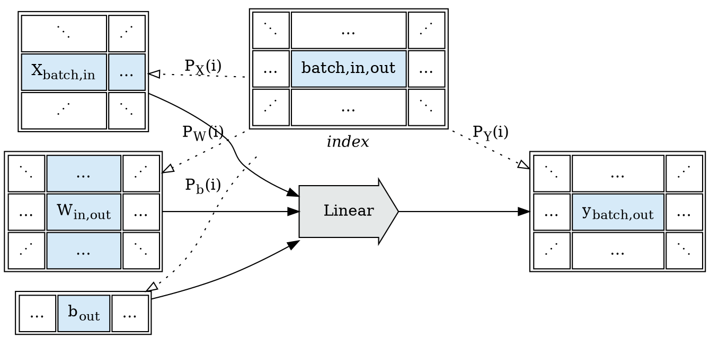
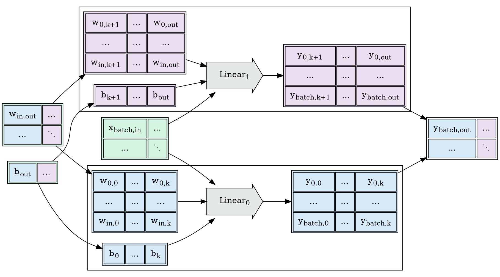
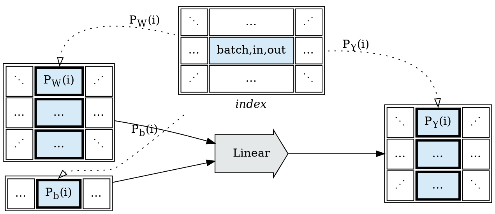

### Series

This post develops part of this document:
   * [Tapestry: Shardable Tensor Expression Languages](/Tapestry)

# Sharding $Linear$ over the `out` dimension

In the previous post on [Index Projection Functions](/2022/12/Index-Projection-Functions/),
we developed affine projections for the batch dimension of a tensor-valued $Linear$ operation,
assuming dimensions: $X: [batch, in]$, $W: [in, out]$, $b: [out]$, $Y: [batch, out]$:

$$
Linear(X, W, b) := X \cdot W + b
$$

We'll now consider $P_W(i)$, and how we'll handle batching over `out` dimensions:

The values of $Linear$ in the `out` dimension are independent of each other;
each `out` value is computed using one column of $W$ and one value in $b$;
and as a result the op can be cleanly and trivially sharded by chunking $W$ and $b$:

By extending the $index$ space to index the $out$ dimension, we can express the index functions $P_W(i)$, $P_b(i)$,
and $P_Y(i)$ $start$ coordinates in terms of the indexed $out$ coordinate, and the shapes in
terms of the $W_{out}$ out dimension size.

$$\begin{eqnarray\*}
P_W(i) &=& ZRange \left\\{ \begin{split} start&:& [i_{out}, 0], \\\\ shape &:& [W_{out}, 1] \end{split} \right\\} \\\\
\\\\
P_b(i) &=& ZRange \left\\{ \begin{split} start&:& [i_{out}], \\\\ shape &:& [1] \end{split} \right\\} \\\\
\\\\
P_Y(i) &=& ZRange \left\\{ \begin{split} start&:& [i_{out}, 0], \\\\ shape &:& [W_{out}, 1] \end{split} \right\\}
\end{eqnarray\*}$$

We also cleanly get the property that coherent ranges in the index space
correspond to coherent tensor ranges in the mapped coordinate space:

```graphviz
digraph G {
    rankdir=LR;

    idx [
        shape="plain",
        label=<
	<table border="0">
        <tr><td>
          <table cellpadding="8">
              <tr>
                  <td>⋱</td>
                  <td>…</td>
                  <td>⋰</td>
                  </tr>
              <tr>
                  <td>…</td>
                  <td bgcolor="#D6EAF8" align="center">batch,in,out</td>
                  <td>…</td>
                  </tr>
              <tr>
                  <td>⋰</td>
                  <td>…</td>
                  <td>⋱</td>
                  </tr>
              </table>
	  </td></tr>
        <tr><td><i>index</i></td></tr>
	  </table>
        >,
    ];

    w [
        shape="plain",
        label=<
        <table cellpadding="8">
            <tr>
                <td port="a" bgcolor="#D6EAF8">P<sub>W</sub>({out: 0})</td>
                <td bgcolor="#D6EAF8">…</td>
                <td port="b" border="3">P<sub>W</sub>({out: k})</td>
                <td border="3">…</td>
                <td>…</td>
                </tr>
            <tr>
                <td bgcolor="#D6EAF8">…</td>
                <td bgcolor="#D6EAF8">…</td>
                <td border="3">…</td>
                <td border="3">…</td>
                <td>…</td>
                </tr>
            <tr>
                <td bgcolor="#D6EAF8">…</td>
                <td bgcolor="#D6EAF8">…</td>
                <td border="3">…</td>
                <td border="3">…</td>
                <td>…</td>
                </tr>
            </table>
        >,
    ];
    
    y [
        shape="plain",
        label=<
        <table cellpadding="8">
            <tr>
                <td port="a" bgcolor="#D6EAF8">P<sub>Y</sub>({out: 0})</td>
                <td bgcolor="#D6EAF8">…</td>
                <td port="b" border="3">P<sub>Y</sub>({out: k})</td>
                <td border="3">…</td>
                <td>…</td>
                </tr>
            <tr>
                <td bgcolor="#D6EAF8">…</td>
                <td bgcolor="#D6EAF8">…</td>
                <td border="3">…</td>
                <td border="3">…</td>
                <td>…</td>
                </tr>
            <tr>
                <td bgcolor="#D6EAF8">…</td>
                <td bgcolor="#D6EAF8">…</td>
                <td border="3">…</td>
                <td border="3">…</td>
                <td>…</td>
                </tr>
            </table>
        >,
    ];
    
    b [
        shape="plain",
        label=<
        <table cellpadding="8">
            <tr>
                <td port="a" bgcolor="#D6EAF8" border="3">P<sub>b</sub>({out: 0})</td>
                <td bgcolor="#D6EAF8">…</td>
                <td port="b" border="3">P<sub>b</sub>({out: k})</td>
                <td border="3">...</td>
                <td>…</td>
                </tr>
            </table>
        >,
    ];

    op [
        label=Linear,
        shape=rarrow,
        style=filled,
        fillcolor="#E5E8E8",
        margin=0.3
    ];

    w -> op;
    b -> op;
    op -> y;

    idx -> w:a [
        label=<P<sub>W</sub>({out: 0})>,
        constraint=false,
        style=dotted,
        arrowhead=empty
    ];
    
    idx -> w:b [
        label=<P<sub>W</sub>({out: k})>,
        constraint=false,
        style=dotted,
        arrowhead=empty
    ];
    
    idx -> b:a [
        label=<P<sub>b</sub>({out: 0})>,
        constraint=false,
        style=dotted,
        arrowhead=empty
    ];
    
    idx -> b:b [
        label=<P<sub>b</sub>({out: k})>,
        constraint=false,
        style=dotted,
        arrowhead=empty
    ];
    
    idx -> y:a [
        label=<P<sub>Y</sub>({out: 0})>,
        constraint=false,
        style=dotted,
        arrowhead=empty
    ];
    
    idx -> y:b [
        label=<P<sub>Y</sub>({out: b})>,
        constraint=false,
        style=dotted,
        arrowhead=empty
    ];

    { rank=same; op; idx; }
}
```

# Sharding $Linear$ over the `in` dimension

Sharding $Linear$ over the $W_{in}$ dimension is more complex, as it requires sharding a
reduce operation; which breaks our current block model; as a preview for a future post,
we can see that this can be rewritten as a $sum$ reduction:

```graphviz
digraph G {
  rankdir=LR;

  x [
      shape="plain",
      label=<
      <table cellpadding="8">
          <tr>
              <td border="3" bgcolor="#D6EAF8">x<sub>i,m</sub></td>
              <td border="3" bgcolor="#D6EAF8">…</td>
              <td>⋰</td>
              </tr>
          <tr>
              <td>…</td>
              <td>…</td>
              <td>…</td>
              </tr>
          <tr>
          	<td>⋰</td>
              <td>…</td>
          	<td>⋱</td>
              </tr>
          </table>
      >,
  ];

  w [
      shape="plain",
      label=<
      <table cellpadding="8">
          <tr>
              <td border="3" bgcolor="#D6EAF8">w<sub>m,n</sub></td>
              <td>…</td>
              <td>⋰</td>
              </tr>
          <tr>
              <td border="3" bgcolor="#D6EAF8">…</td>
              <td>…</td>
              <td>…</td>
              </tr>
          <tr>
          	<td>⋰</td>
              <td>…</td>
          	<td>⋱</td>
              </tr>
          </table>
      >,
  ];

  subgraph cluster_0 {
    idx0 [
      shape="plain",
      label=<
          <table border="0">
      <tr><td>
        <table cellpadding="8">
          <tr><td>
        
        <table cellpadding="8">
          <tr>
            <td bgcolor="#D6EAF8">i,n,k</td>
            <td>⋰</td>
            </tr>
          <tr>
            <td>⋰</td>
            <td>⋱</td>
            </tr>
          </table>
            </td></tr>
          </table>
            </td></tr>
      <tr><td><i>matmul index</i></td></tr>
            </table>
      >,
    ];

    x0 [
        shape="plain",
        label=<
        <table cellpadding="8">
            <tr>
                <td border="3" bgcolor="#D6EAF8">x<sub>i,m</sub></td>
                <td border="3" bgcolor="#D6EAF8">…</td>
                <td>⋰</td>
                </tr>
            <tr>
                <td>…</td>
                <td>…</td>
                <td>…</td>
                </tr>
            <tr>
            	<td>⋰</td>
                <td>…</td>
            	<td>⋱</td>
                </tr>
            </table>
        >,
    ];

    w0 [
        shape="plain",
        label=<
        <table cellpadding="8">
            <tr>
                <td border="3" bgcolor="#D6EAF8">w<sub>m,n</sub></td>
                <td>…</td>
                <td>⋰</td>
                </tr>
            <tr>
                <td border="3" bgcolor="#D6EAF8">…</td>
                <td>…</td>
                <td>…</td>
                </tr>
            <tr>
            	<td>⋰</td>
                <td>…</td>
            	<td>⋱</td>
                </tr>
            </table>
        >,
    ];

    op0 [
        label=matmul,
        shape=rarrow,
        style=filled,
        fillcolor="#E5E8E8",
        margin=0.3
    ];

    z0 [
      shape="plain",
      label=<
      <table cellpadding="8">
        <tr><td>

      <table cellpadding="8">
        <tr>
          <td bgcolor="#D6EAF8">z<sub>i,k,n</sub></td>
          <td>…</td>
          </tr>
        <tr>
          <td>⋰</td>
          <td>⋱</td>
          </tr>
        </table>

	  </td></tr>
        </table>
      >,
    ];

    x0 -> op0;
    w0 -> op0;
    op0 -> z0;

    { rank=same; idx0; op0; }
  }

  x -> x0;
  z0 -> z;

  z [
    shape="plain",
    label=<
      <table cellpadding="8">
        <tr><td>
      
      <table cellpadding="8">
        <tr>
          <td>z<sub>i,k,n</sub></td>
          <td>⋰</td>
          </tr>
        <tr>
          <td>⋰</td>
          <td>⋱</td>
          </tr>
        </table>

	  </td></tr>
        </table>
    >,
  ];

  w -> w0;

  subgraph cluster_1 {
    idx1 [
      shape="plain",
      label=<
          <table border="0">
      <tr><td>
        <table cellpadding="8">
          <tr>
            <td bgcolor="#EBDEF0">i,n</td>
            <td>⋰</td>
            </tr>
          <tr>
            <td>⋰</td>
            <td>⋱</td>
            </tr>
          </table>
            </td></tr>
      <tr><td><i>sum index</i></td></tr>
            </table>
      >,
    ];

    z1 [
      shape="plain",
      label=<
      <table cellpadding="8">
        <tr><td>

      <table cellpadding="8">
        <tr>
          <td bgcolor="#EBDEF0">z<sub>i,k,n</sub></td>
          <td>…</td>
          </tr>
        <tr>
          <td>⋰</td>
          <td>⋱</td>
          </tr>
        </table>

	  </td></tr>
        </table>
      >,
    ];

    op1 [
        label=sum,
        shape=rarrow,
        style=filled,
        fillcolor="#E5E8E8",
        margin=0.3
    ];

    y1 [
      shape="plain",
      label=<
      <table cellpadding="8">
        <tr>
          <td bgcolor="#EBDEF0">y<sub>i,n</sub></td>
          <td>…</td>
          </tr>
        <tr>
          <td>⋱</td>
          <td>…</td>
          </tr>
        </table>
      >,
    ];

    b1 [
      shape="plain",
      label=<
      <table cellpadding="8">
        <tr>
          <td bgcolor="#EBDEF0">b<sub>n</sub></td>
          <td>…</td>
          </tr>
        </table>
      >,
    ];

    z1 -> op1;
    b1 -> op1;
    op1 -> y1;

    { rank=same; idx1; op1; }
  }

  z -> z1;

  b [
    shape="plain",
    label=<
    <table cellpadding="8">
      <tr>
        <td bgcolor="#EBDEF0">b<sub>n</sub></td>
        <td>…</td>
        </tr>
      </table>
    >,
  ];

  b -> b1;

  y [
    shape="plain",
    label=<
    <table cellpadding="8">
      <tr>
        <td bgcolor="#EBDEF0">y<sub>i,n</sub></td>
        <td>…</td>
        </tr>
      <tr>
        <td>⋱</td>
        <td>…</td>
        </tr>
      </table>
    >,
  ];

  y1 -> y;

  { rank=same; x; w; b; }

}
```

