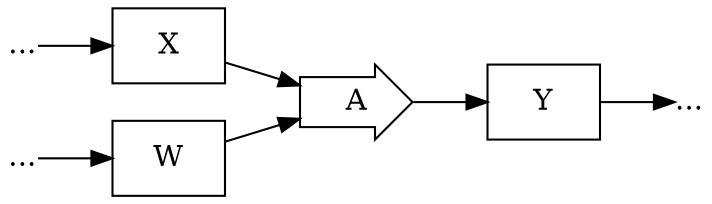
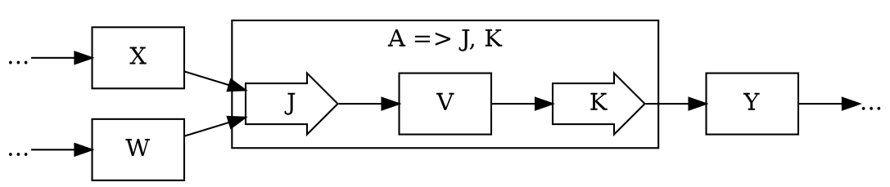
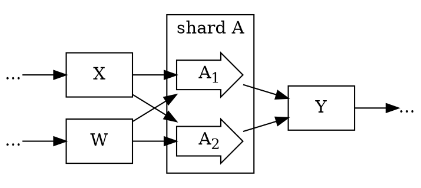
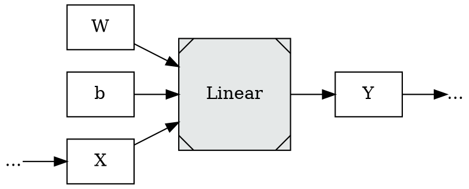
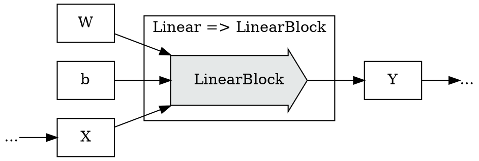
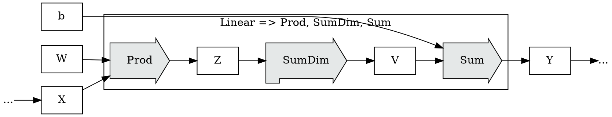

This post develops part of this document:

* [Tapestry: Shardable Tensor Expression Environments](/Tapestry)

## Graph Rewrite Rules

[Graph rewriting](https://en.wikipedia.org/wiki/Graph_rewriting) is a common implementation feature
of graph evaluation languages; "graph rewrite rules" are rules to describe legal rewrites on a graph,
and the field constitutes a large field of study on its own.

As an example, suppose we have a graph containing the following sub-graph:

And we have a rule saying something like:
* "under certain conditions, `A` can be rewritten in terms of `J` and `K`";
  with appropriate patterns and machinery to check those conditions, and perform the rewrite mechanically.

We could imagine determining that the rewrite applied in this situation, and then applying it yielding
the following graph, where `A` has been replaced with `J` and `K`, and an intermediate value `V` has been introduced:

It can be valuable to distinguish between semantic and optimization rewrites:
* **semantic rewrites** are rewrites required by the language; frequently when some high level feature
  is implemented in terms of lower level features, and *must* be replaced for evaluation.
* **optimization rewrites** are rewrites which aim to reduce the execution cost;
  they are optional, but desired.

Much of the work on block sharding thus far has been implicitly modeling families of rewrite
rules around sharding block operations; on rewriting block operation graphs, such as this one:

Into graphs where the block operations have been sharded in some way, such as this one:

Previous work in sharding $Linear$ and $Matmul$ blocks has shown that there are other rewrites
that are valuable to us, starting from a high-level $Linear$ block:

We semantically rewrite to either a $LinearBlock$ if we choose not to shard on the $in$ dimension
of $Linear$:

Or we semantically rewrite to a $Prod$, $SumDim$, $Sum$ subgraph if we choose to shard on the $in$ dimension
of $Linear$:

Fully expanding an optimizing tensor evaluation environment requires some facility
for graph rewriting; though only **semantic rewrites** are required.

**Optimization rewrites** are frequently treated as a nice-to-have; something
added to evaluation systems once they've reached maturity, and added piecemeal,
where they can be inserted without disrupting the semantics of existing programs.

The resource impact, in performance and memory, of optimization rewrites can
be extremely large; large enough that an argument can be made that the core
structure of a system should be engineered from the beginning to enable them;
and that is the approach that we're taking with Tapestry.

Every operational or semantic design component of Tapestry should be measured
against the question:
* Does this enable or impede optimization rewrites?

### Conditional Expansion

tied to an operator, descent only, macros, "definitions"

### Global Rewrite Search

always true, extend the environment

### Rewrite Utility Operators

operators which exist to enable rewrite rules.

