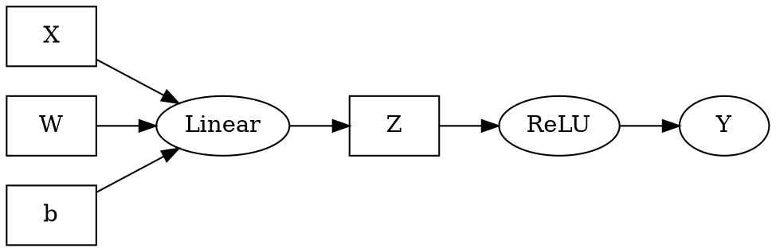
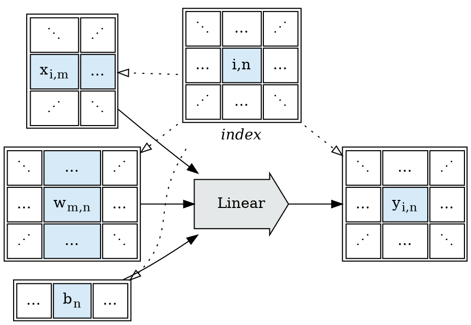

This post explores *Index Projection Functions*; as a pathway to contiune the tensor expression
evaluation environment design discussed in [Sharding Tensor Expressions](/2022/12/12/Sharding-Tensor-Expressions/).

Suppose we've got a toy tensor expression language:
```
X, W, b, Z: Tensor
Z = Linear(X, W, b)
Y = ReLU(Z)
```

And we're interested in mechanical sharding optimizations of the resultant expression graph: 


As discussed in the previous post, we're attempting to find a family of $Operators$ such that,
for any given $Operator$, we'll have additional information:
* Given the shapes of the parameters, what are the expected shapes of the results?
* Given the shapes of the parameters, what independent shards are possible which can be
  fused back into the same results?
* How do the shards share resources (which sharding choices are more or less expensive)?


