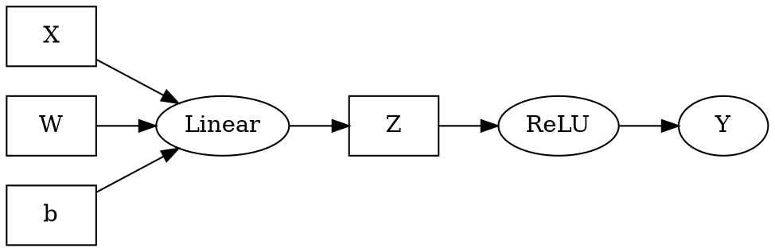
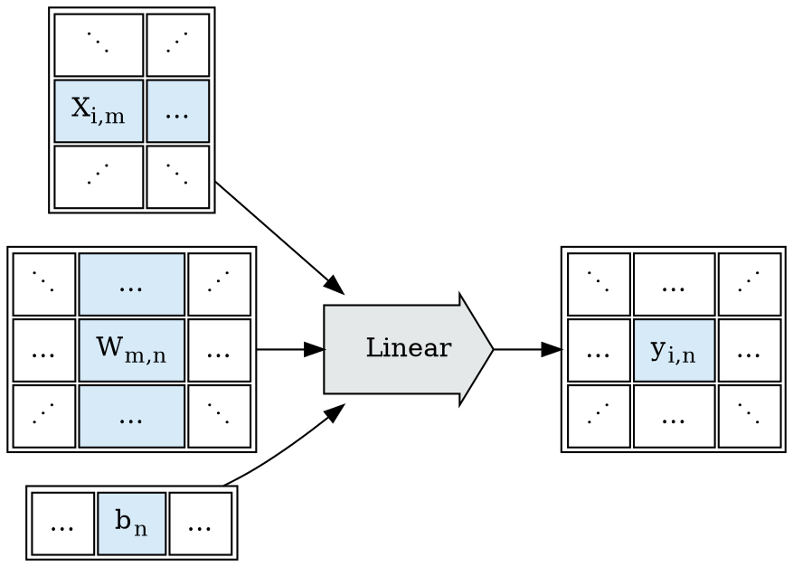
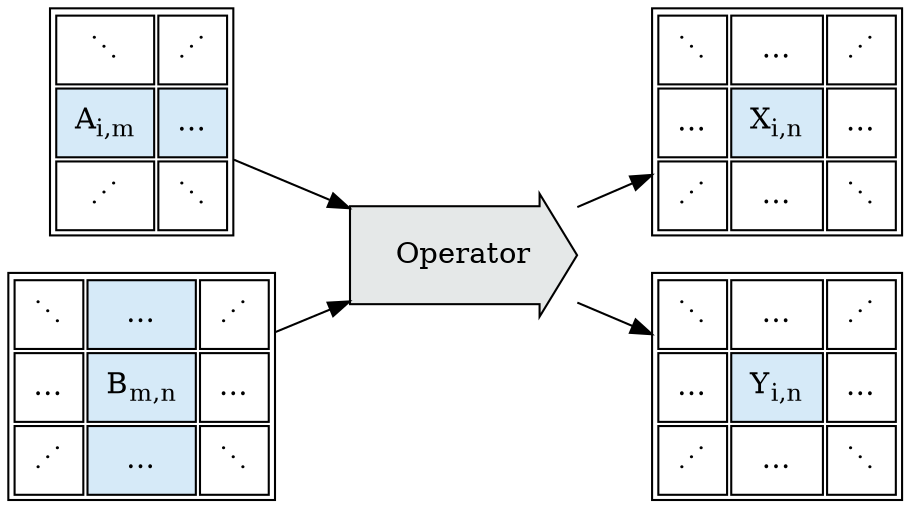
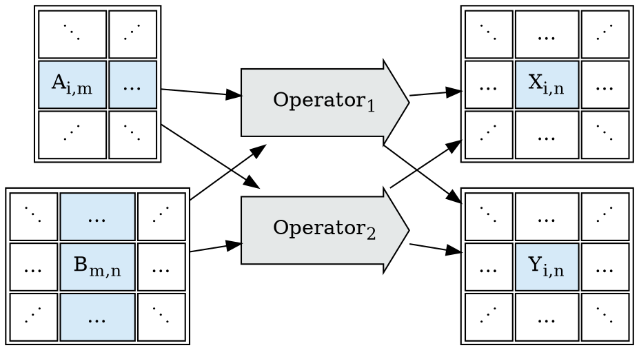
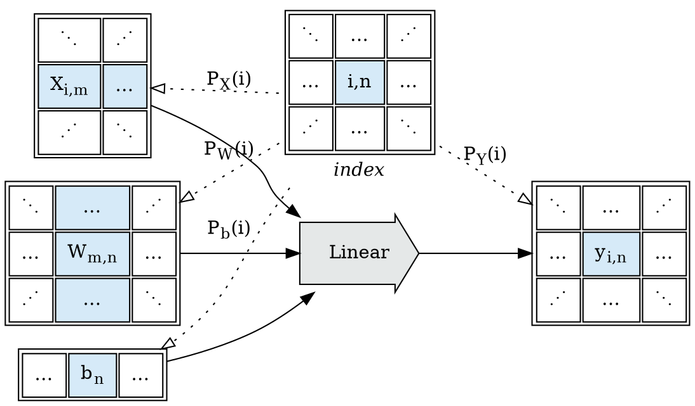
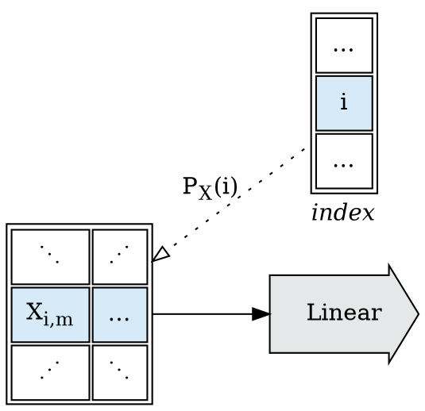
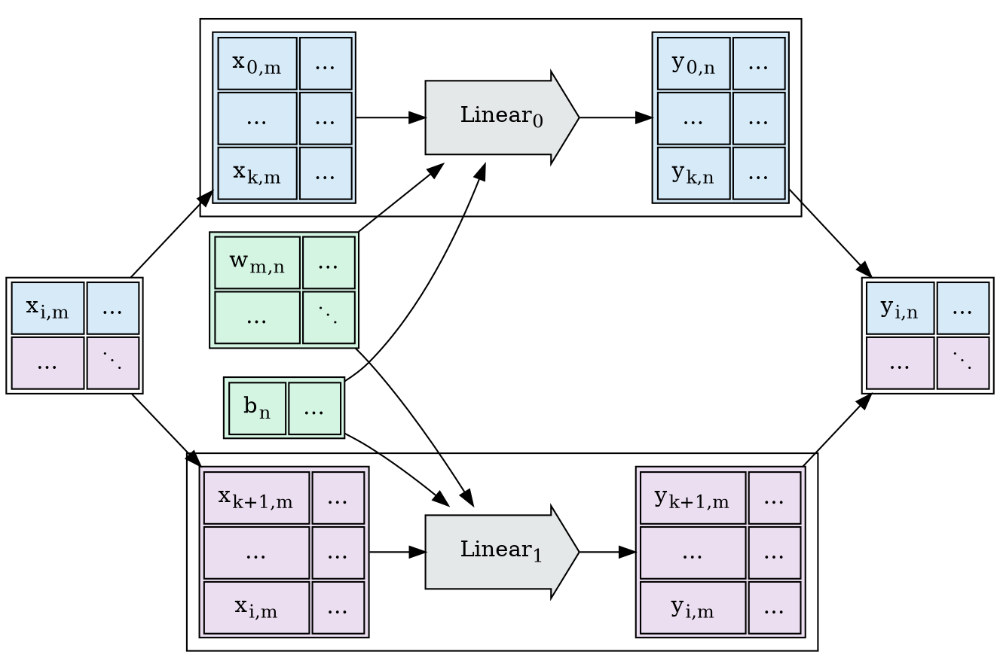
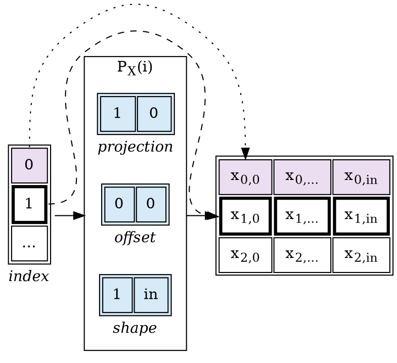
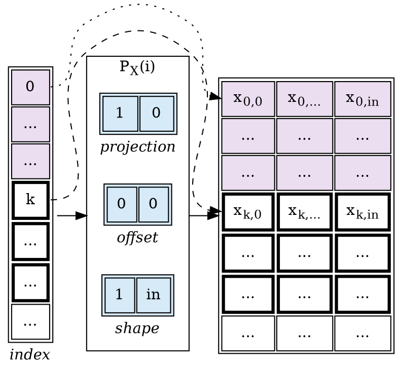

### Series

This post develops part of this document:
    * [Tapestry: Shardable Tensor Expression Languages](/Tapestry)

This post explores *Index Projection Functions*; as a pathway to developing a tensor
expression evaluation environment:
  * See Part 1: [Sharding Tensor Expressions](/2022/12/12/Sharding-Tensor-Expressions/).

# Restricting to Shardable Operators

Suppose we've got a toy tensor expression language $Expr$:
```
X, W, b, Z: Tensor
Z = Linear(X, W, b)
Y = ReLU(Z)
```

And we're interested in mechanical sharding optimizations of the resultant expression graph: 


## Shardable Operators

Let $Operator$ be a block-operation, taking *tensor*-valued inputs, and producing *tensor*-valued outputs.

As discussed in the previous post, we're attempting to find a family of $Operators$ such that,
for any given $Operator$, we'll have additional information:
* Given the shapes of the parameters, what are the expected shapes of the results?
* Given the shapes of the parameters, what independent shards are possible which can be
  fused back into the same results?
* How do the shards share resources (which sharding choices are more or less expensive)?



Consider the abstract one-$Operator$ flow graph:



We're interested in families of $Operator$ such that we can shard operations mechanically, and
re-assemble the results mechanically, and produce the same value as though the operation had been done in one pass.



## Operator Index Counting

Crucially, the goal is to be able to shard:
  * *With* a strong ability to predict execution costs before evaluation; and
  * *Without* examining anything about the implementation of $Operator$.

This can be reframed as a counting problem:
  * Can we enumerate all simple sub-problems of a given call to $Operator$?

To make this concrete, let's reconsider $Linear$ from above. If we add an $index$ space
to count all sub-problems of $Linear$:
  * What is the shape of $index$?
    * How many dimensions does $index$ have?
    * What are their sizes?
  * What relationship does the shape of $index$ have to the inputs ($X$, $W$, $b$) and outputs ($Y$)?
  * What *portions* of the inputs and outputs are associated with each point in $index$?



Given a block $Operation$, and knowledge about the structural co-variance of its inputs
and outputs, we seek an index space, and a collection of projection functions $P_T(i)$
for each input or output $tensor$, such that we can mechanically enumerate sub-problems
and re-assemble the results.

It is important to state that the top-down approach (starting with an $Operator$, find sharding)
is a potentially intractable problem; while the bottom-up approach (starting with sharding, define
$Operator$s) is solvable by construction (but limited to findable constructions):
  * Top-Down: Given this $Operator$, can I find projection functions $P_T(i)$?
  * Bottom-Up: Given a menagerie of known projection functions $P_T(i)$,
      what $Operators$ can I construct?

## Affine Projection Functions

One design approach for solving the $P_T(i)$ projection design problem is the use of
coordinate space (integer, $\mathbb{Z}$) affine transforms (linear projections) from the index space
to the tensor spaces.

Affine projection functions are an approach I explored in depth working at 3Scan,
and an approach that's also been incorporated into the [MLIR](https://mlir.llvm.org/)
project's [Polyhedral Types](https://mlir.llvm.org/docs/Dialects/Affine/).

What components make up an affine projection function?:
  * an affine expression mapping points in $index$ space to starts in the coordinate space of input/output tensors;
  * a fixed $shape$ defining the shape of region selected relative to the mapped point.

The simplest representation of this is a simple affine transform + a shape:

$$
P_T(i) := ZRange(start: A_T i + B_T, shape: S_T)
$$

Are affine expressions the *right* or *best* solution to te design of projection functions?
We don't know; affine expressions can only be compared to other proposals, not
all possible families of functions; there may be better ideas yet to be surfaced.
We do know that affine expressions make some common patterns easy to express
*and* to compute the shards of; and make some performance critical patterns
*tractable* to express and compute the shards of.

Affine projection function have an important non-obvious property; it is generally
tractable to arrange them such that *coherent* range blocks in the *index* space
map to *coherent* space blocks in the input or output tensors. This property falls
out of the fact that affine projection functions have constant marginal delta strides
(the incremental change resulting from changing an input by one step is constant).
Coherent input/output blocks dramatically simplify processing expectations,
particularly in the face of shared input (as with convolution operations).

As with many matrix transform operations, the basic definitions are simple;
but some of the implications can be complex to unpack. We'll explore a few here.

### Linear Strides Over a Batch Dimension

Consider $Linear$'s $X$ input tensor; let's assume a 2D shape $[batch, in]$.




We'd like to be able to describe a $P_X(i)$ affine projection such that we can describe
the following shards:



A very simple linear projection is sufficient to describe the mapping from a point in index space 
to a batch row of the input $X$.



We also cleanly get the property that coherent ranges in the index space
correspond to coherent tensor ranges in the mappend coordinate space:



I'll continue developing this theme in future posts. More can be read in the tapestry work:
  * [tapestry: Exploring Tensor Block Sharding Feasibility](https://github.com/crutcher/tapestry/blob/main/BlockSharding.md)
  * [tapestry: Index Projection Functions](https://github.com/crutcher/tapestry/blob/main/IndexProjectionDesign.md)
