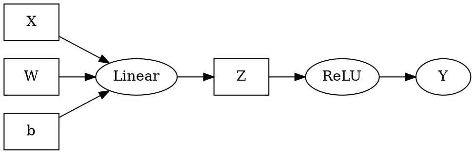
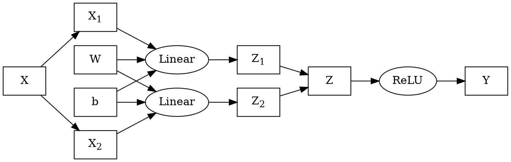
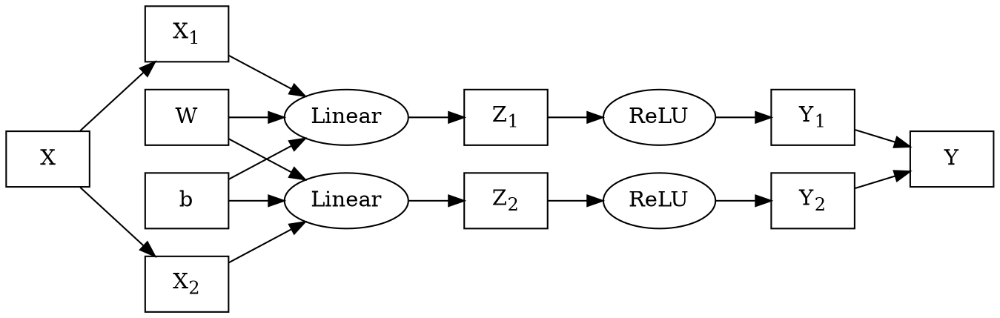
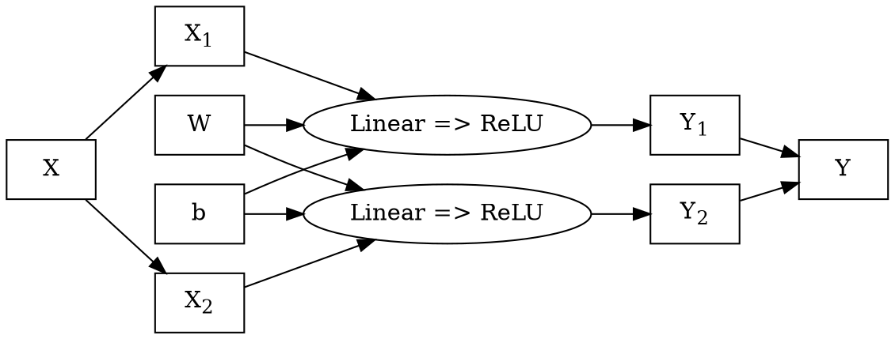

The distributed tensor expression "problem":
* Given a tensor expression ( $Y = f(A, B); Z = g(X, Y)$ ), where the tensors may be
  arbitrarily large, how do we efficiently schedule the expression over large numbers of GPUs?

Much of the existing work in this space has focused upon scaling programs written
in existing tensor expression languages (`pytorch`, `tensorflow`, `numpy`);
most of which were modeled upon the stats language `R`; and none of which were built
to permit the ready calculation of operation sharding, or graph optimization.

It's understandable why the focus has been on extending the semantics and scalability
of the languages that so much of the existing AI application stacks have been written in;
incremental improvements have direct impact on the ability to train and deploy existing
applications.

However, quite a few pieces of the current system pose problems for these *smart* compilers:
* the existing APIs have many entry points;
* the entry points don't all follow consistent semantics;
* the apis were not written to enforce a stable co-variance between parameters and results;
* the tensor APIs are data/shape polymorphic;
* and python itself is obnoxious to trace symbolically


If, as an exercise, we drop any notion of compatibility with existing `numpy`-derived
apis; I'm interested in the question of how far we can get?

## Expanding a Toy Example

The process of designing new evaluation environments is the process of searching over spaces
of functor embeddings to attempt to fit the formal semantics we desire to the operational
requirements we'd like to satisfy in evaluation.

Consider a tensor expression in a toy language, call it $Expr$:

```
X, W, b, Z: Tensor
Z = Linear(X, W, b)
Y = ReLU(Z)
```
At this point there are no formal semantics for $Expr$; we're searching design space
for formal semantics such that:
1. Common operations in AI can be represented in the semantics;
2. $Expr$ can be sharded to a distributed GPU fabric using existing optimization theory.

If we were attempting to shard `python+numpy`, or `python+pytorch`, or any number of other
existing problem spaces, we'd be forced to find an embedding which permitted hosting
the entire semantic surface of those environments.

But since we've decided to drop that requirement, we can *break* the semantics; since $Expr$
is only a sketch towards a language, we can explore restrictions to $Expr$ which simplify
embedding.

Consider one functional dependency interpretation of our toy example:


Taking motivation from the toy example; we'd like to be able to shard the $Linear$ node.
The operation is intended as a stand-in for the fully-connected linear layer operation from
neural networks:

$$
Linear(X, W, b) := X \cdot W^T + b
$$

By examining the implementation of $Linear$, and assuming that $X$ has shape $[batch, in]$ ,
we can show that the operation can be cleanly sharded along any batch dimensions of the input $X$:

$$\begin{eqnarray\*}
\begin{split}
Z &= Linear(X, W, b) \\\\
Y &= ReLU(Z)
\end{split}
\quad &\leftrightarrow& \quad
\begin{split}
Z &= \left( \begin{split}
Linear(X[..k , ...], W, b) \\\\
Linear(X[k.. , ...], W, b)
\end{split} \right) \\\\
Y &= ReLU(Z)
\end{split} \\\\ \\\\
&\leftrightarrow& \quad
\begin{split}
X_1 &= X[.. k, ...] \\\\
X_2 &= X[k .., ...] \\\\
Z_1 &= Linear(X_1, W, b) \\\\
Z_2 &= Linear(X_2, W, b) \\\\
Z &= \left( \begin{split} Z_1 \\\\ Z_2 \end{split} \right) \\\\
Y &= ReLU(Z)
\end{split} \\\\ \\\\
\end{eqnarray\*}$$




By exploiting our knowledge of the implementation of $ReLU$:

$$
ReLU(Z) := Z \circ [Z > 0]
$$

We know that we can also re-write $ReLU$ expressions upon the batch dimensions:

$$\begin{eqnarray\*}
\begin{split}
X_1 &= X[.. k, ...] \\\\
X_2 &= X[k .., ...] \\\\
Z_1 &= Linear(X_1, W, b) \\\\
Z_2 &= Linear(X_2, W, b) \\\\
Z &= \left( \begin{split} Z_1 \\\\ Z_2 \end{split} \right) \\\\
Y &= ReLU(Z)
\end{split}
\quad &\leftrightarrow& \quad
\begin{split}
X_1 &= X[.. k, ...] \\\\
X_2 &= X[k .., ...] \\\\
Z_1 &= Linear(X_1, W, b) \\\\
Z_2 &= Linear(X_2, W, b) \\\\
Y &= \left( \begin{split}
ReLU(Z_1) \\\\
ReLU(Z_2)
\end{split} \right)
\end{split} \\\\ \\\\
&\leftrightarrow& \quad
\begin{split}
X_1 &= X[.. k, ...] \\\\
X_2 &= X[k .., ...] \\\\
Z_1 &= Linear(X_1, W, b) \\\\
Z_2 &= Linear(X_2, W, b) \\\\
Y_1 &= ReLU(Z_1) \\\\
Y_2 &= ReLU(Z_2) \\\\
Y &= \left( \begin{split} Y_1 \\\\ Y_2 \end{split} \right) \\\\
\end{split}
\end{eqnarray\*}$$




And finally, seeing $Z_1$ and $Z_2$ do not escape, we can fuse $Linear$ and $ReLU$
into the combined $Linear \Rightarrow ReLU$ operation, and collapse the shards:

$$\begin{eqnarray\*}
\begin{split}
X_1 &= X[.. k, ...] \\\\
X_2 &= X[k .., ...] \\\\
Z_1 &= Linear(X_1, W, b) \\\\
Z_2 &= Linear(X_2, W, b) \\\\
Y_1 &= ReLU(Z_1) \\\\
Y_2 &= ReLU(Z_2) \\\\
Y &= \left( \begin{split}
Y_1 \\\\
Y_2
\end{split} \right)
\end{split}
\quad &\leftrightarrow& \quad
\begin{split}
X_1 &= X[.. k, ...] \\\\
X_2 &= X[k .., ...] \\\\
Y_1 &= ReLU(Linear(X_1, W, B)) \\\\
Y_2 &= ReLU(Linear(X_2, W, B)) \\\\
Y &= \left( \begin{split}
Y_1 \\\\
Y_2
\end{split} \right)
\end{split} \\\\
&\leftrightarrow& \quad
\begin{split}
X_1 &= X[.. k, ...] \\\\
X_2 &= X[k .., ...] \\\\
Y_1 &= (Linear \Rightarrow ReLU)(X_1, W, b) \\\\
Y_2 &= (Linear \Rightarrow ReLU)(X_2, W, b) \\\\
Y &= \left( \begin{split}
Y_1 \\\\
Y_2
\end{split} \right)
\end{split} \\\\ \\\\
\end{eqnarray\*}$$




These series of transformations are possible because we know (or assume) details about
the structural co-variance of the inputs and outputs to the operations $Linear$ and $ReLU$.

## Restricting Operators to Known Structural Co-Variance

We cannot assume that any arbitrary operation from a collection of named tensors (the parameters)
to a collection of named tensors (the results) will have cleanly explicable structural co-variance
(the relationship between the data in the input cells and the data in the output cells);
but we can observe that the tractability and explicability of the structural co-variance of operators
bears directly upon our ability to design mechanical sharding and graph-rewrite algorithms over
expression graphs.

* If we take as a design requirement the ability to make intelligent sharding choices about operators,
  and to be able to chain the results of those choices through subsequent layers of the graph, then we
  can reframe the semantics problem of our toy language as searching for a family of operators with
  this property.

For any given $Operator$, we need additional information:
* Given the shapes of the parameters, what are the expected shapes of the results?
* Given the shapes of the parameters, what independent shards are possible which can be
  fused back into the same results?
* How do the shards share resources (which sharding choices are more or less expensive)?

But we also need to ensure that connective expression language between operators has the same properties.

This is an active field of research for me; I believe that index projection functions are a viable solution to this,
and I've done a fair amount of background work on large transform environments.

  * [Tapestry Tensor Expressions](https://github.com/crutcher/tapestry)
    - my current toy environment.
  * [3Scan Crystal Pipeline](https://docs.google.com/presentation/d/1KGlawW9iZnI7xN-X-Q5y4h8aBqgu6bh4pA_0Siq321E/edit?usp=sharing) 
    - a slideshow of previous work we did on large-scale tensor expression environments.
  * [MLIR Polyhedral Types](https://mlir.llvm.org/docs/Dialects/Affine/)
    - the current LLVM work on polyhedral types for MLIR.


Continue reading:
  * See Part 2: [Index Projection Functions](http://localhost:4000/2022/12/13/Index-Projection-Functions/)