This post develops part of this document:
   * [Tapestry: Shardable Tensor Expression Languages](/Tapestry)

# Sharding $Linear$, and $Matmul$, over the `in` dimension

In the previous posts on [Index Projection Functions](/2022/12/13/Index-Projection-Functions/)
and [Sharding Linear Operations over Weight Out Dimensions](/2022/12/17/Sharding-Linear-Operations-Over-Weight-Out-Dimensions/),
we developed affine projection sharding over the $batch$ and $out$ dimensions of a tensor-valued $Linear$ operaton,
assuming dimensions: $X: [batch, in]$, $W: [in, out]$, $b: [out]$, $Y: [batch, out]$:

$$
Linear(X_{[batch,in]}, W_{[in,out]}, b_{[out]})_{[batch,out]} := X \times W + b
$$

To examine sharding over the $in$ dimension, we'll need to focus on the nature of the matrix multiplication
operation, and discuss $Matmul$ and $Sum$ operations.

$$
\begin{eqnarray}
Matmul(X_{[batch,in]}, W_{[in,out]})_{[batch,out]} &:=& X \times W \\\\
Sum(A\_{[...]}, B\_{[...]})\_{[...]} &:=& A + B
\end{eqnarray}
$$

What's important here is that, while $Matmul$ is linearly shardable in its $batch$ and $out$ dimensions,
it contains an implicit reduce sum reduction operation in its $input$ dimension.

$$
Matmul(X_{[batch,in]}, W_{[in,out]}) := \left(
\begin{split}
\left\\{\sum_{in=1}^n x_{batch,in}w_{in,out}\right\\}_{batch,out} &\qquad& ... \\\\
... &\qquad& ...
\end{split} \right)
$$

> 📝 Note: careful readers may note that there exists a large body of work dedicated to the question of
> how to implement $Matmul$ more efficiently. The point of this exercise is to use $Linear$ and $Matmul$
> as a lens to examine data covariance in sharding block operations; and a naive treatment of $Matmul$
> is useful to these needs.
> \
> In a fully developed tensor expression sharding environment, it could be useful to hoist some
> operations, such as $Matmul$ to the level that the compiler were directly aware of them;
> and could more aggressively use the existing research in those spaces; but it is not
> necessary to develop the foundations of such an environment.

Returning to $Linear$, we can rewrite $Linear$ as a composition of $Matmul$ and $Sum$:

$$
Linear(X_{[batch,in]}, W_{[in,out]}, b_{[out]})_{[batch,out]} := Sum(Matuml(X, W), b)
$$

Applying this re-write would restructure our expression graph from this:


To this:


A block operation sharding solution for $Matmul$ on $in$ should translate to a solution
for $Linear$ on $in$.

We can decompose $Matmul$ by distinguishing between the matrix multiplication operator ($\times$)
and the cell-wise product operation ($\cdot$); and generate an intermediate product with shape $[batch,in,out]$.

To do this, we need to extend and broadcast $X$ and $W$ to the combined shape $[batch,in,out]$,
to produce an intermediate result $V$:

$$
V := (X\_{[batch,in,1]} \cdot W\_{[1,in,out]})\_{[batch,in,out]}
$$

And we need to introduce a new operator $SumDim(T, dim)$ which sums along and removes one dim of $T$.

We can now define $Matmul$ in terms of this intermediate result, and $SumDim$

$$
\begin{eqnarray}
Matmul(X_{[batch,in]}, W_{[in,out]})_{[batch,out]} &:=& X\_{[batch,in]} \times W\_{[in,out]\} \\\\
&=& SumDim \left( \begin{split}
(X\_{[batch,in,1]} \times W\_{[1,in,out]})\_{[batch,in,out]}, \\\\
dim = \langle in \rangle
\end{split} \right)
\end{eqnarray}
$$

This decomposition yields the following expression graph:


In this decomposition, $Prod$ is a well-behaved block operation; but
$SumDim$ is represented differently, it is not a block operation as we've represented them
before, but a *reduction operation*.

## Sharding $Prod$ 

Consider $Prod$; a simple cell-wise multiplication. We expect the output
to have the same shape and dimensions as the input:

$$
\begin{eqnarray}
Prod(A\_{[...]\}, B\_{[...]})\_{[...]} &:=& A \cdot B \\\\
Prod(A\_{[m,n,o]}, B\_{[m,n,o]})\_{[m,n,o]} &:=& \left( \begin{split}
(a\_{m,n,o} \cdot b\_{m,n,o}) &\qquad& ... \\\\
... &\qquad& ...
\end{split} \right)
\end{eqnarray}
$$

To achieve this in tensor operations over inputs where the shapes are not initially the
same, but can be manipulated to be the same; it's common to use *broadcasting*; to
treat any dimension which is $1$ for one input, but non $1$ for another input
as though it were broadcast or spread to cover the size of the other:

$$
Prod(A\_{[1,n,o]}, B\_{[m,1,o]})\_{[m,n,o]} := \left( \begin{split}
(a\_{1,n,o} \cdot b\_{m,1,o}) &\qquad& ... \\\\
... &\qquad& ...
\end{split} \right)
$$

It is also common in tensor operations to perform various permutations,
transpositions, and reversals to achieve appropriate alignment for
broadcasting operations; all tensor libraries have a host of features,
some more convenient than others.

```python
>>> import torch
>>> batch = 10
>>> input = 2
>>> output = 3

>>> x = torch.rand((batch, input)
>>> x.shape
torch.Size([10, 2]))
>>> x.unsqueeze(-1).shape
torch.Size([10, 2, 1])

>>> w = torch.rand((input, output))
>>> w.shape
torch.Size([2, 3]))
>>> w.unsqueeze(0).shape
torch.Size([1, 2, 3])

>>> (x.unsqueeze(-1) * w.unsqueeze(0)).shape
torch.Size([10, 2, 3])
```

Index projection functions permit working directly in the dimensions
of the input and output tensors; provided there is enough space in
the dimensionality of the index space to count all points in the block;
so we can directly describe the above $Prod$ operation used by the $Matmul$
with a simple index space that covers the full shape of the output.

```graphviz
digraph G {
    rankdir=LR;

    idx [
        shape="plain",
        label=<
	<table border="0">
        <tr><td>
          <table><tr><td>
            <table cellpadding="8">
                <tr>
                    <td>…</td>
                    <td>…</td>
                    </tr>
                <tr>
                    <td bgcolor="#D6EAF8" align="center">batch,in,out</td>
                    <td>…</td>
                    </tr>
                <tr>
                    <td>…</td>
                    <td>…</td>
                    </tr>
                </table>
              </td></tr></table>
	  </td></tr>
        <tr><td><i>index</i></td></tr>
	  </table>
        >,
    ];

    x [
        shape="plain",
        label=<
        <table cellpadding="8">
            <tr>
                <td>⋱</td>
                <td>⋰</td>
                </tr>
            <tr>
                <td bgcolor="#D6EAF8">x<sub>batch,in</sub></td>
                <td>…</td>
                </tr>
            <tr>
                <td>⋰</td>
                <td>⋱</td>
                </tr>
            </table>
        >,
    ];
    
    w [
        shape="plain",
        label=<
        <table cellpadding="8">
            <tr>
                <td>⋱</td>
                <td>⋰</td>
                </tr>
            <tr>
                <td bgcolor="#D6EAF8">w<sub>in,out</sub></td>
                <td>…</td>
                </tr>
            <tr>
                <td>⋰</td>
                <td>⋱</td>
                </tr>
            </table>
        >,
    ];

    op [
        label=Prod,
        shape=rarrow,
        style=filled,
        fillcolor="#E5E8E8",
        margin=0.3
    ];

    z [
        shape="plain",
        label=<
        <table><tr><td>
        <table cellpadding="8">
            <tr>
                <td>…</td>
                </tr>
            <tr>
                <td bgcolor="#D6EAF8">Z<sub>batch,in,out</sub></td>
                </tr>
            <tr>
                <td>…</td>
                </tr>
            </table>
            </td></tr></table>
        >,
    ];

    x -> op;
    w -> op;
    op -> z;

    idx -> x [label=<P<sub>X</sub>(i)>, constraint=false, style=dotted, arrowhead=empty];
    idx -> w [label=<P<sub>W</sub>(i)>, constraint=false, style=dotted, arrowhead=empty];
    idx -> z [label=<P<sub>Z</sub>(i)>, constraint=false, style=dotted, arrowhead=empty];

    { rank=same; op; idx; }
}
```



> 📝 Note: careful readers may note that this involves the same input
> data being read by multiple output cells.


## Reduction Operations

Reduction operations require information *between* cells, on the face they
don't appear shardable. Consider the index projections for a
$SumDim(X\_{[batch,reduce]}, dim=\langle reduce \rangle)$ operation
over two dimensions:

```graphviz
digraph G {
    rankdir=LR;

    idx [
        shape="plain",
        label=<
	<table border="0">
        <tr><td>
          <table cellpadding="8">
              <tr>
                  <td>…</td>
                  </tr>
              <tr>
                  <td bgcolor="#D6EAF8" align="center">batch</td>
                  </tr>
              <tr>
                  <td>…</td>
                  </tr>
              </table>
	  </td></tr>
        <tr><td><i>index</i></td></tr>
	  </table>
        >,
    ];

    x [
        shape="plain",
        label=<
        <table cellpadding="8">
            <tr>
                <td>⋱</td>
                <td>⋰</td>
                </tr>
            <tr>
                <td bgcolor="#D6EAF8">X<sub>batch,reduce</sub></td>
                <td bgcolor="#D6EAF8">…</td>
                </tr>
            <tr>
                <td>⋰</td>
                <td>⋱</td>
                </tr>
            </table>
        >,
    ];

    op [
        label=SumDim,
        shape=rarrow,
        style=filled,
        fillcolor="#E5E8E8",
        margin=0.3
    ];

    y [
        shape="plain",
        label=<
        <table cellpadding="8">
            <tr>
                <td>…</td>
                </tr>
            <tr>
                <td bgcolor="#D6EAF8">y<sub>batch</sub></td>
                </tr>
            <tr>
                <td>…</td>
                </tr>
            </table>
        >,
    ];

    x -> op;
    op -> y;

    idx -> x [label=<P<sub>X</sub>(i)>, constraint=false, style=dotted, arrowhead=empty];
    idx -> y [label=<P<sub>Y</sub>(i)>, constraint=false, style=dotted, arrowhead=empty];

    { rank=same; op; idx; }
}
```



$SumDim$, as a block operation, cannot be sharded along the $reduce$ dimension.

Additional information about $SumDim$, and about rewrites to $SumDim$
which are semantics-preserving; beyond what can be expressed about *Block Operations*,
would permit us to break it apart.

In modeling tensor expression graphs, we're interested in recurrent *classes* of operations;
a solution specific to $SumDim$ might be useful, but a larger class of answers
would hold more value.

Suppose we notice that the summation reduction follows the monadic laws (it is associative
and commutative); such that we can re-order and regroup it as we see fit:

$$\begin{eqnarray\*}
a \oplus b \oplus c \oplus d &=& (a \oplus b) \oplus (c \oplus d) \\\\
&=& (c \oplus d) \oplus (a \oplus b)
\end{eqnarray\*} $$

Any operation with this property, no matter what the implementation is doing,
permits us to mechanically rewrite evaluation order.

If we can attest that $SumDim$ is a reduction operation along the reduction dimension;
then we know we can split the operation into intermediate results.

Suppose we introduced a $block$ index dimension, to model partial reductions
over blocks of the reduction dimension, producing an intermediate result
with an additional $block$ dimension; and then and then applied a second $SumDim$
stage to complete the reduction:

```graphviz
digraph G {
    rankdir=LR;

    idx [
        shape="plain",
        label=<
	<table border="0">
        <tr><td>
          <table cellpadding="8">
              <tr>
                  <td>…</td>
                  </tr>
              <tr>
                  <td bgcolor="#D6EAF8" align="center">batch,block</td>
                  </tr>
              <tr>
                  <td>…</td>
                  </tr>
              </table>
	  </td></tr>
        <tr><td><i>index</i></td></tr>
	  </table>
        >,
    ];

    x [
        shape="plain",
        label=<
        <table cellpadding="8">
            <tr>
                <td>…</td>
                <td>…</td>
                <td>…</td>
                <td>…</td>
                </tr>
            <tr>
                <td bgcolor="#D6EAF8">X<sub>batch,reduce</sub></td>
                <td bgcolor="#D6EAF8">…</td>
                <td>…</td>
                <td>…</td>
                </tr>
            <tr>
                <td>…</td>
                <td>…</td>
                <td>…</td>
                <td>…</td>
                </tr>
            </table>
        >,
    ];

    op [
        label=SumDim,
        shape=rarrow,
        style=filled,
        fillcolor="#E5E8E8",
        margin=0.3
    ];
    
    v [
        shape="plain",
        label=<
        <table cellpadding="8">
            <tr>
                <td>…</td>
                <td>…</td>
                </tr>
            <tr>
                <td bgcolor="#D6EAF8" border="3">v<sub>batch,block</sub></td>
                <td border="3">…</td>
                </tr>
            <tr>
                <td>…</td>
                <td>…</td>
                </tr>
            </table>
        >,
    ];

    x -> op;
    op -> v;

    idx -> x [label=<P<sub>X</sub>(i)>, constraint=false, style=dotted, arrowhead=empty];
    idx -> v [label=<P<sub>V</sub>(i)>, constraint=false, style=dotted, arrowhead=empty];

    { rank=same; op; idx; }
    
    idx2 [
        shape="plain",
        label=<
	<table border="0">
        <tr><td>
          <table cellpadding="8">
              <tr>
                  <td>…</td>
                  </tr>
              <tr>
                  <td bgcolor="#D6EAF8" border="3">batch</td>
                  </tr>
              <tr>
                  <td>…</td>
                  </tr>
              </table>
	  </td></tr>
        <tr><td><i>index</i></td></tr>
	  </table>
        >,
    ];
    
    op2 [
        label=SumDim,
        shape=rarrow,
        style=filled,
        fillcolor="#E5E8E8",
        margin=0.3
    ];
    
    y [
        shape="plain",
        label=<
        <table cellpadding="8">
            <tr>
                <td>…</td>
                </tr>
            <tr>
                <td bgcolor="#D6EAF8" border="3">y<sub>batch</sub></td>
                </tr>
            <tr>
                <td>…</td>
                </tr>
            </table>
        >,
    ];
    
    v -> op2;
    op2 -> y;
    
    idx2 -> v [label=<P<sub>V</sub>(i)>, constraint=false, style=dotted, arrowhead=empty];
    idx2 -> y [label=<P<sub>Y</sub>(i)>, constraint=false, style=dotted, arrowhead=empty];
    
    { rank=same; op2; idx2; }
}
```



When an operation is known to be a monoidal reduction along a given dimension of the
input, a broad family of equivalent rewrite schedules become possible; but it complicates
representation of the index space, as $⟪reduce⟫$ is no longer a simple countable dimension.

```graphviz
digraph G {
    rankdir=LR;

    idx [
        shape="plain",
        label=<
	<table border="0">
        <tr><td align="center">
	      <table border="0">
            <tr><td align="center">
              <table cellpadding="8">
                  <tr>
                      <td>…</td>
                      </tr>
                  <tr>
                      <td bgcolor="#D6EAF8" align="center">batch</td>
                      </tr>
                  <tr>
                      <td>…</td>
                      </tr>
                  </table>
              </td></tr>
              <tr><td align="center">⟪reduce⟫</td></tr>
              </table>
	  </td></tr>
        <tr><td><i>index</i></td></tr>
	  </table>
        >,
    ];

    x [
        shape="plain",
        label=<
        <table cellpadding="8">
            <tr>
                <td>⋱</td>
                <td>⋰</td>
                </tr>
            <tr>
                <td bgcolor="#D6EAF8">X<sub>batch,reduce</sub></td>
                <td bgcolor="#D6EAF8">…</td>
                </tr>
            <tr>
                <td>⋰</td>
                <td>⋱</td>
                </tr>
            </table>
        >,
    ];

    op [
        label=SumDim,
        shape=rpromoter,
        style=filled,
        fillcolor="#E5E8E8",
        margin=0.3
    ];

    y [
        shape="plain",
        label=<
        <table cellpadding="8">
            <tr>
                <td>…</td>
                </tr>
            <tr>
                <td bgcolor="#D6EAF8">y<sub>batch</sub></td>
                </tr>
            <tr>
                <td>…</td>
                </tr>
            </table>
        >,
    ];

    x -> op;
    op -> y;

    idx -> x [label=<P<sub>X</sub>(i)>, constraint=false, style=dotted, arrowhead=empty];
    idx -> y [label=<P<sub>Y</sub>(i)>, constraint=false, style=dotted, arrowhead=empty];

    { rank=same; op; idx; }
}
```



## Rewriting $Matmul$

Returning to the definition of $Matmul$,

$$\begin{eqnarray\*}
Matmul(X_{[batch,in]}, W_{[in,out]}) &:=& \left(
\begin{split}
\left\\{\sum_{in=1}^n x_{batch,in}w_{in,out}\right\\}_{batch,out} &\qquad& ... \\\\
... &\qquad& ...
\end{split} \right) \\\\
&=& SumDim \left( \begin{split}
(X\_{[batch,in,1]} \cdot W\_{[1,in,out]})\_{[batch,in,out]}, \\\\
dim = \langle in \rangle
\end{split} \right)
\end{eqnarray\*}$$

We can now construct $Matmul$ from the combination of a block operation and a reduce operation:


## Sharding $Linear$ over $in$

Putting this together with the definition of $Linear$,

$$ \begin{eqnarray\*}
Linear(X_{[batch,in]}, W_{[in,out]}, b_{[out]})_{[batch,out]} := X \times W + b
\end{eqnarray\*} $$

We can now express $Linear$ as a form of high-level reduction operation,
over the $batch$, $in$, and $out$ dimensions:

```graphviz
digraph G {
    rankdir=LR;

    idx [
        shape="plain",
        label=<
	<table border="0">
        <tr><td>
            <table border="0">
            <tr><td>
              <table cellpadding="8">
                  <tr>
                      <td>…</td>
                      <td>…</td>
                      </tr>
                  <tr>
                      <td bgcolor="#D6EAF8" align="center">batch,out</td>
                      <td>…</td>
                      </tr>
                  <tr>
                      <td>…</td>
                      <td>…</td>
                      </tr>
                  </table>
              </td></tr>
              <tr><td align="center">⟪in⟫</td></tr>
              </table>
	  </td></tr>
        <tr><td><i>index</i></td></tr>
	  </table>
        >,
    ];

    x [
        shape="plain",
        label=<
        <table cellpadding="8">
            <tr>
                <td>⋱</td>
                <td>⋰</td>
                </tr>
            <tr>
                <td bgcolor="#D6EAF8">x<sub>batch,in</sub></td>
                <td>…</td>
                </tr>
            <tr>
                <td>⋰</td>
                <td>⋱</td>
                </tr>
            </table>
        >,
    ];
    
    w [
        shape="plain",
        label=<
        <table cellpadding="8">
            <tr>
                <td bgcolor="#D6EAF8">w<sub>in,out</sub></td>
                <td>⋰</td>
                </tr>
            <tr>
                <td>…</td>
                <td>…</td>
                </tr>
            <tr>
                <td>⋰</td>
                <td>⋱</td>
                </tr>
            </table>
        >,
    ];
    
    b [
        shape="plain",
        label=<
        <table cellpadding="8">
            <tr>
                <td bgcolor="#D6EAF8">b<sub>out</sub></td>
                </tr>
            <tr>
                <td>…</td>
                </tr>
            <tr>
                <td>…</td>
                </tr>
            </table>
        >,
    ];

    Linear [
        label=Linear,
        shape=Msquare,
        style=filled,
        fillcolor="#E5E8E8",
        margin=0.3
    ];

    y [
        shape="plain",
        label=<
        <table cellpadding="8">
            <tr>
                <td>…</td>
                <td>…</td>
                </tr>
            <tr>
                <td bgcolor="#D6EAF8">y<sub>batch,out</sub></td>
                <td>…</td>
                </tr>
            <tr>
                <td>…</td>
                <td>…</td>
                </tr>
            </table>
        >,
    ];

    x -> Linear;
    w -> Linear;
    b -> Linear;
    Linear -> y;

    idx -> x [label=<P<sub>X</sub>(i)>, constraint=false, style=dotted, arrowhead=empty];
    idx -> b [label=<P<sub>B</sub>(i)>, constraint=false, style=dotted, arrowhead=empty];
    idx -> w [label=<P<sub>W</sub>(i)>, constraint=false, style=dotted, arrowhead=empty];
    idx -> y [label=<P<sub>Y</sub>(i)>, constraint=false, style=dotted, arrowhead=empty];

    { rank=same; Linear; idx; }
}
```



When sharding is desired over the $in$ dimension, $Linear$ expands to the following
sub-graph of $Prod$, $SumDim$, and $Sum$ operations:

```graphviz
digraph G {
    rankdir=LR;

    idx [
        shape="plain",
        label=<
	<table border="0">
        <tr><td>
          <table><tr><td>
            <table cellpadding="8">
                <tr>
                    <td>…</td>
                    <td>…</td>
                    </tr>
                <tr>
                    <td bgcolor="#D6EAF8" align="center">batch,in,out</td>
                    <td>…</td>
                    </tr>
                <tr>
                    <td>…</td>
                    <td>…</td>
                    </tr>
                </table>
              </td></tr></table>
	  </td></tr>
        <tr><td><i>index</i></td></tr>
	  </table>
        >,
    ];

    x [
        shape="plain",
        label=<
        <table cellpadding="8">
            <tr>
                <td>⋱</td>
                <td>⋰</td>
                </tr>
            <tr>
                <td bgcolor="#D6EAF8">x<sub>batch,in</sub></td>
                <td>…</td>
                </tr>
            <tr>
                <td>⋰</td>
                <td>⋱</td>
                </tr>
            </table>
        >,
    ];
    
    w [
        shape="plain",
        label=<
        <table cellpadding="8">
            <tr>
                <td>⋱</td>
                <td>⋰</td>
                </tr>
            <tr>
                <td bgcolor="#D6EAF8">w<sub>in,out</sub></td>
                <td>…</td>
                </tr>
            <tr>
                <td>⋰</td>
                <td>⋱</td>
                </tr>
            </table>
        >,
    ];

    Prod [
        label=Prod,
        shape=rarrow,
        style=filled,
        fillcolor="#E5E8E8",
        margin=0.3
    ];

    z [
        shape="plain",
        label=<
        <table><tr><td>
        <table cellpadding="8">
            <tr>
                <td>…</td>
                </tr>
            <tr>
                <td bgcolor="#D6EAF8">Z<sub>batch,in,out</sub></td>
                </tr>
            <tr>
                <td>…</td>
                </tr>
            </table>
            </td></tr></table>
        >,
    ];

    x -> Prod;
    w -> Prod;
    Prod -> z;

    idx -> x [label=<P<sub>X</sub>(i)>, constraint=false, style=dotted, arrowhead=empty];
    idx -> w [label=<P<sub>W</sub>(i)>, constraint=false, style=dotted, arrowhead=empty];
    idx -> z [label=<P<sub>Z</sub>(i)>, constraint=false, style=dotted, arrowhead=empty];

    { rank=same; Prod; idx; }
    
    idx2 [
        shape="plain",
        label=<
	<table border="0">
        <tr><td align="center">
	      <table border="0">
            <tr><td align="center">
              <table cellpadding="8">
                  <tr>
                      <td>…</td>
                      <td>…</td>
                      </tr>
                  <tr>
                      <td bgcolor="#D6EAF8" align="center">batch,out</td>
                      <td>…</td>
                      </tr>
                  <tr>
                      <td>…</td>
                      <td>…</td>
                      </tr>
                  </table>
              </td></tr>
              <tr><td align="center">⟪in⟫</td></tr>
              </table>
	  </td></tr>
        <tr><td><i>index</i></td></tr>
	  </table>
        >,
    ];
    
    SumDim [
        label=SumDim,
        shape=rpromoter,
        style=filled,
        fillcolor="#E5E8E8",
        margin=0.3
    ];

    v [
        shape="plain",
        label=<
        <table cellpadding="8">
            <tr>
                <td>…</td>
                <td>…</td>
                </tr>
            <tr>
                <td bgcolor="#D6EAF8">y<sub>batch,out</sub></td>
                <td>…</td>
                </tr>
            <tr>
                <td>…</td>
                <td>…</td>
                </tr>
            </table>
        >,
    ];

    z -> SumDim;
    SumDim -> v;

    idx2 -> z [label=<P<sub>X</sub>(i)>, constraint=false, style=dotted, arrowhead=empty];
    idx2 -> v [label=<P<sub>V</sub>(i)>, constraint=false, style=dotted, arrowhead=empty];

    { rank=same; SumDim; idx2; }

    idx3 [
        shape="plain",
        label=<
	<table border="0">
        <tr><td>
            <table cellpadding="8">
                <tr>
                    <td>…</td>
                    <td>…</td>
                    </tr>
                <tr>
                    <td bgcolor="#D6EAF8" align="center">batch,out</td>
                    <td>…</td>
                    </tr>
                <tr>
                    <td>…</td>
                    <td>…</td>
                    </tr>
                </table>
	  </td></tr>
        <tr><td><i>index</i></td></tr>
	  </table>
        >,
    ];
    
    b [
        shape="plain",
        label=<
        <table cellpadding="8">
            <tr>
                <td bgcolor="#D6EAF8">b<sub>out</sub></td>
                </tr>
            <tr>
                <td>…</td>
                </tr>
            <tr>
                <td>…</td>
                </tr>
            </table>
        >,
    ];

    Sum [
        label=Sum,
        shape=rarrow,
        style=filled,
        fillcolor="#E5E8E8",
        margin=0.3
    ];
    
    y [
        shape="plain",
        label=<
        <table cellpadding="8">
            <tr>
                <td>…</td>
                <td>…</td>
                </tr>
            <tr>
                <td bgcolor="#D6EAF8">y<sub>batch,out</sub></td>
                <td>…</td>
                </tr>
            <tr>
                <td>…</td>
                <td>…</td>
                </tr>
            </table>
        >,
    ];
    
    v -> Sum;
    b -> Sum;
    Sum -> y;
    
    idx3 -> v [label=<P<sub>V</sub>(i)>, constraint=false, style=dotted, arrowhead=empty];
    idx3 -> b [label=<P<sub>B</sub>(i)>, constraint=false, style=dotted, arrowhead=empty];
    idx3 -> y [label=<P<sub>Y</sub>(i)>, constraint=false, style=dotted, arrowhead=empty];
    
    { rank=same; Sum; idx3; }
}
```



And when sharding is $not$ desired over the $in$ dimension; $Linear$
expands to a graph over the one-step $LinearBlock$ operation, which
behaves the way our previous description of $Linear$ behaved:

```graphviz
digraph G {
    rankdir=LR;

    idx [
        shape="plain",
        label=<
	<table border="0">
        <tr><td>
            <table cellpadding="8">
                <tr>
                    <td>…</td>
                    <td>…</td>
                    </tr>
                <tr>
                    <td bgcolor="#D6EAF8" align="center">batch,out</td>
                    <td>…</td>
                    </tr>
                <tr>
                    <td>…</td>
                    <td>…</td>
                    </tr>
                </table>
	  </td></tr>
        <tr><td><i>index</i></td></tr>
	  </table>
        >,
    ];

    x [
        shape="plain",
        label=<
        <table cellpadding="8">
            <tr>
                <td>⋱</td>
                <td>⋰</td>
                </tr>
            <tr>
                <td bgcolor="#D6EAF8">x<sub>batch,in</sub></td>
                <td bgcolor="#D6EAF8">…</td>
                </tr>
            <tr>
                <td>⋰</td>
                <td>⋱</td>
                </tr>
            </table>
        >,
    ];
    
    w [
        shape="plain",
        label=<
        <table cellpadding="8">
            <tr>
                <td bgcolor="#D6EAF8">w<sub>in,out</sub></td>
                <td>⋰</td>
                </tr>
            <tr>
                <td bgcolor="#D6EAF8">…</td>
                <td>…</td>
                </tr>
            <tr>
                <td bgcolor="#D6EAF8">⋰</td>
                <td>⋱</td>
                </tr>
            </table>
        >,
    ];
    
    b [
        shape="plain",
        label=<
        <table cellpadding="8">
            <tr>
                <td bgcolor="#D6EAF8">b<sub>out</sub></td>
                </tr>
            <tr>
                <td>…</td>
                </tr>
            <tr>
                <td>…</td>
                </tr>
            </table>
        >,
    ];

    Linear [
        label=LinearBlock,
        shape=rarrow,
        style=filled,
        fillcolor="#E5E8E8",
        margin=0.3
    ];

    y [
        shape="plain",
        label=<
        <table cellpadding="8">
            <tr>
                <td>…</td>
                <td>…</td>
                </tr>
            <tr>
                <td bgcolor="#D6EAF8">y<sub>batch,out</sub></td>
                <td>…</td>
                </tr>
            <tr>
                <td>…</td>
                <td>…</td>
                </tr>
            </table>
        >,
    ];

    x -> Linear;
    w -> Linear;
    b -> Linear;
    Linear -> y;

    idx -> x [label=<P<sub>X</sub>(i)>, constraint=false, style=dotted, arrowhead=empty];
    idx -> b [label=<P<sub>B</sub>(i)>, constraint=false, style=dotted, arrowhead=empty];
    idx -> w [label=<P<sub>W</sub>(i)>, constraint=false, style=dotted, arrowhead=empty];
    idx -> y [label=<P<sub>Y</sub>(i)>, constraint=false, style=dotted, arrowhead=empty];

    { rank=same; Linear; idx; }
}
```



Being able to express this re-write option, when the $in$ dimension is not sharded,
will require us to develop high-order meta-operator representation above the index
projection function formalism.

## Next

The full decomposition of $Linear$ provides a pathway to sharding potentially large operations,
at the cost of decomposing operations which can be represented by highly space and time
efficient kernel implementations when they are not decomposed.

Were we able to select between this decomposition, when $in$ was large enough to require
sharding, and the block representation of $Linear$, when $in$ fit within our execution
boundaries; we'd have a flexible mechanism to handle both large and small cases.

Decorating operators with re-write production rules will be developed in future
work in this series.