This post develops part of this document:

* [Tapestry: Shardable Tensor Expression Environments](/Tapestry)

## Graph Rewrite Rules

[Graph rewriting](https://en.wikipedia.org/wiki/Graph_rewriting) is a common implementation feature
of graph evaluation languages; "graph rewrite rules" are rules to describe legal rewrites on a graph,
and the field constitutes a large field of study on its own.

As an example, suppose we have a graph containing the following subgraph:

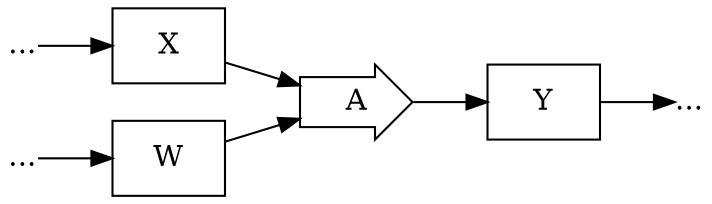

And we have a rule saying something like:

* "Under certain conditions, `A` can be rewritten in terms of `J` and `K`";
  with appropriate patterns and machinery to check those conditions, and perform the rewrite mechanically.

We could imagine determining that the rewrite applied in this situation, and then applying it yielding
the following graph, where `A` has been replaced with `J` and `K`, and an intermediate value `V` has been introduced:

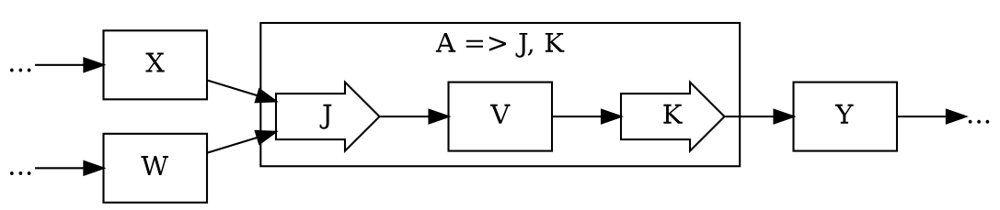

It can be valuable to distinguish between semantic and optimization rewrites:

* **semantic rewrites** are rewrites required by the language; frequently when some high level feature
  is implemented in terms of lower level features, and *must* be replaced for evaluation.
* **optimization rewrites** are rewrites which aim to reduce the execution cost;
  they are optional, but desired.

Much of the work on block sharding thus far has been implicitly modeling families of rewrite
rules around sharding block operations; on rewriting block operation graphs, such as this one:

Into graphs where the block operations have been sharded in some way, such as this one:

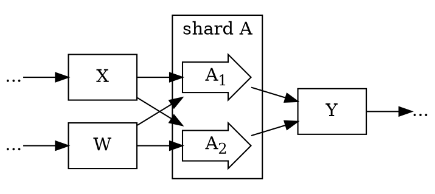

Previous work in sharding $Linear$ and $Matmul$ blocks has shown that there are other rewrites
that are valuable to us, starting from a high-level $Linear$ block:

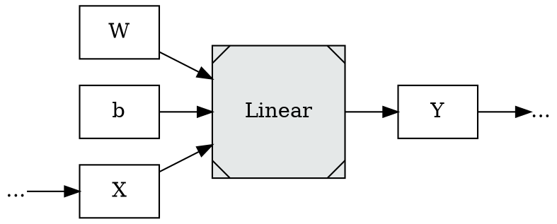

We semantically rewrite to either a $LinearBlock$ if we choose not to shard on the $in$ dimension
of $Linear$:

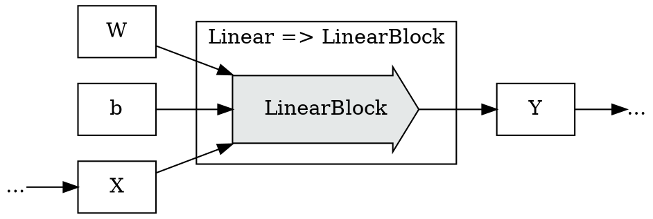

Or we semantically rewrite to a $Prod$, $SumDim$, $Sum$ subgraph if we choose to shard on the $in$ dimension
of $Linear$:

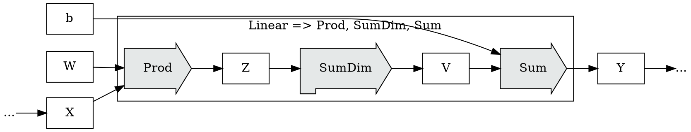

Fully expanding an optimizing tensor evaluation environment requires some facility
for graph rewriting; though only **semantic rewrites** are required.

**Optimization rewrites** are frequently treated as a nice-to-have; something
added to evaluation systems once they've reached maturity, and added piecemeal,
where they can be inserted without disrupting the semantics of existing programs.

The resource impact, in performance and memory, of optimization rewrites can
be extremely large; large enough that an argument can be made that the core
structure of a system should be engineered from the beginning to enable them;
and that is the approach that we're taking with Tapestry.

Graph rewrite rules, both semantic and optimization, require a mechanism of
application. There are two broad categories of graph rewrite application
methodologies:

* **Local Expansion** - locally expanding a node with the subgraph which "defines" it.
* **Global Search** - searching for subgraph patterns in the full graph
  which match a given rule, and rewriting the matching subgraph.

### Local Node Expansion Rewrite

Local node expansion is the simplest form of graph rewrite to implement.

Local node expansion rules are best thought of as
[production rules](https://en.wikipedia.org/wiki/Production_(computer_science)):

* they mave have a single expansion,
* they may have multiple ambiguous expansions,
* they may have conditional expansions which can only be used in certain situations;
* and they may be recursively defined with other production rules.

Given a high level node, such as this example $Op$, local rewrite provides
one or more expansions for the definition of that node. We need only find that
node in the tree, and replace it with one of it's "definitions".

For example, consider this subgraph featuring $Op$:

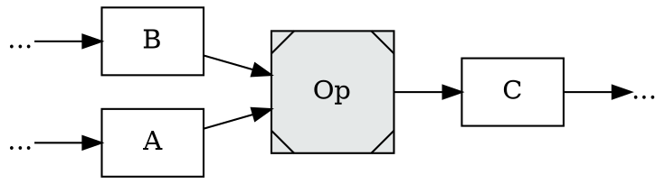

A high level node with a single expansion is essentially a simple
function or macro. In this case it's easy and common to think of the
expansion as the "definition" or "internals" of the $Op$.

Suppose we had one expansion defined for $Op$; such that the following rewrite
could be applied:

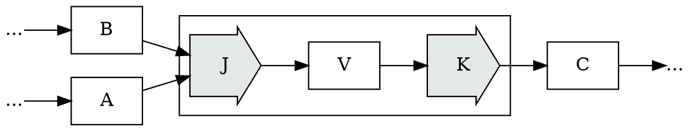

A given high-level node may have multiple expansions; which is equivalent to plural
[production rules](https://en.wikipedia.org/wiki/Production_(computer_science));
for example this entirely different rewrite of $Op$.

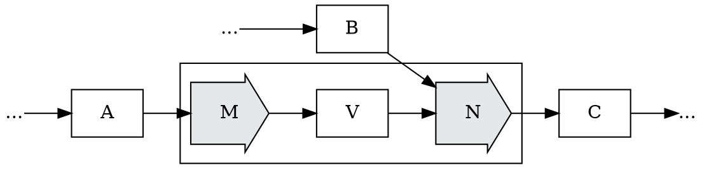

#### Conditional Rewrites

In the situation where there are multiple expansions of a given node,
it is common to set some conditional gates upon those expansions;
to establish a guarantee that a given node will be expanded unambiguously
in exactly one way in a given situation; frequently with fall-through
precedence ordering, and a final default case, to handle resolution
when multiple tests match:

* If condition $T_0$ is true, expand $Op$ to $J, K$;
* If condition $T_1$ is true, expand $Op$ to $M, N$;
* otherwise, expand $Op$ to $P$.

This is helpful with single descent local rewrite implementations;
but it is limiting for global optimization.

#### Ambiguous Rewrites

If we permit multiple expansions of a node to simultaneously match,
either by having no conditions on expansion, or by permitting more
than one condition to match at the same time, we may have ambiguous
expansion.

A simple fall-back implementation to handle ambiguous expansion
is to apply some heuristic to select the winning expansion;
but the real power in ambiguous expansions lies in global optimization.

It is frequently the case that there isn't sufficient local information
to determine which expansion is best; and we can only determine the best
choice by examining the relative cost models of both expansions
in a global context.

Implementing parallel global tree optimization search is significantly
more complex and expensive at compile time; but also permits much
more aggressive optimizations; particularly when paired with global
pattern search rewrites, as discussed below.

### Global Pattern Search Rewrite

Global pattern search rewrites are not limited to defining local
expansions of high-level abstract nodes.

Global pattern search rewrites define subgraph patterns that they can
be applied to (potentially gated by conditional tests); and upon application
they can rewrite the tree at that location.

Consider the subgraph below:

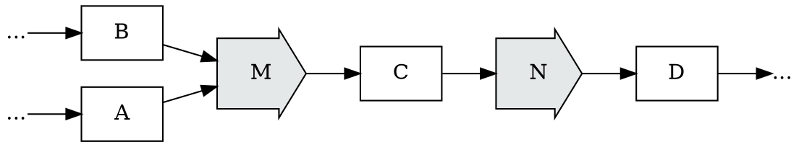

Suppose we had a rule which could match the $M \rightarrow \\$V \rightarrow N$ pattern,
and rewrite it to a new condensed operator, $J$:

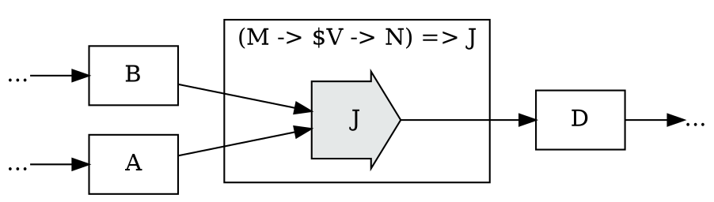

This rule is not a node expansion; and to apply a rule like this, we'd need to search
the entire graph for matching patterns.

Suites of global graph rewrite rules can enable deep incremental rewrites, particularly
when their rewrites are permitted to be mutually recursive (produce rewrites which
will in turn be rewritten).

Implementations of the application of global rewrite rules can be grouped into two
broad categories:

* deterministic/fixed-pass count implementations - these scan for patterns a fixed
  number of times, performing expansions and rewrites in a predetermined order.
* non-deterministic implementations - these scan for matching patterns until
  a fixed-point is reached; a point at which no further rewrites can be found.

It is common to stack rewrite passes into larger rewrite meta sequences; deterministic
passes to expand certain high level primitives; a few non-deterministic passes to
search for optimizations; and a few final deterministic passes to perform fusions.

As discussed later in the sections on parallel stochastic search; we can see that
each re-write step will produce an instance with a different estimated cost according
to our cost models, and we can merge rewrites with stochastic optimization to allow
us to use the ambiguity of optional rewrites to permit aggressive exploration of the optimization space.

### Returning to Linear

Returning to the implementation of $Linear$ expansion; we could implement $Linear$
using either local expansion, or global rewrite search.

#### Linear under Local Expansion

Under local expansion, we'd implement $Linear$ with expansion rules
on the operator, expanding to either a $LinearBlock$ if we choose not to shard on the $in$ dimension
of $Linear$:

Or expanding to a $Prod$, $SumDim$, $Sum$ subgraph if we choose to shard on the $in$ dimension
of $Linear$:

#### Linear under Global Rewrite

Under global rewrite rules, we'd **always** expand $Linear$ to the $Prod$, $SumDim$, $Sum$
representation:

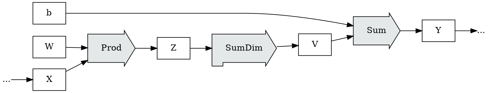

But we'd also add a global rule that said that the pattern could be conditionally
rewritten to $LinearBlock$ when the $in$ dimension wasn't being sharded upon:

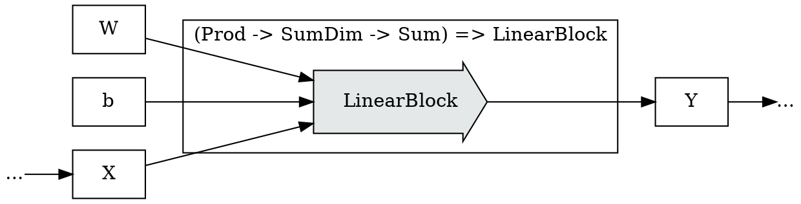

One of the benefits of this approach is that **any** matching subgraph
with these operators could be fused anywhere in the graph, even if
they'd never originally been part of a $Linear$ block.

### Graph Fusion Operators

Global rewrite operations become significantly more powerful when paired
with fusion operators designed for them.

We can examine common operators, and develop a repertoire of utility operators,
sometimes with interfaces which may seem less natural for programmers to use
directly, which significantly improve fusion products.

This is a common approach in functional language compilers, such as Haskell.

This approach can be made more powerful when high-level operators are designed by
api designers in terms of the known family of fusion operators and rewrite
operations; leading to potentially large wins in fusion optimization search
results.