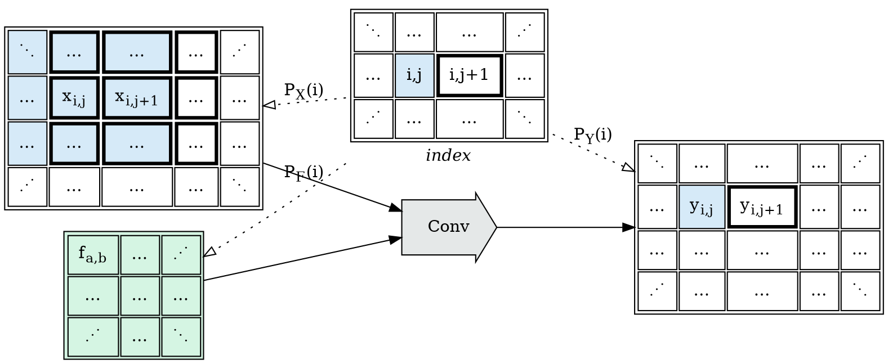
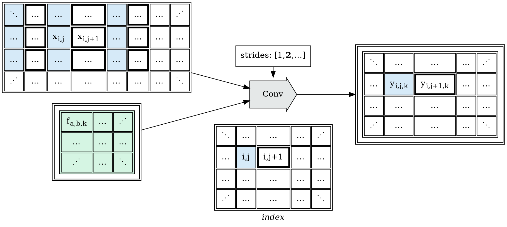
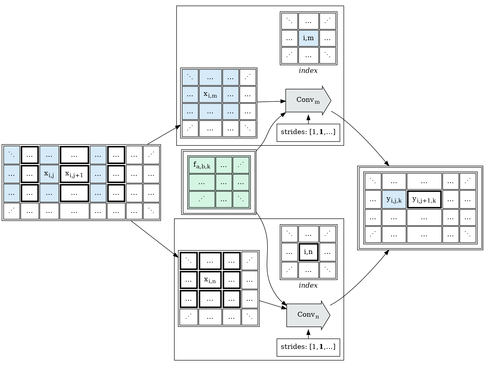

This post develops part of this document:

* [Tapestry: Shardable Tensor Expression Environments](/Tapestry)

### Sharding Convolution Operators

Let's now consider a new operation, the application of
[Convolution Kernels](https://en.wikipedia.org/wiki/Kernel_(image_processing)).

```python
Y = Conv2D(X, K)
```

Kernel convolution operations tile (or tessellate) a moving input window over the entire space
of an input tensor. Convolution operations (frequently, see sparse convolutions below) share input data with neighbors;
and effective modeling of their shard characteristics can dramatically reduce data flow
in large computations, by sharding data neighborhoods to maximize local data sharing.

Expanding the sharding theory of convolution operations will require us to:
* define tensor stride view operations, to model sparse convolutions;
* develop stacked affine projections, to work in derived view environments;
* define tensor fusion operations, to reassemble sparse shards.

Consider the following case of a $[3, 3]$ kernel. We wish to generate output cells
by applying an operation on this kernel to window selections on the input of the same
size.

If we apply no padding, and shift each neighbor by 1 step:

* $Y[0,0] = sum(X[0:3, 0:3] * F)$ ;
* $Y[1,0] = sum(X[1:4, 0:3] * F)$ ;
* $Y[0,1] = sum(X[0:3, 1:4] * F)$ ;
* etc ...



The projection function $P_X(i)$ for the no-padding, simple stride, dense case is
very simple to describe:

* the origin value should point to the first cell used by the output origin;
* the marginal stride matches the output stride;
* the projection shape size matches the window size.

In this situation:

* $P_X(i).projection$ is $Identity$,
* $P_X(i).shape$ is $[3, 3]$


Convolution operations are frequently applied to not one convolution kernel,
but to a stack of them. It's common for a $Conv2D$ call to have a kernel (or filter)
with a 2D $[3,3]$ or $[5,5]$ shape, but with $64$, $128$ stacked filters;
so we may see $F_{[128,3,3]}$, and to produce a layer of $Y$ for each
input filter layer.

Additionally, in cases where no padding is used, the output must lose size relative
to the input; the first and last values along each dimension are shifted in to permit
the full selection of the convolution filters. Padding will be discussed later,
which brings with it many questions of how that padding should be generated.

Consider:
* a 100 batch, $[10,10]$ shape, 1-channel input $X$;
* a 128 layer, $[3,3]$ shape, 1-channel input convolution filter $F$;
* yielding a 100 batch, $[8,8]$ shape, 128-channel output $Y$.

$$\begin{eqnarray\*}
Y_{[100,128,8,8]} = Conv2D(X_{[100,1,10,10]}, F_{[128,1,3,3]})
\end{eqnarray\*}$$

#### Sparse Strided Convolution Operators

Consider an operation which is common in convolution, but which our current index
projection description has no mechanism for describing: *striding*

In this example, we wish to apply the $[3,3]$ kernel filters to $[3,3]$ tiles
of the input; but we wish to do that sparsely along one of the dimensions;
skipping over 1 value in our selection.

This is a common mechanism to add non-local information to a kernel without inflating
the size (and complexity) of the kernel filter itself; a good model of it is necessary.



The outcome we'd like to achieve in this situation is that we're able to rewrite
this operation into dense variants; doing so permits local neighborhood data reuse.

Consider the following rewrite, into strided sliced views of $X$; and fusing
$Y$ from strided sliced result shards: 



There are two broad approaches to realize this goal, which will be explored in later sections:
* extending the projection function language with the concept of striding;
* developing strided tensor slice and fusion operations.

In practice, these two approaches are isomorphic to each other; though in some situations
some problems are easier to express in one or the other approach. We'll develop both.
