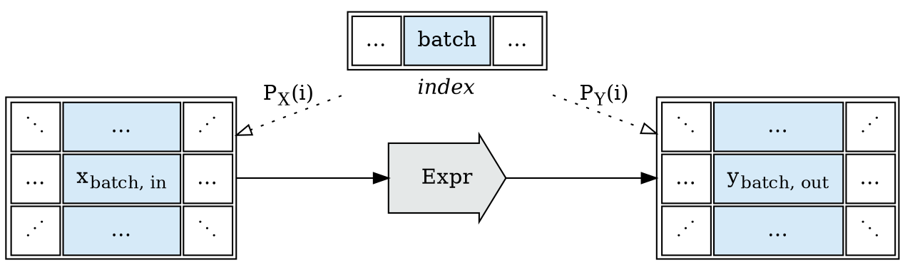
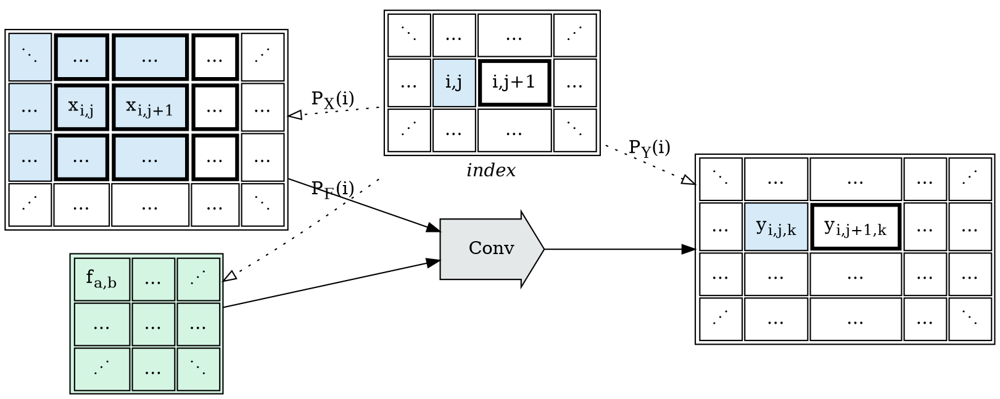

This post develops part of this document:

* [Tapestry: Shardable Tensor Expression Environments](/Tapestry)

### Tensor View Selections

As noted in previous sections, a family of tensor view selection operations can significantly
reduce the complexity of representing expression graphs.

Consider a very simple expression; one which indexes solely over a $batch$ dimension,
mapping vectors of $in$-features to vectors of $out$-features.

The signature for this expression describes the contract of the attached operation;
exactly; we do not have analytic information about the internals of the operation
(at this level), so to execute this expression, we *must* provide an input
tensor shaped as $[batch, in]$, and we *must* expect an output tensor
shaped as $[batch, out]$.

But suppose the previous step provided tensor view $W$, which was oriented feature-first?

What operation $Selection$ might we use to adjust the data?

```graphviz
digraph G {
  rankdir=LR;

  idx [
    shape="plain",
    label=<
    <table border="0">
    <tr><td><table cellpadding="8">
          <tr>
              <td>…</td>
              <td bgcolor="#D6EAF8">batch</td>
              <td>…</td>
              </tr>
          </table></td></tr>
    <tr><td><i>index</i></td></tr>
        </table>
    >,
  ];
  
  W [
      shape="plain",
      label=<
      <table cellpadding="8">
          <tr>
              <td>⋱</td>
              <td>…</td>
              <td>⋰</td>
              </tr>
          <tr>
              <td bgcolor="#D6EAF8">…</td>
              <td bgcolor="#D6EAF8">w<sub>in, batch</sub></td>
              <td bgcolor="#D6EAF8">…</td>
              </tr>
          <tr>
              <td>⋰</td>
              <td>…</td>
              <td>⋱</td>
              </tr>
          </table>
      >,
  ];

  X [
      shape="plain",
      label=<
      <table cellpadding="8">
          <tr>
              <td>⋱</td>
              <td bgcolor="#D6EAF8">…</td>
              <td>⋰</td>
              </tr>
          <tr>
              <td>…</td>
              <td bgcolor="#D6EAF8">x<sub>batch, in</sub></td>
              <td>…</td>
              </tr>
          <tr>
              <td>⋰</td>
              <td bgcolor="#D6EAF8">…</td>
              <td>⋱</td>
              </tr>
          </table>
      >,
  ];

  Expr [
      shape=rarrow,
      style=filled,
      fillcolor="#E5E8E8",
      margin=0.3
  ];
  
  Y [
      shape="plain",
      label=<
      <table cellpadding="8">
          <tr>
              <td>⋱</td>
              <td bgcolor="#D6EAF8">…</td>
              <td>⋰</td>
              </tr>
          <tr>
              <td>…</td>
              <td bgcolor="#D6EAF8">y<sub>batch, out</sub></td>
              <td>…</td>
              </tr>
          <tr>
              <td>⋰</td>
              <td bgcolor="#D6EAF8">…</td>
              <td>⋱</td>
              </tr>
          </table>
      >,
  ];
  
  V [
    label="Selection",
    shape=parallelogram,
    style=filled,
    fillcolor="#a0d0d0",
    color=black,
  ];
  W -> V;
  V -> X;

  X -> Expr;
  Expr -> Y;
  
  idx -> X [label=<P<sub>X</sub>(i)>, constraint=false, style=dotted, arrowhead=empty];
  idx -> Y [label=<P<sub>Y</sub>(i)>, constraint=false, style=dotted, arrowhead=empty];

  { rank=same; idx; Expr; }
}
```

We could of course use further block expressions to rewrite data; the operation family
is general and sufficient for any structural rewrite we may wish to perform. But doing
so would push the problem back up a recursion level; we'd be scheduling operations
which existed solely to reorder data for other operations.

Under sufficiently strong graph rewrite and operator fusion assumptions, such an approach
could work efficiently, but it raises the standards needed for an effective optimizer.

So we look for a weaker operator family, which would be simpler to schedule and
more amenable to rewrites and optimization.

Additionally, consider that the input for a given operation may be collected from
multiple disparate tensor shards, from distributed execution environments.

Possibly sharded by batch:

```graphviz
digraph G {
  rankdir=LR;

  idx [
    shape="plain",
    label=<
    <table border="0">
    <tr><td><table cellpadding="8">
          <tr>
              <td>…</td>
              <td bgcolor="#D6EAF8">batch</td>
              <td>…</td>
              </tr>
          </table></td></tr>
    <tr><td><i>index</i></td></tr>
        </table>
    >,
  ];
  
  W1 [
      shape="plain",
      label=<
      <table cellpadding="8">
          <tr>
              <td>⋱</td>
              <td>…</td>
              <td>⋰</td>
              </tr>
          <tr>
              <td bgcolor="#D6EAF8">…</td>
              <td bgcolor="#D6EAF8">w<sub>in, m</sub></td>
              <td bgcolor="#D6EAF8">…</td>
              </tr>
          <tr>
              <td>⋰</td>
              <td>…</td>
              <td>⋱</td>
              </tr>
          </table>
      >,
  ];
  
  W2 [
      shape="plain",
      label=<
      <table cellpadding="8">
          <tr>
              <td>⋱</td>
              <td>…</td>
              <td>⋰</td>
              </tr>
          <tr>
              <td bgcolor="#D6EAF8">…</td>
              <td bgcolor="#D6EAF8">w<sub>in, k</sub></td>
              <td bgcolor="#D6EAF8">…</td>
              </tr>
          <tr>
              <td>⋰</td>
              <td>…</td>
              <td>⋱</td>
              </tr>
          </table>
      >,
  ];

  X [
      shape="plain",
      label=<
      <table cellpadding="8">
          <tr>
              <td>⋱</td>
              <td bgcolor="#D6EAF8">…</td>
              <td>⋰</td>
              </tr>
          <tr>
              <td>…</td>
              <td bgcolor="#D6EAF8">x<sub>(m+k), in</sub></td>
              <td>…</td>
              </tr>
          <tr>
              <td>⋰</td>
              <td bgcolor="#D6EAF8">…</td>
              <td>⋱</td>
              </tr>
          </table>
      >,
  ];

  Expr [
      shape=rarrow,
      style=filled,
      fillcolor="#E5E8E8",
      margin=0.3
  ];
  
  Y [
      shape="plain",
      label=<
      <table cellpadding="8">
          <tr>
              <td>⋱</td>
              <td bgcolor="#D6EAF8">…</td>
              <td>⋰</td>
              </tr>
          <tr>
              <td>…</td>
              <td bgcolor="#D6EAF8">y<sub>batch, out</sub></td>
              <td>…</td>
              </tr>
          <tr>
              <td>⋰</td>
              <td bgcolor="#D6EAF8">…</td>
              <td>⋱</td>
              </tr>
          </table>
      >,
  ];
  
  V [
    label="Selection",
    shape=parallelogram,
    style=filled,
    fillcolor="#a0d0d0",
    color=black,
  ];
  W1 -> V;
  W2 -> V;
  V -> X;

  X -> Expr;
  Expr -> Y;
  
  idx -> X [label=<P<sub>X</sub>(i)>, constraint=false, style=dotted, arrowhead=empty];
  idx -> Y [label=<P<sub>Y</sub>(i)>, constraint=false, style=dotted, arrowhead=empty];

  { rank=same; idx; Expr; }
}
```

Or by feature group:

```graphviz
digraph G {
  rankdir=LR;

  idx [
    shape="plain",
    label=<
    <table border="0">
    <tr><td><table cellpadding="8">
          <tr>
              <td>…</td>
              <td bgcolor="#D6EAF8">batch</td>
              <td>…</td>
              </tr>
          </table></td></tr>
    <tr><td><i>index</i></td></tr>
        </table>
    >,
  ];
  
  W1 [
      shape="plain",
      label=<
      <table cellpadding="8">
          <tr>
              <td>⋱</td>
              <td>…</td>
              <td>⋰</td>
              </tr>
          <tr>
              <td bgcolor="#D6EAF8">…</td>
              <td bgcolor="#D6EAF8">w<sub>a, batch</sub></td>
              <td bgcolor="#D6EAF8">…</td>
              </tr>
          <tr>
              <td>⋰</td>
              <td>…</td>
              <td>⋱</td>
              </tr>
          </table>
      >,
  ];
  
  W2 [
      shape="plain",
      label=<
      <table cellpadding="8">
          <tr>
              <td>⋱</td>
              <td>…</td>
              <td>⋰</td>
              </tr>
          <tr>
              <td bgcolor="#D6EAF8">…</td>
              <td bgcolor="#D6EAF8">w<sub>b, batch</sub></td>
              <td bgcolor="#D6EAF8">…</td>
              </tr>
          <tr>
              <td>⋰</td>
              <td>…</td>
              <td>⋱</td>
              </tr>
          </table>
      >,
  ];

  X [
      shape="plain",
      label=<
      <table cellpadding="8">
          <tr>
              <td>⋱</td>
              <td bgcolor="#D6EAF8">…</td>
              <td>⋰</td>
              </tr>
          <tr>
              <td>…</td>
              <td bgcolor="#D6EAF8">x<sub>batch, (a+b)</sub></td>
              <td>…</td>
              </tr>
          <tr>
              <td>⋰</td>
              <td bgcolor="#D6EAF8">…</td>
              <td>⋱</td>
              </tr>
          </table>
      >,
  ];

  Expr [
      shape=rarrow,
      style=filled,
      fillcolor="#E5E8E8",
      margin=0.3
  ];
  
  Y [
      shape="plain",
      label=<
      <table cellpadding="8">
          <tr>
              <td>⋱</td>
              <td bgcolor="#D6EAF8">…</td>
              <td>⋰</td>
              </tr>
          <tr>
              <td>…</td>
              <td bgcolor="#D6EAF8">y<sub>batch, out</sub></td>
              <td>…</td>
              </tr>
          <tr>
              <td>⋰</td>
              <td bgcolor="#D6EAF8">…</td>
              <td>⋱</td>
              </tr>
          </table>
      >,
  ];
  
  V [
    label="Selection",
    shape=parallelogram,
    style=filled,
    fillcolor="#a0d0d0",
    color=black,
  ];
  W1 -> V;
  W2 -> V;
  V -> X;

  X -> Expr;
  Expr -> Y;
  
  idx -> X [label=<P<sub>X</sub>(i)>, constraint=false, style=dotted, arrowhead=empty];
  idx -> Y [label=<P<sub>Y</sub>(i)>, constraint=false, style=dotted, arrowhead=empty];

  { rank=same; idx; Expr; }
}
```

Defining some terms:
* a *Tensor View* is a logical slice of tensor-structured data; and
* a *Selection* is an expression to assemble a *Tensor View* from other tensors.

> Note: a reminder that as these describe sharding operations, Tensor Views
> are slices of tensor coordinate space; and a given Tensor View may be
> indexed at any point in tensor space.

A feature which appears to be present from the examined cases is that a
*Selection* routes each cell in its resultant *View* back to some cell in
some source tensor.

We can formalize this as a requirement:
* a *Selection* maps each coordinate in a *Tensor View* space to a $tensor, coordinate$ pair
  of exactly one source tensor.

Fundamentally, moving data from the output of one operation to the input of another operation,
which may be on another machine, is an operation centered on copying portions of buffers;
and by being careful in our restriction of legal *Selection* operations, we can evaluate
them by simply copying *different* buffer data; many of these operations will have zero marginal cost
over direct movement.

#### Affine Selections

Consider the following potential index/stride-manipulation *Selection* operations:
* `permute/transpose` - reordering the dimension indexes of a tensor is free.
* `reverse/flip` - flipping a tensor dimension is free.
* `select` - selecting a subset of a tensor is free.
* `stride` - skipping every `k` items along a dimension is free.
* `squeeze/unsqueeze` - adding/removing a size-1 dimension is free.
* `broadcast`\* - treat a size 1 dimension as though it were size `n`, without copying data.

These operations are free on local tensors, because they're all indexing tricks;
and can be implemented using discrete affine projections, the same as the index
projection functions.

On remote tensors, we can transmit the *Selection* operation to the tensor holder,
evaluate the indexing trick operation where it is free, and transmit back the
selected data block.

> \*`broadcast` is something we'd much prefer to implement on the local consumer; as implementing broadcast
> remotely would cause an unnecessary duplication of data. And we see now an operation where a good
> optimizer may wish to rewrite a *Selection* cascade for efficiency in some situations.

#### Composite Selections

A careful reader of the given examples may note that we have a case for both some form of `concat`
(for the example of fusing partial feature results from $Linear$); and of `interleave` (for
the example of fusing the results of a sharded dilated convolution kernel).

* `concat` - assemble a tensor view by concatenating multiple tensors along a dimension.
* `interleave` - assemble a tensor view by interleaving multiple tensors along a dimension.
* `repeat`\* - assemble a tensor view by repeating a tensor along a dimension.
* `pad`\* - supply data outside the selection region with a default value, or a reflection.

These operations cannot be implemented using discrete affine projections; they generally perform
routing by applying some range limit comparison operation, with or without a modulo, to one
dimension of the input, and use that to derive a target tensor and new coordinates.

On local machines, `concat` and `interleave` are generally implemented as full-copy operations,
because otherwise supporting them as transparent views would require a tree of tensor view objects;
but as *Selection* operations, they are still fundamentally performing simple index operations
and then differing to a backing view.

> \*`pad` and `repeat` are *Selection*s we'd also prefer to implement on the local consumer;
> as the data is either a default value, or a reflection or duplication of data we already have;
> and these are also good targets for Selection optimization and re-write.

#### Atomic Selections

We *could* define a *Selection* an arbitrary tree of the above or similar operations;
but as each of these operations has real impact on the cost model of execution through
data sharing impacts, and we desire to be able to see and optimize through those operations;
we forbid composite selections:

* All *Selection* operations are "simple", and complex *Tensor Views* are assembled via trees of chained
  atomic *Selections*; not composite *Selections*.

#### An Example From Conv

We now have the operations necessary to fully describe the previous dilated $Conv$ example:

Where a dilated convolution input is sharded into dense convolutions; and the resulting
dense results are interleaved back into the convolution result we would have seen
if the original convolution had been applied:

```graphviz
digraph G {
  rankdir=LR;

  subgraph cluster_0 {
  idx0 [
    shape="plain",
    label=<
        <table border="0">
    <tr><td>

      <table cellpadding="8">
          <tr>
              <td>⋱</td>
              <td>…</td>
              <td>⋰</td>
              </tr>
          <tr>
              <td>…</td>
              <td bgcolor="#D6EAF8">i,m</td>
              <td>…</td>
              </tr>
          <tr>
              <td>⋰</td>
              <td>…</td>
              <td>⋱</td>
              </tr>
          </table>
	</td></tr>

    <tr><td><i>index</i></td></tr>
          </table>
    >,
  ];

  X0 [
      shape="plain",
      label=<
      <table cellpadding="8">
          <tr>
              <td bgcolor="#D6EAF8">⋱</td>
              <td bgcolor="#D6EAF8">…</td>
              <td bgcolor="#D6EAF8">…</td>
              <td>⋰</td>
              </tr>
          <tr>
              <td bgcolor="#D6EAF8">…</td>
              <td bgcolor="#D6EAF8">x<sub>i,m</sub></td>
              <td bgcolor="#D6EAF8">…</td>
              <td>…</td>
              </tr>
          <tr>
              <td bgcolor="#D6EAF8">…</td>
              <td bgcolor="#D6EAF8">…</td>
              <td bgcolor="#D6EAF8">…</td>
              <td>…</td>
              </tr>
          <tr>
              <td>⋰</td>
              <td>…</td>
              <td>…</td>
              <td>⋱</td>
              </tr>
          </table>
      >,
  ];
  
  Conv0 [
      label=<Conv<sub>m</sub>>,
      shape=rarrow,
      style=filled,
      fillcolor="#E5E8E8",
      margin=0.3
  ];
  
  Y0 [
      shape="plain",
      label=<
      <table cellpadding="8">
          <tr>
              <td bgcolor="#D6EAF8">⋱</td>
              <td bgcolor="#D6EAF8">…</td>
              <td bgcolor="#D6EAF8">…</td>
              <td>⋰</td>
              </tr>
          <tr>
              <td bgcolor="#D6EAF8">…</td>
              <td bgcolor="#D6EAF8">y<sub>i,k</sub></td>
              <td bgcolor="#D6EAF8">…</td>
              <td>…</td>
              </tr>
          <tr>
              <td bgcolor="#D6EAF8">…</td>
              <td bgcolor="#D6EAF8">…</td>
              <td bgcolor="#D6EAF8">…</td>
              <td>…</td>
              </tr>
          <tr>
              <td>⋰</td>
              <td>…</td>
              <td>…</td>
              <td>⋱</td>
              </tr>
          </table>
      >,
  ];

  strides0 [
      label=<strides: [1,<b>1</b>,…]>,
      shape=rectangle,
  ];

  strides0 -> Conv0;
  
  Conv0 -> Y0;

  { rank=same; idx0; Conv0; strides0; }
  }

  subgraph cluster_1 {
  X1 [
      shape="plain",
      label=<
      <table cellpadding="8">
          <tr>
              <td border="3">⋱</td>
              <td border="3">…</td>
              <td border="3">…</td>
              <td>⋰</td>
              </tr>
          <tr>
              <td border="3">…</td>
              <td border="3">x<sub>i,n</sub></td>
              <td border="3">…</td>
              <td>…</td>
              </tr>
          <tr>
              <td border="3">…</td>
              <td border="3">…</td>
              <td border="3">…</td>
              <td>…</td>
              </tr>
          <tr>
              <td>⋰</td>
              <td>…</td>
              <td>…</td>
              <td>⋱</td>
              </tr>
          </table>
      >,
  ];

  idx1 [
    shape="plain",
    label=<
        <table border="0">
    <tr><td>

      <table cellpadding="8">
          <tr>
              <td>⋱</td>
              <td>…</td>
              <td>⋰</td>
              </tr>
          <tr>
              <td>…</td>
              <td border="3">i,n</td>
              <td>…</td>
              </tr>
          <tr>
              <td>⋰</td>
              <td>…</td>
              <td>⋱</td>
              </tr>
          </table>
	</td></tr>

    <tr><td><i>index</i></td></tr>
          </table>
    >,
  ];
  Conv1 [
      label=<Conv<sub>n</sub>>,
      shape=rarrow,
      style=filled,
      fillcolor="#E5E8E8",
      margin=0.3
  ];

  strides1 [
      label=<strides: [1,<b>1</b>,…]>,
      shape=rectangle,
  ];
  
  Y1 [
      shape="plain",
      label=<
      <table cellpadding="8">
          <tr>
              <td border="3">⋱</td>
              <td border="3">…</td>
              <td border="3">…</td>
              <td>⋰</td>
              </tr>
          <tr>
              <td border="3">…</td>
              <td border="3">y<sub>i,k</sub></td>
              <td border="3">…</td>
              <td>…</td>
              </tr>
          <tr>
              <td border="3">…</td>
              <td border="3">…</td>
              <td border="3">…</td>
              <td>…</td>
              </tr>
          <tr>
              <td>⋰</td>
              <td>…</td>
              <td>…</td>
              <td>⋱</td>
              </tr>
          </table>
      >,
  ];

  strides1 -> Conv1;
  Conv1 -> Y1;

  { rank=same; idx1; Conv1; strides1; }
  }

  X [
      shape="plain",
      label=<
      <table cellpadding="8">
          <tr>
              <td bgcolor="#D6EAF8">⋱</td>
              <td border="3">…</td>
              <td bgcolor="#D6EAF8">…</td>
              <td border="3">…</td>
              <td bgcolor="#D6EAF8">…</td>
              <td border="3">…</td>
              <td>…</td>
              <td>⋰</td>
              </tr>
          <tr>
              <td bgcolor="#D6EAF8">…</td>
              <td border="3">…</td>
              <td bgcolor="#D6EAF8">x<sub>i,j</sub></td>
              <td border="3">x<sub>i,j+1</sub></td>
              <td bgcolor="#D6EAF8">…</td>
              <td border="3">…</td>
              <td>…</td>
              <td>…</td>
              </tr>
          <tr>
              <td bgcolor="#D6EAF8">…</td>
              <td border="3">…</td>
              <td bgcolor="#D6EAF8">…</td>
              <td border="3">…</td>
              <td bgcolor="#D6EAF8">…</td>
              <td border="3">…</td>
              <td>…</td>
              <td>…</td>
              </tr>
          <tr>
              <td>⋰</td>
              <td>…</td>
              <td>…</td>
              <td>…</td>
              <td>…</td>
              <td>…</td>
              <td>…</td>
              <td>⋱</td>
              </tr>
          </table>
      >,
  ];
  
  Stride0 [
    label=<Stride<sub>0</sub>>,
    shape=parallelogram,
    style=filled,
    fillcolor="#a0d0d0",
    color=black,
  ];
  Stride1 [
    label=<Stride<sub>0</sub>>,
    shape=parallelogram,
    style=filled,
    fillcolor="#a0d0d0",
    color=black,
  ];
  
  X -> Stride0;
  X -> Stride1;

  Stride0 -> X0;
  Stride1 -> X1;

  F [
      shape="plain",
      label=<
      <table cellpadding="8">
        <tr><td>
      <table bgcolor="#D5F5E3" cellpadding="8">
          <tr>
              <td >f<sub>a,b,k</sub></td>
              <td >…</td>
              <td>⋰</td>
              </tr>
          <tr>
              <td>…</td>
              <td>…</td>
              <td>…</td>
              </tr>
          <tr>
          	<td>⋰</td>
              <td>…</td>
          	<td>⋱</td>
              </tr>
          </table>
	  </td></tr>
        </table>
      >,
  ];

  Y [
      shape="plain",
      label=<
      <table cellpadding="8">
        <tr><td>

      <table cellpadding="8">
          <tr>
              <td>⋱</td>
              <td>…</td>
              <td>…</td>
              <td>…</td>
              <td>⋰</td>
              </tr>
          <tr>
              <td>…</td>
              <td bgcolor="#D6EAF8">y<sub>i,j,k</sub></td>
              <td border="3">y<sub>i,j+1,k</sub></td>
              <td>…</td>
              <td>…</td>
              </tr>
          <tr>
              <td>…</td>
              <td>…</td>
              <td>…</td>
              <td>…</td>
              <td>…</td>
              </tr>
          <tr>
              <td>⋰</td>
              <td>…</td>
              <td>…</td>
              <td>…</td>
              <td>⋱</td>
              </tr>
          </table>

	  </td></tr>
        </table>
      >,
  ];
  
  Inter [
    label=<Interleave>,
    shape=parallelogram,
    style=filled,
    fillcolor="#a0d0d0",
    color=black,
  ];

  X0 -> Conv0;
  F -> Conv0;

  X1 -> Conv1;
  F -> Conv1;
  
  Y0 -> Inter;
  Y1 -> Inter;
  Inter -> Y;
}
```

