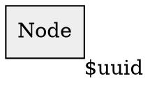
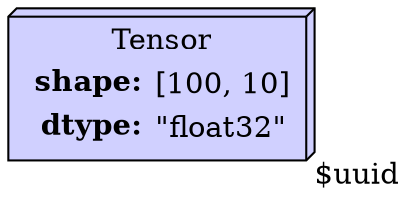
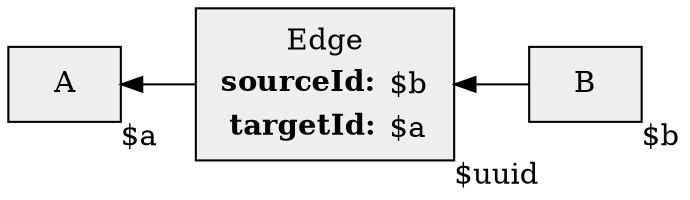
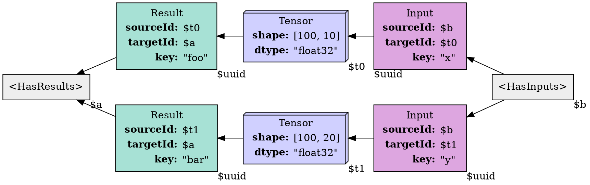

I'm spending time exploring how to build the type theory for the graphs representing the 
internals of my [Tapestry](/Tapestry) project.

Consider an expression graph like the following, representing a small expression:

```graphviz
digraph "G" {
graph ["rankdir"="RL","nodesep"="0.7"]
node ["margin"="0.1"]
"d0f72e3c-64bb-48f1-89c9-7bebefe307c0" ["label"=<<table border="0" cellspacing="0" cellborder="0"><tr><td colspan="2">Tensor</td></tr><tr><td align="right"><b>shape:</b></td><td align="left">[100, 10]</td></tr><tr><td align="right"><b>dtype:</b></td><td align="left">&quot;float32&quot;</td></tr></table>>,"xlabel"="#2D","fillcolor"="#eeeeee","shape"="box3d","style"="filled"]
"e48139c0-6e98-4c8f-aa15-7b9799e4ff30" ["label"=<<table border="0" cellspacing="0" cellborder="0"><tr><td colspan="2">BlockOperator</td></tr><tr><td align="right"><b>op:</b></td><td align="left">&quot;load&quot;</td></tr></table>>,"xlabel"="#96","margin"="0.15","fillcolor"="#75DDDD","shape"="rarrow","style"="filled"]
"c113551c-6a84-4b1d-b56b-54cf9c5b56d7" ["label"=<<table border="0" cellspacing="0" cellborder="0"><tr><td colspan="2">Tensor</td></tr><tr><td align="right"><b>shape:</b></td><td align="left">[100, 20]</td></tr><tr><td align="right"><b>dtype:</b></td><td align="left">&quot;float32&quot;</td></tr></table>>,"xlabel"="#D7","fillcolor"="#d0d0ff","shape"="box3d","style"="filled"]
"d88f1695-6c41-472d-b8c3-25e88699f45f" ["label"=<<table border="0" cellspacing="0" cellborder="0"><tr><td colspan="2">Fusion</td></tr><tr><td align="right"><b>op:</b></td><td align="left">&quot;concat&quot;</td></tr></table>>,"xlabel"="#C8","margin"="0.15","fillcolor"="#75DDDD","shape"="component","style"="filled"]
"208e14b3-5dec-4ec4-afc8-6975d7a85791" ["label"=<<table border="0" cellspacing="0" cellborder="0"><tr><td colspan="2">Tensor</td></tr><tr><td align="right"><b>shape:</b></td><td align="left">[50, 20]</td></tr><tr><td align="right"><b>dtype:</b></td><td align="left">&quot;float32&quot;</td></tr></table>>,"xlabel"="#27","fillcolor"="#d0d0ff","shape"="box3d","style"="filled"]
"af3b555f-6692-4267-abdf-d737900e06a2" ["label"=<<table border="0" cellspacing="0" cellborder="0"><tr><td colspan="2">BlockOperator</td></tr><tr><td align="right"><b>op:</b></td><td align="left">&quot;load&quot;</td></tr></table>>,"xlabel"="#2A","margin"="0.15","fillcolor"="#75DDDD","shape"="rarrow","style"="filled"]
"2de2d3df-d2d9-4f58-9759-77b9edc57fe0" ["label"=<<table border="0" cellspacing="0" cellborder="0"><tr><td colspan="2">Tensor</td></tr><tr><td align="right"><b>shape:</b></td><td align="left">[100, 5]</td></tr><tr><td align="right"><b>dtype:</b></td><td align="left">&quot;float8&quot;</td></tr></table>>,"xlabel"="#98","fillcolor"="#d0d0ff","shape"="box3d","style"="filled"]
"4079ffc7-1507-4e05-ae2e-c70cb1f01e4f" ["label"=<<table border="0" cellspacing="0" cellborder="0"><tr><td colspan="2">Macro</td></tr><tr><td align="right"><b>op:</b></td><td align="left">&quot;dense&quot;</td></tr></table>>,"xlabel"="#03","margin"="0.15","fillcolor"="#75DDDD","shape"="Msquare","style"="filled"]
"5a99ddc3-d5bc-46bc-a891-40369538e34d" ["label"=<<table border="0" cellspacing="0" cellborder="0"><tr><td colspan="2">BlockIndex</td></tr><tr><td align="right"><b>@start:</b></td><td align="left">[0]</td></tr><tr><td align="right"><b>@end:</b></td><td align="left">[100]</td></tr></table>>,"xlabel"="#CC","margin"="0.15","fillcolor"="#E7DCB8","shape"="tab","style"="filled"]
"c5a4bdca-1770-4237-82b4-d326abf08bc2" ["label"=<<table border="0" cellspacing="0" cellborder="0"><tr><td colspan="2">Parameters</td></tr><tr><td align="right"><b>@target:</b></td><td align="left">&quot;#refOut&quot;</td></tr></table>>,"xlabel"="#19","margin"="0.15","fillcolor"="#E7DCB8","shape"="tab","style"="filled"]
"a22299da-16c3-4b17-a94c-a2fbfc6a6228" ["label"=<<table border="0" cellspacing="0" cellborder="0"><tr><td colspan="2">BlockOperator</td></tr><tr><td align="right"><b>op:</b></td><td align="left">&quot;store&quot;</td></tr></table>>,"xlabel"="#C7","margin"="0.15","fillcolor"="#75DDDD","shape"="rarrow","style"="filled"]
"029e6583-a221-4410-a312-1d6fb3ffe621" ["label"=<<table border="0" cellspacing="0" cellborder="0"><tr><td colspan="2">Tensor</td></tr><tr><td align="right"><b>shape:</b></td><td align="left">[50, 20]</td></tr><tr><td align="right"><b>dtype:</b></td><td align="left">&quot;float32&quot;</td></tr></table>>,"xlabel"="#A2","fillcolor"="#d0d0ff","shape"="box3d","style"="filled"]
"b32c7865-b701-4e4f-8e01-b53ba90d74cb" ["label"=<<table border="0" cellspacing="0" cellborder="0"><tr><td colspan="2">View</td></tr><tr><td align="right"><b>op:</b></td><td align="left">&quot;split&quot;</td></tr></table>>,"xlabel"="#23","margin"="0","fillcolor"="#75DDDD","shape"="parallelogram","style"="filled"]
"5810fb0a-ee34-48e7-bfdd-fd19530ac4fe" ["label"=<<table border="0" cellspacing="0" cellborder="0"><tr><td colspan="2">Parameters</td></tr><tr><td align="right"><b>@size:</b></td><td align="left">&quot;10&quot;</td></tr><tr><td align="right"><b>@dim:</b></td><td align="left">&quot;1&quot;</td></tr></table>>,"xlabel"="#CA","margin"="0.15","fillcolor"="#E7DCB8","shape"="tab","style"="filled"]
"e173b54f-a2d7-46ea-adfe-69125b81cc17" ["label"=<<table border="0" cellspacing="0" cellborder="0"><tr><td colspan="2">Tensor</td></tr><tr><td align="right"><b>shape:</b></td><td align="left">[100, 10]</td></tr><tr><td align="right"><b>dtype:</b></td><td align="left">&quot;float8&quot;</td></tr></table>>,"xlabel"="#08","fillcolor"="#d0d0ff","shape"="box3d","style"="filled"]
"523306b9-f323-4513-8dca-ce691df848bb" ["label"=<<table border="0" cellspacing="0" cellborder="0"><tr><td colspan="2">CellOperator</td></tr><tr><td align="right"><b>op:</b></td><td align="left">&quot;convert&quot;</td></tr></table>>,"xlabel"="#2F","margin"="0.15","fillcolor"="#75DDDD","shape"="cds","style"="filled"]
"e83be0cb-2916-44d7-8908-8822e75e7f5c" ["label"=<<table border="0" cellspacing="0" cellborder="0"><tr><td colspan="2">WithInput</td></tr><tr><td align="right"><b>key:</b></td><td align="left">&quot;input&quot;</td></tr></table>>,"xlabel"="#AD","fillcolor"="#DDA6E0","shape"="box","style"="filled"]
"0ae7375f-c1fe-4d4b-84b1-42b9f5ef43f7" ["label"=<<table border="0" cellspacing="0" cellborder="0"><tr><td colspan="2">WithInput</td></tr><tr><td align="right"><b>key:</b></td><td align="left">&quot;input/0&quot;</td></tr></table>>,"xlabel"="#00","fillcolor"="#DDA6E0","shape"="box","style"="filled"]
"307295e3-5097-458c-9947-2bda87018309" ["label"=<<table border="0" cellspacing="0" cellborder="0"><tr><td colspan="2">ResultOf</td></tr><tr><td align="right"><b>key:</b></td><td align="left">&quot;chunk/1&quot;</td></tr></table>>,"xlabel"="#BC","fillcolor"="#eeeeee","shape"="box","style"="filled"]
"a4e974cd-b691-4aa1-ac94-db2dca71a799" ["label"=<<table border="0" cellspacing="0" cellborder="0"><tr><td colspan="2">BlockOperator</td></tr><tr><td align="right"><b>op:</b></td><td align="left">&quot;load&quot;</td></tr></table>>,"xlabel"="#B0","margin"="0.15","fillcolor"="#75DDDD","shape"="rarrow","style"="filled"]
"2220f529-aff9-4ad8-8848-952d99b7b593" ["label"=<<table border="0" cellspacing="0" cellborder="0"><tr><td colspan="2">Parameters</td></tr><tr><td align="right"><b>@source:</b></td><td align="left">&quot;#refW&quot;</td></tr></table>>,"xlabel"="#CD","margin"="0.15","fillcolor"="#E7DCB8","shape"="tab","style"="filled"]
"27bc002d-dbf1-42a8-819d-7ce1e984e273" ["label"=<<table border="0" cellspacing="0" cellborder="0"><tr><td colspan="2">Tensor</td></tr><tr><td align="right"><b>shape:</b></td><td align="left">[100, 10]</td></tr><tr><td align="right"><b>dtype:</b></td><td align="left">&quot;float32&quot;</td></tr></table>>,"xlabel"="#F0","fillcolor"="#d0d0ff","shape"="box3d","style"="filled"]
"3783123c-81fc-49ae-96b9-0d9873525b3b" ["label"=<<table border="0" cellspacing="0" cellborder="0"><tr><td colspan="2">Tensor</td></tr><tr><td align="right"><b>shape:</b></td><td align="left">[5, 10]</td></tr><tr><td align="right"><b>dtype:</b></td><td align="left">&quot;float8&quot;</td></tr></table>>,"xlabel"="#E3","fillcolor"="#d0d0ff","shape"="box3d","style"="filled"]
"2a9b068a-e717-443f-bc75-78f1a5535ac6" ["label"=<<table border="0" cellspacing="0" cellborder="0"><tr><td colspan="2">IO</td></tr></table>>,"xlabel"="#0A","fillcolor"="coral","shape"="box","style"="filled"]
"b7019d5a-a984-40dc-83b9-22c9039547cd" ["label"=<<table border="0" cellspacing="0" cellborder="0"><tr><td colspan="2">Parameters</td></tr><tr><td align="right"><b>@source:</b></td><td align="left">&quot;#ref0&quot;</td></tr></table>>,"xlabel"="#48","margin"="0.15","fillcolor"="#E7DCB8","shape"="tab","style"="filled"]
"317314bc-f60e-4e00-b1ef-364eaa1b8754" ["label"=<<table border="0" cellspacing="0" cellborder="0"><tr><td colspan="2">WithInput</td></tr><tr><td align="right"><b>key:</b></td><td align="left">&quot;input/1&quot;</td></tr></table>>,"xlabel"="#90","fillcolor"="#DDA6E0","shape"="box","style"="filled"]
"ea0ed828-7570-4f08-a43d-388e4c33e3e0" ["label"=<<table border="0" cellspacing="0" cellborder="0"><tr><td colspan="2">Parameters</td></tr><tr><td align="right"><b>@source:</b></td><td align="left">&quot;#ref1&quot;</td></tr></table>>,"xlabel"="#11","margin"="0.15","fillcolor"="#E7DCB8","shape"="tab","style"="filled"]
"55dab401-e066-4b71-a68d-74184f345f39" ["label"=<<table border="0" cellspacing="0" cellborder="0"><tr><td colspan="2">Parameters</td></tr><tr><td align="right"><b>@dtype:</b></td><td align="left">&quot;float8&quot;</td></tr></table>>,"xlabel"="#4E","margin"="0.15","fillcolor"="#E7DCB8","shape"="tab","style"="filled"]
"3a1a9856-65d9-4542-86f5-f1b7d4434f96" ["label"=<<table border="0" cellspacing="0" cellborder="0"><tr><td colspan="2">IO</td></tr></table>>,"xlabel"="#93","fillcolor"="coral","shape"="box","style"="filled"]
"750afade-bfa8-44f7-8226-8378b2a129bd" ["label"=<<table border="0" cellspacing="0" cellborder="0"><tr><td colspan="2">ResultOf</td></tr><tr><td align="right"><b>key:</b></td><td align="left">&quot;chunk/0&quot;</td></tr></table>>,"xlabel"="#30","fillcolor"="#A7E1D5","shape"="box","style"="filled"]
"fc35dedc-9f77-4355-a218-7aea9c88b36c" ["label"=<<table border="0" cellspacing="0" cellborder="0"><tr><td colspan="2">Observer</td></tr></table>>,"xlabel"="#3F","margin"="0","fillcolor"="#B4F8C8","shape"="Mcircle","style"="filled"]
"f551072b-68ad-4167-b5ca-99b00d1094b2" ["label"=<<table border="0" cellspacing="0" cellborder="0"><tr><td colspan="2">IO</td></tr></table>>,"xlabel"="#67","fillcolor"="coral","shape"="box","style"="filled"]
"5c065fad-8937-41f7-99ad-dcfbdda9df7c" ["label"=<<table border="0" cellspacing="0" cellborder="0"><tr><td colspan="2">WithInput</td></tr><tr><td align="right"><b>key:</b></td><td align="left">&quot;weight&quot;</td></tr></table>>,"xlabel"="#DD","fillcolor"="#DDA6E0","shape"="box","style"="filled"]
"2d9be685-fc79-4dae-adba-e865bfddd122" ["label"=<<table border="0" cellspacing="0" cellborder="0"><tr><td colspan="2">IO</td></tr></table>>,"xlabel"="#65","fillcolor"="coral","shape"="box","style"="filled"]
"d0f72e3c-64bb-48f1-89c9-7bebefe307c0" -> "307295e3-5097-458c-9947-2bda87018309" ["arrowhead"="odot"]
"e48139c0-6e98-4c8f-aa15-7b9799e4ff30" -> "ea0ed828-7570-4f08-a43d-388e4c33e3e0" ["label"="WithParams"]
"c113551c-6a84-4b1d-b56b-54cf9c5b56d7" -> "d88f1695-6c41-472d-b8c3-25e88699f45f" ["label"="ResultOf"]
"d88f1695-6c41-472d-b8c3-25e88699f45f" -> "317314bc-f60e-4e00-b1ef-364eaa1b8754" ["arrowhead"="odot"]
"d88f1695-6c41-472d-b8c3-25e88699f45f" -> "0ae7375f-c1fe-4d4b-84b1-42b9f5ef43f7" ["arrowhead"="odot"]
"208e14b3-5dec-4ec4-afc8-6975d7a85791" -> "af3b555f-6692-4267-abdf-d737900e06a2" ["label"="ResultOf"]
"af3b555f-6692-4267-abdf-d737900e06a2" -> "b7019d5a-a984-40dc-83b9-22c9039547cd" ["label"="WithParams"]
"2de2d3df-d2d9-4f58-9759-77b9edc57fe0" -> "4079ffc7-1507-4e05-ae2e-c70cb1f01e4f" ["label"="ResultOf"]
"4079ffc7-1507-4e05-ae2e-c70cb1f01e4f" -> "5c065fad-8937-41f7-99ad-dcfbdda9df7c" ["arrowhead"="odot"]
"4079ffc7-1507-4e05-ae2e-c70cb1f01e4f" -> "e83be0cb-2916-44d7-8908-8822e75e7f5c" ["arrowhead"="odot"]
"a22299da-16c3-4b17-a94c-a2fbfc6a6228" -> "c5a4bdca-1770-4237-82b4-d326abf08bc2" ["label"="WithParams"]
"a22299da-16c3-4b17-a94c-a2fbfc6a6228" -> "2de2d3df-d2d9-4f58-9759-77b9edc57fe0" ["label"="WithInput"]
"a22299da-16c3-4b17-a94c-a2fbfc6a6228" -> "5a99ddc3-d5bc-46bc-a891-40369538e34d" ["label"="WithIndex"]
"029e6583-a221-4410-a312-1d6fb3ffe621" -> "e48139c0-6e98-4c8f-aa15-7b9799e4ff30" ["label"="ResultOf"]
"b32c7865-b701-4e4f-8e01-b53ba90d74cb" -> "c113551c-6a84-4b1d-b56b-54cf9c5b56d7" ["label"="WithInput"]
"b32c7865-b701-4e4f-8e01-b53ba90d74cb" -> "5810fb0a-ee34-48e7-bfdd-fd19530ac4fe" ["label"="WithParams"]
"e173b54f-a2d7-46ea-adfe-69125b81cc17" -> "523306b9-f323-4513-8dca-ce691df848bb" ["label"="ResultOf"]
"523306b9-f323-4513-8dca-ce691df848bb" -> "55dab401-e066-4b71-a68d-74184f345f39" ["label"="WithParams"]
"523306b9-f323-4513-8dca-ce691df848bb" -> "27bc002d-dbf1-42a8-819d-7ce1e984e273" ["label"="WithInput"]
"e83be0cb-2916-44d7-8908-8822e75e7f5c" -> "e173b54f-a2d7-46ea-adfe-69125b81cc17" ["dir"="both","arrowtail"="oinv"]
"0ae7375f-c1fe-4d4b-84b1-42b9f5ef43f7" -> "208e14b3-5dec-4ec4-afc8-6975d7a85791" ["dir"="both","arrowtail"="oinv"]
"307295e3-5097-458c-9947-2bda87018309" -> "b32c7865-b701-4e4f-8e01-b53ba90d74cb" ["dir"="both","arrowtail"="oinv"]
"a4e974cd-b691-4aa1-ac94-db2dca71a799" -> "2220f529-aff9-4ad8-8848-952d99b7b593" ["label"="WithParams"]
"27bc002d-dbf1-42a8-819d-7ce1e984e273" -> "750afade-bfa8-44f7-8226-8378b2a129bd" ["arrowhead"="odot"]
"3783123c-81fc-49ae-96b9-0d9873525b3b" -> "a4e974cd-b691-4aa1-ac94-db2dca71a799" ["label"="ResultOf"]
"2a9b068a-e717-443f-bc75-78f1a5535ac6" -> "af3b555f-6692-4267-abdf-d737900e06a2"
"317314bc-f60e-4e00-b1ef-364eaa1b8754" -> "029e6583-a221-4410-a312-1d6fb3ffe621" ["dir"="both","arrowtail"="oinv"]
"3a1a9856-65d9-4542-86f5-f1b7d4434f96" -> "a22299da-16c3-4b17-a94c-a2fbfc6a6228"
"750afade-bfa8-44f7-8226-8378b2a129bd" -> "b32c7865-b701-4e4f-8e01-b53ba90d74cb" ["dir"="both","arrowtail"="oinv"]
"fc35dedc-9f77-4355-a218-7aea9c88b36c" -> "a22299da-16c3-4b17-a94c-a2fbfc6a6228" ["label"="WaitsOn"]
"f551072b-68ad-4167-b5ca-99b00d1094b2" -> "a4e974cd-b691-4aa1-ac94-db2dca71a799"
"5c065fad-8937-41f7-99ad-dcfbdda9df7c" -> "3783123c-81fc-49ae-96b9-0d9873525b3b" ["dir"="both","arrowtail"="oinv"]
"2d9be685-fc79-4dae-adba-e865bfddd122" -> "e48139c0-6e98-4c8f-aa15-7b9799e4ff30"
}
```


It's important that this graph lend itself to easy to understand and use APIs, while
also being easy to implement fully and correctly. The Tapestry project lives and dies
on the ease with which backend compiler and optimizer passes can be written; so the
more investment put into getting an expressive yet concise representation I put in,
the cheaper and faster everything that follows will be.

Much of that is working out what should be *in* the graph language; but a lot of that
has been done in explorations and theory work on Tapestry so far; under concern at
the moment is the internals of the type theory which structures the graph itself.

### Node

Consider a simple Node, with an id, making it distinct from other nodes; this
will form the basis of most of our type theory:


> Note: We'll use UUIDs for the id; because symbol generation is easy, and
> because we'd like to be able to compare graphs across a timeline history of mutations to
> the same graph, so ids in a global namespace work better; we won't reuse them.
> Are UUIDs "unique enough"? Almost certainly, yes. We can make sure we don't reuse them
> in the same graph, if we really care; but collisions are exceptionally unlikely, and
> impossible when generated by the same UUID library during the same program execution.

### Tensor Node

We know we need Tensors holding values; but our graph model doesn't see the values, so
we mainly need a tensor to represent the space a value could be in. We can extend
the *Node* and add a *shape* and a *dtype*:


### Structured Edges

We need to establish links between nodes, and some of our links carry data. We can introduce
a new kind of node, called an *Edge Node*, and give it a *sourceId* and a *targetId*:



### Inputs and Results

We also know that some operations read *Tensor Nodes*, and some produce them.

We can introduce an *Input Edge* and a *Result Edge*, to create that link;
but we'll also include a *key* field on that edge so we can distinguish
which input or output a given tensor is bound to.

We can also introduce some abstract types, *HasInputs* and *HasResults*,
to describe nodes which are permitted to have these attached edges.



### Operation Nodes

We run into problems when we begin to describe operation nodes, representing processes
to be applied to tensors to produce new tensors.

We do know that all operations will want to have *Parameters*, which we can model
as part of the node, or as an attached linked node; there are arguments for both,
but since we're aiming to shard operations, we may want to make a choice which
permits them to share *Parameter* nodes after sharding, so we can more easily
trace the evolution of sharding plans.

At issue is that we have a number of properties we'd like to be able to attach to
an operation node, and the properties don't fit into a simple type hierarchy.

- Does this operation have external side effects, which we need to sequence appropriately
  into "Happens Before"/"Happens After" schedules relative to other operations with
  side effects?
- Is this operation cell-aligned and intrinsically shardable?
- If this operation is not cell-aligned, do we have a block index and shape signature
  which permit us to shard or slice the operation?

Additionally, we'd like to be able to include operation nodes which are *Macro Nodes*;
which expand into subgraphs of other operations. These can be described by the same
properties; side effects, cell-aligned, index and signature bearing.

We can say that "has IO"/"has no IO" is one type property; and "cell-aligned" / "signature"
is another, and make the actual presence of the index and signature optional
(if it's missing, we can't shard).

But a given operation could have either form of either property; determined not by the
node type but by the intrinsics of the operation internals being described.

So we're forced to either:
- expand to the cross-product family of base node types, and special handle each of them;
- annotate each operation with one or the other as a property;
- treat operation classes as CSS-like union properties.

It's very tempting to try and shoehorn these types into the type theory of existing languages,
so that we can take advantage of the language's static analysis tooling to help us
autocomplete compiler backend code during writing, and detect bugs and errors;
using either mix-ins or interface extensions; but there is a risk that similar type
distinctions will arise in the future, forcing every more elaborate type hacks. And
the larger risk is that these type hacks won't be aligned between languages; the python
api may have very different type hierarchies than the java api, for instance.

The alternative to this approach is to build a graph that works more like an HTML/XML
DOM tree; where attaching properties and classes to nodes is independent of running
schema validators over the tree. The api is somewhat more verbose, and we lose
the language's external static analysis tooling; but we get an api that can be implemented
the same way across languages, and we can share schema specifications for type checking.

I've put some time into trying to solve this via embedding in Java; and I think I've reached
the limits of expressibility trying to model the "is IO" relationship; and it's leading
to code that looks like this:
```java
    @JsonTypeName("ResultOf")
    @TTagBase.SourceType(TTensor.class)
    @TEdgeBase.TargetType(TOperatorBase.class)
    @NodeDisplayOptions.NodeAttributes(
        value = {@NodeDisplayOptions.Attribute(name = "fillcolor", value = "#A7E1D5")})
    public static final class TResultEdge
        extends TTargetKeyedEdge<TResultEdge, TTensor, TOperatorBase> {
      @JsonCreator
      public TResultEdge(
          @Nullable @JsonProperty(value = "id", required = true) UUID id,
          @Nonnull @JsonProperty(value = "sourceId", required = true) UUID sourceId,
          @Nonnull @JsonProperty(value = "targetId", required = true) UUID targetId,
          @Nonnull @JsonProperty(value = "key", required = true) String key) {
        super(id, sourceId, targetId, key);
      }

      public TResultEdge(@Nonnull UUID sourceId, @Nonnull UUID targetId, @Nonnull String name) {
        this(null, sourceId, targetId, name);
      }

      public TResultEdge(@Nonnull TResultEdge source) {
        this(source.id, source.sourceId, source.targetId, source.key);
      }

      @Override
      public TResultEdge copy() {
        return new TResultEdge(this);
      }
    }
```

So I'm going to explore the DOM tree model next.