Continuing work on [Tapestry](/Tapestry), and contrasting with previous explorations of 
edge-reified graphs as discussed in
[a previous post](/2023/06/28/Tapestry-Graph-Type-Theory-Explorations/); I've been exploring
a graph IR form with dense nodes, with extension attributes.

```graphviz
digraph "G" {
graph ["rankdir"="RL","nodesep"="0.7"]
node ["margin"="0.1"]
"14872452-92d2-4be0-b899-3af137d2e85d" ["xlabel"="#4D","style"="filled","shape"="component","margin"="0.05","fillcolor"="#FDCEDF","label"=<<table border="0" cellborder="0" cellspacing="0"><tr><td colspan="2">OpSignature</td></tr><tr><td align="right"><b>op:</b></td><td align="left">&quot;tapestry.io/cast&quot;</td></tr><tr><td align="right"><b>external:</b></td><td align="left">false</td></tr></table>>]
"da99ed96-154b-4978-8d8c-8c659612e884" ["xlabel"="#C1","style"="filled","shape"="component","margin"="0.05","fillcolor"="#FDCEDF","label"=<<table border="0" cellborder="0" cellspacing="0"><tr><td colspan="2">OpSignature</td></tr><tr><td align="right"><b>op:</b></td><td align="left">&quot;tapestry.io/dense&quot;</td></tr><tr><td align="right"><b>external:</b></td><td align="left">false</td></tr></table>>]
"b6539802-f74a-4765-8fc2-5b9d1d8ba0d3" ["shape"="component","style"="filled","fillcolor"="#FDCEDF","label"=<<table border="0" cellborder="0" cellspacing="0"><tr><td align="right"><b>indexMap:</b></td><td align="left">[batch, out]</td></tr><tr><td align="right"><b>inputProjections:</b></td><td align="left"><table border="0" cellborder="1" cellspacing="0"><tr><td align="right"><b>input:</b></td><td align="left">[{input=[block, out], output=[block, in], map={a=[[1, 0], [0, 0]], b=[0, 0]}, shape=[1, 20]}]</td></tr></table></td></tr><tr><td align="right"><b>outputProjections:</b></td><td align="left"></td></tr></table>>]
"88a91ea7-ba69-4774-bfd3-01a2d5bf1658" ["xlabel"="#4A","style"="filled","shape"="rarrow","margin"="0.15","fillcolor"="#75DDDD","color"="red","penwidth"="6","label"=<<table border="0" cellborder="0" cellspacing="0"><tr><td colspan="2">Operation</td></tr><tr><td align="right"><b>op:</b></td><td align="left">&quot;load&quot;</td></tr></table>>]
"d9a3f5d4-69c6-4bb2-9efa-73516518e8b7" ["xlabel"="#18","style"="filled","shape"="component","margin"="0.05","fillcolor"="#FDCEDF","label"=<<table border="0" cellborder="0" cellspacing="0"><tr><td colspan="2">OpSignature</td></tr><tr><td align="right"><b>op:</b></td><td align="left">&quot;tapestry.io/load&quot;</td></tr><tr><td align="right"><b>external:</b></td><td align="left">true</td></tr></table>>]
"faa28dba-8494-43e1-8f74-ba5f715cf353" ["xlabel"="#1A","style"="filled","shape"="box3d","fillcolor"="#d0d0ff","label"=<<table border="0" cellborder="0" cellspacing="0"><tr><td colspan="2">Tensor</td></tr><tr><td align="right"><b>shape:</b></td><td align="left">[50, 20]</td></tr><tr><td align="right"><b>dtype:</b></td><td align="left">&quot;float32&quot;</td></tr></table>>]
"fee89a76-7f53-410f-abdb-b43c0f010023" ["xlabel"="#EA","style"="filled","shape"="component","margin"="0.05","fillcolor"="#FDCEDF","label"=<<table border="0" cellborder="0" cellspacing="0"><tr><td colspan="2">OpSignature</td></tr><tr><td align="right"><b>op:</b></td><td align="left">&quot;tapestry.io/split&quot;</td></tr><tr><td align="right"><b>external:</b></td><td align="left">false</td></tr></table>>]
"5f55033b-a7d2-4749-a7d1-e10f17370f94" ["xlabel"="#22","style"="filled","shape"="rarrow","margin"="0.15","fillcolor"="#75DDDD","label"=<<table border="0" cellborder="0" cellspacing="0"><tr><td colspan="2">Operation</td></tr><tr><td align="right"><b>op:</b></td><td align="left">&quot;dense&quot;</td></tr></table>>]
"06bd2096-9c40-40d5-9db3-ccf7f32df9fb" ["xlabel"="#4F","style"="filled","shape"="box3d","fillcolor"="#d0d0ff","label"=<<table border="0" cellborder="0" cellspacing="0"><tr><td colspan="2">Tensor</td></tr><tr><td align="right"><b>shape:</b></td><td align="left">[100, 20]</td></tr><tr><td align="right"><b>dtype:</b></td><td align="left">&quot;float8&quot;</td></tr></table>>]
"3c1ada16-ba7d-436f-865f-63f0e6115389" ["xlabel"="#95","style"="filled","shape"="box3d","fillcolor"="#d0d0ff","label"=<<table border="0" cellborder="0" cellspacing="0"><tr><td colspan="2">Tensor</td></tr><tr><td align="right"><b>shape:</b></td><td align="left">[5, 10]</td></tr><tr><td align="right"><b>dtype:</b></td><td align="left">&quot;float8&quot;</td></tr></table>>]
"c7be7345-dbbe-4864-a278-9fc7b4d8a152" ["xlabel"="#F1","style"="filled","shape"="box3d","fillcolor"="#d0d0ff","label"=<<table border="0" cellborder="0" cellspacing="0"><tr><td colspan="2">Tensor</td></tr><tr><td align="right"><b>shape:</b></td><td align="left">[100, 5]</td></tr><tr><td align="right"><b>dtype:</b></td><td align="left">&quot;float8&quot;</td></tr></table>>]
"781efceb-01b5-4e1f-850e-bf1b80b61595" ["xlabel"="#33","style"="filled","shape"="box3d","fillcolor"="#d0d0ff","label"=<<table border="0" cellborder="0" cellspacing="0"><tr><td colspan="2">Tensor</td></tr><tr><td align="right"><b>shape:</b></td><td align="left">[100, 10]</td></tr><tr><td align="right"><b>dtype:</b></td><td align="left">&quot;float32&quot;</td></tr></table>>]
"2c2e3300-1306-49aa-ad7e-41e932222d3d" ["xlabel"="#47","style"="filled","shape"="rarrow","margin"="0.15","fillcolor"="#75DDDD","color"="red","penwidth"="6","label"=<<table border="0" cellborder="0" cellspacing="0"><tr><td colspan="2">Operation</td></tr><tr><td align="right"><b>op:</b></td><td align="left">&quot;load&quot;</td></tr></table>>]
"7b8e54f5-59b5-45f0-9866-6a586506d63a" ["xlabel"="#EF","style"="filled","shape"="box3d","fillcolor"="#d0d0ff","label"=<<table border="0" cellborder="0" cellspacing="0"><tr><td colspan="2">Tensor</td></tr><tr><td align="right"><b>shape:</b></td><td align="left">[50, 20]</td></tr><tr><td align="right"><b>dtype:</b></td><td align="left">&quot;float32&quot;</td></tr></table>>]
"acb637f3-043c-42ff-9789-9262cee81eef" ["xlabel"="#CD","style"="filled","shape"="component","margin"="0.05","fillcolor"="#FDCEDF","label"=<<table border="0" cellborder="0" cellspacing="0"><tr><td colspan="2">OpSignature</td></tr><tr><td align="right"><b>op:</b></td><td align="left">&quot;tapestry.io/save&quot;</td></tr><tr><td align="right"><b>external:</b></td><td align="left">true</td></tr></table>>]
"d0c58a0f-2b07-4cb7-bf32-c34c9dc55c0a" ["xlabel"="#64","style"="filled","shape"="box3d","fillcolor"="#d0d0ff","label"=<<table border="0" cellborder="0" cellspacing="0"><tr><td colspan="2">Tensor</td></tr><tr><td align="right"><b>shape:</b></td><td align="left">[100, 10]</td></tr><tr><td align="right"><b>dtype:</b></td><td align="left">&quot;float32&quot;</td></tr></table>>]
"fff0139e-bc7f-416e-a1fa-f007d2e018ce" ["xlabel"="#68","style"="filled","shape"="rarrow","margin"="0.15","fillcolor"="#75DDDD","label"=<<table border="0" cellborder="0" cellspacing="0"><tr><td colspan="2">Operation</td></tr><tr><td align="right"><b>op:</b></td><td align="left">&quot;concat&quot;</td></tr></table>>]
"1318454a-d5d0-423f-8a4d-a6943783cc73" ["xlabel"="#0B","style"="filled","shape"="component","margin"="0.05","fillcolor"="#FDCEDF","label"=<<table border="0" cellborder="0" cellspacing="0"><tr><td colspan="2">OpSignature</td></tr><tr><td align="right"><b>op:</b></td><td align="left">&quot;tapestry.io/concat&quot;</td></tr><tr><td align="right"><b>external:</b></td><td align="left">false</td></tr></table>>]
"6b1a5a37-58b0-477a-8c81-ee0e69e13a17" ["xlabel"="#1C","style"="filled","shape"="box3d","fillcolor"="#d0d0ff","label"=<<table border="0" cellborder="0" cellspacing="0"><tr><td colspan="2">Tensor</td></tr><tr><td align="right"><b>shape:</b></td><td align="left">[100, 20]</td></tr><tr><td align="right"><b>dtype:</b></td><td align="left">&quot;float32&quot;</td></tr></table>>]
"f42d0671-be20-4ccf-8268-915467956a96" ["xlabel"="#7F","style"="filled","shape"="rarrow","margin"="0.15","fillcolor"="#75DDDD","label"=<<table border="0" cellborder="0" cellspacing="0"><tr><td colspan="2">Operation</td></tr><tr><td align="right"><b>op:</b></td><td align="left">&quot;cast&quot;</td></tr></table>>]
"5acf9e88-f844-4c4c-a628-2c44de1f4f29" ["xlabel"="#89","style"="filled","shape"="rarrow","margin"="0.15","fillcolor"="#75DDDD","label"=<<table border="0" cellborder="0" cellspacing="0"><tr><td colspan="2">Operation</td></tr><tr><td align="right"><b>op:</b></td><td align="left">&quot;split&quot;</td></tr></table>>]
"c757cad4-6175-45ff-a719-2e4c7f5e7a5d" ["xlabel"="#88","style"="filled","shape"="rarrow","margin"="0.15","fillcolor"="#75DDDD","color"="red","penwidth"="6","label"=<<table border="0" cellborder="0" cellspacing="0"><tr><td colspan="2">Operation</td></tr><tr><td align="right"><b>op:</b></td><td align="left">&quot;load&quot;</td></tr></table>>]
"53d4e7cc-20e6-4615-8ef4-e9d126882db9" ["xlabel"="#BD","style"="filled","shape"="rarrow","margin"="0.15","fillcolor"="#75DDDD","color"="red","penwidth"="6","label"=<<table border="0" cellborder="0" cellspacing="0"><tr><td colspan="2">Operation</td></tr><tr><td align="right"><b>op:</b></td><td align="left">&quot;save&quot;</td></tr></table>>]
"da99ed96-154b-4978-8d8c-8c659612e884" -> "b6539802-f74a-4765-8fc2-5b9d1d8ba0d3" ["label"="tapestry.io/polysig"]
"88a91ea7-ba69-4774-bfd3-01a2d5bf1658" -> "d9a3f5d4-69c6-4bb2-9efa-73516518e8b7" ["style"="dotted"]
"faa28dba-8494-43e1-8f74-ba5f715cf353" -> "88a91ea7-ba69-4774-bfd3-01a2d5bf1658" ["label"="\"result\""]
"5f55033b-a7d2-4749-a7d1-e10f17370f94" -> "3c1ada16-ba7d-436f-865f-63f0e6115389" ["label"="\"weight\""]
"5f55033b-a7d2-4749-a7d1-e10f17370f94" -> "06bd2096-9c40-40d5-9db3-ccf7f32df9fb" ["label"="\"input\""]
"5f55033b-a7d2-4749-a7d1-e10f17370f94" -> "da99ed96-154b-4978-8d8c-8c659612e884" ["style"="dotted"]
"06bd2096-9c40-40d5-9db3-ccf7f32df9fb" -> "f42d0671-be20-4ccf-8268-915467956a96" ["label"="\"result\""]
"3c1ada16-ba7d-436f-865f-63f0e6115389" -> "c757cad4-6175-45ff-a719-2e4c7f5e7a5d" ["label"="\"result\""]
"c7be7345-dbbe-4864-a278-9fc7b4d8a152" -> "5f55033b-a7d2-4749-a7d1-e10f17370f94" ["label"="\"result\""]
"781efceb-01b5-4e1f-850e-bf1b80b61595" -> "5acf9e88-f844-4c4c-a628-2c44de1f4f29" ["label"="\"result\"[1]"]
"2c2e3300-1306-49aa-ad7e-41e932222d3d" -> "d9a3f5d4-69c6-4bb2-9efa-73516518e8b7" ["style"="dotted"]
"7b8e54f5-59b5-45f0-9866-6a586506d63a" -> "2c2e3300-1306-49aa-ad7e-41e932222d3d" ["label"="\"result\""]
"d0c58a0f-2b07-4cb7-bf32-c34c9dc55c0a" -> "5acf9e88-f844-4c4c-a628-2c44de1f4f29" ["label"="\"result\"[0]"]
"fff0139e-bc7f-416e-a1fa-f007d2e018ce" -> "7b8e54f5-59b5-45f0-9866-6a586506d63a" ["label"="\"input\"[1]"]
"fff0139e-bc7f-416e-a1fa-f007d2e018ce" -> "faa28dba-8494-43e1-8f74-ba5f715cf353" ["label"="\"input\"[0]"]
"fff0139e-bc7f-416e-a1fa-f007d2e018ce" -> "1318454a-d5d0-423f-8a4d-a6943783cc73" ["style"="dotted"]
"6b1a5a37-58b0-477a-8c81-ee0e69e13a17" -> "fff0139e-bc7f-416e-a1fa-f007d2e018ce" ["label"="\"result\""]
"f42d0671-be20-4ccf-8268-915467956a96" -> "d0c58a0f-2b07-4cb7-bf32-c34c9dc55c0a" ["label"="\"input\""]
"f42d0671-be20-4ccf-8268-915467956a96" -> "14872452-92d2-4be0-b899-3af137d2e85d" ["style"="dotted"]
"5acf9e88-f844-4c4c-a628-2c44de1f4f29" -> "6b1a5a37-58b0-477a-8c81-ee0e69e13a17" ["label"="\"input\""]
"5acf9e88-f844-4c4c-a628-2c44de1f4f29" -> "fee89a76-7f53-410f-abdb-b43c0f010023" ["style"="dotted"]
"c757cad4-6175-45ff-a719-2e4c7f5e7a5d" -> "d9a3f5d4-69c6-4bb2-9efa-73516518e8b7" ["style"="dotted"]
"53d4e7cc-20e6-4615-8ef4-e9d126882db9" -> "c7be7345-dbbe-4864-a278-9fc7b4d8a152" ["label"="\"input\""]
"53d4e7cc-20e6-4615-8ef4-e9d126882db9" -> "acb637f3-043c-42ff-9789-9262cee81eef" ["style"="dotted"]
}
```

When working with extensions, we need namespaces, so I introduced an XMLNS style type, `ScopedName`,
containing:
  * a scope (probably a web domain); and
  * a name in that scope.

And given this, a handful of basic nodes:
 * Tensor Nodes
   * shape attribute
   * dtype attributes
 * Operation Nodes
   * signature link
   * input tensor reference map
   * result tensor reference map
 * OpSignature Nodes
   * scoped name (with namespace and name)
   * an is-external property

This is sufficient to describe a lowerable graph, but it lacks things needed to describe a 
schedule (what machine is a thing on), the happens-before links of io nodes (based upon the 
is-external property), or any information needed to rewrite the graph.

The assumption is that the rewrite rules operate on namespaced properties, and may need new 
attributes attached to a node to enable novel rewrite rules; so I'm exploring namespaced
extension attributes. We can slot the polyhedral type signature into this format, but potentially
other information needed for rewrite rules; and it potentially plays nice with xpath/jquery style
graph query rules.

At present, this is just a sketch. But it explores ideas of separating core-semantics (tensors, 
operations, sequencing) from extension semantics (rewrite type information, scheduling constraints).

One thing that's become clear is that the shape signature of block operations, with their polyhedral
projections, is very different from fusion operations like `concat`; and it's possible there are
yet more special forms needed; rather than force a common form for all operations, or construct an
operation hierarchy zoo, it seems profitable to permit namespaced extension attributes, and handle
the various forms in purpose-built graph rewrite rules for the given forms.
